# vLLM 从入门到专家（2.0 版）第一部分

> **目标读者**：熟悉 Python、了解 Transformer 基本原理，想深入理解工业级 LLM 推理系统的工程师。
>
> **阅读路径**：每章均分三节——①理论背景（为什么）②vLLM 怎么做（How，含架构图）③从零手搓（动手验证理解）。
>
> **配套代码**：`/mnt/esfs/master_work/vllm-from-scratch/`，所有代码可在 vllm 容器中直接运行。

---

## 前言：LLM 推理面临的真正瓶颈

2022 年底，ChatGPT 爆火。随之而来的是一个工程问题：**一张 A100 GPU，一次能服务多少用户？**

答案令人沮丧——在朴素实现下，大约只能服务 1-2 个并发用户。原因不是算力不够，而是**内存管理极其低效**。

Berkeley 的 Woosuk Kwon 等人在 2023 年的 SOSP 论文 *Efficient Memory Management for Large Language Model Serving with PagedAttention*[[1]](https://arxiv.org/abs/2309.06180) 中指出：

> 传统 LLM serving 系统中，GPU 显存的有效利用率只有 20-40%，其余全部浪费在**内存碎片**和**预留空间**上。

这篇论文催生了 vLLM。本系列博客将从源码出发，逐层解析 vLLM 的每个核心机制。

---

## 第一章：为什么需要 vLLM？

### 1.1 理论背景：自回归生成的两阶段特性

理解 vLLM 的必要性，首先要理解 LLM 推理的本质。

LLM 的文本生成是**自回归（Autoregressive）**的：每次只生成一个 token，新 token 依赖所有历史 token。

```
输入：  [我] [爱] [北]
生成1：                [京]      ← 依赖前3个token
生成2：           [我] [爱] [北] [京] [天]  ← 依赖前4个token
生成3：      [我] [爱] [北] [京] [天] [安]  ← 依赖前5个token
...
```

这一过程天然分为两个阶段，它们的计算特征**截然不同**：

| 阶段 | 名称 | 输入 | 计算类型 | 瓶颈 |
|------|------|------|---------|------|
| 阶段1 | Prefill（预填充） | 全部 prompt token（可并行） | 计算密集（Compute-bound） | GPU 算力 |
| 阶段2 | Decode（解码） | 逐个生成 token | 内存带宽密集（Memory-bound） | 显存带宽 |

**Prefill**：把用户的 prompt（如 "请帮我写一首关于北京的诗"）喂给模型，一次性计算所有 token 的 Key-Value，存入 KV Cache。这一步像一次矩阵乘法，GPU 很高兴。

**Decode**：每步只生成一个新 token，要把这个 token 的 Q 和 KV Cache 里所有历史 K, V 做 attention。GPU 的算力严重浪费（大量时间等内存）。

### 1.2 朴素实现的三大痛点

在 vLLM 之前，主流实现（如 HuggingFace Transformers 的 `generate()`）存在以下问题：

**痛点 1：KV Cache 内存碎片**

```
朴素实现：为每个请求预分配最大序列长度的 KV Cache

请求A（实际生成100个token，但预分配2048个token的空间）：
  ████░░░░░░░░░░░░░░░░░░░░░░░░░░  ← 只用了5%，95%是碎片

请求B（实际生成1800个token，但预分配2048个token的空间）：
  ████████████████████████████░░  ← 还不错，但仍有碎片

GPU显存利用率：实测 20-40%
```

**痛点 2：无法动态共享内存**

如果 100 个请求都以相同的系统提示词开头，朴素实现会把这个前缀的 KV Cache 存 100 份。

**痛点 3：批处理效率低**

不同请求的序列长度不同，做 batch 时需要 padding 对齐，大量计算浪费在 padding token 上。

### 1.3 vLLM 的解决思路

vLLM 借鉴了操作系统中**虚拟内存 + 分页**的思想：

```
操作系统：        虚拟地址空间   →  页表（Page Table）  →  物理内存页
vLLM：    逻辑 KV 块序列   →  块表（Block Table）  →  物理 KV 块
```

每个物理 KV 块大小固定（如 16 个 token），按需分配，不再预留。

---

## 第二章：vLLM 整体架构

### 2.1 理论背景：高性能服务系统的设计原则

构建一个高吞吐推理系统，需要解决以下层次的问题：

1. **算法层**：如何提高 GPU 利用率（KV Cache 管理、批处理策略）
2. **系统层**：如何管理内存、调度请求、并行执行
3. **硬件层**：如何最大化 PCIe/NVLink 带宽、减少 CPU-GPU 同步开销

vLLM 的架构对这三层都有对应的设计。

### 2.2 vLLM V1 整体架构解析

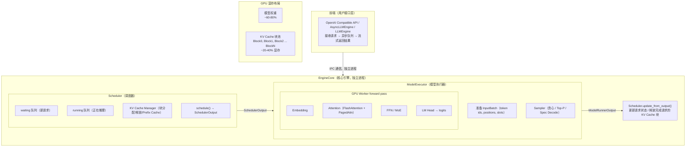

**核心文件定位（vLLM 源码）**：

```
vllm/v1/
├── engine/
│   ├── async_llm.py          # AsyncLLMEngine：异步前端，接收用户请求
│   └── llm_engine.py         # LLMEngine：同步接口封装
├── core/
│   └── sched/
│       └── scheduler.py      # Scheduler：调度核心，~1800行
├── worker/
│   └── gpu/
│       ├── gpu_model_runner.py   # GPU模型执行，InputBatch构建
│       └── worker.py             # Worker进程，管理GPU资源
└── sample/
    └── rejection_sampler.py  # 投机解码Rejection Sampling
```

### 2.3 一次推理的完整数据流

以用户请求 "你好" → 模型回复 "你好！有什么可以帮你的？" 为例：

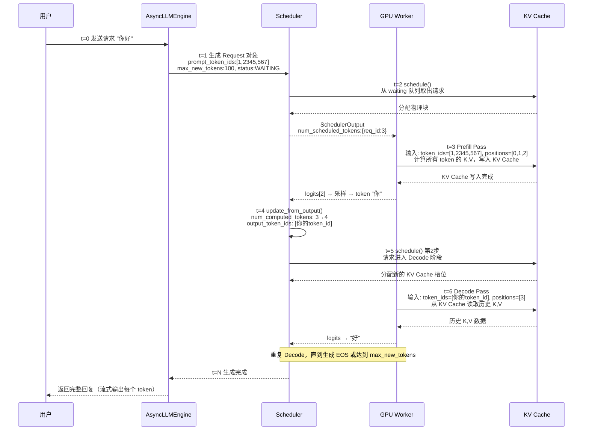

### 2.4 V0 vs V1 架构对比

vLLM 在 v0.6 之后引入了 V1 架构，进行了重大重构：

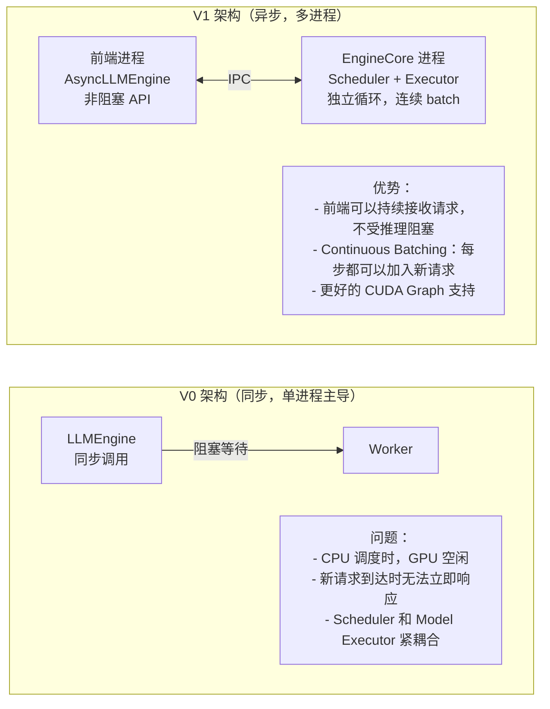

**关键源码位置**：
- V1 引擎主循环：`vllm/v1/engine/core.py:EngineCore._run_engine_loop()`
- 调度主函数：`vllm/v1/core/sched/scheduler.py:Scheduler.schedule()`

---

## 第三章：Paged Attention——从理论到实现

### 3.1 理论背景：虚拟内存与分页

**论文**：*Efficient Memory Management for Large Language Model Serving with PagedAttention*
- 作者：Woosuk Kwon, Zhuohan Li, Siyuan Zhuang 等（UC Berkeley）
- 发表：SOSP 2023（系统顶会）
- 链接：https://arxiv.org/abs/2309.06180

PagedAttention 的灵感直接来自操作系统的**虚拟内存**机制。回想一下 OS 的分页：

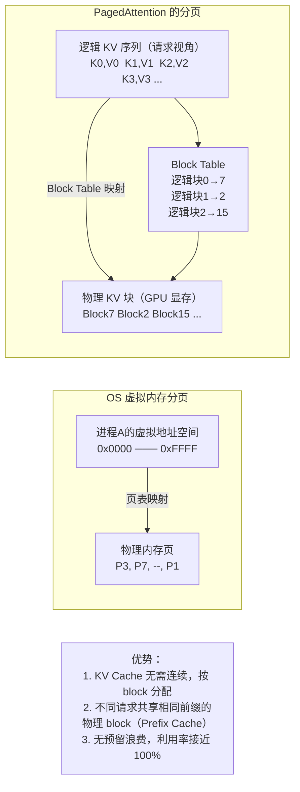

PagedAttention 把同样的思路用到了 KV Cache：

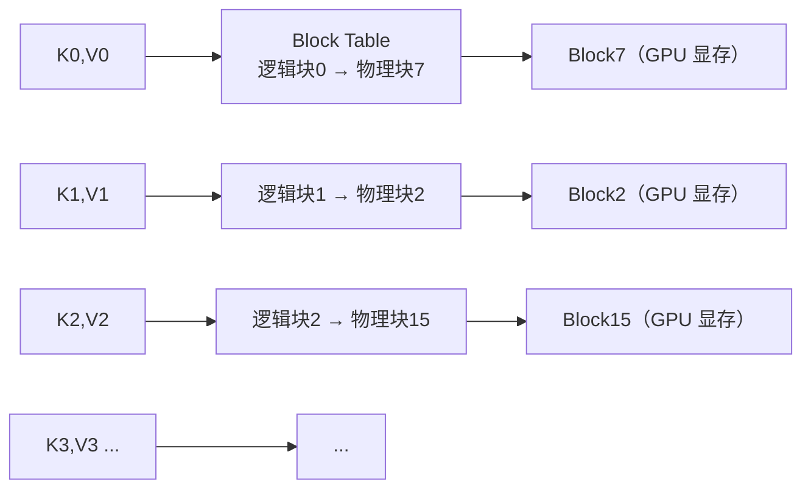

**关键概念定义**：

- **逻辑块（Logical Block）**：从请求视角看到的连续 KV 序列，按 `block_size` 分段
- **物理块（Physical Block）**：GPU 显存中实际存储 KV 数据的固定大小区域
- **块表（Block Table）**：请求的逻辑块索引 → 物理块 ID 的映射表
- **槽位（Slot）**：`block_id × block_size + offset`，即某个 token 的 KV 在物理显存中的线性位置

### 3.2 vLLM 是如何实现 Paged Attention 的？

#### 3.2.1 KV Cache 的物理布局

在 vLLM 中，每一层的 KV Cache 是一个预分配的大 tensor：

```
每层 KV Cache 的内存布局：

k_cache: [num_blocks, block_size, num_kv_heads, head_dim]
v_cache: [num_blocks, block_size, num_kv_heads, head_dim]

具体数值示例（LLaMA-7B，block_size=16）：
  num_blocks = 1000（根据剩余显存计算）
  block_size = 16   token/block
  num_kv_heads = 32
  head_dim = 128

  k_cache shape: [1000, 16, 32, 128]
  v_cache shape: [1000, 16, 32, 128]

  单层 KV Cache 总大小：
    1000 × 16 × 32 × 128 × 2（float16）= 131 MB
```

**关键源码**（`vllm/v1/worker/gpu/gpu_model_runner.py`）：

```python
# 初始化 KV Cache（简化版）
kv_cache_shape = (
    num_blocks,
    block_size,
    num_kv_heads,
    head_dim,
)
self.kv_caches = [
    (
        torch.zeros(kv_cache_shape, dtype=cache_dtype, device=self.device),  # K
        torch.zeros(kv_cache_shape, dtype=cache_dtype, device=self.device),  # V
    )
    for _ in range(num_layers)
]
```

#### 3.2.2 Block Table 的数据结构

**Block Table 是什么**：每个请求维护一张表，记录"逻辑块编号 → 物理块 ID"的映射。可以把它理解为一个数组，下标是逻辑块索引（0, 1, 2, ...），值是对应的物理块 ID。

```
请求 A（已处理 40 tokens，block_size=16）：

逻辑块0  覆盖 token  0-15  →  物理块 ID = 7
逻辑块1  覆盖 token 16-31  →  物理块 ID = 23
逻辑块2  覆盖 token 32-47  →  物理块 ID = 4（仅使用了前8个slot，部分填充）

block_table[A] = [7, 23, 4]
                  ↑   ↑   ↑
               逻辑块0 1  2
```

**如何用 block_table 定位某个 token 的 K/V**：

```
问题：token 18 的 K 存在哪里？

Step 1: 计算逻辑块索引  block_idx    = 18 // 16 = 1
Step 2: 计算块内偏移    block_offset = 18 %  16 = 2
Step 3: 查 block_table  physical_block_id = block_table[1] = 23
Step 4: 访问物理存储    k_cache[23][2][head][dim]
                          ↑     ↑
                    物理块ID  块内偏移
```

**Block Table 在推理中的两个用途**：

```
用途1（写入）：Prefill/Decode 时，把计算好的 K,V 写入 KV Cache
  → 需要知道"每个新 token 写到哪个物理 slot"
  → 由此派生出 Slot Mapping（见下节）

用途2（读取）：Decode 时，读取所有历史 token 的 K,V 做 attention
  → GPU Kernel 遍历 block_table，依次读取每个物理块
  → 由此实现非连续物理内存的"连续"访问
```

**Block Table 的内存布局**（实际 vLLM 中是一个 2D tensor）：

```
block_tables: [max_num_seqs, max_num_blocks_per_seq]  （整型 tensor，在 GPU 上）

例：batch 中有 3 个请求，max_blocks=8，block_size=16
  row 0 (请求A): [7, 23,  4,  0,  0, ...]   ← 只用了3个逻辑块，其余填0
  row 1 (请求B): [2,  0,  0,  0,  0, ...]   ← 只用了1个逻辑块
  row 2 (请求C): [9, 15, 31, 44,  0, ...]   ← 用了4个逻辑块
```

**vLLM 源码位置**（`vllm/v1/worker/block_table.py`，`vllm/v1/core/kv_cache_manager.py`）：

```python
# vllm/v1/core/kv_cache_manager.py（简化）
class KVCacheManager:
    def allocate_slots(
        self,
        request: Request,
        num_new_tokens: int,      # 本次调度步骤要处理的 token 数
        ...
    ) -> list[int] | None:
        """
        功能：为请求分配足够的物理块，并返回 slot_mapping。

        参数说明：
          request.num_computed_tokens：
              该请求到目前为止已经完成计算并写入 KV Cache 的 token 数。
              - 首次 Prefill 前：= 0（或 prefix cache 命中的 token 数）
              - 每次 schedule 完成后：由 update_from_output() 递增
              例：prompt 有 40 tokens，首次 Prefill 全量计算后 = 40

          num_new_tokens：
              本次调度要新计算的 token 数。
              - Prefill 步：= prompt 长度（或 chunked prefill 的 chunk 大小）
              - Decode 步：= 1（每次只生成 1 个 token）
        """
        # current_end：本次计算完成后，序列的总 token 数
        # 含义：从位置 0 到 current_end-1，这些 token 都需要在 KV Cache 中有对应 slot
        # 示例：num_computed=32, num_new=8 → current_end=40
        #        意味着 token 0-39 都需要 slot，需要 ceil(40/16)=3 个物理块
        current_end = request.num_computed_tokens + num_new_tokens
        num_blocks_needed = math.ceil(current_end / self.block_size)

        # 按需分配新块（已有的块不重复分配）
        # 例：已有 2 个块，需要 3 个 → 只分配第 3 个
        while len(request.block_ids) < num_blocks_needed:
            block_id = self._allocator.allocate()
            request.block_ids.append(block_id)
        # 此时 request.block_ids 就是 block_table：逻辑块索引 → 物理块 ID

        # 计算 slot_mapping：每个"新 token"写入哪个物理 slot
        # 只需为本次新增的 token（位置 num_computed 到 current_end-1）计算
        slot_mapping = []
        for pos in range(request.num_computed_tokens, current_end):
            block_idx        = pos // self.block_size       # 逻辑块索引
            block_offset     = pos %  self.block_size       # 块内偏移
            physical_block   = request.block_ids[block_idx] # 查 block_table
            slot = physical_block * self.block_size + block_offset
            slot_mapping.append(slot)

        return slot_mapping
```

#### 3.2.3 Slot Mapping：Block Table 的"写入视图"

Block Table 回答的是"读取"问题：Decode 时，历史 K/V 在哪些物理块？

**Slot Mapping** 回答的是"写入"问题：本次前向传播计算出来的新 K/V，应该写到 KV Cache 的哪个线性位置？

```
为什么需要从 Block Table 派生出 Slot Mapping？

GPU Kernel 写 KV Cache 时，需要：
  flat_k[slot] = computed_key    ← 一次性批量写入，slot 必须是标量整数

而 Block Table 是"逻辑块 → 物理块"的二维映射，不能直接作为写地址。

Slot Mapping 是将 Block Table 展开得到的线性地址：
  slot = physical_block_id × block_size + offset_in_block

              Block Table（二维逻辑）        Slot Mapping（一维线性）
  token 0  : block_table[0]=7, offset=0  →  slot =  7×16 + 0 = 112
  token 1  : block_table[0]=7, offset=1  →  slot =  7×16 + 1 = 113
  ...
  token 16 : block_table[1]=23, offset=0 →  slot = 23×16 + 0 = 368
  token 17 : block_table[1]=23, offset=1 →  slot = 23×16 + 1 = 369
```

**Slot Mapping 在批处理中的使用**：

Scheduler 为本批次中所有请求的新 token 计算 slot_mapping，拼接成一个大数组传给 GPU：

```
批次示例（block_size=16）：

  请求A（Prefill，5 个新 token，已有 0 个 token，block_table=[0]）：
    token  0 → slot  0×16+0 =  0
    token  1 → slot  0×16+1 =  1
    token  2 → slot  0×16+2 =  2
    token  3 → slot  0×16+3 =  3
    token  4 → slot  0×16+4 =  4
    slots_A = [0, 1, 2, 3, 4]

  请求B（Decode，1 个新 token，已有 128 个 token，block_table=[..., 8]）：
    token 128 → slot  8×16+0 = 128
    slots_B = [128]

  请求C（Prefill，3 个新 token，已有 0 个 token，block_table=[1]）：
    token  0 → slot  1×16+0 = 16
    token  1 → slot  1×16+1 = 17
    token  2 → slot  1×16+2 = 18
    slots_C = [16, 17, 18]

  拼接传给 GPU：
    token_ids    = [A0, A1, A2, A3, A4,  B0,  C0, C1, C2]
    slot_mapping = [ 0,  1,  2,  3,  4, 128,  16, 17, 18]

GPU Kernel 执行：
    for i in range(len(token_ids)):
        flat_k[slot_mapping[i]] = compute_key(token_ids[i], ...)
        flat_v[slot_mapping[i]] = compute_val(token_ids[i], ...)
```

**Block Table vs Slot Mapping 的职责分工总结**：

```
                  Block Table                  Slot Mapping
─────────────────────────────────────────────────────────────
形式       逻辑块索引 → 物理块ID（2D）      token → 线性 slot（1D）
谁计算     Scheduler（按需分配块时构建）    Scheduler（从 block_table 派生）
谁使用     Decode Attention Kernel（读 KV） Write Kernel（写 KV）
何时用     读取历史 KV（Decode 阶段）       写入新 KV（Prefill/Decode 均需）
GPU 上形式 block_tables tensor             slot_mapping tensor
─────────────────────────────────────────────────────────────
```

#### 3.2.4 Paged Attention 的计算过程

在 **Decode** 阶段，GPU Kernel 通过 block_table 读取历史 K,V 并计算 attention：

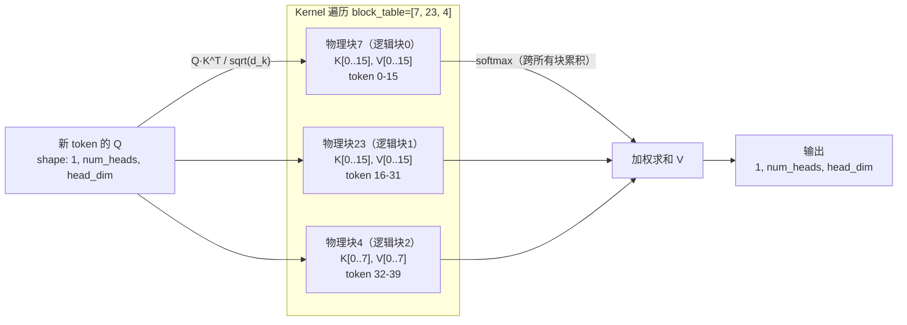

vLLM 使用 **FlashAttention** + 自定义 **Paged Attention Kernel** 实现这一计算：
- 核心 CUDA Kernel：`vllm/csrc/attention/attention_kernels.cuh`
- Python 接口：`vllm/_custom_ops.py`
- 实际调用路径：`gpu_model_runner.py → attention backend → flash_attn_varlen_func / paged_attn_kernel`

### 3.3 从零实现：Paged Attention

现在我们来实现一个功能完整的 Paged Attention 系统。这个实现用纯 PyTorch 编写，忽略 CUDA Kernel 的优化细节，但完整保留了所有数据结构和算法逻辑。

#### 3.3.1 整体架构设计

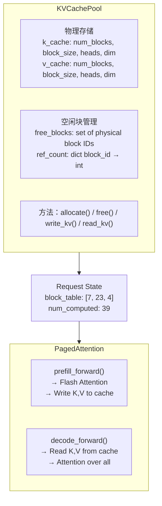

#### 3.3.2 核心实现

> 完整代码位于 `01_paged_attention/paged_attention.py`，以下是关键部分的解读。

**第一步：物理块的分配与释放**

```python
class KVCachePool:
    """
    KV Cache 物理块池

    设计决策：
    1. 预分配固定大小的 tensor（避免运行时动态分配的 CUDA 内存碎片）
    2. 用 set 维护空闲块列表（O(1) 分配/释放）
    3. 引用计数支持多请求共享同一物理块（Prefix Cache 的基础）
    """

    def __init__(self, num_blocks: int, block_size: int,
                 num_heads: int, head_dim: int, dtype=torch.float16):
        # 一次性预分配所有显存
        self.k_cache = torch.zeros(
            (num_blocks, block_size, num_heads, head_dim), dtype=dtype
        )
        self.v_cache = torch.zeros(
            (num_blocks, block_size, num_heads, head_dim), dtype=dtype
        )

        self.num_blocks = num_blocks
        self.block_size = block_size
        self.free_blocks = set(range(num_blocks))  # 初始全部空闲
        self.ref_count = {}  # block_id → 引用计数

    def allocate(self) -> int:
        """
        分配一个物理块，返回 block_id
        OOM 时抛出 RuntimeError
        """
        if not self.free_blocks:
            raise RuntimeError("KV Cache OOM: 没有空闲块")
        block_id = self.free_blocks.pop()
        self.ref_count[block_id] = 1
        return block_id

    def free(self, block_id: int):
        """
        释放物理块（减少引用计数）
        引用计数降为 0 时才真正归还
        """
        self.ref_count[block_id] -= 1
        if self.ref_count[block_id] == 0:
            del self.ref_count[block_id]
            # 重置块内容（安全性考虑，生产环境可省略）
            self.k_cache[block_id].zero_()
            self.v_cache[block_id].zero_()
            self.free_blocks.add(block_id)
```

**第二步：计算 Slot Mapping**

```python
def compute_slot_mapping(
    block_table: list[int],   # 逻辑块 → 物理块的映射
    start_pos: int,           # 起始位置（token 在序列中的绝对位置）
    num_tokens: int,          # 本次要写入的 token 数
    block_size: int,
) -> list[int]:
    """
    计算 slot_mapping：每个 token 在 KV Cache 中的线性槽位

    示例：
      block_table = [7, 23, 4]，block_size = 16
      start_pos = 18，num_tokens = 3

      token 18：逻辑块 18//16=1，偏移 18%16=2，物理槽=23*16+2=370
      token 19：逻辑块 19//16=1，偏移 19%16=3，物理槽=23*16+3=371
      token 20：逻辑块 20//16=1，偏移 20%16=4，物理槽=23*16+4=372

      返回 [370, 371, 372]
    """
    slots = []
    for pos in range(start_pos, start_pos + num_tokens):
        block_idx = pos // block_size          # 逻辑块索引
        block_offset = pos % block_size        # 块内偏移
        physical_block_id = block_table[block_idx]
        slot = physical_block_id * block_size + block_offset
        slots.append(slot)
    return slots
```

**第三步：Prefill 阶段 Attention**

```python
def paged_attention_prefill(
    q: torch.Tensor,          # [T, H, D]：本次 prefill 的全部 Query
    k: torch.Tensor,          # [T, H, D]：本次 prefill 的全部 Key
    v: torch.Tensor,          # [T, H, D]：本次 prefill 的全部 Value
    slot_mapping: list[int],  # [T]：每个 token 的物理槽位
    kv_pool: KVCachePool,
) -> torch.Tensor:
    """
    Prefill：
    1. 将 K, V 写入 KV Cache（供后续 Decode 使用）
    2. 计算 Causal Attention（每个 token 只看自己和前面的 token）
    """
    T, H, D = q.shape

    # Step 1: 将 K, V 写入 KV Cache
    # slot_mapping 告诉我们每个 token 写到哪里
    flat_k = kv_pool.k_cache.view(-1, H, D)  # [num_blocks*block_size, H, D]
    flat_v = kv_pool.v_cache.view(-1, H, D)

    slots = torch.tensor(slot_mapping, dtype=torch.long)
    flat_k[slots] = k   # 批量写入
    flat_v[slots] = v

    # Step 2: Causal Self-Attention
    scale = D ** -0.5
    # Q·K^T: [H, T, D] × [H, D, T] → [H, T, T]
    q_t = q.permute(1, 0, 2)   # [H, T, D]
    k_t = k.permute(1, 2, 0)   # [H, D, T]
    attn = torch.bmm(q_t, k_t) * scale

    # Causal mask：下三角
    mask = torch.triu(torch.full((T, T), float('-inf'), device=q.device), diagonal=1)
    attn = attn + mask
    attn = torch.softmax(attn, dim=-1)

    # 加权 V
    v_t = v.permute(1, 0, 2)   # [H, T, D]
    out = torch.bmm(attn, v_t)  # [H, T, D]
    return out.permute(1, 0, 2)  # [T, H, D]
```

**第四步：Decode 阶段 Attention（核心！）**

```python
def paged_attention_decode(
    q: torch.Tensor,           # [B, H, D]：B 个请求各自的新 Query
    block_tables: list[list[int]],  # 每个请求的 block_table
    seq_lens: list[int],       # 每个请求当前的序列长度（历史 KV 总数）
    kv_pool: KVCachePool,
) -> torch.Tensor:
    """
    Decode：每个请求只有 1 个新 Query，对历史所有 K, V 做 attention

    关键挑战：不同请求的历史长度不同（ragged batch）
    解决方案：对每个请求单独处理（生产环境用 Triton/CUDA Kernel 并行化）
    """
    B, H, D = q.shape
    outputs = []
    scale = D ** -0.5

    flat_k = kv_pool.k_cache.view(-1, H, D)  # 展平 KV Cache
    flat_v = kv_pool.v_cache.view(-1, H, D)

    for i in range(B):
        seq_len = seq_lens[i]
        block_table = block_tables[i]
        q_i = q[i]  # [H, D]

        # 从 block_table 读取该请求所有历史 K, V
        # 计算每个历史 token 的槽位
        history_slots = []
        for pos in range(seq_len):
            block_idx = pos // kv_pool.block_size
            block_offset = pos % kv_pool.block_size
            phys_block = block_table[block_idx]
            history_slots.append(phys_block * kv_pool.block_size + block_offset)

        slots_t = torch.tensor(history_slots, dtype=torch.long)
        k_hist = flat_k[slots_t]  # [seq_len, H, D]
        v_hist = flat_v[slots_t]  # [seq_len, H, D]

        # Q·K^T：[H, 1, D] × [H, D, seq_len] → [H, 1, seq_len]
        q_t = q_i.unsqueeze(1)           # [H, 1, D]
        k_t = k_hist.permute(1, 2, 0)    # [H, D, seq_len]
        attn = torch.bmm(q_t, k_t) * scale   # [H, 1, seq_len]
        attn = torch.softmax(attn, dim=-1)

        # 加权 V：[H, 1, seq_len] × [H, seq_len, D] → [H, 1, D]
        v_t = v_hist.permute(1, 0, 2)    # [H, seq_len, D]
        out = torch.bmm(attn, v_t)       # [H, 1, D]
        outputs.append(out.squeeze(1))   # [H, D]

    return torch.stack(outputs)  # [B, H, D]
```

#### 3.3.3 运行验证

> 完整测试：`docker exec vllm python3 -m pytest 01_paged_attention/test_paged_attention.py -v`

关键验证点：

1. **等价性验证**：Paged Attention 的计算结果应与标准 Dense Attention 完全一致（atol=1e-3）
2. **内存不连续验证**：即使 block_table = [7, 23, 4]（非连续），结果应与连续存储相同
3. **GQA 验证**：当 num_kv_heads < num_heads（Grouped Query Attention），K/V 需要正确广播

---

## 第四章：KV Cache 管理——存取、换入与换出

### 4.1 理论背景：内存层次结构与驱逐策略

在 OS 中，当物理内存不足时，会将内存页换出（Swap）到磁盘。vLLM 面临类似问题：当 GPU 显存不足时，需要将部分 KV Cache 块换出到 CPU 内存。

**关键权衡**：

```
内存层次：GPU VRAM → CPU DRAM → NVMe SSD

访问延迟（对比）：
  GPU VRAM：  ~1ns   （片上 HBM，~3 TB/s）
  CPU DRAM：  ~100ns  （通过 PCIe，~32 GB/s）
  NVMe SSD：  ~100μs  （通过 PCIe，~7 GB/s）

换出代价：
  换出1个 KV Cache 块（16 tokens，LLaMA-7B）：
    大小 ≈ 16 × 32 × 2 × 128 × 2 bytes = 262 KB
    通过 PCIe 传输时间 ≈ 262KB / 32GB/s ≈ 8μs

  与推理一步的时间对比（Decode，~5ms）：
    换出时间/推理时间 ≈ 0.16%  ← 可以接受
```

**驱逐策略**（Eviction Policy）：vLLM 使用 **FCFS + 抢占**（Preemption）：

- 正在运行的低优先级请求（通常是 earliest deadline first 的反面）被抢占
- 其 KV Cache 块被换出到 CPU 或直接丢弃（重计算）
- 请求重新进入 waiting 队列，等待被重新调度时重新 prefill

### 4.2 vLLM 的 KV Cache 生命周期

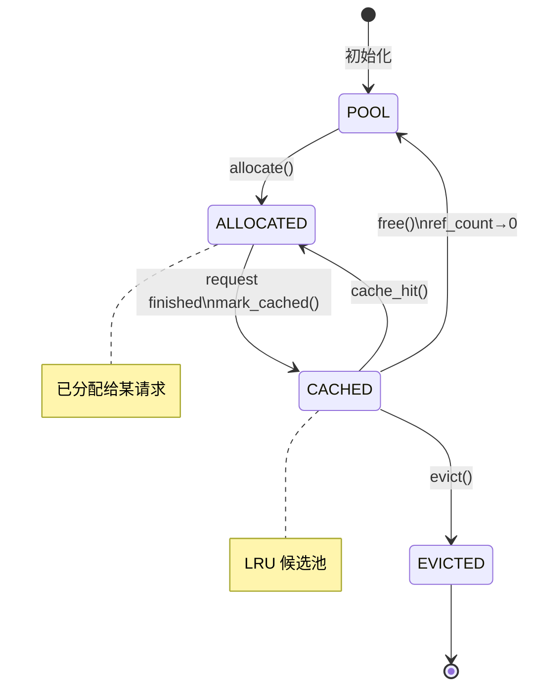

**关键源码**（`vllm/v1/core/block_pool.py`）：

```python
class BlockPool:
    """
    物理块分配器

    vLLM 的实现维护两个主要数据结构：
    1. free_blocks: 空闲块列表（双向链表实现的 LRU）
    2. cached_blocks: hash → block 的映射（用于 Prefix Cache 命中）
    """

    def allocate_or_get_cached(self, block_hash: int) -> tuple[int, bool]:
        """
        尝试复用已缓存的块（Prefix Cache），失败则分配新块

        返回 (block_id, is_cache_hit)
        """
        if block_hash in self.cached_blocks:
            block = self.cached_blocks[block_hash]
            block.ref_count += 1
            # 从 LRU 队列中移除（防止被驱逐）
            self.free_block_queue.remove(block)
            return block.block_id, True

        # 没有命中，分配新块
        return self.allocate(), False
```

### 4.3 从零实现：带 LRU Prefix Cache 的块管理器

> 完整代码位于 `02_kvcache/block_pool_lru.py`

#### 4.3.1 架构设计

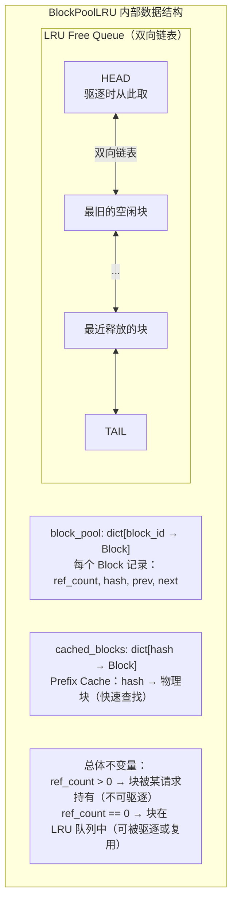

关键操作的时间复杂度：
- `allocate()`：O(1)（从 LRU 头取）
- `free()`：O(1)（加入 LRU 尾）
- `cache_hit(hash)`：O(1)（hash 表查找）
- `evict()`：O(1)（从 LRU 头删除）

#### 4.3.2 Prefix Cache 的工作原理

```
场景：100 个用户共享相同系统提示词（1024 tokens = 64 个块）

第1个请求：
  - 全部 MISS，计算所有块的 K, V
  - 发布到 cached_blocks（hash → block_id）

第2-100个请求：
  - compute_block_hashes(sys_prompt) → [H0, H1, ..., H63]
  - 逐一查询 cached_blocks
  - 全部 HIT！直接复用这 64 个物理块
  - 只需计算用户独特问题部分的 K, V

效果：
  节省计算：99 × 1024 × prefill_flops_per_token
  节省时间：~99 × 0.5s = 49.5 秒（每用户 0.5s prefill）
```

**块哈希的链式设计**（确保前缀唯一性）：

```python
def hash_block_tokens(
    parent_block_hash: int,          # 前一个块的哈希（形成链）
    curr_block_token_ids: tuple,     # 本块的 token ID 序列
) -> int:
    """
    链式哈希：每个块的哈希依赖其前缀

    为什么不能只哈希本块的 token？

    反例：
      请求A：[SYS_BLOCK] + [block_X]
      请求B：[OTHER_SYS] + [block_X]  ← 同样的 block_X 内容，但前缀不同！

      如果只哈希 token_ids，block_X 的哈希相同，会错误复用！

    链式哈希：
      block_X 在请求A中的哈希 = hash(H_SYS, tokens_X) = HA
      block_X 在请求B中的哈希 = hash(H_OTHER, tokens_X) = HB ≠ HA ✓
    """
    return hash((parent_block_hash, curr_block_token_ids))
```

---

## 第五章：一个请求的完整推理路径

### 5.1 端到端数据流追踪

用一个具体例子把前四章串联起来。

**场景**：用户发送 "请用三句话描述量子纠缠"（12 tokens），模型生成 50 个 token 的回复。

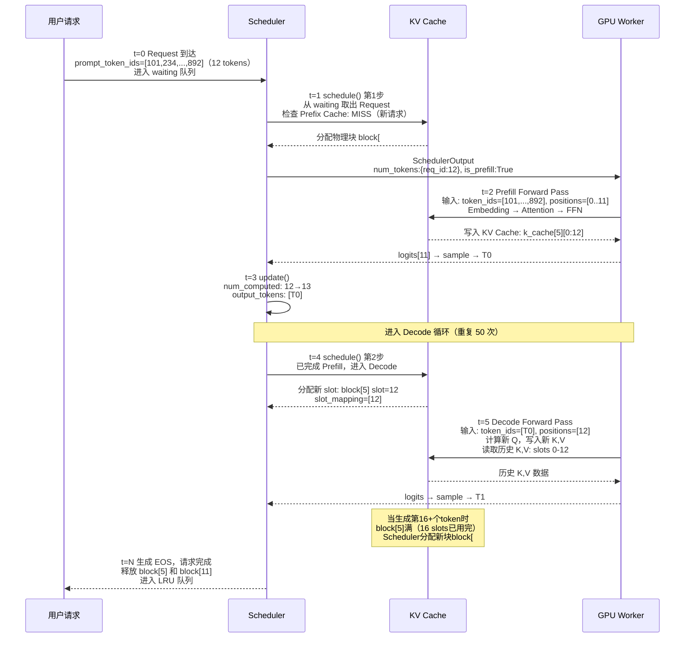

### 5.2 KV Cache 的内存布局可视化

```
时间 t=10（已生成 8 个 token，共 12+8=20 tokens）

block_table = [5, 11]

Block #5（物理块，block_size=16）：
  slot  0: K[req,0],  V[req,0]   ← token 0  （"请"）
  slot  1: K[req,1],  V[req,1]   ← token 1  （"用"）
  ...
  slot 11: K[req,11], V[req,11]  ← token 11 （"缠"，最后一个prompt token）
  slot 12: K[req,12], V[req,12]  ← generated token 0 (T0)
  slot 13: K[req,13], V[req,13]  ← generated token 1 (T1)
  ...
  slot 15: K[req,15], V[req,15]  ← generated token 3 (T3)

Block #11（物理块）：
  slot  0: K[req,16], V[req,16]  ← generated token 4 (T4)
  slot  1: K[req,17], V[req,17]  ← generated token 5 (T5)
  ...
  slot  3: K[req,19], V[req,19]  ← generated token 7 (T7)
  slot  4: (空，下一个 token 将写入此处)
  ...
  slot 15: (空)

GPU 显存中的其他 block（#0-4, #6-10, #12-...）：
  可能被其他请求使用，或在 LRU 队列中空闲
```

### 5.3 多请求并发批处理

vLLM 的核心价值之一是**连续批处理（Continuous Batching）**[[2]](https://arxiv.org/abs/2309.06180)：新请求无需等待当前批次完成，可以在任意推理步之间插入。

```mermaid
gantt
    title 连续批处理时序（3个并发请求）
    dateFormat X
    axisFormat Step%L

    section 请求A
    Prefill 3 tokens  : a1, 0, 1
    Decode            : a2, after a1, 1
    Decode            : a3, after a2, 1
    Decode            : a4, after a3, 1
    Decode / DONE     : a5, after a4, 1

    section 请求B
    Prefill 5 tokens  : b1, 0, 1
    Prefill 5 tokens  : b2, after b1, 1
    Decode            : b3, after b2, 1
    Decode / DONE     : b4, after b3, 1

    section 请求C（Step2插入）
    Prefill 2 tokens  : c1, 1, 1
    Decode            : c2, after c1, 1
    Decode            : c3, after c2, 1
    Decode            : c4, after c3, 1
    Decode...         : c5, after c4, 1
```

---

## 本章总结与关键公式

| 概念 | 公式 / 规则 |
|------|------------|
| Token 的物理 Slot | `block_table[pos // block_size] × block_size + pos % block_size` |
| KV Cache 内存占用 | `num_blocks × block_size × num_layers × num_heads × head_dim × 2 × dtype_bytes` |
| 有效显存利用率 | `理论值：接近 100%`（PagedAttention）vs `实测 20-40%`（朴素实现） |
| Prefix Cache 收益 | `节省计算 = num_cached_tokens × prefill_cost_per_token` |
| 块哈希 | `hash((parent_hash, token_ids_in_block, optional_extra_key))` |

---

## 推荐阅读

1. **PagedAttention 原论文**：Kwon et al., *Efficient Memory Management for Large Language Model Serving with PagedAttention*, SOSP 2023
   https://arxiv.org/abs/2309.06180

2. **Attention Is All You Need**：Vaswani et al., NeurIPS 2017（Transformer 基础）
   https://arxiv.org/abs/1706.03762

3. **FlashAttention**：Dao et al., *FlashAttention: Fast and Memory-Efficient Exact Attention with IO-Awareness*, NeurIPS 2022
   https://arxiv.org/abs/2205.14135

4. **Continuous Batching**：Yu et al., *Orca: A Distributed Serving System for Transformer-Based Generative Models*, OSDI 2022
   https://www.usenix.org/conference/osdi22/presentation/yu

5. **GQA（Grouped Query Attention）**：Ainslie et al., *GQA: Training Generalized Multi-Query Transformer Models from Multi-Head Checkpoints*, EMNLP 2023
   https://arxiv.org/abs/2305.13245

---

*第二部分将覆盖：Prefix Cache 全局池化（Mooncake）、Scheduler 调度算法、投机解码（EAGLE）、Chunked Prefill。*
