# vLLM 从入门到专家（2.0 版）：全局 Prefix Cache——分布式 KV 池

> **本文内容**：单机 Prefix Cache 的局限（§7.1）、全局 KV 池方案全景与选型（§7.2）、LMCache + MooncakeStore NVIDIA 推荐方案（§7.3）、vllm-ascend AscendStoreConnector 完整实现（§7.4）、AscendStoreConnector colocated 简洁部署（§7.5）；以及扩展阅读（P2P 源码 §7.6、RDMA 原理 §7.7、模拟实现 §7.8）。
>
> **阅读前提**：已读第二部分第六章（单机 Prefix Cache），理解块级哈希前缀匹配。
>
> **快速阅读**：NVIDIA GPU 路线 — §7.1 → §7.2 → §7.3；Ascend（昇腾）路线 — §7.1 → §7.2 → §7.4 → §7.5。

---

## 第七章：全局 Prefix Cache——Mooncake 风格的分布式 KV 池

### 7.1 理论背景：单机 Prefix Cache 的局限性

单机版 Prefix Cache 受限于**单张 GPU 的显存**。以 A100 80GB 为例：

```
显存分配：
  模型权重（LLaMA-70B）：约 140GB（需要 2 张 GPU）
  剩余 KV Cache：约 20GB
  可缓存 token 数（LLaMA-70B）：
    20GB / (32层 × 8头 × 128维 × 2 × 2字节) = ~20万 tokens

问题：
  - 一个 32K token 的系统提示词 = 32,000 / 200,000 = 16% 的缓存空间
  - 100 个不同用户的对话历史全都缓存：不可能
  - 多节点集群中，每个节点各自维护缓存：重复计算
```

**解决思路**：把 KV Cache 移到容量更大的存储层（CPU DRAM、SSD），建立**全局共享的 KV 池**。

**关键论文**：
- Mooncake（月之暗面）：*Mooncake: A KVCache-centric Disaggregated Architecture for LLM Serving*, 2024
  https://arxiv.org/abs/2407.00079
- PD 分离的先驱工作：*Splitwise: Efficient Generative LLM Inference Using Phase Splitting*, ISCA 2024
  https://arxiv.org/abs/2311.18677
- KV Cache 卸载：*InfiniGen: Efficient Generative Inference of Large Language Models with Dynamic KV Cache Management*, OSDI 2024

### 7.2 全局 KV 池方案全景：分类、对比与选型

本节回答四个问题，帮助读者在深入源码前建立完整的认知地图：**有哪些大类方案？各方案是什么？各有什么优缺点？应该选择哪个？**

#### 7.2.1 vLLM 与 vllm-ascend 的关系

读者在阅读本章时会同时看到来自 `vllm/` 和 `vllm_ascend/` 的实现。两者关系如下：

| | 上游 vLLM | vllm-ascend |
|--|-----------|-------------|
| **维护方** | vLLM Project（开源社区，主要面向 NVIDIA GPU） | 华为昇腾 AI（适配 Ascend NPU） |
| **仓库** | `github.com/vllm-project/vllm` | `github.com/vllm-project/vllm-ascend` |
| **与上游关系** | 上游基础实现 | 以 **Plugin 机制**在运行时覆盖/扩展 vLLM 的特定组件 |
| **硬件目标** | NVIDIA A100/H100/H200 | 华为昇腾 Atlas 800T A2 等 NPU |
| **特有功能** | MooncakeConnector、LMCacheConnector、NixlConnector | D-pull RDMA READ、异构TP、AscendStore、MLA 专项优化 |

vllm-ascend **不是 vLLM 的 Fork**，而是通过 `VLLM_PLUGINS` 机制在运行时动态替换特定组件。

> **本文约定**：提到"上游 vLLM"指 `vllm-project/vllm`；"vllm-ascend"指 `vllm_ascend/` 路径下的扩展实现。

---

#### 7.2.2 两大技术路线：P2P 直传 vs 全局存储池

跨节点 KV Cache 共享存在两种根本不同的架构路线：

```
┌─────────────────────────────────────────────────────────────────┐
│  路线一：P2P 直传（分布式点对点）                                  │
│                                                                 │
│    Prefiller ──[RDMA WRITE/READ]──→ Decoder                     │
│                                                                 │
│    • 无共享存储，无中心节点                                        │
│    • 每个请求独立传输一次，不持久化                                 │
│    • 不支持跨请求前缀复用（同一提示词被 100 个请求用，传 100 次）    │
│    • 代表：上游 vLLM MooncakeConnector（P-push）                  │
│             vllm-ascend MooncakeConnectorV1（D-pull）            │
└─────────────────────────────────────────────────────────────────┘

┌─────────────────────────────────────────────────────────────────┐
│  路线二：全局存储池（中心化 KV 池）                                │
│                                                                 │
│    Prefiller ──[RDMA PUT]──→ 分布式 KV 存储池                    │
│                                    │                           │
│                               etcd/元数据                       │
│                                    │                           │
│    Decoder ←──[RDMA GET]───────────┘                           │
│                                                                 │
│    • KV 持久化在 DRAM 池中，支持跨请求前缀复用                     │
│    • 同一提示词写入一次，100 个请求全部命中读取                     │
│    • 元数据服务形式不同（etcd 中心 / P2PHANDSHAKE / ZMQ intra）    │
│    • 代表：LMCache + MooncakeStore（NVIDIA GPU，etcd 中心元数据）   │
│             vllm-ascend AscendStoreConnector（Ascend，ZMQ 查询，支持 MultiConnector）│
│             （注：MooncakeConnectorStoreV1 是 AscendStoreConnector 的兼容别名，已废弃）│
└─────────────────────────────────────────────────────────────────┘
```

**关键区分**：P2P 解决的是"PD 分离"问题（让 Prefill 和 Decode 在不同节点上运行），但**不是**全局前缀缓存。全局存储池才能实现"相同前缀只计算一次，所有 Decoder 共用"的目标。

---

#### 7.2.3 现有方案全览

目前业界有 **4 个实现方案**，覆盖两种路线和两种硬件平台：

| 方案 | 路线 | 平台 | 跨请求复用 | 共享持久存储 | PD 模式 | 可验证运行 |
|------|------|------|-----------|------------|---------|----------|
| **上游 vLLM `MooncakeConnector`** | P2P（P-push） | NVIDIA GPU | ❌ | ❌ | 分离 | ✅ |
| **LMCache + MooncakeStore** | 全局存储池 | NVIDIA GPU | ✅ | ✅ DRAM+可选SSD | 分离/colocated | ✅ |
| **vllm-ascend `MooncakeConnectorV1`**（注册名，Python 类 `MooncakeConnector`） | P2P（D-pull） | Ascend NPU | ❌ | ❌ | 分离 | ❌（需昇腾硬件） |
| **vllm-ascend `AscendStoreConnector`** | 全局存储池 | Ascend NPU | ✅ | ✅ DRAM | 分离或colocated | ❌（需昇腾硬件） |

> **命名说明**：`MooncakeConnectorV1` 是 **KV Connector 注册名**（写入 `kv_connector` 配置），实际 Python 类为 `MooncakeConnector`。`MooncakeConnectorStoreV1` 是 `AscendStoreConnector` 的**向后兼容别名**（两者注册同一个类，使用前者会触发废弃警告），建议直接使用 `AscendStoreConnector`。

**架构对比（4方案 × 核心维度）：**

| 维度 | MooncakeConnector | LMCache+MooncakeStore | MooncakeConnectorV1<br/>（类 MooncakeConnector） | AscendStoreConnector |
|------|------------------|-----------------------|--------------------------------------------------|----------------------|
| 元数据服务 | 无（P2P） | mooncake_master+etcd | 无（P2P） | KVPoolScheduler（ZMQ） |
| KV 索引 | `transfer_id`（请求级） | SHA-256 block_hash | `transfer_id`（请求级） | SHA-256 block_hash |
| 传输方向 | P RDMA WRITE → D | D RDMA GET ← Store | D RDMA READ ← P | D RDMA GET ← Store |
| PD 模式 | 分离 | 分离 | 分离 | 分离或colocated（可配置）|
| LMCache依赖 | ❌ | ✅ | ❌ | ❌ |
| 异构 TP | ❌ | 依赖 MooncakeStore | ✅（P_tp ≥ D_tp） | ✅ |
| 逐层流水线 | ❌ | ✅（per-layer） | ✅（LayerwiseConnector） | ✅（`use_layerwise` 可配置） |
| 冷缓存层 | ❌ | ✅（DRAM / NVMe SSD） | ❌ | ✅（可插拔后端） |
| MultiConnector | ❌ | ❌ | ❌ | **✅（P2P+Pool同时运行）** |
| MLA支持 | ❌ | ❌ | ❌ | **✅（consumer_is_to_put）** |
| delay_free | ✅（P 侧保持 blocks） | ❌ | ✅ | ❌ |

---

#### 7.2.4 各方案优缺点

**方案一：上游 vLLM MooncakeConnector（P2P，NVIDIA）**

```
优点：
  ✅ 部署最简单：无需额外服务，只需 RDMA 网络
  ✅ 延迟最低：P→D 直传，无中间跳转
  ✅ 已进入 vLLM 主线，文档完善，社区支持好
  ✅ 不需要 DRAM 存储预算

缺点：
  ❌ 每次请求完整传输一次 KV，高并发下带宽压力大
  ❌ 不支持跨请求前缀复用（最大的局限）
  ❌ 强耦合 1P:1D，难以横向扩展为 XP:YD
  ❌ P 完成 Prefill 才传输，无法与计算并行（实际上 save_kv_layer 支持逐层，但无持久化）

适合场景：对话型应用，每次对话内容不同，前缀复用收益低；或仅需要基础 PD 分离降低 GPU 竞争。
```

**方案二：LMCache + MooncakeStore（全局池，NVIDIA）**

```
优点：
  ✅ 真正的全局前缀缓存：同一系统提示词写一次，所有 Decoder 共用
  ✅ XP:YD 灵活扩展（多 Prefiller 共享同一存储池）
  ✅ P/D 时序解耦：Prefiller 写完即释放，Decoder 独立读取
  ✅ 支持多级存储（GPU VRAM → CPU DRAM → NVMe SSD）
  ✅ 可验证运行（NVIDIA GPU + InfiniBand 或 TCP 软 RDMA）
  ✅ 生产验证：Kimi K2（128 H200）等大规模集群使用

缺点：
  ❌ 部署复杂：需要额外运行 mooncake_master + etcd
  ❌ 存在额外 memcpy（LMCache LocalBuffer 中转）
  ❌ 引入 LMCache 中间层，调试链路更长
  ❌ DRAM 存储成本（需要预留 30~64 GiB/节点）

适合场景：固定系统提示词场景（客服、RAG、代码助手），多P多D大规模集群，系统提示词频繁复用。
```

**方案三：vllm-ascend MooncakeConnectorV1（P2P，Ascend）**

```
优点：
  ✅ 针对 Ascend NPU 优化（D-pull 方向，减少 P 侧 NPU 负担）
  ✅ 支持异构 TP（P_tp=4, D_tp=2 等组合）
  ✅ 逐层传输流水线（LayerwiseConnector）

缺点：
  ❌ 同样不支持跨请求前缀复用
  ❌ 需要 Ascend NPU 硬件，无法在 NVIDIA GPU 上验证
```

**方案四：vllm-ascend AscendStoreConnector（全局池，Ascend）**

```
优点：
  ✅ Ascend 上的真正全局 KV 池，支持 PD 分离或 colocated
  ✅ SHA-256 内容寻址（block_hash），跨节点前缀去重
  ✅ ZMQ intra-node 快速查询（Scheduler↔Worker，无外部服务依赖）
  ✅ MultiConnector：同时运行 P2P（当前请求即时加速）+ 写入Pool（未来请求复用）
  ✅ MLA 专项支持（consumer_is_to_put=true）
  ✅ 可插拔后端（MooncakeDistributedStore / Memcache）

缺点：
  ❌ 需要 Ascend NPU 硬件，无法在 NVIDIA GPU 上验证
  ❌ PYTHONHASHSEED=0 必须全集群一致，否则 prefix_hash 不匹配
  ❌ 配置项较多，自定义 ZMQ 查询协议增加了调试复杂度
```

---

> **⚠️ 勘误说明**：博客早期版本将 `MooncakeConnectorStoreV1` 作为一个独立的、架构上不同的方案单独列出，这是**错误的**。根据最新源码（vllm-ascend commit `812c722`，[`__init__.py`](https://github.com/vllm-project/vllm-ascend/blob/main/vllm_ascend/distributed/kv_transfer/__init__.py#L26)），`MooncakeConnectorStoreV1` 和 `AscendStoreConnector` 注册**同一个 Python 类**，前者是即将废弃的向后兼容别名，使用时会触发 warning：
> ```
> "It is recommended to use the AscendStoreConnector, as the MoonCakeStoreConnector will be removed in the future."
> ```
> Ascend 全局存储池方案**只有一个独立实现**：`AscendStoreConnector`。

**AscendStoreConnector 两种典型部署模式：**

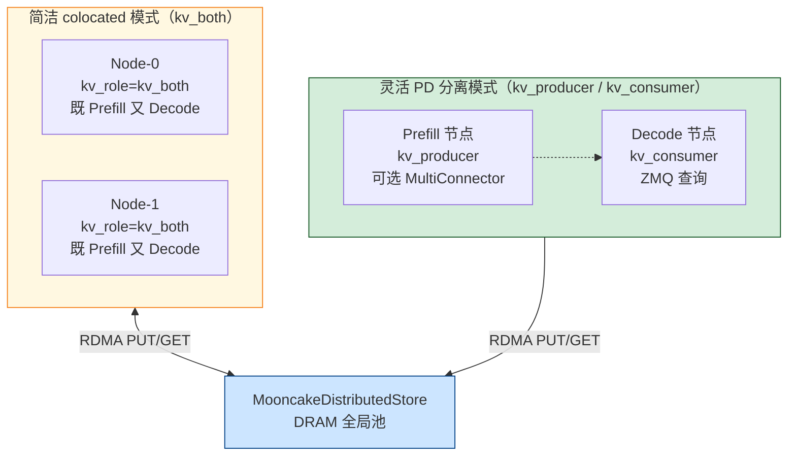

**选型决策表：**

| 场景 | AscendStoreConnector 配置 | 关键参数 |
|------|--------------------------|---------|
| PD colocated，快速上手 | `kv_role: kv_both`，`use_layerwise: false` | mooncake.json P2PHANDSHAKE 元数据 |
| PD 完全分离（专职 Prefiller/Decoder） | `kv_role: kv_producer/kv_consumer` | ZMQ intra-node 查询 |
| 同时降低延迟 + 沉淀复用 | `MultiConnector` 模式 | P2P 即时传 + 池写入并行 |
| MLA 模型（DeepSeek 等） | `consumer_is_to_put: true` | GQA 变体专项优化 |
| 超长序列 Decode 早启动 | `use_layerwise: true` | 逐层流水线，Decode 无需等全部传输完 |

---

#### 7.2.5 业界推荐方案

> **结论先行**：如果你用 NVIDIA GPU 且关注全局前缀缓存，**推荐使用 LMCache + MooncakeStore**。

选择理由：
1. **可验证性**：不需要昇腾硬件，任意 NVIDIA GPU 集群（含软 RDMA/TCP 回退）均可运行
2. **真正的全局前缀缓存**：跨请求、跨 Prefiller 节点复用 KV
3. **生产验证**：Kimi K2（128 H200，224K tokens/sec Prefill，288K tokens/sec Decode）等大规模部署
4. **社区活跃**：LMCache 和 Mooncake 均有官方文档和持续维护

**本章后续结构**：
- **§7.3 — LMCache + MooncakeStore 完整手撕（NVIDIA 推荐方案，重点）**
- §7.4 — vllm-ascend AscendStoreConnector 深度解析（Ascend 全局池完整实现）
- §7.5 — vllm-ascend AscendStoreConnector colocated 部署实战（配置最简路线，兼谈 MooncakeConnectorStoreV1 别名迁移）
- §7.6 — MooncakeConnector P2P 深度解析（理解 P2P 基础，为全局池对比做铺垫）
- §7.7 — RDMA 从零到懂（传输层基础知识）
- §7.8 — 模拟全局 KV 池（从原理理解设计）

---

#### 7.2.6 KVConnector V1 接口（实现基础）

以上所有方案均基于 vLLM V1 的 `KVConnectorBase_V1` 接口。理解这个接口是读懂后续源码的前提。

**V1 的核心设计**：将 Connector 一分为二——Scheduler 进程侧（感知调度）+ Worker 进程侧（执行传输）：

```
V1 KVConnectorBase_V1
│
├── 调度器侧（Scheduler 进程，在 schedule() 中调用）
│   ├── get_num_new_matched_tokens(request, num_computed_tokens)
│   │     → 返回 (extra_tokens, is_async)
│   │     → 告知调度器：远端还有多少 token 的 KV 可加载
│   │
│   ├── update_state_after_alloc(request, blocks, num_external_tokens)
│   │     → blocks 分配完成后，记录"哪些 blocks 需要从远端填充"
│   │
│   ├── build_connector_meta(scheduler_output) → KVConnectorMetadata
│   │     → 打包本调度步的传输元数据，通过 ZeroMQ IPC 发给 Worker 进程
│   │
│   ├── request_finished(request, block_ids) → (bool, dict|None)
│   │     → delay_free=True 则 Connector 接管 blocks 释放时机
│   │     → P-Node 在此记录待发 blocks（RDMA WRITE 完成前绝不能释放！）
│   │
│   └── take_events() → Iterable[KVCacheEvent]
│
└── Worker 侧（GPU Worker 进程，在 execute_model 前后调用）
    ├── register_kv_caches(kv_caches)   → 将 GPU KV Cache 内存注册到 RDMA 引擎
    ├── start_load_kv(forward_context)  → D-Node 发起异步 KV 加载
    ├── wait_for_layer_load(layer_name) → 等待该层 KV 加载完成（逐层流水线）
    ├── save_kv_layer(layer_name, ...)  → 异步保存/发送该层 KV（P-Node）
    ├── wait_for_save()                 → 等待所有层 KV 发送完成
    └── get_finished(finished_req_ids)  → 轮询异步完成状态
```

完整接口定义详见《博客第三部分》§13.3.2。

> **V0 历史背景**（简短说明，避免代码阅读时困惑）：vLLM 早期使用 `send_kv_caches_and_hidden_states` / `recv_kv_caches_and_hidden_states` 的 V0 接口，已在 vLLM V1 中废弃。部分旧博客、PR 和论文复现代码仍使用这些方法名，遇到时识别为**历史实现**即可，当前 V1 架构已完全重新设计。

---

#### 7.2.7 全局 KV 池的理想架构图

全局存储池方案（LMCache + MooncakeStore / AscendStoreConnector）对应以下理想架构（AscendStoreConnector colocated 模式使用 P2PHANDSHAKE 作为 MooncakeStore 元数据协议，整体数据流相同）：

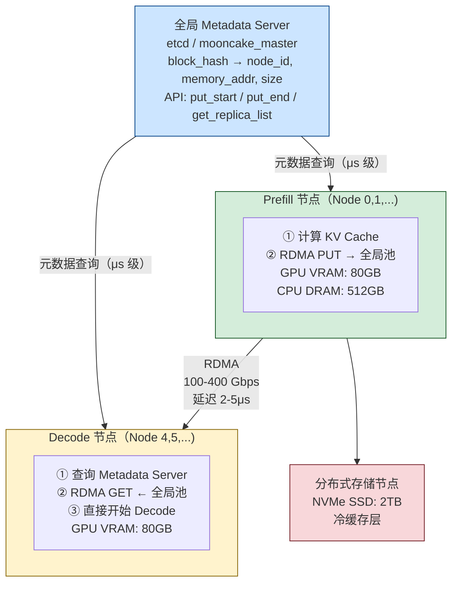

详细实现见 §7.6.5（D-pull）、§7.6.6（异构TP）、§7.6.7（逐层传输）、§7.3（LMCache+MooncakeStore，NVIDIA）、§7.4（AscendStoreConnector，Ascend）、§7.5（AscendStoreConnector colocated 简洁部署）。

### 7.3 LMCache + MooncakeStore：主流全局 KV 池方案

> 参考：[Mooncake 官方文档 — vLLM V1 Disaggregated Serving with LMCache](https://kvcache-ai.github.io/Mooncake/getting_started/examples/vllm-integration/vllmv1-lmcache-integration.html)
> 源码：`lmcache/integration/vllm/`、`lmcache/storage/remote/mooncake_store_connector.py`

§7.6 介绍的 `MooncakeConnector` 是纯 P2P 方案：Prefiller 把 KV 直接推给 Decoder，每次请求传输一次，不能复用。而 **LMCache + MooncakeStore** 是真正的全局 KV 池：KV 写入持久化的分布式 DRAM 存储，任意 Decoder 都可读取，跨请求复用相同前缀的 KV，这才是 NVIDIA GPU 集群上最主流的全局池化方案。

#### 7.3.1 为什么 P2P 不够：三个核心局限

| 局限 | P2P MooncakeConnector | LMCache + MooncakeStore |
|------|----------------------|------------------------|
| **跨请求复用** | ❌ 每次都传输全部 KV | ✅ 相同前缀只存一次，命中直接读 |
| **XP:YD 部署** | ❌ 强耦合 1P:1D 配对 | ✅ 任意 P 写入，任意 D 读取 |
| **时序耦合** | P 必须等 D 确认收到 | P 写完即结束；D 独立读取 |
| **传输次数** | N 个请求 = N 次 RDMA | M 个唯一前缀 = M 次写入 |

**典型收益场景**：同一系统提示词被 100 个并发请求共用。P2P 方案需传输 100 次；LMCache+MooncakeStore 只传输 1 次，后续 99 次全部命中。

---

#### 7.3.2 完整四层架构

```
vLLM V1 Scheduler/Worker
        │
        │  KVConnectorBase_V1 接口
        ▼
LMCacheConnectorV1          ← vLLM 插件入口（lmcache/integration/vllm/）
        │
        │  LMCacheConnectorV1Impl（实际实现）
        ▼
LMCache StorageManager      ← KV 分块、前缀感知查找（ChunkedTokenDatabase）
        │
        ├── LocalCPUBackend（可选：DRAM 本地缓存层）
        │
        └── RemoteBackend
                │
                │  RemoteConnector 抽象接口
                ▼
        MooncakeStoreConnector  ← 适配器：RemoteConnector → MooncakeDistributedStore
                │
                ▼
        MooncakeDistributedStore（client，嵌入 vLLM 进程内）
                │
                │  RDMA / TCP Transfer Engine
                ▼
        mooncake_master（独立进程）+ etcd（元数据）
        ← 管理所有节点的显存/内存注册、key→location 映射
```

**与 §7.4 vllm-ascend AscendStore 的架构对比：**

| | LMCache + MooncakeStore | vllm-ascend AscendStore |
|--|------------------------|------------------------|
| 中间层 | LMCache StorageManager（有 LocalBuffer） | 无中间层（直接 ZMQ + 传输线程） |
| 存储键 | `chunk_hash`（LMCache 内部管理） | `PoolKey.to_string()`（SHA-256，含 tp_rank） |
| 调度器查询 | 进程内查询（无 ZMQ） | ZMQ intra-node REQ/REP |
| 适用硬件 | NVIDIA GPU（主流） | 华为 Ascend NPU |
| 额外 memcpy | LocalBuffer 存在一次 CPU 中转 | 无，直接 GPU↔Store RDMA |

---

#### 7.3.3 RemoteConnector：LMCache 的可插拔存储接口

LMCache 定义了 `RemoteConnector` 抽象类，任何远端存储都只需实现这 4 个方法：

```python
# lmcache/storage/remote/base_connector.py
from abc import ABC, abstractmethod
from typing import Any, Optional
from lmcache.storage.mem_obj import MemoryObj

class RemoteConnector(ABC):

    @abstractmethod
    def exists(self, key: str) -> bool:
        """检查指定 key 是否已在远端存储中"""
        ...

    @abstractmethod
    def put(self, key: str, metadata: Any, kvbytes: bytes) -> None:
        """将 KV 数据（含元数据头）写入远端存储"""
        ...

    @abstractmethod
    def get(self, key: str) -> Optional[MemoryObj]:
        """从远端存储读取 KV，返回 LMCache 管理的 MemoryObj；未找到返回 None"""
        ...

    @abstractmethod
    def close(self) -> None:
        """清理资源，关闭连接"""
        ...
```

URL scheme 决定使用哪个 `RemoteConnector` 实现：
- `mooncakestore://master_ip:50051/` → `MooncakeStoreConnector`
- `redis://localhost:6379/` → `RedisConnector`
- `infinistore://localhost:8080/` → `InfiniStoreConnector`

---

#### 7.3.4 MooncakeStoreConnector 完整实现

```python
# lmcache/storage/remote/mooncake_store_connector.py

import os
import json
import logging
from typing import Any, Optional

from lmcache.storage.mem_obj import MemoryObj
from lmcache.storage.remote.base_connector import RemoteConnector
from lmcache.utils import CacheEngineKey

logger = logging.getLogger(__name__)

class MooncakeStoreConnector(RemoteConnector):
    """
    LMCache RemoteConnector 实现：使用 MooncakeDistributedStore 作为远端后端。

    架构位置：
      LMCache StorageManager → RemoteBackend → MooncakeStoreConnector
                                                       ↓
                                             MooncakeDistributedStore
                                             （嵌入式 client，RDMA/TCP 传输）
    """

    def __init__(self, url: str, extra_config: dict):
        """
        初始化分三步：
          1. 验证依赖（mooncake-transfer-engine 是否已安装）
          2. 加载配置（优先使用 extra_config，其次读 MOONCAKE_CONFIG_PATH）
          3. 初始化 MooncakeDistributedStore client

        Args:
            url:          形如 "mooncakestore://192.168.1.100:50052/"
            extra_config: 来自 LMCache YAML 的 extra_config 字段
        """
        # ── Step 1：验证依赖 ─────────────────────────────────────
        try:
            from mooncake.store import MooncakeDistributedStore
        except ImportError:
            raise ImportError(
                "mooncake-transfer-engine 未安装。请运行：\n"
                "  pip install mooncake-transfer-engine"
            )

        # ── Step 2：解析配置 ─────────────────────────────────────
        # extra_config 优先（来自 YAML）；其次从 MOONCAKE_CONFIG_PATH 读取
        cfg = self._load_config(extra_config)

        # 从 URL 中解析 master 地址（如果 extra_config 未覆盖）
        if "master_server_address" not in cfg:
            # url = "mooncakestore://192.168.1.100:50052/"
            host_port = url.split("://")[1].rstrip("/")
            cfg["master_server_address"] = host_port

        # ── Step 3：初始化分布式存储 ─────────────────────────────
        self.store = MooncakeDistributedStore()
        self.store.setup(
            local_hostname=cfg["local_hostname"],
            metadata_server=cfg["metadata_server"],
            global_segment_size=cfg.get("global_segment_size", 32 * 1024**3),
            local_buffer_size=cfg.get("local_buffer_size", 1 * 1024**3),
            protocol=cfg.get("protocol", "rdma"),
            rdma_devices=cfg.get("device_name", ""),
            master_server_addr=cfg["master_server_address"],
        )
        logger.info(f"MooncakeStoreConnector 初始化完成，master={cfg['master_server_address']}")

    def _load_config(self, extra_config: dict) -> dict:
        """从 extra_config 或 MOONCAKE_CONFIG_PATH 加载配置"""
        if extra_config:
            return extra_config
        config_path = os.environ.get("MOONCAKE_CONFIG_PATH")
        if config_path:
            with open(config_path) as f:
                return json.load(f)
        raise RuntimeError(
            "缺少 Mooncake 配置：请设置 MOONCAKE_CONFIG_PATH 或"
            " 在 LMCache YAML 中提供 extra_config"
        )

    def exists(self, key: str) -> bool:
        """检查 key 是否已在 MooncakeStore 中（任意节点上）"""
        result = self.store.is_exist(key)
        return result == 1   # 1=存在，0=不存在，-1=错误

    def put(self, key: str, metadata: Any, kvbytes: bytes) -> None:
        """
        将 KV 数据写入 MooncakeStore（分布式 DRAM 池）。

        LMCache 会在 metadata 头部记录 chunk_size、dtype、shape 等信息，
        与 kvbytes 打包后一起写入，方便 Decoder 直接解析。
        """
        import pickle
        # 将 metadata 序列化并和 KV bytes 打包
        meta_bytes = pickle.dumps(metadata)
        payload = len(meta_bytes).to_bytes(8, "little") + meta_bytes + kvbytes

        # 写入 MooncakeStore（store 会选择一个本地或就近节点存储）
        self.store.put(key, payload)

    def get(self, key: str) -> Optional[MemoryObj]:
        """
        从 MooncakeStore 读取 KV。
        store 自动路由到存有该 key 的节点，通过 RDMA 拉取数据。
        """
        import pickle
        payload = self.store.get(key)
        if payload is None:
            return None

        # 解析 payload：metadata 长度 + metadata + kvbytes
        meta_len = int.from_bytes(payload[:8], "little")
        metadata = pickle.loads(payload[8:8 + meta_len])
        kvbytes   = payload[8 + meta_len:]

        return MemoryObj(metadata=metadata, data=kvbytes)

    def close(self) -> None:
        """关闭 MooncakeDistributedStore 连接"""
        self.store.close()
```

---

#### 7.3.5 请求生命周期：逐层存取流水线

LMCache 的关键优化是**逐层（per-layer）存取**，允许 KV IO 与模型计算重叠。

**Prefiller 侧：逐层写入**

```python
# LMCacheConnectorV1 worker-side（简化版）

def save_kv_layer(
    self,
    layer_name: str,
    kv_layer: torch.Tensor,
    attn_metadata: AttentionMetadata,
    **kwargs,
) -> None:
    """
    在模型前向传播的每一层 Attention 结束后调用。
    LMCache 异步把这一层的 KV 块发给 StorageManager（不阻塞计算）。

    流水线效果：
      GPU:    Attn_0 → Attn_1 → Attn_2 → ...
      LMCache:   ↓save    ↓save    ↓save      （与 GPU 计算并行）
    """
    self._lmcache_engine.store_kv_layer(
        layer_name=layer_name,
        kv_layer=kv_layer,          # 当前层的 KV 张量（来自 paged KV buffer）
        attn_metadata=attn_metadata,
    )

def wait_for_save(self) -> None:
    """forward pass 退出时调用，等待所有层的 put 操作完成"""
    self._lmcache_engine.wait_for_save()
```

**Decoder 侧：逐层加载**

```python
def start_load_kv(
    self,
    forward_context: ForwardContext,
    **kwargs,
) -> None:
    """
    forward pass 开始前调用。
    LMCache 异步为每个命中请求从 MooncakeStore 拉取 KV，
    按层写入 vLLM 的 paged KV buffer。
    """
    # 从 forward_context 中获取本 batch 中有 KV 命中的请求列表
    for request_id, load_spec in forward_context.connector_metadata.items():
        self._lmcache_engine.retrieve_kv_async(
            request_id=request_id,
            block_ids=load_spec.block_ids,
            block_hashes=load_spec.block_hashes,
        )

def wait_for_layer_load(self, layer_name: str) -> None:
    """
    在每个 Attention 层开始前调用。
    等待该层的 KV 已从 MooncakeStore 加载完毕。

    流水线效果：
      LMCache:  load_layer_0 → load_layer_1 → load_layer_2 → ...
      GPU:           ↓wait         ↓wait          ↓wait       （有 KV 才开始计算）
      GPU Attn:  Attn_0        Attn_1          Attn_2
    """
    self._lmcache_engine.wait_for_layer(layer_name)
```

**端到端时序**

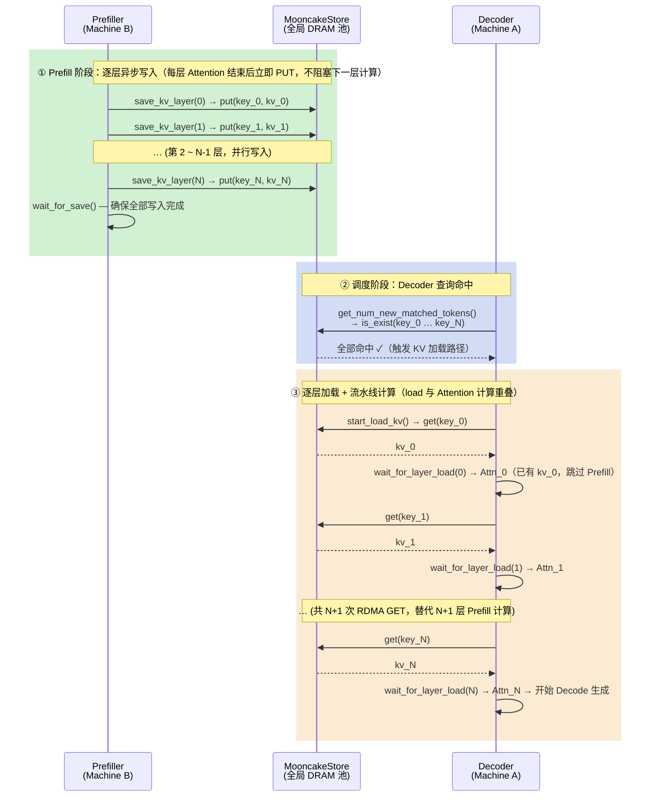

> **净效果**：Decoder 完全跳过 Prefill 计算，替换为 N+1 次跨节点 RDMA GET（延迟 ~2–5μs/次）。TTFT 从完整 Prefill 时间压缩到纯 IO 时间。

---

#### 7.3.6 部署配置

**Step 1：启动 Mooncake Master（Machine A，Decoder 同机）**

```bash
mooncake_master \
  -port 50052 \
  -max_threads 64 \
  --enable_http_metadata_server=true \
  --http_metadata_server_host=0.0.0.0 \
  --http_metadata_server_port=8080
```

`mooncake_master` 只处理元数据（key→location 映射），不参与数据传输。

**Step 2：LMCache 配置文件（YAML）**

Decoder 侧（`mooncake-decoder-config.yaml`，Machine A）：

```yaml
chunk_size: 256               # 每个缓存块的 token 数（需与 vLLM block_size 对齐）
remote_url: "mooncakestore://192.168.1.100:50052/"
remote_serde: "naive"         # 序列化格式（raw bytes，无压缩）
local_cpu: false              # 禁用本地 CPU DRAM 缓存层

extra_config:
  local_hostname: "192.168.1.100"           # 本机 IP（用于 RDMA 端点注册）
  metadata_server: "http://192.168.1.100:8080/metadata"
  protocol: "rdma"                          # 或 "tcp"（无 InfiniBand 时）
  device_name: "mlx5_0"                    # RDMA 网卡名
  master_server_address: "192.168.1.100:50052"
  global_segment_size: 32212254720          # 本机贡献给全局池的内存（30 GiB）
  local_buffer_size:   1073741824           # RDMA 传输缓冲区（1 GiB）
```

Prefiller 侧（`mooncake-prefiller-config.yaml`，Machine B）：结构完全相同，只需将 `local_hostname` 改为 Machine B 的 IP，`remote_url` 仍指向 Machine A 的 master。

**Step 3：启动 vLLM（两台机器）**

```bash
# Machine A（Decoder）
LMCACHE_CONFIG_FILE=mooncake-decoder-config.yaml \
LMCACHE_USE_EXPERIMENTAL=True \
VLLM_ENABLE_V1_MULTIPROCESSING=1 \
vllm serve Qwen/Qwen2.5-7B-Instruct \
  --kv-transfer-config '{"kv_connector":"LMCacheConnectorV1","kv_role":"kv_consumer"}' \
  --port 8200

# Machine B（Prefiller）
LMCACHE_CONFIG_FILE=mooncake-prefiller-config.yaml \
LMCACHE_USE_EXPERIMENTAL=True \
VLLM_ENABLE_V1_MULTIPROCESSING=1 \
vllm serve Qwen/Qwen2.5-7B-Instruct \
  --kv-transfer-config '{"kv_connector":"LMCacheConnectorV1","kv_role":"kv_producer"}' \
  --port 8100
```

**Step 4：代理服务器（注意事项）**

使用 LMCache 提供的 `disagg_proxy_server.py`，但**必须注释掉 `wait_decode_kv_ready(req_id)` 调用**：

```python
# disagg_proxy_server.py
async def handle_request(request):
    # Step 1: 发送到 Prefiller（计算并写入 MooncakeStore）
    await forward_to_prefiller(request)
    # wait_decode_kv_ready(req_id)   # ← 使用 MooncakeStore 时必须注释掉！
    #                                 # MooncakeStore 是解耦的：
    #                                 # Decoder 自己轮询 store，不需要 proxy 通知

    # Step 2: 发送到 Decoder（从 MooncakeStore 加载 KV，执行 Decode）
    response = await forward_to_decoder(request)
    return response
```

```bash
python3 disagg_proxy_server.py \
  --host localhost --port 9000 \
  --prefiller-host 192.168.1.200 --prefiller-port 8100 \
  --decoder-host   192.168.1.100 --decoder-port 8200
```

---

#### 7.3.7 从零手搓：LMCache + MooncakeStore 全套实现

理解原理后，从零搭建精简版，重点在于还原 LMCache 的**真实架构**。

> **手撕对齐声明**：以下实现以 LMCache 源码为准，有意简化的地方会明确标注。如发现偏差，以源码为准。

---

**Step 1：MooncakeStore Client 封装**

```python
# minimal/mooncake_client.py
from mooncake.store import MooncakeDistributedStore

class MinimalMooncakeClient:
    """
    封装 MooncakeDistributedStore，提供 put/get/exists 接口。
    参数名对齐 LMCache extra_config 字段（mooncake-{role}-config.yaml）。
    """

    def __init__(self, config: dict):
        self.store = MooncakeDistributedStore()
        self.store.setup(
            local_hostname=config["local_hostname"],       # 本机 IP，用于 RDMA 端点注册
            metadata_server=config["metadata_server"],     # mooncake_master HTTP 元数据地址
            global_segment_size=config.get("global_segment_size", 32 * 1024**3),
            local_buffer_size=config.get("local_buffer_size", 1 * 1024**3),
            protocol=config.get("protocol", "rdma"),
            device_name=config.get("device_name", ""),    # RDMA 网卡名，如 "mlx5_0"
            master_server_address=config["master_server_address"],
        )

    def put(self, key: str, data: bytes) -> None:
        self.store.put(key, data)

    def get(self, key: str) -> bytes | None:
        return self.store.get(key)

    def exists(self, key: str) -> bool:
        return self.store.is_exist(key) == 1

    def close(self) -> None:
        self.store.close()
```

---

**Step 2：块哈希与存储键**

> **关键架构澄清：LMCache 不自行计算 token 哈希。**
>
> LMCache 收到的 `block_hashes` 由 **vLLM Scheduler** 计算后通过 `connector_metadata` 传入。
> vLLM 使用**链式 SHA256**：
> ```
> hash_0 = sha256( pack(0)       ‖ tokens_0 )
> hash_n = sha256( pack(hash_{n-1}) ‖ tokens_n )
> ```
> 每个 block 的 hash 依赖整个前序链，保证前缀不同的请求不会混用彼此的 KV。
>
> LMCache 拿到这些 hash 后，按如下格式拼装存储键：
> ```
> vllm@{model_name}@{world_size}@{worker_id}@{block_hash:016x}
> ```
> 每层 KV 单独存一条 entry，key 再加 `@{layer_name}` 后缀。
>
> **以下 `VLLMBlockHasher` 仅用于独立演示时模拟 vLLM Scheduler 的哈希计算；
> 真实 LMCache 中此步骤由 vLLM 完成，connector 直接消费传入的 block_hashes。**

```python
# minimal/block_hasher.py
import hashlib, struct
import numpy as np

class VLLMBlockHasher:
    """
    模拟 vLLM Scheduler 的链式块哈希计算（对齐 vLLM SHA256 实现）。
    真实系统中由 vLLM 计算，通过 connector_metadata 传给 LMCache。
    """

    def __init__(self, block_size: int = 16):
        self.block_size = block_size

    def compute_block_hashes(self, token_ids: list[int]) -> list[int]:
        """返回每个完整 block 的链式哈希（uint64）"""
        prev = 0
        hashes = []
        for i in range(0, len(token_ids) - self.block_size + 1, self.block_size):
            chunk = token_ids[i : i + self.block_size]
            # 链式：sha256(prev_hash ‖ token_ids)，取前 8 字节为 uint64
            data = struct.pack(">Q", prev) + np.array(chunk, dtype=np.int32).tobytes()
            prev = int.from_bytes(hashlib.sha256(data).digest()[:8], "big")
            hashes.append(prev)
        return hashes


def make_lmcache_key(
    model_name: str, world_size: int, worker_id: int,
    block_hash: int, layer_name: str
) -> str:
    """
    LMCache 实际存储键格式（对齐 LMCache 源码 storage_backend/connector/）：
      vllm@{model}@{world_size}@{worker_id}@{block_hash:016x}@{layer_name}
    """
    return f"vllm@{model_name}@{world_size}@{worker_id}@{block_hash:016x}@{layer_name}"
```

---

**Step 3：Prefiller 侧连接器（save_kv_layer）**

```python
# minimal/prefill_connector.py
import torch
from .block_hasher import VLLMBlockHasher, make_lmcache_key
from .mooncake_client import MinimalMooncakeClient

class MinimalPrefillConnector:
    """
    Prefiller 侧：逐层把 KV 写入 MooncakeStore。
    对应 LMCacheConnectorV1 的 save_kv_layer + wait_for_save。

    真实 LMCache：block_hashes 由 attn_metadata 携带（vLLM 预计算）。
    此处用 VLLMBlockHasher 模拟，演示键构造逻辑。
    """

    def __init__(self, client: MinimalMooncakeClient,
                 model_name: str, block_size: int = 16):
        self.client     = client
        self.model_name = model_name.replace("/", "_")
        self.hasher     = VLLMBlockHasher(block_size)

    def save_kv_layer(
        self,
        layer_name: str,               # 如 "model.layers.0"
        kv_layer: torch.Tensor,        # shape: [2, num_tokens, num_heads, head_dim]
        block_hashes: list[int],       # vLLM 链式哈希，由 attn_metadata 携带
    ) -> None:
        """按 block 把当前层 KV 写入 MooncakeStore"""
        block_size = kv_layer.shape[1] // len(block_hashes)

        for blk_idx, blk_hash in enumerate(block_hashes):
            start = blk_idx * block_size
            end   = start + block_size
            kv_chunk = kv_layer[:, start:end, :, :]   # [2, block_size, heads, dim]

            key      = make_lmcache_key("1", 1, 0, blk_hash, layer_name)
            kv_bytes = kv_chunk.cpu().numpy().tobytes()
            self.client.put(key, kv_bytes)

    def wait_for_save(self) -> None:
        """等待所有异步写入完成（简化版同步 put，无需等待）"""
        pass
```

---

**Step 4：Decoder 侧连接器（start_load_kv + wait_for_layer_load）**

```python
# minimal/decode_connector.py
import threading, torch
from .block_hasher import make_lmcache_key
from .mooncake_client import MinimalMooncakeClient

class MinimalDecodeConnector:
    """
    Decoder 侧：从 MooncakeStore 异步加载 KV，按层写入 paged KV buffer。
    对应 LMCacheConnectorV1 的 start_load_kv + wait_for_layer_load。

    block_hashes 来自 scheduler_output.connector_metadata（vLLM 预计算，
    经 build_connector_meta → scheduler_output 流转到 worker 侧）。
    """

    def __init__(self, client: MinimalMooncakeClient,
                 kv_caches: list[torch.Tensor]):
        self.client     = client
        self.kv_caches  = kv_caches
        self._layer_events: dict[str, threading.Event] = {}

    def start_load_kv(
        self,
        block_hashes: list[int],   # vLLM 链式哈希列表（每个 block 一个）
        block_ids:    list[int],   # 对应 vLLM paged KV buffer 中的物理 block id
        layer_names:  list[str],   # 所有层名称列表
    ) -> None:
        """为每层启动后台线程，并行从 MooncakeStore 拉取 KV"""
        for layer_name in layer_names:
            ev = threading.Event()
            self._layer_events[layer_name] = ev

            def _load(lname=layer_name, ev=ev):
                layer_idx = layer_names.index(lname)
                kv_cache  = self.kv_caches[layer_idx]
                for blk_idx, (blk_hash, blk_id) in enumerate(
                    zip(block_hashes, block_ids)
                ):
                    key      = make_lmcache_key("1", 1, 0, blk_hash, lname)
                    kv_bytes = self.client.get(key)
                    if kv_bytes is None:
                        continue
                    # 写入 paged KV buffer 的对应物理 block
                    kv_tensor = torch.frombuffer(kv_bytes, dtype=kv_cache.dtype)
                    kv_tensor = kv_tensor.reshape(2, -1, *kv_cache.shape[2:])
                    kv_cache[0, blk_id] = kv_tensor[0]   # key cache
                    kv_cache[1, blk_id] = kv_tensor[1]   # value cache
                ev.set()

            threading.Thread(target=_load, daemon=True).start()

    def wait_for_layer_load(self, layer_name: str) -> None:
        """等待指定层 KV 加载完成（在该层 Attention 执行前调用）"""
        ev = self._layer_events.pop(layer_name, None)
        if ev:
            ev.wait()
```

---

**Step 5：组装 vLLM V1 Connector（胶水层）**

```python
# minimal/lmcache_connector.py
import os, json, threading
from vllm.distributed.kv_transfer.kv_connector.v1.base import KVConnectorBase_V1
from .block_hasher import VLLMBlockHasher, make_lmcache_key
from .mooncake_client import MinimalMooncakeClient
from .decode_connector import MinimalDecodeConnector
from .prefill_connector import MinimalPrefillConnector

class MinimalLMCacheConnector(KVConnectorBase_V1):
    """精简版 LMCacheConnectorV1，对齐真实 LMCache 的调用路径"""

    def __init__(self, vllm_config, role):
        super().__init__(vllm_config, role)
        cfg = json.load(open(os.environ["LMCACHE_CONFIG_FILE"]))
        self.client      = MinimalMooncakeClient(cfg.get("extra_config", {}))
        self.block_size  = vllm_config.cache_config.block_size  # 与 vLLM block 对齐
        self.hasher      = VLLMBlockHasher(self.block_size)
        self.model_name  = vllm_config.model_config.model.replace("/", "_")
        self._load_connector: MinimalDecodeConnector | None = None

    # ── Scheduler 侧 ─────────────────────────────────────────────

    def get_num_new_matched_tokens(
        self, request, num_computed_tokens: int
    ) -> tuple[int, bool]:
        """
        查询 MooncakeStore 中已有多少连续 block 命中。
        真实 LMCache：直接使用 request 携带的 vLLM block_hashes 逐个查 exists()。
        此处用模拟 hasher 替代（逻辑等价）。
        """
        token_ids    = request.inputs.prompt_token_ids
        block_hashes = self.hasher.compute_block_hashes(token_ids)

        matched = 0
        for blk_hash in block_hashes:
            # 只要第 0 层存在，认为整个 block 已缓存（简化：真实 LMCache 检查所有层）
            probe_key = make_lmcache_key(self.model_name, 1, 0, blk_hash, "layer.0")
            if not self.client.exists(probe_key):
                break
            matched += 1

        new_tokens = matched * self.block_size - num_computed_tokens
        return max(new_tokens, 0), new_tokens > 0

    def update_state_after_alloc(self, request, blocks, num_lookahead_slots):
        pass

    def build_connector_meta(self, request):
        """把 block_hashes 和 block_ids 打包，随 scheduler_output 流转到 worker 侧"""
        token_ids    = request.inputs.prompt_token_ids
        block_hashes = self.hasher.compute_block_hashes(token_ids)
        return {
            "block_hashes": block_hashes,
            "block_ids":    request.get_block_ids(),
        }

    def request_finished(self, request, block_ids, success):
        return False, None   # LMCache 无需 delay_free

    def take_events(self):
        return []

    # ── Worker 侧 ─────────────────────────────────────────────────

    def register_kv_caches(self, kv_caches):
        self.kv_caches  = kv_caches
        self.layer_names = [f"model.layers.{i}" for i in range(len(kv_caches))]

    def save_kv_layer(self, layer_name: str, kv_layer, attn_metadata, **kwargs):
        """
        Prefiller 侧：把当前层 KV 写入 MooncakeStore。
        真实 LMCache：block_hashes 从 attn_metadata 取得（vLLM 预计算）。
        """
        token_ids    = attn_metadata.seq_groups[0].get_token_ids()   # 简化取法
        block_hashes = self.hasher.compute_block_hashes(token_ids)
        connector    = MinimalPrefillConnector(
            self.client, self.model_name, self.block_size
        )
        connector.save_kv_layer(layer_name, kv_layer, block_hashes)

    def wait_for_save(self):
        pass   # 真实 LMCache：等待后台异步 put 线程池完成

    def start_load_kv(self, scheduler_output, finished_reqs):
        """Decoder 侧：从 scheduler_output.connector_metadata 取 block_hashes，启动异步加载"""
        meta = scheduler_output.connector_metadata
        if not meta:
            return
        self._load_connector = MinimalDecodeConnector(self.client, self.kv_caches)
        self._load_connector.start_load_kv(
            block_hashes = meta["block_hashes"],
            block_ids    = meta["block_ids"],
            layer_names  = self.layer_names,
        )

    def wait_for_layer_load(self, layer_name: str):
        if self._load_connector:
            self._load_connector.wait_for_layer_load(layer_name)

    def get_finished(self, finished_req_ids):
        return [], []
```

---

#### 7.3.8 本节小结

| 维度 | P2P MooncakeConnector（§7.6） | LMCache + MooncakeStore（本节） | vllm-ascend AscendStore（§7.4） |
|------|------------------------------|--------------------------------|--------------------------------|
| **定位** | 简单 PD 分离，低延迟直传 | 主流全局 KV 池（NVIDIA GPU） | Ascend NPU 全局 KV 池 |
| **跨请求复用** | ❌ | ✅ | ✅ |
| **中间层** | 无 | LMCache（LocalBuffer） | 无 |
| **调度器查询** | 无（不感知前缀） | 进程内 ChunkedTokenDatabase | ZMQ intra-node |
| **per-layer IO** | ❌（一次性传输） | ✅ save_kv_layer / wait_for_layer_load | ✅ LayerSending/RecvingThread |
| **delay_free** | ✅ | ❌ | ❌ |
| **多 Decoder 共享** | ❌ | ✅（XP:YD） | ✅ |
| **配置方式** | `MOONCAKE_CONFIG_PATH` JSON | `LMCACHE_CONFIG_FILE` YAML | `MOONCAKE_CONFIG_PATH` JSON |
| **适合场景** | 严格 1P:1D、超低延迟 | 通用 NVIDIA 集群、大规模 Prefix 复用 | 华为 Ascend 集群 |

**推荐选择逻辑**：
- 你用 NVIDIA GPU，需要跨请求前缀复用 → **LMCache + MooncakeStore**（本节）
- 你用华为 Ascend NPU → **vllm-ascend AscendStore**（§7.4）
- 极简部署，只需单次 P→D 传输，不关心 KV 持久化 → **P2P MooncakeConnector**（§7.6）

---

### 7.4 vllm-ascend AscendStore：真实全局 KV 池实现

> 源码路径：`vllm_ascend/distributed/kv_transfer/kv_pool/ascend_store/`

7.8 节的模拟实现揭示了全局 KV 池的设计原理。vllm-ascend 的 **AscendStore** 是真实生产中的全局 KV 池实现，是本章的核心方案。本节将逐层拆解其四层架构、关键数据结构、请求生命周期、传输线程精髓，以及 MooncakeDistributedStore 后端原理，最后提供完整的"从零手搓"七步实现骨架。

#### 7.4.1 完整四层架构

AscendStore 由四层组件构成，每层职责清晰分离：

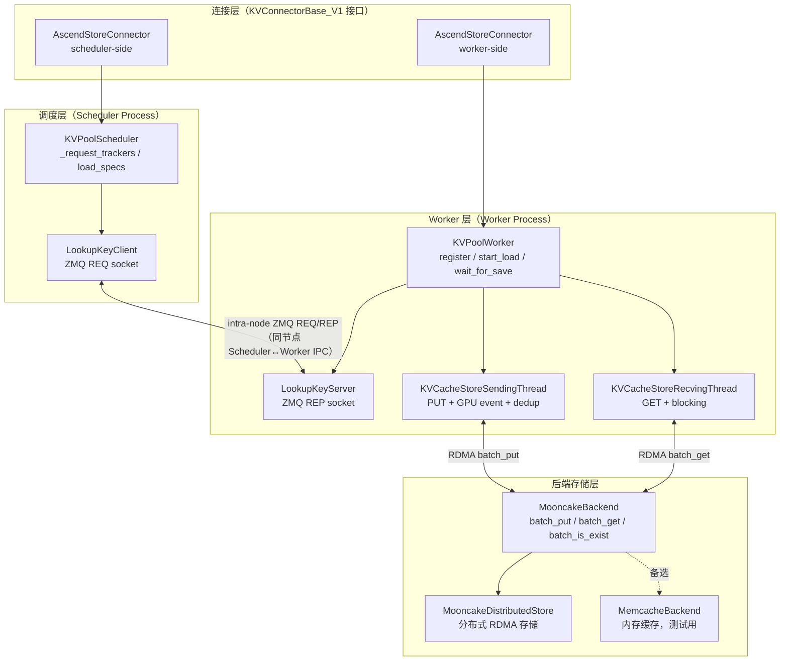

**与 7.8 模拟版的对应关系：**

| 模拟版 | AscendStore 对应组件 | 职责 |
|--------|---------------------|------|
| `GlobalMetadataServer` | `KVPoolScheduler` + `LookupKeyClient/Server` | 查询哪些 block 已缓存 |
| `TransferEngine` | `KVCacheStoreSendingThread` + `RecvingThread` | 执行实际 KV 读写 |
| `publish_kv()` | `wait_for_save()` → `SendingThread` | 将 KV 写入全局池 |
| `wait_for_kv()` | `wait_for_layer_load()` | 等待 KV 从全局池加载 |
| `hash(tuple(tokens))` | `PoolKey.to_string()` (SHA-256) | 内容寻址，跨节点去重 |

**两个关键设计决策：**

- **ZMQ 是 Intra-Node（同节点）的**：Scheduler Process 和 Worker Process 运行在同一台机器上，ZMQ IPC socket 只负责进程间通信。跨节点查询通过 MooncakeDistributedStore 的 etcd 元数据服务完成。
- **`delay_free=False`**：与上游 MooncakeConnector（P2P 模式，`delay_free=True`）不同，AscendStore 是全局池，写入后 block 不依赖 D 节点持有，因此不需要延迟释放。

---

#### 7.4.2 关键数据结构

理解数据结构是读懂整个系统的前提。

**PoolKey：内容寻址存储键**

```python
# config_data.py（源码：config_data.py:14-52）

@dataclasses.dataclass
class KeyMetadata:
    """PoolKey 的元数据部分，描述 KV 所属的计算位置"""
    model_name: str         # 模型名称（不同模型 KV 形状不通用）
    head_or_tp_rank: int    # TP rank（各 rank 存不同 head 的 KV）
    pcp_rank: int           # Prefill Context Parallel rank（上下文并行维度）
    dcp_rank: int           # Decode  Context Parallel rank（上下文并行维度）
    pp_rank: int            # Pipeline Parallel rank（各 stage 层不同）

@dataclasses.dataclass
class PoolKey:
    key_metadata: KeyMetadata
    chunk_hash: str         # 已是 hex 字符串（由 vLLM core BlockHash 传入）

    def to_string(self) -> str:
        """生成全局唯一存储键，格式：model@pcp{n}@dcp{n}@head_or_tp_rank:{n}@pp_rank:{n}@hash"""
        return (
            f"{self.key_metadata.model_name}"
            f"@pcp{self.key_metadata.pcp_rank}"
            f"@dcp{self.key_metadata.dcp_rank}"
            f"@head_or_tp_rank:{self.key_metadata.head_or_tp_rank}"
            f"@pp_rank:{self.key_metadata.pp_rank}"
            f"@{self.chunk_hash}"
        )
```

> **⚠️ pcp_rank / dcp_rank 说明**：`pcp` = Prefill Context Parallel rank，`dcp` = Decode Context Parallel rank，用于支持异构 TP 场景下的精确寻址（一线系统设计文档：Key 结构设计为 `model(@pp)(@pcp)(@dcp)@head_or_tp_rank@hash`）。

为什么要把 `tp_rank` / `pcp_rank` / `dcp_rank` 全部编入 key？

```
TP=4 时，同一 block 的 KV 在 4 个 rank 上各不同：
  rank 0 存 head 0~7  的 K/V
  rank 1 存 head 8~15 的 K/V
  rank 2 存 head 16~23 的 K/V
  rank 3 存 head 24~31 的 K/V

pcp/dcp rank 进一步区分异构 TP 场景下 Prefill/Decode 侧的上下文并行分片。
所有维度都编入 key，才能在全局池中精确寻址，避免跨 rank 混用 KV 数据。
```

**ChunkedTokenDatabase：把 block_hashes 映射成 PoolKey 序列**

> **⚠️ 关键纠正**：`ChunkedTokenDatabase` **不计算 hash**。SHA-256 由 vLLM 核心调度器通过 `BlockHash` 机制完成，`ChunkedTokenDatabase` 只是接收这些哈希值、做 `bytes→hex` 格式转换、生成 `PoolKey`。

```python
# config_data.py（源码：config_data.py:139-181）

class ChunkedTokenDatabase:
    """将 token 序列按 block 切分，把外部传入的 block_hashes 映射成 PoolKey 列表"""

    def __init__(self, block_size: int, key_metadata: KeyMetadata):
        self.block_size = block_size
        self.key_metadata = key_metadata

    def process_tokens(
        self,
        token_len: int,
        block_hashes: list[BlockHash] | list[str],  # 来自 vLLM core，非本类计算
        mask_num: int = 0,
    ) -> Iterable[tuple[int, int, PoolKey]]:
        """
        将 vLLM core 计算好的 block_hashes 转换为 (start, end, PoolKey) 三元组序列。

        注意：
        - BlockHash 是 bytes 类型时做 .hex() 转换；已是 str 时直接使用
        - PoolKey 中的 chunk_hash 是 hex string，而非原始 bytes
        """
        if block_hashes and not isinstance(block_hashes[0], str):
            block_hashes = [h.hex() for h in block_hashes]  # bytes → hex，不重新计算

        for chunk_id, hash_val in enumerate(block_hashes):
            start_idx = chunk_id * self.block_size
            end_idx   = min(start_idx + self.block_size, token_len)
            yield start_idx, end_idx, self._make_key_by_hash(hash_val)

    def _make_key_by_hash(self, hash_val: str) -> PoolKey:
        return PoolKey(key_metadata=self.key_metadata, chunk_hash=hash_val)
```

**哈希计算责任分工**：
```
vLLM Scheduler
  └── BlockHash 计算（基于 token_ids 内容，跨节点一致性依赖 PYTHONHASHSEED=0）
       └── 传入 ChunkedTokenDatabase.process_tokens(block_hashes=...)
            └── 只做 bytes→hex，生成 PoolKey，查询全局池
```

**ReqMeta 与 LoadSpec：请求元数据**

```python
# config_data.py
@dataclasses.dataclass
class ReqMeta:
    """Worker 侧：描述一个 block 集合的存取任务"""
    req_id: str
    keys: list[str]          # PoolKey.to_string() 列表（全局存储键）
    kv_addrs: list[int]      # GPU 内存地址（每个 block 首地址，DMA 可访问）
    kv_sizes: list[int]      # 每个 block 的字节大小
    event: "torch.cuda.Event | None"  # GPU event，用于 SendingThread 同步

@dataclasses.dataclass
class LoadSpec:
    """Scheduler 侧：描述需要从全局池加载的 block 信息"""
    req_id: str
    num_matched_blocks: int     # 命中的 block 数量
    block_hashes: list[bytes]   # 各 block 的 SHA-256 原始 bytes
    block_ids: list[int]        # 本地物理 block ID（update_state_after_alloc 后填充）
```

---

#### 7.4.3 调度器侧生命周期

调度器侧（Scheduler Process）通过 `KVPoolScheduler` 管理请求状态，通过 ZMQ 向同节点 Worker 查询全局池命中情况。

**`get_num_new_matched_tokens()`：ZMQ 查询全局池**

```python
# pool_scheduler.py（精简注释版）
class KVPoolScheduler:
    def __init__(self, block_size, model_name, tp_rank, pp_rank):
        self.block_size = block_size
        self.model_name = model_name
        self.tp_rank    = tp_rank
        self.pp_rank    = pp_rank
        # per-request 状态
        self._chunked_dbs:      dict[str, ChunkedTokenDatabase] = {}
        self._request_trackers: dict[str, int]                  = {}  # req_id → 已确认命中块数
        self.load_specs:        dict[str, LoadSpec]             = {}
        # ZMQ 查询客户端（intra-node）
        self.lookup_client = LookupKeyClient(ipc_path="/tmp/kv_lookup.ipc")

    def get_num_new_matched_tokens(
        self, request, num_computed_tokens: int
    ) -> tuple[int, bool]:
        req_id    = request.request_id
        token_ids = request.inputs.prompt_token_ids

        # 1. 更新分块哈希缓存
        db = self._chunked_dbs.setdefault(
            req_id, ChunkedTokenDatabase(self.block_size)
        )
        db.update(token_ids)

        # 2. 计算本次要查询的范围
        total_blocks    = len(token_ids) // self.block_size
        prev_matched    = self._request_trackers.get(req_id, 0)
        blocks_to_query = total_blocks - prev_matched
        if blocks_to_query <= 0:
            return 0, False

        # 3. ZMQ 查询：向同节点 Worker 发送哈希列表
        all_hashes = db.get_hashes(total_blocks)
        new_hashes = all_hashes[prev_matched:]
        hit_count  = self.lookup_client.lookup(
            token_len=len(token_ids),
            hashes=new_hashes,
        )

        # 4. 更新命中状态
        new_total_matched = prev_matched + hit_count
        self._request_trackers[req_id] = new_total_matched

        # 5. 保存 LoadSpec（供 build_connector_meta 使用）
        if hit_count > 0:
            self.load_specs[req_id] = LoadSpec(
                req_id=req_id,
                num_matched_blocks=new_total_matched,
                block_hashes=all_hashes[:new_total_matched],
                block_ids=[],   # 待 update_state_after_alloc 填充
            )

        return hit_count * self.block_size, hit_count > 0
```

**ZMQ Lookup 通信协议**

```
Scheduler Process                       Worker Process
────────────────                        ──────────────
LookupKeyClient (ZMQ REQ)    →→→→→    LookupKeyServer (ZMQ REP)
                                               │
frames = [                                     ↓
  token_len (8 bytes LE),             构造 PoolKey 列表
  hash_0 (32 bytes SHA-256),          backend.exists(keys)   ← MooncakeStore etcd 查询
  hash_1 (32 bytes),                  计算前缀连续命中数
  ...
]                               ←←←←  reply = hit_count (8 bytes LE)
```

**`update_state_after_alloc()`：记录物理 block ID**

```python
def update_state_after_alloc(self, request, blocks, num_lookahead_slots):
    """Scheduler 分配物理 block 后调用，把 block_id 填入 LoadSpec"""
    spec = self.load_specs.get(request.request_id)
    if spec is None:
        return
    # 从 request 的 block table 取前 num_matched_blocks 个物理 block ID
    spec.block_ids = request.get_block_ids()[:spec.num_matched_blocks]
```

**`build_connector_meta()`：打包 IPC 元数据**

```python
# ascend_store_connector.py（scheduler-side）
def build_connector_meta(self, request) -> AscendConnectorMetadata | None:
    """把 LoadSpec 封装为跨进程 IPC 消息（通过 vLLM 内部机制传递给 Worker）"""
    spec = self.scheduler.load_specs.pop(request.request_id, None)
    if spec is None:
        return None
    return AscendConnectorMetadata(
        req_id=spec.req_id,
        num_matched_blocks=spec.num_matched_blocks,
        block_hashes=spec.block_hashes,
        block_ids=spec.block_ids,
    )
```

---

#### 7.4.4 Worker 侧生命周期

Worker Process 接收 Scheduler 发来的 `AscendConnectorMetadata`，通过 `KVPoolWorker` 执行实际的 KV 加载和存储。

**`register_kv_caches()`：向后端注册 GPU 内存**

```python
# pool_worker.py
class KVPoolWorker:
    def register_kv_caches(self, kv_caches: list[torch.Tensor]) -> None:
        """
        把所有层的 GPU KV Cache 内存段注册到 MooncakeDistributedStore。
        注册后，RDMA 传输可直接操作这些显存地址，无需额外拷贝。
        """
        self.kv_caches = kv_caches
        for kv_cache in kv_caches:
            # 向传输引擎注册这块 GPU 内存（地址 + 大小）
            self.backend.register_buffer(
                addr=kv_cache.data_ptr(),
                size=kv_cache.nbytes,
            )
        # 计算单个 block 的字节大小（所有层合并）
        # kv_cache shape: [2, num_blocks, block_size, num_heads, head_size]
        single_block_elems = kv_caches[0][0][0].numel()  # 一层一个 block 的元素数
        self.block_bytes = (
            kv_caches[0].element_size()
            * single_block_elems
            * len(kv_caches)  # 所有层
        )
```

**`start_load_kv()`：异步触发跨节点 KV 加载**

```python
def start_load_kv(
    self,
    scheduler_output: SchedulerOutput,
    finished_reqs: list[str],
) -> None:
    """读取 AscendConnectorMetadata，为每个命中请求提交 RDMA GET 任务"""
    meta: AscendConnectorMetadata = scheduler_output.connector_metadata
    if meta is None:
        return

    for load_req in meta.load_requests:
        # 1. 根据物理 block_ids 计算 GPU 内存地址
        addrs = [
            self.kv_caches[0].data_ptr() + bid * self.block_bytes
            for bid in load_req.block_ids[:load_req.num_matched_blocks]
        ]
        sizes = [self.block_bytes] * load_req.num_matched_blocks

        # 2. 构造内容寻址存储键（与 SendingThread 存入时完全一致）
        keys = [
            PoolKey(
                model_name=self.model_name,
                head_or_tp_rank=self.tp_rank,
                chunk_hash=h,
                pp_rank=self.pp_rank,
            ).to_string()
            for h in load_req.block_hashes
        ]

        # 3. 提交给 RecvingThread 异步执行 RDMA GET
        req_meta = ReqMeta(
            req_id=load_req.req_id,
            keys=keys, kv_addrs=addrs, kv_sizes=sizes,
            event=None,  # 加载不需要 GPU event
        )
        done_event = self.kv_recv_thread.add_request(req_meta)
        self._load_events[load_req.req_id] = done_event
```

**`wait_for_save()`：GPU Event 同步后异步存储**

```python
def wait_for_save(self, request, finished: bool) -> bool:
    """
    请求完成（计算结束）后，异步将 KV 写入全局池。
    核心问题：GPU 是异步的，KV 计算和 CPU 代码并行执行，
    必须用 Event 确保 KV 写入显存后再发起 RDMA。
    """
    if not finished:
        return False

    # 1. 创建 GPU/NPU Event 并在当前 stream 上打点（非阻塞）
    #    这个 event 标记"KV 计算已完成"的时间点
    event = torch.cuda.Event()
    event.record()  # 在 NPU stream 上打点，CPU 立即返回

    # 2. 构造存储任务
    block_ids    = request.get_block_ids()
    block_hashes = self._get_block_hashes(request)
    addrs = [
        self.kv_caches[0].data_ptr() + bid * self.block_bytes
        for bid in block_ids
    ]
    keys = [
        PoolKey(self.model_name, self.tp_rank, h, self.pp_rank).to_string()
        for h in block_hashes
    ]

    # 3. 提交给 SendingThread（含 event）
    #    SendingThread 会在合适时机调用 event.synchronize()
    req_meta = ReqMeta(
        req_id=request.request_id,
        keys=keys,
        kv_addrs=addrs,
        kv_sizes=[self.block_bytes] * len(block_ids),
        event=event,
    )
    self.kv_send_thread.add_request(req_meta)

    # delay_free=False：AscendStore 全局池不依赖延迟释放
    return False
```

---

#### 7.4.5 传输线程：GPU Event 同步与去重

传输线程是 AscendStore 中最精密的部分，解决两个核心问题：
1. **正确性**：如何确保 KV 计算完成后再传输？→ GPU Event 同步
2. **效率**：如何避免重复传输相同的 block？→ 内容寻址去重

**KVCacheStoreSendingThread**

```python
# kv_transfer.py
import queue, threading, torch
from .backend import Backend

class KVCacheStoreSendingThread(threading.Thread):
    """
    专用后台线程：把 NPU/GPU 上的 KV 异步写入 MooncakeStore。
    流程：去重检查 → GPU Event 同步 → 批量 RDMA PUT
    """
    def __init__(self, backend: Backend):
        super().__init__(daemon=True)
        self.backend = backend
        self._queue: queue.Queue[ReqMeta | None] = queue.Queue()

    def add_request(self, req_meta: ReqMeta) -> None:
        """主线程调用（非阻塞），把任务入队"""
        self._queue.put(req_meta)

    def run(self) -> None:
        while True:
            req_meta = self._queue.get()
            if req_meta is None:  # 哨兵值，退出
                break
            self._handle_put(req_meta)

    def _handle_put(self, req_meta: ReqMeta) -> None:
        # ── Step 1：去重检查（避免 RDMA 重复写入相同 block）──────────
        # 内容寻址：不同节点对相同 token 序列产生相同 key
        # 若 block 已在全局池中（另一个 P 节点已存入），直接跳过
        exists_flags = self.backend.exists(req_meta.keys)
        new_keys, new_addrs, new_sizes = [], [], []
        for key, addr, size, exists in zip(
            req_meta.keys, req_meta.kv_addrs, req_meta.kv_sizes, exists_flags
        ):
            if not exists:
                new_keys.append(key)
                new_addrs.append(addr)
                new_sizes.append(size)

        if not new_keys:
            return  # 全部已缓存，无需传输

        # ── Step 2：等待 GPU/NPU 计算完成（关键同步点）──────────────
        # event.synchronize() 会阻塞当前 CPU 线程，等待 NPU stream
        # 到达 event 记录时刻——确保 KV 数据已写入显存。
        #
        # 时序保证：
        #   NPU:  ... → Attn 计算 KV → [event.record()] → 继续计算
        #   CPU(SendingThread): ... → event.synchronize() → RDMA PUT
        #                                    ↑
        #                            此处等待，直到 NPU 过了 record 时刻
        if req_meta.event is not None:
            req_meta.event.synchronize()

        # ── Step 3：批量 RDMA PUT（零拷贝，直接从 GPU 显存写出）────
        self.backend.put(new_keys, new_addrs, new_sizes)
```

**KVCacheStoreRecvingThread**

```python
# kv_transfer.py
class KVCacheStoreRecvingThread(threading.Thread):
    """
    专用后台线程：从 MooncakeStore 异步加载 KV 到本地 GPU 显存。
    """
    def __init__(self, backend: Backend):
        super().__init__(daemon=True)
        self.backend = backend
        self._queue: queue.Queue[ReqMeta | None] = queue.Queue()
        self._done_events: dict[str, threading.Event] = {}

    def add_request(self, req_meta: ReqMeta) -> threading.Event:
        """主线程调用，返回 Event 供 wait_for_layer_load() 等待"""
        done_event = threading.Event()
        self._done_events[req_meta.req_id] = done_event
        self._queue.put(req_meta)
        return done_event

    def run(self) -> None:
        while True:
            req_meta = self._queue.get()
            if req_meta is None:
                break
            self._handle_get(req_meta)

    def _handle_get(self, req_meta: ReqMeta) -> None:
        # RDMA GET：从全局池把 KV 拉到本地 GPU 显存（blocking=True）
        # MooncakeStore 自动路由到存有该 key 的节点（通过 etcd 查 local_seg）
        self.backend.get(
            req_meta.keys,
            req_meta.kv_addrs,
            req_meta.kv_sizes,
        )
        # 通知 wait_for_layer_load()：加载完成
        done_event = self._done_events.pop(req_meta.req_id, None)
        if done_event:
            done_event.set()
```

**逐层传输变体（Layerwise）**

AscendStore 还提供逐层版本 `KVCacheStoreLayerSendingThread` / `KVCacheStoreLayerRecvingThread`，支持存储读取与模型计算的流水线：

```python
# pool_worker.py（逐层加载 generator）
def _retrieve_layerwise(self, req_meta) -> Generator:
    """
    把 [block, layer] 的二维 key 转置为 [layer, block]，
    逐层提交给 RecvingThread，每提交一层就 yield 一次。
    外层的 wait_for_layer_load() 等待当前层完成后，
    模型才能执行该层的 Attention 计算。
    """
    # keys_2d[block_idx][layer_idx] → 转置为 keys_by_layer[layer_idx][block_idx]
    keys_by_layer = [list(row) for row in zip(*self._keys_2d[req_id])]
    for layer_id, layer_keys in enumerate(keys_by_layer):
        self.kv_layer_recv_thread.add_request(
            LayerReqMeta(layer_id=layer_id, keys=layer_keys, ...)
        )
        yield  # vLLM 主循环: wait_for_layer_load() → 等该层 → 执行 Attention → next()
```

**TP 场景下的 PoolKey 设计**

TP=4 时，同一 block 在 4 个 rank 上存储的 K/V **内容不同**（各 rank 只有自己分到的 head 分片），因此必须用不同的 key 区分：

```
rank 0 → PoolKey: ...@head_or_tp_rank:0@...@{hash}  (head 0–7 的 KV)
rank 1 → PoolKey: ...@head_or_tp_rank:1@...@{hash}  (head 8–15 的 KV)
rank 2 → PoolKey: ...@head_or_tp_rank:2@...@{hash}  (head 16–23 的 KV)
rank 3 → PoolKey: ...@head_or_tp_rank:3@...@{hash}  (head 24–31 的 KV)
```

加载时，rank R 只能读取 `head_or_tp_rank=R` 的 entry，拿到的才是自己那份 head 分片。`head_or_tp_rank` 字段的核心作用正是在**相同 block hash 下区分不同 TP rank 的 KV 分片**，防止跨 rank 数据混用。

> **例外：GQA/MLA 等 KV head 数极少的架构**，K/V 可能不参与 TP 分片——所有 rank 的 K/V 张量完全相同。此时 4 份存储确实冗余，可只让 1 个 rank 写入、其他 rank 读取同一 entry。`pool_worker.py:580+` 的 `lookup_scheduler` 对这类场景有专项处理，感兴趣可对照源码深入。

---

#### 7.4.6 MooncakeDistributedStore 后端

`MooncakeBackend` 封装了底层 `MooncakeDistributedStore` 的复杂性，提供简洁的 `put/get/exists` 接口。

**配置文件（JSON）**

通过环境变量 `MOONCAKE_CONFIG_PATH` 指定配置文件路径：

```json
{
    "metadata_server":       "192.168.1.100:2379",
    "global_segment_size":   68719476736,
    "local_buffer_size":     4294967296,
    "protocol":              "ascend",
    "master_server_address": "192.168.1.100:50051",
    "device_name":           "ascend"
}
```

| 字段 | 含义 |
|------|------|
| `metadata_server` | etcd 地址，存储全局 key→local_seg 映射（哪个节点有哪些 block） |
| `global_segment_size` | 每节点注册给全局池的显存大小。支持整数（bytes）或字符串（`"1GB"`、`"512MB"`）；**生产部署建议从 `"1GB"` 起步**，过大值（100GB 级别整数）会导致 mooncake 初始化失败（见 §7.5.2） |
| `local_buffer_size` | 本地传输缓冲区大小（4 GB） |
| `protocol` | 传输协议：`rdma`（InfiniBand）或 `ascend`（华为 HCCS） |
| `master_server_address` | MooncakeStore master 节点地址（负责传输协调） |

**完整 MooncakeBackend 实现**

```python
# backend/mooncake_backend.py
import os, json
from mooncake.store import MooncakeDistributedStore, ReplicateConfig

class MooncakeStoreConfig:
    @classmethod
    def load_from_env(cls) -> "MooncakeStoreConfig":
        path = os.environ.get("MOONCAKE_CONFIG_PATH")
        if not path:
            raise RuntimeError("MOONCAKE_CONFIG_PATH 未设置")
        with open(path) as f:
            data = json.load(f)
        cfg = cls()
        cfg.metadata_server       = data["metadata_server"]
        cfg.global_segment_size   = data["global_segment_size"]
        cfg.local_buffer_size     = data.get("local_buffer_size", 0)
        cfg.protocol              = data.get("protocol", "rdma")
        cfg.master_server_address = data.get("master_server_address", "")
        cfg.device_name           = data.get("device_name", "")
        return cfg

class MooncakeBackend(Backend):
    def __init__(self, parallel_config):
        cfg = MooncakeStoreConfig.load_from_env()

        # 本地 segment 名（节点唯一标识，写入 etcd 元数据）
        self.local_seg = (
            f"{os.uname().nodename}_tp{parallel_config.tp_rank}"
        )

        # 初始化分布式存储（此时建立与 master 的连接，注册本节点）
        self.store = MooncakeDistributedStore()
        self.store.setup(
            local_seg=self.local_seg,
            metadata_server=cfg.metadata_server,
            global_segment_size=cfg.global_segment_size,
            local_buffer_size=cfg.local_buffer_size,
            protocol=cfg.protocol,
            master_server_address=cfg.master_server_address,
            device_name=cfg.device_name,
        )

    def register_buffer(self, addr: int, size: int) -> None:
        """把 GPU/NPU 内存段注册到 RDMA 引擎（一次性操作）"""
        # 注册后，RDMA PUT/GET 可直接操作这段显存，无需 CPU 中转
        self.store.register_memory(addr, size)

    def put(self, keys: list[str], addrs: list[int], sizes: list[int]) -> None:
        """批量写入：GPU 显存 → 全局分布式存储（优先写本地节点）"""
        rc = ReplicateConfig()
        rc.preferred_segment         = self.local_seg  # 优先写本地（减少跨节点延迟）
        rc.prefer_alloc_in_same_node = True
        self.store.batch_put_from_multi_buffers(keys, addrs, sizes, rc)
        # 写入后，etcd 元数据自动更新：key → local_seg 映射

    def get(self, keys: list[str], addrs: list[int], sizes: list[int]) -> None:
        """批量读取：全局分布式存储 → GPU 显存（阻塞直到完成）"""
        # MooncakeStore 通过 etcd 查询 key 所在节点，自动路由 RDMA
        self.store.batch_get_into_multi_buffers(
            keys, addrs, sizes,
            True,  # blocking=True
        )

    def exists(self, keys: list[str]) -> list[bool]:
        """批量检查：key 是否已在全局池中（任意节点上）"""
        return self.store.batch_is_exist(keys)
```

**`preferred_segment` 的作用（局部性优化）**

```
4 节点集群，Node 1 执行 PUT：
  preferred_segment = "node1_tp0"
         ↓
  MooncakeStore 优先将数据存储在 node1 的 global_segment
         ↓
  etcd 记录：key → "node1_tp0"
         ↓
  其他节点 GET 该 key 时，MooncakeStore 路由到 node1，走 RDMA 读取
         ↓
  如果 node1 故障，MooncakeStore 可从副本节点读取（ReplicateConfig 可配多副本）
```

**两种后端的数据流对比：Mooncake vs MemCache**

AscendStoreConnector 支持两种存储后端，数据路径完全不同，直接决定了 `ASCEND_BUFFER_POOL` 的必要性与延迟特征：

```
Mooncake 后端（A2/A3 通用，需要 Transfer Buffer 中转）
──────────────────────────────────────────────────────────────────
存储路径：NPU KV Cache
              │  [D2D，NPU内部总线]
              ▼
         Transfer Buffer（ASCEND_BUFFER_POOL 配置的缓冲区）
              │  [跨节点 D2D，昇腾 HCCS/RDMA]
              ▼
         远端 Transfer Buffer
              │  [D2H，Host DRAM 写入]
              ▼
         远端 Host DRAM（全局池存储）

读取路径：远端 Host DRAM → 远端 Transfer Buffer → [跨节点 D2D]
           → 本地 Transfer Buffer → [D2D] → NPU KV Cache

⚠️ A3 硬件已知问题：D2D 与跨节点 D2D 共享同一总线，
   高并发时两路流量互相干扰，导致性能退化。

MemCache 后端（需要 A3 及以上，昇腾统一寻址）
──────────────────────────────────────────────────────────────────
存储路径：NPU KV Cache
              │  [D2RH，直接写入远端 Host DRAM，统一寻址]
              ▼
         远端 Host DRAM（全局池存储）

读取路径：远端 Host DRAM
              │  [RH2D，直接读入 NPU KV Cache，统一寻址]
              ▼
         NPU KV Cache

✅ 减少一次 D2D 中转，路径更短，延迟更低
✅ 无需 ASCEND_BUFFER_POOL Transfer Buffer
⚠️ 仅支持 A3 及以上硬件（依赖昇腾统一寻址能力）
```

这也解释了 §7.5.2 部署配置中为什么 `ASCEND_BUFFER_POOL` 环境变量仅在 Mooncake 后端下必须设置，MemCache 后端可省略。

---

#### 7.4.7 从零手搓完整 AscendStore

有了以上基础，可以按依赖顺序，从底层往上逐步构建一个完整的极简版 AscendStore。

**Step 1：Backend 抽象接口**

```python
# minimal/backend.py
from abc import ABC, abstractmethod

class Backend(ABC):
    @abstractmethod
    def register_buffer(self, addr: int, size: int) -> None:
        """向 RDMA 引擎注册 GPU/NPU 显存段"""
        ...

    @abstractmethod
    def put(self, keys: list[str], addrs: list[int], sizes: list[int]) -> None:
        """批量写入（GPU→全局存储）"""
        ...

    @abstractmethod
    def get(self, keys: list[str], addrs: list[int], sizes: list[int]) -> None:
        """批量读取（全局存储→GPU），阻塞直到完成"""
        ...

    @abstractmethod
    def exists(self, keys: list[str]) -> list[bool]:
        """批量检查 key 是否存在于全局池"""
        ...
```

**Step 2：MooncakeBackend 实现**

```python
# minimal/mooncake_backend.py
import os, json
from mooncake.store import MooncakeDistributedStore, ReplicateConfig
from .backend import Backend

class MinimalMooncakeBackend(Backend):
    def __init__(self, local_seg: str):
        cfg = json.load(open(os.environ["MOONCAKE_CONFIG_PATH"]))
        self.local_seg = local_seg
        self.store     = MooncakeDistributedStore()
        self.store.setup(
            local_seg=local_seg,
            metadata_server=cfg["metadata_server"],
            global_segment_size=cfg["global_segment_size"],
            protocol=cfg.get("protocol", "rdma"),
            master_server_address=cfg.get("master_server_address", ""),
        )

    def register_buffer(self, addr, size):
        self.store.register_memory(addr, size)

    def put(self, keys, addrs, sizes):
        rc = ReplicateConfig()
        rc.preferred_segment         = self.local_seg
        rc.prefer_alloc_in_same_node = True
        self.store.batch_put_from_multi_buffers(keys, addrs, sizes, rc)

    def get(self, keys, addrs, sizes):
        self.store.batch_get_into_multi_buffers(keys, addrs, sizes, True)

    def exists(self, keys):
        return self.store.batch_is_exist(keys)
```

**Step 3：PoolKey 与哈希工具**

```python
# minimal/pool_key.py
import hashlib, dataclasses
import numpy as np

@dataclasses.dataclass
class PoolKey:
    model_name: str
    tp_rank:    int
    chunk_hash: bytes   # SHA-256 digest（32 bytes）
    pp_rank:    int = 0

    def to_string(self) -> str:
        return (f"{self.model_name}"
                f"@head:{self.tp_rank}"
                f"@pp:{self.pp_rank}"
                f"@{self.chunk_hash.hex()}")

    @staticmethod
    def hash_tokens(token_ids: list[int]) -> bytes:
        return hashlib.sha256(
            np.array(token_ids, dtype=np.int32).tobytes()
        ).digest()
```

**Step 4：传输线程**

```python
# minimal/transfer.py
import dataclasses, queue, threading, torch
from .backend import Backend

@dataclasses.dataclass
class ReqMeta:
    req_id: str
    keys:   list[str]
    addrs:  list[int]
    sizes:  list[int]
    event:  "torch.cuda.Event | None" = None

class SendingThread(threading.Thread):
    def __init__(self, backend: Backend):
        super().__init__(daemon=True)
        self.backend = backend
        self._q: queue.Queue[ReqMeta | None] = queue.Queue()

    def add(self, meta: ReqMeta)  -> None: self._q.put(meta)
    def stop(self)                -> None: self._q.put(None)

    def run(self):
        while True:
            meta = self._q.get()
            if meta is None: break
            # 1. 去重
            flags = self.backend.exists(meta.keys)
            new_k, new_a, new_s = [], [], []
            for k, a, s, f in zip(meta.keys, meta.addrs, meta.sizes, flags):
                if not f:
                    new_k.append(k); new_a.append(a); new_s.append(s)
            if not new_k: continue
            # 2. 等待 GPU 计算完成
            if meta.event: meta.event.synchronize()
            # 3. RDMA PUT
            self.backend.put(new_k, new_a, new_s)

class RecvingThread(threading.Thread):
    def __init__(self, backend: Backend):
        super().__init__(daemon=True)
        self.backend = backend
        self._q:    queue.Queue[ReqMeta | None] = queue.Queue()
        self._done: dict[str, threading.Event]  = {}

    def add(self, meta: ReqMeta) -> threading.Event:
        ev = threading.Event()
        self._done[meta.req_id] = ev
        self._q.put(meta)
        return ev

    def stop(self) -> None: self._q.put(None)

    def run(self):
        while True:
            meta = self._q.get()
            if meta is None: break
            self.backend.get(meta.keys, meta.addrs, meta.sizes)
            ev = self._done.pop(meta.req_id, None)
            if ev: ev.set()
```

**Step 5：ZMQ Lookup Bridge（Intra-Node）**

```python
# minimal/zmq_bridge.py
import threading
import zmq
from .backend import Backend

IPC_PATH = "/tmp/ascend_kv_lookup.ipc"

class LookupServer(threading.Thread):
    """在 Worker Process 内运行，响应 Scheduler 的查询"""
    def __init__(self, backend: Backend, ipc_path: str = IPC_PATH):
        super().__init__(daemon=True)
        ctx       = zmq.Context()
        self.sock = ctx.socket(zmq.REP)
        self.sock.bind(f"ipc://{ipc_path}")
        self.backend = backend

    def run(self):
        while True:
            frames = self.sock.recv_multipart()
            # frames[0] = token_len（暂时不用）
            # frames[1:] = hash bytes（每个 32 bytes SHA-256）
            hashes = frames[1:]
            keys   = [h.hex() for h in hashes]   # 简化版 key（实际要带 model/rank）
            flags  = self.backend.exists(keys)
            # 计算前缀连续命中数（只算首段连续命中）
            hit = 0
            for f in flags:
                if f: hit += 1
                else: break
            self.sock.send(hit.to_bytes(8, "little"))

class LookupClient:
    """在 Scheduler Process 内运行，向 Worker 发起查询"""
    def __init__(self, ipc_path: str = IPC_PATH):
        ctx       = zmq.Context()
        self.sock = ctx.socket(zmq.REQ)
        self.sock.connect(f"ipc://{ipc_path}")

    def lookup(self, token_len: int, hashes: list[bytes]) -> int:
        frames = [token_len.to_bytes(8, "little")] + list(hashes)
        self.sock.send_multipart(frames)
        reply  = self.sock.recv()
        return int.from_bytes(reply, "little")
```

**Step 6：KVPoolWorker**

```python
# minimal/pool_worker.py
import threading, torch
from .backend import Backend
from .transfer import SendingThread, RecvingThread, ReqMeta
from .zmq_bridge import LookupServer
from .pool_key import PoolKey

class MinimalKVPoolWorker:
    def __init__(self, backend: Backend, model_name: str, tp_rank: int):
        self.backend    = backend
        self.model_name = model_name
        self.tp_rank    = tp_rank
        self.kv_caches: list[torch.Tensor] = []
        self.block_bytes = 0
        self._load_events: dict[str, threading.Event] = {}

        # 启动三个后台组件
        self.send_thread = SendingThread(backend)
        self.recv_thread = RecvingThread(backend)
        self.lookup_srv  = LookupServer(backend)
        self.send_thread.start()
        self.recv_thread.start()
        self.lookup_srv.start()

    def register_kv_caches(self, kv_caches: list[torch.Tensor]) -> None:
        self.kv_caches   = kv_caches
        self.block_bytes = (
            kv_caches[0].element_size()
            * kv_caches[0][0][0].numel()
            * len(kv_caches)
        )
        for kv in kv_caches:
            self.backend.register_buffer(kv.data_ptr(), kv.nbytes)

    def _make_keys(self, block_hashes: list[bytes]) -> list[str]:
        return [PoolKey(self.model_name, self.tp_rank, h).to_string()
                for h in block_hashes]

    def _make_addrs(self, block_ids: list[int]) -> tuple[list[int], list[int]]:
        base  = self.kv_caches[0].data_ptr()
        addrs = [base + bid * self.block_bytes for bid in block_ids]
        sizes = [self.block_bytes] * len(block_ids)
        return addrs, sizes

    def start_load_kv(
        self, block_ids: list[int], block_hashes: list[bytes], req_id: str
    ) -> threading.Event:
        keys        = self._make_keys(block_hashes)
        addrs, szs  = self._make_addrs(block_ids)
        meta        = ReqMeta(req_id, keys, addrs, szs)
        ev          = self.recv_thread.add(meta)
        self._load_events[req_id] = ev
        return ev

    def wait_for_load(self, req_id: str) -> None:
        ev = self._load_events.pop(req_id, None)
        if ev: ev.wait()

    def wait_for_save(
        self, block_ids: list[int], block_hashes: list[bytes], req_id: str
    ) -> None:
        keys       = self._make_keys(block_hashes)
        addrs, szs = self._make_addrs(block_ids)
        event      = torch.cuda.Event()
        event.record()
        meta = ReqMeta(req_id, keys, addrs, szs, event)
        self.send_thread.add(meta)
```

**Step 7：KVPoolScheduler + AscendStoreConnector（胶水层）**

```python
# minimal/pool_scheduler.py
import hashlib, numpy as np
from .zmq_bridge import LookupClient
from .pool_key import PoolKey

class MinimalKVPoolScheduler:
    def __init__(self, block_size: int, model_name: str, tp_rank: int):
        self.block_size = block_size
        self.model_name = model_name
        self.tp_rank    = tp_rank
        self.client     = LookupClient()
        self._trackers: dict[str, int]         = {}
        self._hashes:   dict[str, list[bytes]] = {}

    def _compute_hashes(self, token_ids: list[int]) -> list[bytes]:
        result = []
        for i in range(0, len(token_ids) - self.block_size + 1, self.block_size):
            chunk = token_ids[i:i + self.block_size]
            result.append(PoolKey.hash_tokens(chunk))
        return result

    def get_num_new_matched_tokens(self, req_id: str, token_ids: list[int]) -> int:
        hashes = self._compute_hashes(token_ids)
        self._hashes[req_id] = hashes
        prev       = self._trackers.get(req_id, 0)
        new_hashes = hashes[prev:]
        if not new_hashes:
            return 0
        hits = self.client.lookup(len(token_ids), new_hashes)
        self._trackers[req_id] = prev + hits
        return hits * self.block_size

    def get_load_spec(self, req_id: str) -> dict:
        n = self._trackers.get(req_id, 0)
        return {
            "num_matched_blocks": n,
            "block_hashes": self._hashes.get(req_id, [])[:n],
        }

# minimal/connector.py
from vllm.distributed.kv_transfer.kv_connector.v1.base import KVConnectorBase_V1

class MinimalAscendStoreConnector(KVConnectorBase_V1):
    """把 KVPoolScheduler（调度器侧）和 KVPoolWorker（Worker 侧）粘合到 V1 接口"""

    # ── 调度器侧 ────────────────────────────────────────────────────
    def get_num_new_matched_tokens(self, request, num_computed_tokens):
        n = self.scheduler.get_num_new_matched_tokens(
            request.request_id, request.inputs.prompt_token_ids
        )
        return n, n > 0

    def update_state_after_alloc(self, request, blocks, num_lookahead_slots):
        spec = self.scheduler.get_load_spec(request.request_id)
        spec["block_ids"] = request.get_block_ids()[:spec["num_matched_blocks"]]

    def build_connector_meta(self, request):
        return self.scheduler.get_load_spec(request.request_id) or None

    def request_finished(self, request, block_ids, success):
        return None, False  # delay_free=False

    def take_events(self):
        return []

    # ── Worker 侧 ────────────────────────────────────────────────────
    def register_kv_caches(self, kv_caches):
        self.worker.register_kv_caches(kv_caches)

    def start_load_kv(self, scheduler_output, finished_reqs):
        meta = scheduler_output.connector_metadata
        if not meta or not meta.get("num_matched_blocks"):
            return
        self.worker.start_load_kv(
            meta["block_ids"], meta["block_hashes"], meta["req_id"]
        )

    def wait_for_layer_load(self, layer_name):
        # 简化版：等待所有请求的 KV 加载完成（非逐层）
        # 生产版使用 LayerRecvingThread 实现逐层流水线
        for req_id in list(self.worker._load_events):
            self.worker.wait_for_load(req_id)

    def save_kv_layer(self, layer_name, kv_layer, *args):
        pass  # AscendStore 在 wait_for_save 批量处理，不逐层

    def wait_for_save(self, request, finished):
        if not finished:
            return False
        spec = self.scheduler.get_load_spec(request.request_id)
        self.worker.wait_for_save(
            request.get_block_ids(),
            spec.get("block_hashes", []),
            request.request_id,
        )
        return False  # delay_free=False

    def get_finished(self, in_flight):
        return [], []
```

---

#### 7.4.8 端到端数据流：一次全局池跨节点命中

以下是完整的跨节点 KV 命中场景：Node 0 作为 Prefill 节点计算了系统提示词，Node 1 作为 Decode 节点发起新请求。

```
═══════════════════════════════════════════════════════════════════
Node 0（Prefill 节点）：计算并存入全局池
═══════════════════════════════════════════════════════════════════
[NPU Stream]        → Attention(sys_prompt) → event.record() → 继续计算
                                                    ↓ (非阻塞)
[wait_for_save()]   创建 event，构造 ReqMeta → SendingThread.add(meta)
[SendingThread]     (1) backend.exists(keys) → 全部 False（首次写入）
                    (2) event.synchronize()  → 等待 NPU 完成 KV 计算
                    (3) backend.put(keys, gpu_addrs, sizes)
                         └→ RDMA WRITE → MooncakeDistributedStore
                         └→ etcd 更新：key → "node0_tp0"

═══════════════════════════════════════════════════════════════════
Node 1（Decode 节点）：新请求，命中全局池
═══════════════════════════════════════════════════════════════════

[Scheduler]    get_num_new_matched_tokens()
                 → _compute_hashes(sys_prompt_tokens) = [h0, h1, ..., h31]
                 → LookupClient.lookup(hashes)
                      → ZMQ REQ → LookupServer（node1 Worker Process）
                      → backend.exists([key0,...,key31]) → etcd 查询 → 全部 True
                      → reply = 32
                 → 返回 32 * block_size 个命中 token ✓

[Scheduler]    update_state_after_alloc() → block_ids = [5,6,...,36]
               build_connector_meta()     → AscendConnectorMetadata

[Worker]       start_load_kv()
                 → RecvingThread.add(ReqMeta(keys=[key0..key31], addrs=[...]))
                 → backend.get(keys, addrs, sizes)
                      └→ MooncakeStore 通过 etcd 查到 key 在 node0
                      └→ RDMA READ from node0 GPU → node1 GPU
                      └→ done_event.set()

[Scheduler]    wait_for_layer_load() → done_event.wait() → 加载完成

[NPU]          直接执行 Prefill Attention（KV 已就位）→ 跳过重计算

═══════════════════════════════════════════════════════════════════
净效果：32 blocks × block_size tokens 的 Prefill 计算 → 一次 RDMA 传输
        延迟：从 ~254ms（重算） → ~2ms（RDMA）
═══════════════════════════════════════════════════════════════════
```

---

#### 7.4.9 本节小结

| 特性 | 模拟版（7.8） | 上游 MooncakeConnector | vllm-ascend AscendStore |
|------|--------------|----------------------|------------------------|
| **范围** | 教学用 | P2P（仅 PD 分离） | 全局 KV 池（所有节点共享） |
| **存储** | Python dict | 无持久化 | MooncakeDistributedStore (RDMA) |
| **哈希/去重** | Python hash()（本地） | 无去重（按 block_id） | SHA-256 精确内容寻址 |
| **跨节点去重** | ❌ | ❌ | ✅（内容寻址 + etcd） |
| **GPU 同步** | 无（模拟延迟） | asyncio.Event | torch.cuda.Event.synchronize() |
| **ZMQ 查询** | ❌ | ❌ | ✅ Intra-node 毫秒级 |
| **逐层流水线** | ❌ | ❌ | ✅ LayerSending/RecvingThread |
| **delay_free** | ❌ | ✅（P2P 需要） | ❌（全局池不需要） |
| **多后端** | ❌ | ❌ | ✅ Mooncake / Memcache |
| **生产就绪** | ❌ | ✅ | ✅ |

---

#### 7.4.10 三种加载策略与权衡

`AscendStoreConnector` 加载全局池 KV 时有三种策略，选择直接影响延迟和正确性：

**策略一：同步加载（Sync Load）—— 默认，生产推荐**

```
Scheduler → get_num_new_matched_tokens() → 命中 N blocks
Worker    → start_load_kv()   → 发起 GET
Worker    → wait_for_layer_load() → 阻塞，等待所有层 KV 到齐
Worker    → 开始 Decode 前向计算
```

- **优点**：实现简单，无数据竞争，结果正确
- **缺点**：Decode 必须等待全部 KV 加载完成，KV 较大时有等待开销
- **适用**：KV 体积适中，传输延迟可接受

**策略二：异步加载（Async Load）—— ⚠️ 存在正确性风险**

```
Scheduler → get_num_new_matched_tokens() → 命中 N blocks
Worker    → start_load_kv() → 异步发起 GET，不等待
Worker    → 立即开始 Decode 前向计算（KV 可能尚未到达！）
```

- **优点**：理论上 Decode 计算与 KV 传输并行，降低 TTFT
- **⚠️ 已知问题**：**Batch 组装陷阱**——调度器可能在 KV 尚未就绪时将请求组入 Decode batch，导致使用未初始化的 KV 数据，产生错误推理输出。当前实现中异步加载存在正确性风险，**生产环境不建议使用**。

**策略三：逐层加载（Layer-wise，use_layerwise=true）**

```
第 0 层 KV 传输 → Decode layer 0 计算 │ 第 1 层 KV 传输（并行）
第 1 层 KV 传输完 → Decode layer 1 计算 │ 第 2 层 KV 传输...
```

- **优点**：第 N 层 KV 到达后立即计算，Decode 与传输流水线重叠
- **⚠️ 已知问题**：逐层传输产生大量小包，RDMA 场景下小包性能退化严重（每层一个 PUT/GET）
- **适用**：超长序列场景，总传输量大到必须与计算重叠才能接受延迟

**选型建议**：

| 场景 | 建议策略 | 配置 |
|------|---------|------|
| 通用生产环境 | 同步加载 | `use_layerwise=false`（默认） |
| 超长序列（>32K tokens） | 逐层加载 | `use_layerwise=true` |
| 异步加载 | ❌ 暂不推荐 | 存在正确性风险，待官方修复 |

至此，§7.4 完整覆盖了 AscendStoreConnector 的四层架构、关键数据结构、请求生命周期、传输线程、后端原理与加载策略。**接下来 §7.5 给出最快上手的 colocated 部署路线**——配置精简，适合快速验证效果；MultiConnector 与 PD 分离等进阶场景见 §7.5.8。

---

### 7.5 vllm-ascend AscendStoreConnector：colocated 简洁部署实战

> **⚠️ 命名纠正**：本节原标题为"MooncakeConnectorStoreV1"，这是一个已被**废弃的别名**。根据最新源码（[`__init__.py:26-30`](https://github.com/vllm-project/vllm-ascend/blob/main/vllm_ascend/distributed/kv_transfer/__init__.py#L26)），`MooncakeConnectorStoreV1` 和 `AscendStoreConnector` 注册**完全相同的 Python 类**：
>
> ```python
> # __init__.py（简化）
> KVConnectorFactory.register_connector(
>     "MooncakeConnectorStoreV1",               # 已废弃别名
>     "...kv_pool.ascend_store.ascend_store_connector",
>     "AscendStoreConnector",                   # ← 同一个类
> )
> KVConnectorFactory.register_connector(
>     "AscendStoreConnector",                   # 推荐用法
>     "...kv_pool.ascend_store.ascend_store_connector",
>     "AscendStoreConnector",                   # ← 同一个类
> )
> ```
>
> 使用旧名称会触发：`"It is recommended to use the AscendStoreConnector, as the MoonCakeStoreConnector will be removed in the future."`
>
> **本节定位**：§7.4 展示了 `AscendStoreConnector` 的完整功能集（ZMQ、MultiConnector、MLA、PD 分离……）。本节聚焦它最常见的 **colocated 简洁部署模式**：`kv_role=kv_both`、所有节点对等、配置极简，是 Ascend 全局 KV 池的最快上手路径。

`AscendStoreConnector` 在 colocated 模式下的调用链显著短于 NVIDIA 路线：

```
NVIDIA 路线（§7.3）：
  vLLM → LMCacheConnectorV1 → LMCache Engine → MooncakeStoreConnector → MooncakeDistributedStore

Ascend colocated 路线（本节）：
  vLLM → AscendStoreConnector → MooncakeDistributedStore（后端）
```

去掉了 LMCache 中间层：调用链更短、问题更易定位；代价是失去 LMCache 的多级存储（SSD 冷缓存）和更丰富的淘汰策略。

---

#### 7.5.1 整体架构

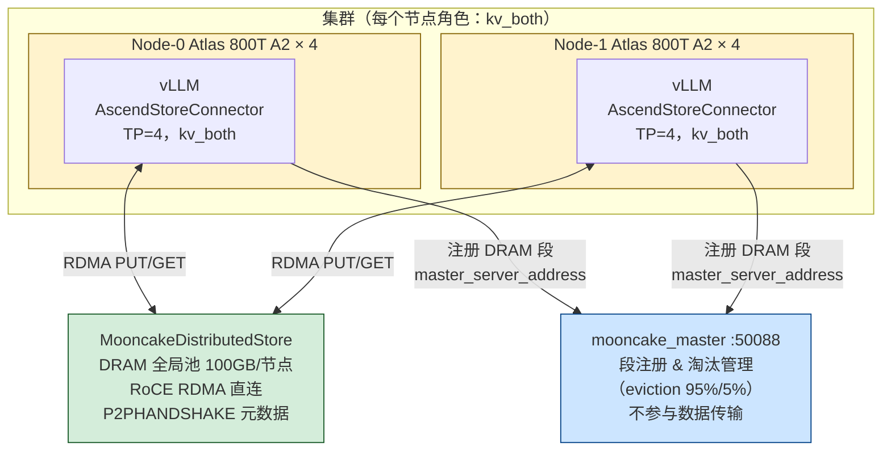

**架构要点：**

1. **全节点对等**（`kv_both`）：每个节点同时担任 Prefiller 和 Decoder，调度器自主决定当前请求执行 Prefill 还是 Decode
2. **mooncake_master**：只负责 DRAM 段的注册、定位和淘汰管理，**不参与实际数据传输**
3. **MooncakeDistributedStore**：所有节点共享的 DRAM KV 池，节点间通过 P2P RDMA 直接读写
4. **P2PHANDSHAKE**：KV 块元数据通过对等握手传递，无中心 etcd 服务

---

#### 7.5.2 完整部署配置（逐步操作）

##### 步骤 1：启动 mooncake_master

在集群中选一个节点（或独立服务器）运行元数据服务：

```bash
mooncake_master --port 50088 \
  --eviction_high_watermark_ratio 0.9 \
  --eviction_ratio 0.15
```

| 参数 | 含义 |
|------|------|
| `--port 50088` | mooncake_master 监听端口，需全集群可达 |
| `--eviction_high_watermark_ratio 0.9` | DRAM 池使用率达 90% 时触发淘汰（一线生产值，更保守，避免 OOM） |
| `--eviction_ratio 0.15` | 每次淘汰释放 15% 空间（一线生产值，更积极清理，避免频繁触发） |

##### 步骤 2：编写 mooncake.json

```json
{
    "metadata_server": "P2PHANDSHAKE",
    "protocol": "ascend",
    "device_name": "",
    "master_server_address": "<your_master_ip>:50088",
    "global_segment_size": "1GB"
}
```

逐字段说明：

| 字段 | 值 | 含义 |
|------|-----|------|
| `metadata_server` | `"P2PHANDSHAKE"` | KV 块位置元数据通过对等握手交换，不走 etcd |
| `protocol` | `"ascend"` | 使用昇腾专有 RDMA 传输协议 |
| `device_name` | `""` | 自动选择 RDMA 网卡，留空即可 |
| `master_server_address` | `"ip:50088"` | mooncake_master 地址，用于 DRAM 段注册和淘汰协调 |
| `global_segment_size` | `"1GB"` | 每节点向全局池注册的 DRAM 段大小，支持字符串单位（`"1GB"`、`"512MB"` 等）。**⚠️ 一线警告：设置过大（如 100GB 整数）会导致 mooncake 底层 segment 注册时内存分配错误，初始化失败。建议从 `"1GB"` 开始调优。** |

##### 步骤 3：配置环境变量

```bash
# 【🔴 必须】跨节点 hash 一致性：不设则相同 token 序列在不同节点产生不同 hash，
# prefix cache 跨节点命中率为 0！（注意：§7.4 缺点列表已提及，此处部署步骤不可省略）
export PYTHONHASHSEED=0

# 【必须】KV 传输缓冲区池：格式 <数量>:<每个大小MB>
# 4 个缓冲区 × 8MB = 32MB 缓冲区总量
export ASCEND_BUFFER_POOL=4:8

# 【必须】mooncake 配置文件路径
export MOONCAKE_CONFIG_PATH="/path/to/mooncake.json"

# 【建议】连接和传输超时（毫秒）；不设可能导致网络抖动时连接/传输超时报错
export ASCEND_CONNECT_TIMEOUT=10000
export ASCEND_TRANSFER_TIMEOUT=10000

# 【按需】昇腾 Python 库路径（若 MooncakeDistributedStore 找不到驱动时设置）
# export LD_LIBRARY_PATH=/usr/local/Ascend/ascend-toolkit/latest/python/site-packages:$LD_LIBRARY_PATH
```

> **`ASCEND_BUFFER_POOL` 调优**：缓冲区用于 NPU KV Cache ↔ DRAM 之间的中间暂存（仅 Mooncake 后端需要；MemCache 后端利用统一寻址直接访问，无需此缓冲）。并发请求多、KV 体积大时可适当增大（如 `8:16`）。

##### 步骤 4：启动每个 vLLM 节点

```bash
vllm serve /path/to/Qwen2.5-72B-Instruct/ \
  --served-model-name qwen \
  --dtype bfloat16 \
  --max-model-len 25600 \
  --tensor-parallel-size 4 \
  --host <this_node_ip> \
  --port 8002 \
  --kv-transfer-config '{
    "kv_connector": "AscendStoreConnector",
    "kv_role": "kv_both",
    "kv_connector_extra_config": {
      "backend": "mooncake",
      "lookup_rpc_port": "0",
      "use_layerwise": false
    }
  }'
# 注：旧版文档可能使用 "MooncakeConnectorStoreV1"，该名称已废弃，效果完全相同，但会打印 warning
```

`kv_connector_extra_config` 逐参解释（基于源码 `ascend_store_connector.py` 及一线部署指南）：

| 参数 | 值 | 来源 | 含义 |
|------|-----|------|------|
| `backend` | `"mooncake"` | 一线部署指南 | 后端类型：`"mooncake"`（需 Transfer Buffer）或 `"memcache"`（统一寻址，无需 ASCEND_BUFFER_POOL） |
| `lookup_rpc_port` | `"0"` | 一线部署指南 | LookupKeyServer RPC 监听端口（0 = 随机分配） |
| `use_layerwise` | `false` | 源码 `get("use_layerwise", False)` | 是否逐层传输；colocated 简洁模式推荐 false（批量 PUT 减少 RPC 次数） |
| `consumer_is_to_put` | `false`（默认） | 源码 `get("consumer_is_to_put", False)` | MLA/GQA 模型专项：consumer 侧反向写入，默认不开启 |

##### 步骤 5（可选）：负载均衡代理

多节点多实例时，前端加一层路由代理，将请求路由到命中率最高的节点：

```bash
python load_balance_proxy_server_example.py \
  --host 0.0.0.0 \
  --port 8000 \
  --backends <node0_ip>:8002 <node1_ip>:8002
```

---

#### 7.5.3 数据流：完整请求生命周期

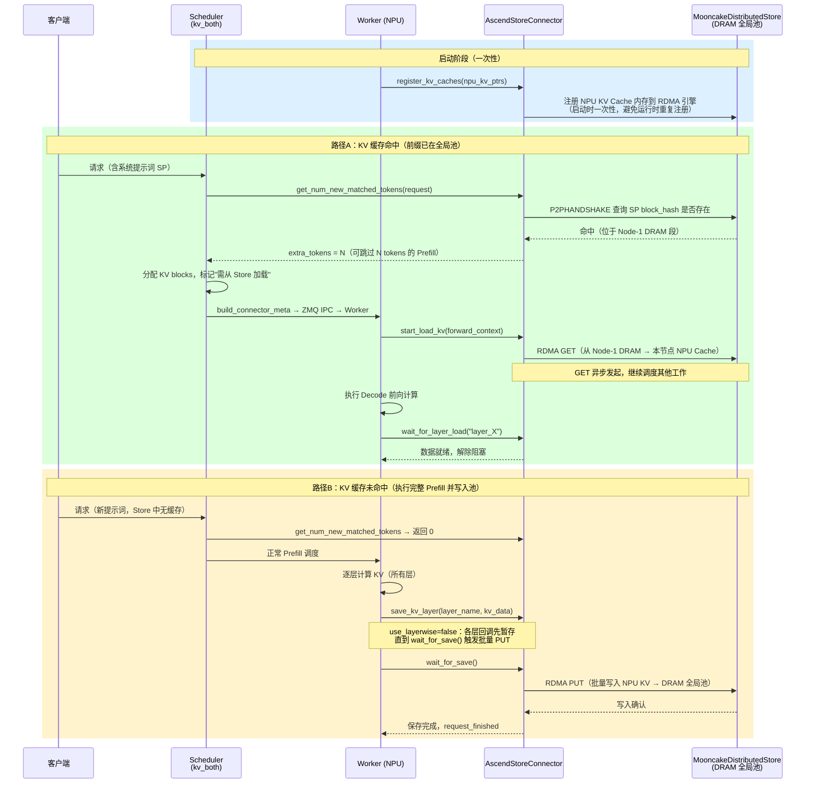

**关键设计决策说明：**

| 配置选择 | 原因 |
|---------|------|
| `use_layerwise=false`（colocated 模式推荐） | 批量 PUT 减少 MooncakeStore RPC 次数；逐层 PUT 产生大量小包，在 RDMA 场景性能反而劣化 |
| `backend="mooncake"` | 默认选择；A3 及以上硬件可选 `"memcache"` 后端（利用统一寻址直接 NPU↔Host DRAM，少一次 Transfer Buffer 拷贝） |
| 启动时注册 NPU 内存 | RDMA NIC 内存注册耗时约 100ms；`register_kv_caches()` 在启动时一次性完成，避免运行时每请求重复注册 |

---

#### 7.5.4 与 §7.3 LMCache + MooncakeStore 的架构对比

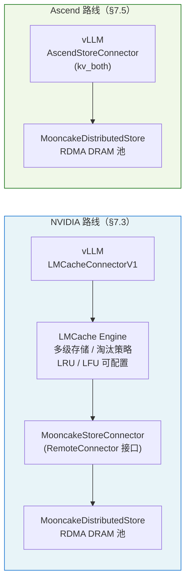

| 对比维度 | LMCache + MooncakeStore（§7.3） | AscendStoreConnector colocated 模式（§7.5） |
|----------|--------------------------------|---------------------------------------------|
| 调用链层数 | 4 层（vLLM→LMCache→StoreConnector→Store） | 2 层（vLLM→Store） |
| 多级存储 | ✅ GPU VRAM → CPU DRAM → NVMe SSD | ❌ 仅 DRAM |
| 元数据协议 | etcd（强一致性中心服务） | P2PHANDSHAKE（去中心） |
| 淘汰策略 | LRU/LFU（LMCache 层控制） | mooncake_master 统一管理 |
| 调试复杂度 | 较高（LMCache 中间层日志链路长） | 较低（链路短，问题定位容易） |
| 平台 | NVIDIA GPU | Ascend NPU |
| 冷缓存层 | ✅（NVMe SSD 溢出） | ❌ |

---

#### 7.5.5 实测性能

**A2 硬件 + Mooncake 后端（colocated 混合模式）**：
- 环境：2 节点 × Atlas 800T A2（各 4 张昇腾 NPU），Qwen2.5-72B-Instruct，TP=4，max_model_len=25600，100 请求 / 25 并发

| 场景 | TTFT (ms) | TTFT 加速比 |
|------|-----------|------------|
| 无全局 KV 池（基线，完整 Prefill） | 2322 | 1.0× |
| **本地 DRAM 命中**（同节点） | **739** | **3.14×** |
| **跨节点 DRAM 命中**（RDMA GET） | **948** | **2.45×** |

**A2 硬件 + Mooncake 后端（一线系统设计文档，混合模式）**：

| 指标 | 无池化基线 → 有池化 | 提升 |
|------|-------------------|------|
| TTFT | 基线 → 优化后 | **52.11% ↑** |
| TPS（吞吐） | 基线 → 优化后 | **80.90% ↑** |

**A3 硬件 + MemCache 后端（一线系统设计文档，混合模式）**：

| 指标 | 无池化基线 → 有池化 | 提升 |
|------|-------------------|------|
| TTFT | 基线 → 优化后 | **41.67% ↑** |
| TPS（吞吐） | 基线 → 优化后 | **71.61% ↑** |

> MemCache 后端（A3+）利用统一寻址，省去 Transfer Buffer 中转，延迟和吞吐均有额外提升空间。

**性能分析（A2 colocated 数据）**：
- **本地命中 739ms**：跳过全部 Prefill 计算，约为基线的 32%
- **跨节点命中 948ms**：在 739ms 基础上增加约 200ms 的跨节点 RDMA GET 延迟（100GbE RoCE 下合理）
- **加速来源**：系统提示词（System Prompt）的 Prefill 计算完全跳过，约占总 TTFT 的 70%+

---

#### 7.5.6 源码定位：读哪个文件？

> `MooncakeConnectorStoreV1` **不存在独立的实现文件**。两个注册名都指向：
> ```
> vllm_ascend/distributed/kv_transfer/kv_pool/ascend_store/ascend_store_connector.py
>   └── class AscendStoreConnector(KVConnectorBase_V1)
> ```
> 详细源码解析见 §7.4。colocated 简洁模式（`kv_both`）与 PD 分离模式走的是同一份代码，区别仅在 `kv_role` 和 `use_layerwise` 等配置参数。

**`AscendStoreConnector.__init__` 中关键配置读取**（[源码 L67-82](https://github.com/vllm-project/vllm-ascend/blob/main/vllm_ascend/distributed/kv_transfer/kv_pool/ascend_store/ascend_store_connector.py#L67)）：

```python
class AscendStoreConnector(KVConnectorBase_V1):
    def __init__(self, vllm_config, role, kv_cache_config=None):
        # colocated 模式：kv_role = "kv_both"（由 vllm_config 传入）
        self.kv_role = vllm_config.kv_transfer_config.kv_role

        # use_layerwise 可配置：False=批量传输（colocated 简洁模式），True=逐层流水线
        self.use_layerwise = vllm_config.kv_transfer_config.kv_connector_extra_config.get(
            "use_layerwise", False
        )

        # 向后兼容：使用旧名称时打印废弃警告，功能完全一致
        connector_name = vllm_config.kv_transfer_config.kv_connector
        if connector_name == "MooncakeConnectorStoreV1":
            logger.warning(
                "It is recommended to use the AscendStoreConnector, "
                "as the MoonCakeStoreConnector will be removed in the future."
            )
```

---

#### 7.5.7 选用 colocated 模式的场景与限制

**colocated 简洁模式（本节配置）的当前限制：**

1. **colocated 拓扑约束**：所有节点 `kv_both`，Prefill 和 Decode 在同节点争用计算资源；PD 专职分离需切换为 `kv_producer`/`kv_consumer` 角色（即 §7.4 完整模式）
2. **`use_layerwise=false`（本节建议值）**：所有层 KV 计算完毕后批量 PUT；如需逐层流水线（超长序列 Decode 早启动），可设 `use_layerwise=true`（同一个 `AscendStoreConnector` 类支持）
3. **无冷缓存层**：MooncakeDistributedStore 仅 DRAM，无 NVMe SSD 溢出层
4. **已知传输问题**：某些配置下 `Transfer slice failed with status: 103901`（ADXL 协议错误，见 vllm-ascend issue #5044）

**场景选型：**

| 场景 | 配置 |
|------|------|
| PD colocated，快速上线，系统提示词高复用 | `AscendStoreConnector` + `kv_both` + `use_layerwise=false`（本节） |
| 超长序列，Decode 需要早启动（传输与计算重叠） | `AscendStoreConnector` + `kv_both` + `use_layerwise=true` |
| PD 完全分离（专职 Prefill / Decode 节点） | `AscendStoreConnector` + `kv_producer`/`kv_consumer`（§7.4） |
| MLA 模型（DeepSeek 等 GQA 变体） | `AscendStoreConnector` + `consumer_is_to_put=true`（§7.4） |
| 当前请求即时加速 + 沉淀未来复用 | `MultiConnector`（P2P + Pool 并行，见 §7.5.8） |

---

#### 7.5.8 进阶配置：MultiConnector 与池化 PD 分离

以下配置来自一线部署指南，适合需要更高吞吐或更低延迟的生产场景。

**配置一：MultiConnector（P2P 即时传 + Pool 异步写入，PD 分离）**

P2P 降低**当前请求**延迟，Pool 沉淀 KV 供**后续相同前缀**复用，两者并行工作互不干扰。

```json
// Prefill 节点 kv-transfer-config
{
    "kv_connector": "MultiConnector",
    "kv_role": "kv_producer",
    "kv_connector_extra_config": {
        "connectors": [
            {
                "kv_connector": "MooncakeConnectorV1",
                "kv_role": "kv_producer",
                "kv_connector_extra_config": {}
            },
            {
                "kv_connector": "AscendStoreConnector",
                "kv_role": "kv_producer",
                "kv_connector_extra_config": {
                    "backend": "mooncake",
                    "lookup_rpc_port": "0"
                }
            }
        ]
    }
}
```

```json
// Decode 节点 kv-transfer-config
{
    "kv_connector": "MultiConnector",
    "kv_role": "kv_consumer",
    "kv_connector_extra_config": {
        "connectors": [
            {
                "kv_connector": "MooncakeConnectorV1",
                "kv_role": "kv_consumer",
                "kv_connector_extra_config": {}
            },
            {
                "kv_connector": "AscendStoreConnector",
                "kv_role": "kv_consumer",
                "kv_connector_extra_config": {
                    "backend": "mooncake",
                    "lookup_rpc_port": "0"
                }
            }
        ]
    }
}
```

**配置二：池化 PD 分离（纯 AscendStoreConnector，无 P2P）**

Prefill 节点写入全局池，Decode 节点从全局池读取，**P 和 D 之间无需直接通信**，所有数据经全局池中转。

```json
// Prefill 节点（kv_producer）
{
    "kv_connector": "AscendStoreConnector",
    "kv_role": "kv_producer",
    "kv_connector_extra_config": {
        "backend": "mooncake",
        "lookup_rpc_port": "0"
    }
}
```

```json
// Decode 节点（kv_consumer）
{
    "kv_connector": "AscendStoreConnector",
    "kv_role": "kv_consumer",
    "kv_connector_extra_config": {
        "backend": "mooncake",
        "lookup_rpc_port": "0",
        "consumer_is_to_load": true
    }
}
```

> `consumer_is_to_load: true`：consumer 侧主动从全局池发起加载（而非等待 producer 推送）。

三种部署模式覆盖了绝大多数生产场景：**colocated**（最简，快速上线）→ **MultiConnector**（即时 P2P + 异步池化并行）→ **池化 PD 分离**（极限解耦，独立扩容 P/D 节点）。路线图信息：vllm-ascend 正在研发异步调度修复、All-Gather 协同加载与 Smart Offload 等优化，预计在后续版本中落地。

---

## 扩展阅读

> 以下三节提供全局 KV 池底层机制的深度解析。对于希望理解"为什么这样工作"、
> 或需要自己实现 KV 传输方案的读者，建议阅读；只需理解和部署全局 KV 池的读者可跳过。

### 7.6 [扩展] P2P MooncakeConnector 源码深度解析

> **本节定位**：§7.2 已给出选型结论（推荐 LMCache + MooncakeStore 或 Ascend 对应的全局池方案）。本节深入 **P2P 路线**的真实源码，目的有二：其一，P2P 是全局池方案的传输内核——理解它才能看懂 §7.3/7.7 在其之上叠加了什么；其二，上游 vLLM（P-push）与 vllm-ascend（D-pull）传输方向相反，这个差异在源码和行业文章中反复出现，值得专门辨析。
>
> **本节只讲 P2P MooncakeConnector**，不涉及全局存储池；全局池实现见 §7.3（LMCache + MooncakeStore）、§7.4（AscendStoreConnector 完整模式）、§7.5（AscendStoreConnector colocated 简洁部署）。

#### 7.6.1 上游 vLLM：P 主动推送（RDMA WRITE）

很多文章把 Mooncake 描述成"D-node 从全局池 pull KV"，但上游 vLLM 的真实实现是**P-node 主动 RDMA WRITE 到 D-node 的内存**：

```
上游 vLLM（RDMA WRITE，P 控制）：
  D-node → 向 P-node 的 ZMQ side channel 发送请求
              包含：D-node 的 GPU 内存地址（kv_caches_base_addr）
  P-node → Prefill 完成后，从本地 GPU 内存 RDMA WRITE 到 D-node
              engine.batch_transfer_sync_write(src_ptrs, dst_ptrs, lengths)
  (P 控制传输方向)
```

**为什么 P 主动写？**

- P-node 知道精确的传输时机（Prefill 刚完成的那一刻）
- P-node 掌握 KV 的物理内存地址（block_id × block_len）
- D-node 不需要知道 P-node 的内存布局细节

#### 7.6.2 核心数据流（上游 vLLM，逐步拆解源码）

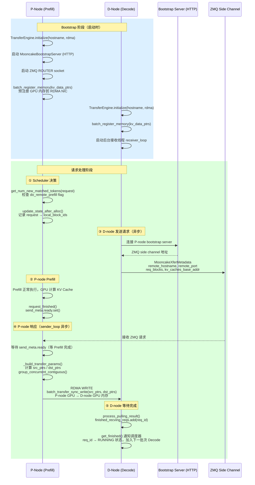

#### 7.6.3 关键源码注解（上游 vLLM）

**内存注册**（一次性，启动时执行）：
```python
# MooncakeConnectorWorker.register_kv_caches()
# kv_caches: 每层的 KV Cache 张量，形如 {layer_name: Tensor[num_blocks, ...]}

kv_data_ptrs = []
kv_data_lens = []
for layer_name, cache in kv_caches.items():
    base_addr = cache.data_ptr()   # GPU 内存的物理地址（指针）
    kv_data_ptrs.append(base_addr)
    kv_data_lens.append(cache.nbytes)

# 向 Mooncake RDMA 引擎注册：将这些 GPU 内存区域"钉住"（pin）
# 注册后，RDMA NIC 可以直接读写这块内存，无需 CPU 干预
ret = self.engine.batch_register_memory(kv_data_ptrs, kv_data_lens)

# block 访问公式：
# 第 block_id 个块的 KV 在第 layer 的偏移 = block_id * block_len
# block_len = tensor.nbytes / num_blocks
self.block_len = tensor_size_bytes // self.num_blocks
```

**地址计算 + 连续块合并**：
```python
# _build_transfer_params() 的关键逻辑
for layer_addr_p, layer_addr_d in zip(local_base_addr, remote_base_addr):
    for group_local, group_remote in zip(group_local_blocks, group_remote_blocks):
        # 连续块合并为单次 RDMA 操作（减少硬件描述符开销）
        # 例：P-node block_ids=[5,6,7] 连续 → 一次 RDMA WRITE 3*block_len 字节
        src_ptrs.append(layer_addr_p + group_local[0] * block_len)
        dst_ptrs.append(layer_addr_d + group_remote[0] * block_len)
        lengths.append(block_len * len(group_local))

# group_concurrent_contiguous() 的作用：
# input: src=[5,6,7,12,13], dst=[2,3,4,8,9]
# output: [(5,6,7), (12,13)], [(2,3,4), (8,9)]
# → 2次 RDMA 操作代替 5次，减少延迟和开销
brk = np.where((np.diff(src_indices) != 1) | (np.diff(dst_indices) != 1))[0] + 1
```

**异步协同机制（asyncio.Event）**：
```python
# SendBlockMeta.ready 是 asyncio.Event
# P-node Prefill 完成时，request_finished() 调用 send_meta.ready.set()
# P-node sender 线程一直在 wait_tasks 中等待：
wait_tasks = [asyncio.create_task(wait_and_ret(d_req_id, send_meta))]
# ...
done, pending = await asyncio.wait(wait_tasks, timeout=ABORT_TIMEOUT)
# ready 触发后，立刻开始 RDMA WRITE

# 关键：D-node 在发送 ZMQ 请求时，Prefill 可能还没完成
# P-node 会在 asyncio.wait() 中挂起，直到 Prefill 完成（ready.set()）
# 这样 D-node 的 ZMQ 请求和 P-node 的 Prefill 可以并发进行，
# P 的 Prefill 完成后 ZMQ 响应立刻就绪，最小化 D-node 等待时间
```

#### 7.6.4 从零手搓一个完整 MooncakeConnector

前面已经分析了关键代码片段。本节把所有部分**整合成一个完整可运行的骨架**，让读者看清楚 V1 MooncakeConnector 端到端的全貌。代码保留核心逻辑，省略错误处理。

##### 整体骨架：实现 V1 接口

MooncakeConnector 实现 `KVConnectorBase_V1`。**同一个类会被实例化两次**：一次在 Scheduler 进程（`role=SCHEDULER`），一次在每个 GPU Worker 进程（`role=WORKER`）。

```python
# minimal_mooncake_connector.py
import asyncio, os, uuid
import zmq, zmq.asyncio
import msgspec
from vllm.distributed.kv_transfer.kv_connector.v1.base import (
    KVConnectorBase_V1, KVConnectorRole,
)

class MooncakeXferMetadata(msgspec.Struct):
    """D-Node 通过 ZMQ 发给 P-Node 的传输请求"""
    transfer_id: str         # P/D 之间本次传输的唯一 ID（request_finished 生成）
    remote_hostname: str     # D 的主机名（P 的 RDMA NIC 需要知道写到哪个机器）
    remote_port: int         # D 的 RDMA 端口
    d_block_ids: list[int]   # D 分配的 KV block IDs
    d_kv_base_addrs: list[int]  # D 的 GPU KV 内存基址（每层一个）

class MinimalMooncakeConnector(KVConnectorBase_V1):
    def __init__(self, vllm_config, role: KVConnectorRole):
        self.role = role
        # 由环境变量区分 P-Node / D-Node
        self.is_prefill = os.environ.get("VLLM_KV_ROLE", "decode") == "prefill"

        # ── 调度器侧共享状态（Scheduler 进程使用）──────────────────────
        self._pending_send: dict = {}   # req_id → (transfer_id, block_ids) [P-Node]
        self._pending_recv: dict = {}   # req_id → pull_meta [D-Node]
        self._send_ready: dict = {}     # transfer_id → asyncio.Event（Prefill 完成标记）

        # ── Worker 侧共享状态（GPU Worker 进程使用）──────────────────────
        self._finished_sending: set = set()  # RDMA WRITE 已完成的 req_id
        self._finished_recving: set = set()  # KV 已接收完成的 req_id

        if role == KVConnectorRole.WORKER:
            self._init_transfer_engine()
```

##### 第一步：内存注册（启动时调用一次）

```python
    def _init_transfer_engine(self):
        from mooncake.engine import TransferEngine
        self.engine = TransferEngine()
        # "P2PHANDSHAKE"：P/D 互相发现并建立 RDMA RC QP（Reliable Connection）
        # "rdma"：使用 InfiniBand 或 RoCEv2（需要支持 RDMA 的网卡）
        self.engine.initialize(os.environ["HOSTNAME"], "P2PHANDSHAKE", "rdma")

        if self.is_prefill:
            # P-Node：启动 Bootstrap HTTP Server（D 用 HTTP 发现 P 的 ZMQ 端口）
            self._start_bootstrap_server()
            # P-Node：启动 ZMQ ROUTER（接收 D-Node 的传输请求）
            self.zmq_ctx = zmq.asyncio.Context()
            self.zmq_router = self.zmq_ctx.socket(zmq.ROUTER)
            self.zmq_port = self.zmq_router.bind_to_random_port("tcp://*")
            asyncio.create_task(self._sender_loop())  # 后台发送协程

    def register_kv_caches(self, kv_caches: dict):
        """
        将 GPU KV Cache 内存注册到 Mooncake RDMA 引擎（"钉住"内存）
        ─ vLLM 启动时调用一次
        ─ 注册后 RDMA NIC 可以绕过 CPU 直接读写这块内存（GPUDirect RDMA）
        """
        kv_ptrs, kv_lens = [], []
        for layer_name, cache in kv_caches.items():
            kv_ptrs.append(cache.data_ptr())   # GPU 物理内存指针
            kv_lens.append(cache.nbytes)
        # "钉住"GPU 内存区域：让 RDMA NIC 可以直接 DMA 到这块内存
        self.engine.batch_register_memory(kv_ptrs, kv_lens)

        self.kv_caches = kv_caches
        self.kv_base_addrs = [c.data_ptr() for c in kv_caches.values()]
        self.num_blocks = next(iter(kv_caches.values())).shape[0]
        self.block_len = next(iter(kv_caches.values())).nbytes // self.num_blocks
```

##### 第二步：调度器侧方法（Scheduler 进程）

```python
    # ══════════════════════════════════════════════════
    # 以下方法运行在 Scheduler 进程，role = SCHEDULER
    # ══════════════════════════════════════════════════

    def get_num_new_matched_tokens(self, request, num_computed_tokens):
        """
        D-Node：告知调度器"可从 P-Node 加载多少 tokens 的 KV"
        ─ 返回 (extra_tokens, is_async)
        ─ is_async=True → 请求先进 WAITING_FOR_REMOTE_KVS 状态，KV 异步到达后再 Decode
        """
        if not self.is_prefill:
            params = request.kv_transfer_params or {}
            if params.get("do_remote_prefill"):
                extra = len(request.prompt_token_ids) - num_computed_tokens
                return extra, True   # 告诉调度器：还差 extra 个 tokens 的 KV 要从 P 加载
        return 0, False

    def update_state_after_alloc(self, request, blocks, num_external_tokens):
        """D-Node：blocks 分配完成，记录需要从 P-Node 填充的 block IDs"""
        if not self.is_prefill and num_external_tokens > 0:
            self._pending_recv[request.request_id] = {
                "block_ids": blocks.physical_block_ids,
                "transfer_id": request.kv_transfer_params["transfer_id"],
                "remote_bootstrap": request.kv_transfer_params["remote_bootstrap_addr"],
            }

    def request_finished(self, request, block_ids):
        """
        P-Node：请求完成，准备发送 KV 给 D-Node
        ─ 返回 delay_free=True → 这些 blocks 不能立即被 LRU 释放！
        ─ 必须等 RDMA WRITE 完成后，get_finished() 通知调度器才能释放
        """
        if self.is_prefill:
            transfer_id = uuid.uuid4().hex
            self._pending_send[request.request_id] = (transfer_id, list(block_ids))
            # asyncio.Event：D-Node ZMQ 请求可能先于 Prefill 完成，需要等 Prefill ready
            event = asyncio.Event()
            event.set()   # Prefill 此时已完成，立即置位（真实代码中由 Prefill 异步置位）
            self._send_ready[transfer_id] = event
            return True, {
                "do_remote_decode": True,
                "transfer_id": transfer_id,
                "remote_bootstrap_addr": f"{os.environ['HOSTNAME']}:{self._bootstrap_port}",
            }
        return False, None

    def build_connector_meta(self, scheduler_output):
        """打包元数据，通过 SchedulerOutput ZMQ IPC 通道发给 Worker 进程"""
        if self.is_prefill:
            meta = {"reqs_to_send": dict(self._pending_send)}
            self._pending_send.clear()
        else:
            meta = {"reqs_to_recv": dict(self._pending_recv)}
            self._pending_recv.clear()
        return meta   # 实际上返回 KVConnectorMetadata 子类
```

##### 第三步：Worker 侧方法（GPU Worker 进程）

```python
    # ══════════════════════════════════════════════════
    # 以下方法运行在 GPU Worker 进程，role = WORKER
    # ══════════════════════════════════════════════════

    def start_load_kv(self, forward_context, **kwargs):
        """
        D-Node：前向传播前，触发 KV 传输（立即返回，不阻塞）
        ─ 向 P-Node 发送 ZMQ 请求，告知"D 的 GPU 内存地址"
        ─ P-Node 收到后执行 RDMA WRITE，把 KV 直接写入 D 的 GPU 内存
        """
        meta = self.get_connector_metadata()
        for req_id, pull_meta in meta.get("reqs_to_recv", {}).items():
            asyncio.create_task(self._request_kv_from_prefill(req_id, pull_meta))

    def wait_for_layer_load(self, layer_name: str):
        """
        MooncakeConnector：整批传输（非逐层），此处 no-op
        ─ 对比 LMCacheConnector：逐层等待，需阻塞
        ─ 对比 AscendStore LayerwiseConnector：逐层等待，需阻塞
        """
        pass

    def save_kv_layer(self, layer_name, kv_layer, attn_metadata, **kwargs):
        """
        MooncakeConnector：整批发送（非逐层），此处 no-op
        ─ Mooncake 的 RDMA WRITE 在 request_finished 触发后由 sender_loop 整批发起
        ─ 对比 LayerwiseConnector：每层 attention 后立即触发 RDMA
        """
        pass

    def wait_for_save(self):
        """MooncakeConnector：no-op（RDMA WRITE 异步进行，由 sender_loop 管理）"""
        pass

    def get_finished(self, finished_req_ids):
        """
        轮询完成状态
        ─ P-Node: finished_sending → 调度器知道哪些 blocks 可以释放
        ─ D-Node: finished_recving → 调度器知道哪些请求可以进入 Decode
        """
        sending = self._finished_sending.copy() or None
        recving = self._finished_recving.copy() or None
        self._finished_sending.clear()
        self._finished_recving.clear()
        return sending, recving
```

##### 第四步：P-Node 后台传输线程（核心：RDMA WRITE）

```python
    async def _sender_loop(self):
        """
        P-Node 后台协程：持续等待 D-Node 的 ZMQ 请求，执行 RDMA WRITE
        ─ 这是整个 P2P 传输的核心：P 主动写入 D 的 GPU 内存
        ─ 在 Worker 进程启动后一直运行，处理所有请求的发送
        """
        while True:
            # 等待 D-Node 发来的 ZMQ 消息（DEALER → ROUTER 模式）
            dealer_id, _, raw_msg = await self.zmq_router.recv_multipart()
            xfer_meta: MooncakeXferMetadata = msgspec.json.decode(raw_msg)

            # 找到该 transfer_id 对应的 P-Node blocks
            req_id = self._find_req_by_transfer_id(xfer_meta.transfer_id)
            _, p_block_ids = self._pending_send.pop(req_id)

            # 等待 Prefill 完成（asyncio.Event）
            # ─ D-Node 可能在 Prefill 还没完成时就发来 ZMQ 请求（两者并发）
            # ─ sender_loop 会在此处挂起，直到 request_finished() 置位 ready
            await self._send_ready[xfer_meta.transfer_id].wait()

            # 建立与 D-Node 的 RDMA 连接（基于 Mooncake TransferEngine）
            remote_session = self.engine.open_session(
                xfer_meta.remote_hostname, xfer_meta.remote_port
            )

            # 计算每层 KV 的 RDMA 传输参数
            src_ptrs, dst_ptrs, lengths = self._build_transfer_params(
                p_block_ids, xfer_meta.d_block_ids, xfer_meta.d_kv_base_addrs
            )

            # ★ 核心：P-GPU → D-GPU RDMA WRITE
            # ─ 绕过 CPU，由 RDMA NIC 直接 DMA 写入对端 GPU 内存
            # ─ 同步等待完成（batch_transfer_sync_write = 发起 + 等待完成）
            ret = self.engine.batch_transfer_sync_write(
                remote_session, src_ptrs, dst_ptrs, lengths
            )

            # 通知调度器：P-Node blocks 现在可以安全释放了
            self._finished_sending.add(req_id)

    def _build_transfer_params(self, p_block_ids, d_block_ids, d_kv_base_addrs):
        """
        计算每层 KV 的 RDMA 传输参数（src 地址、dst 地址、传输长度）
        ─ 连续的 block IDs 合并为一次 RDMA 操作（减少 NIC 描述符开销）
        ─ 例：block_ids=[5,6,7] → 一次 RDMA 传输 3*block_len 字节
        """
        src_ptrs, dst_ptrs, lengths = [], [], []
        for p_base, d_base in zip(self.kv_base_addrs, d_kv_base_addrs):
            for p_group, d_group in group_consecutive(p_block_ids, d_block_ids):
                # block_id * block_len = 第 block_id 个 KV block 的起始地址偏移
                src_ptrs.append(p_base + p_group[0] * self.block_len)
                dst_ptrs.append(d_base + d_group[0] * self.block_len)
                lengths.append(self.block_len * len(p_group))
        return src_ptrs, dst_ptrs, lengths
```

##### 第五步：D-Node 触发传输（ZMQ + 等待 RDMA 完成）

```python
    async def _request_kv_from_prefill(self, req_id: str, pull_meta: dict):
        """
        D-Node：向 P-Node 发起传输请求
        流程：① 通过 Bootstrap HTTP 获取 P 的 ZMQ 地址
              ② 发送 MooncakeXferMetadata（含 D 的 GPU 内存地址）
              ③ P-Node 执行 RDMA WRITE → D-GPU 内存就绪
              ④ 通知 get_finished()，调度器将请求推进 Decode 队列
        """
        # ① 通过 P-Node 的 Bootstrap HTTP Server 获取 ZMQ 地址
        p_zmq_addr = await self._query_bootstrap(pull_meta["remote_bootstrap"])

        # ② 构建请求：把 D 的 GPU block 地址告诉 P
        xfer = MooncakeXferMetadata(
            transfer_id=pull_meta["transfer_id"],
            remote_hostname=os.environ["HOSTNAME"],
            remote_port=self.rdma_port,
            d_block_ids=pull_meta["block_ids"],
            d_kv_base_addrs=self.kv_base_addrs,  # D 的 GPU KV 内存基址
        )

        # ③ 发送给 P-Node（ZMQ DEALER → ROUTER）
        zmq_sock = self.zmq_ctx.socket(zmq.DEALER)
        zmq_sock.connect(p_zmq_addr)
        await zmq_sock.send(msgspec.json.encode(xfer))

        # P-Node 的 sender_loop 收到消息后执行 RDMA WRITE：
        #   engine.batch_transfer_sync_write(session, src_ptrs, dst_ptrs, lengths)
        # RDMA WRITE 完成 → D 的 GPU 内存已被写入正确的 KV 数据

        # ④ 等待传输完成（真实代码用 asyncio.Event + process_pulling_result() 触发）
        await self._wait_for_completion(pull_meta["transfer_id"])

        # ⑤ 通知调度器：该请求的 KV 已就绪，可以进入 Decode 批次
        self._finished_recving.add(req_id)
```

##### 完整数据流连接图

```
P-Node                                    D-Node
─────────────────────────────────         ──────────────────────────────────────

【Scheduler 进程】                         【Scheduler 进程】
request_finished(req, block_ids)           get_num_new_matched_tokens(req)
  → _pending_send[req] = (tid, blocks)       → extra = len(prompt) - computed
  → delay_free = True                        → return (extra, is_async=True)
  → _send_ready[tid] = Event()             update_state_after_alloc(req, blocks)
build_connector_meta()                       → _pending_recv[req] = pull_meta
  → SchedulerOutput + meta (reqs_to_send) build_connector_meta()
         ↓ ZeroMQ IPC                        → SchedulerOutput + meta (reqs_to_recv)
                                                      ↓ ZeroMQ IPC

【Worker 进程】                            【Worker 进程】
register_kv_caches()                       register_kv_caches()
  → engine.batch_register_memory()           → engine.batch_register_memory()

[Prefill Forward Pass 执行中]              start_load_kv()
                                             → _request_kv_from_prefill() [async]
request_finished() 触发 _send_ready.set()       ↓ query P's Bootstrap HTTP
                                                ↓ ZMQ DEALER → P's ZMQ ROUTER
_sender_loop():                                   (MooncakeXferMetadata)
  ← 收到 ZMQ 请求
  → 等待 _send_ready.wait()（Prefill 完成）  ← RDMA WRITE 到达 D-GPU 内存
  → engine.batch_transfer_sync_write()        ─ P-GPU 物理内存 → D-GPU 物理内存
    (P-GPU → D-GPU, RDMA WRITE)               ─ 绕过 CPU，延迟 ~100μs
  → _finished_sending.add(req)              → _finished_recving.add(req)

get_finished() → (finished_sending, None)  get_finished() → (None, finished_recving)
  ↓ 调度器知道：blocks 可以释放               ↓ 调度器知道：req 可进入 Decode 批次
```

> **与真实 vLLM MooncakeConnector 的差异**：真实代码中 `_send_ready` 的 Event 由 `request_finished()` 在调度器进程设置，通过 `KVConnectorMetadata` 传给 Worker；还有错误处理、多 TP worker 协调、bootstrap server 高可用等。但以上骨架覆盖了**所有核心流程**。

---

#### 7.6.5 三种实现对比（模拟 / 上游 vLLM / vllm-ascend）

> **注**："模拟实现"列对应 §7.8 中的 `global_kv_pool.py`，完整代码在该节展开。此处可先聚焦右侧两列的真实实现差异，读完 §7.8 后再回看左列，对照会更清晰。

| 特性 | 模拟实现（§7.8） | 上游 vLLM MooncakeConnector | vllm-ascend MooncakeConnectorV1 |
|------|-----------------|-----------------------------|---------------------------------|
| 元数据服务 | Python dict（单进程内） | 分布式（每个 engine 独立维护） | 分布式（每个 engine 独立维护） |
| 传输方向 | submit_transfer（D pull） | RDMA WRITE（P push） | RDMA READ（D pull） |
| 传输协议 | Python threading sleep | mooncake.engine（RDMA） | mooncake.engine（RDMA） |
| P/D 发现 | 预置 node_id | Bootstrap Server（HTTP） | ZMQ handshake |
| P/D 协调 | wait_for_kv() 同步等 | asyncio.Event + ZMQ | 异步接收线程 |
| 块地址 | 抽象 block_hash | GPU 物理内存指针 | NPU 内存指针 |
| 块合并 | 无 | group_concurrent_contiguous() | 连续块合并 |
| 异构 TP | ❌ | ❌ | ✅ block 分割 |
| 逐层传输 | ❌ | ❌ | ✅ |

---

#### 7.6.6 vllm-ascend：D 主动拉取（RDMA READ）

vllm-ascend 使用与上游完全**相反的传输方向**：由 D-node 主动从 P-node 拉取 KV 数据：

```
vllm-ascend（RDMA READ，D 控制）：
  P-node → Prefill 完成后，向调度器标记 do_remote_decode=True
           内存地址已注册到 Mooncake TransferEngine（NPU 内存 pin）

  D-node → 接收到调度决策（知道目标 P-node）
  D-node → 调用 engine.batch_transfer_sync_read(session_id, src_list, dst_list, length_list)
           直接从 P-node NPU 内存 RDMA READ 到本地 NPU 内存
  (D 控制传输方向)
```

核心代码（`kv_p2p/mooncake_connector.py:545-547`）：

```python
# D-node 主动发起 RDMA READ（与上游 batch_transfer_sync_write 方向相反）
ret = self.engine.batch_transfer_sync_read(
    session_id, src_list, dst_list, length_list
)
```

**D pull 的优势（在 Ascend 场景下）**：
- D-node 可以灵活控制何时发起传输，无需 P-node 等待 D 的内存地址
- 支持异构 TP（一个 D-GPU 从多个 P-GPU 分别读取不同的 head 段）
- P-node 只需注册内存，无需额外的发送逻辑

**数据流（vllm-ascend）**：

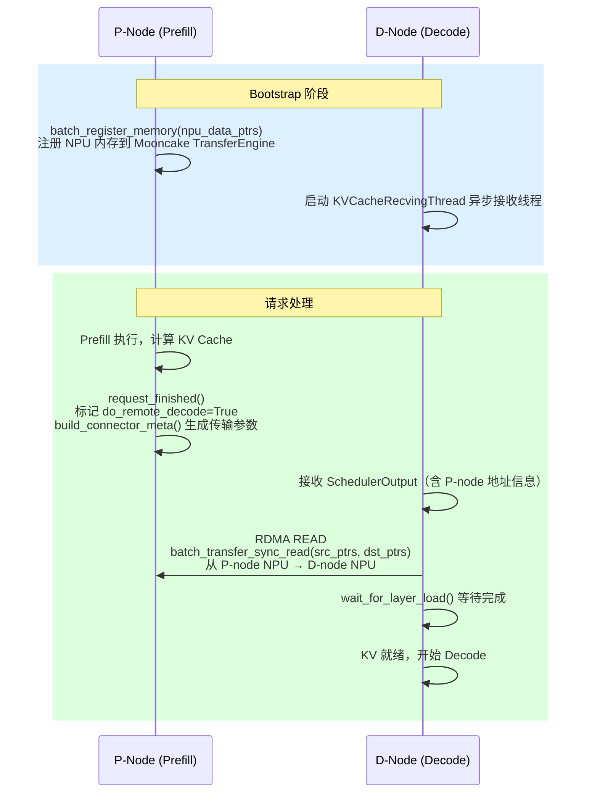

#### 7.6.7 异构 TP 支持：Block 分割机制

vllm-ascend 支持 P 节点与 D 节点使用不同 TP 大小（要求 `P_tp >= D_tp` 且 `P_tp % D_tp == 0`）。

**核心思路**：当 P_tp > D_tp 时，每个 D-GPU 需要覆盖更多的 attention head，因此需要从多个 P-GPU 分别拉取各自负责的 head 段。

**关键计算**（`mooncake_connector.py:1150-1156`）：

```python
num_d_block_heads = max(1, self.num_key_value_heads // self.tp_size)        # D 每 GPU 的 head 数
num_p_block_heads = max(1, self.num_key_value_heads // self._prefill_tp_size)  # P 每 GPU 的 head 数
self.tp_num_need_pulls = num_d_block_heads // num_p_block_heads  # 每个 D-GPU 需要从几个 P-GPU 拉
```

**Block 分割逻辑**（`mooncake_connector.py:537-552`）：

```python
inner_block_len = block_len // tp_num_need_pulls  # 每次 RDMA READ 的字节数
inner_offset = offset % tp_num_need_pulls          # 偏移量，指向当前 P-GPU 的 head 段

for remote_block_id, local_block_id in zip(grouped_remote_ids, grouped_local_ids):
    src = src_layer_base_addr + local_block_id[0] * block_len + inner_offset * inner_block_len
    dst = dst_layer_base_addr + remote_block_id[0] * inner_block_len
    length = inner_block_len * len(local_block_id)
    src_list.append(src), dst_list.append(dst), length_list.append(length)
```

**示例（模型 128 heads，P_tp=4，D_tp=2）**：

```
P_tp=4：每个 P-GPU 存 32 heads 的 KV
D_tp=2：每个 D-GPU 需要 64 heads 的 KV

tp_num_need_pulls = 64 // 32 = 2

D-GPU_0（heads 0-63）需要：
  ← RDMA READ 来自 P-GPU_0（heads 0-31，inner_offset=0）
  ← RDMA READ 来自 P-GPU_1（heads 32-63，inner_offset=1）

D-GPU_1（heads 64-127）需要：
  ← RDMA READ 来自 P-GPU_2（heads 64-95，inner_offset=0）
  ← RDMA READ 来自 P-GPU_3（heads 96-127，inner_offset=1）
```

#### 7.6.8 逐层传输（Layerwise Connector）

`mooncake_layerwise_connector.py` 实现了**层级流水线**传输：Prefill 计算完第 N 层的 KV，立刻 RDMA 传输第 N 层给 D-node，同时 Prefill 继续计算第 N+1 层：

```mermaid
gantt
    title Layerwise vs 整体传输 时序对比
    dateFormat X
    axisFormat %s

    section 整体传输
    P 计算所有层        : t1, 0, 6
    RDMA 传输所有层     : t2, 6, 9
    D Decode           : t3, 9, 12

    section 逐层传输
    P 计算 Layer 0     : l1, 0, 2
    RDMA Layer 0       : l2, 2, 3
    P 计算 Layer 1     : l3, 2, 4
    RDMA Layer 1       : l4, 4, 5
    P 计算 Layer 2     : l5, 4, 6
    RDMA Layer 2       : l6, 6, 7
    D Decode (流水线)  : l7, 3, 9
```

- **整体传输**：Prefill 全部完成才开始 RDMA，D-node 等待时间长
- **逐层传输**：Prefill 每完成一层立刻传输，D-node 提前开始执行已收到的层

逐层传输通过 Python generator 实现（`pool_worker.py:357-424`）：

```python
def retrieve_layer(self, request) -> Generator:
    keys = [list(row) for row in zip(*keys)]  # 转置为 [num_layer, num_block]
    for layer_id, layer_keys in enumerate(keys):
        self.kv_recv_thread.add_request(layer_keys)
        yield None  # 每层 yield 一次，让上层 wait_for_layer_load() 同步
```

### 7.7 [扩展] RDMA 从零到懂——完整技术指南

> **本节定位**：§7.6 的源码反复出现 `batch_register_memory`、`RDMA WRITE/READ`、`QP`、`GPUDirect` 等词，但没有解释底层原理。**本章各 KV 传输方案的物理层都是 RDMA**，读懂它才能理解 §7.3/7.7/7.8 中的性能数字（为什么跨节点延迟是 2–5μs？为什么启动时预注册 NPU KV Cache 内存能省去约 100ms/请求？）。
>
> **没有 RDMA 硬件也可以继续**：§7.7.1 提供 SoftRoCE 软件模拟安装方法；§7.8 的全局池模拟也完全不依赖真实 NIC，可以直接运行验证概念。

#### 7.7.1 RDMA 是什么？硬件要求

**RDMA（Remote Direct Memory Access）**：允许一台机器的网卡直接读写另一台机器的内存，**完全绕过 CPU**。

```
传统 TCP/IP 网络栈（每次传输的开销）：
  应用层：数据在用户空间
    ↓ syscall（上下文切换 ~1μs）
  内核网络栈：TCP/IP 封包
    ↓ DMA 拷贝
  网卡（NIC）：发送
    ↓ 网络
  对端网卡：接收
    ↓ DMA 拷贝到内核缓冲区
    ↓ 中断/轮询（CPU 介入）
    ↓ 内核到用户空间拷贝
  对端应用层：拿到数据

  总延迟：50-100μs，吞吐量：~10 Gbps（受 CPU 限制）

RDMA 网络栈：
  应用层：在内核注册内存（pin memory，一次性）
    ↓ 用户态 RDMA Verb 直接写入 NIC 队列（零拷贝，无 syscall）
  RDMA NIC：直接从/向注册内存 DMA 传输
    ↓ 网络（InfiniBand 或 RoCEv2）
  对端 RDMA NIC：直接 DMA 写入对端注册内存
    ↓ 完成通知（Completion Queue，无需 CPU 中断）
  对端应用层：直接读取内存（无等待）

  总延迟：1-5μs，吞吐量：100-400 Gbps（硬件直达）
```

**硬件要求**：

| 组件 | 要求 | 备注 |
|------|------|------|
| 网卡 | 支持 RDMA 的 NIC | Mellanox/NVIDIA ConnectX-5/6/7，Intel E810 等 |
| 网络协议 | InfiniBand **或** RoCEv2 | InfiniBand：专用网络，延迟最低；RoCEv2：基于以太网 |
| 驱动 | rdma-core 包，verbs API | Ubuntu: `apt install rdma-core ibverbs-utils` |
| GPU 直传 | GPUDirect RDMA | 需要 nvidia-peermem 驱动模块 |
| 系统 | Linux kernel 4.14+，huge pages | RDMA 通常需要锁定大页内存 |

**检查当前环境是否支持 RDMA**：

```bash
# 1. 查看是否有 RDMA 设备
ibv_devices
# 有输出（如 mlx5_0）→ 支持；无输出 → 无 RDMA 硬件

# 2. 查看设备详情（GID，支持的协议）
ibv_devinfo -d mlx5_0

# 3. 检查 GPUDirect RDMA 支持（需要 NVIDIA GPU）
ls /proc/driver/nvidia-peermem/
# 或
nvidia-smi | grep "RDMA"

# 4. 检查 RoCEv2 配置（以太网 RDMA）
rdma link show

# 5. 检查 mlx5 驱动
lsmod | grep mlx5
# 应该看到 mlx5_core 和 mlx5_ib

# 6. 检查 RDMA 子系统
cat /sys/class/infiniband/*/node_type
# 1 = CA (Channel Adapter) → 支持 RDMA
```

**没有 RDMA 硬件怎么办？**

```bash
# 使用 SoftRoCE（软件模拟 RoCEv2，延迟较高但功能完整）
modprobe rdma_rxe
rdma link add rxe0 type rxe netdev eth0  # eth0 是你的以太网接口
ibv_devices  # 应该出现 rxe0

# 注意：SoftRoCE 延迟约 50-100μs（与 TCP 相当），仅用于开发测试
```

#### 7.7.2 从零开始写一个 RDMA 程序

以下是最简单的 RDMA 发送端/接收端示例，展示核心 API：

```c
// rdma_basic.c — RDMA WRITE 基础版（仅展示关键步骤，省略错误处理）
#include <infiniband/verbs.h>

// ─── 第一步：初始化 ───────────────────────────────────────────────
// 1.1 打开 RDMA 设备
struct ibv_device **dev_list = ibv_get_device_list(NULL);
struct ibv_context *ctx = ibv_open_device(dev_list[0]);

// 1.2 创建 Protection Domain（权限隔离域）
struct ibv_pd *pd = ibv_alloc_pd(ctx);

// ─── 第二步：注册内存 ─────────────────────────────────────────────
// 2.1 分配内存并注册（"钉住"内存，让 RDMA NIC 可以直接访问）
char *buf = malloc(BUF_SIZE);
struct ibv_mr *mr = ibv_reg_mr(
    pd, buf, BUF_SIZE,
    IBV_ACCESS_LOCAL_WRITE | IBV_ACCESS_REMOTE_WRITE
);
// mr->lkey：本地密钥（发送时使用）
// mr->rkey：远端密钥（对方写入时使用）

// ─── 第三步：创建通信对象 ─────────────────────────────────────────
// 3.1 Completion Queue（完成队列，接收操作完成通知）
struct ibv_cq *cq = ibv_create_cq(ctx, 16, NULL, NULL, 0);

// 3.2 Queue Pair（发送/接收队列对）
struct ibv_qp_init_attr qp_attr = {
    .send_cq = cq, .recv_cq = cq,
    .qp_type = IBV_QPT_RC,   // RC = Reliable Connection（有序可靠传输）
};
struct ibv_qp *qp = ibv_create_qp(pd, &qp_attr);

// 3.3 建立连接（需要交换 QP 信息：lid, qp_num, gid）
//     （这里通常用 TCP 做 out-of-band 交换，即 "bootstrap"）

// ─── 第四步：发起 RDMA WRITE ─────────────────────────────────────
// 4.1 准备发送工作请求
struct ibv_sge sge = {
    .addr   = (uintptr_t)buf,    // 本地内存地址
    .length = BUF_SIZE,
    .lkey   = mr->lkey,          // 本地密钥
};
struct ibv_send_wr wr = {
    .opcode     = IBV_WR_RDMA_WRITE,   // RDMA WRITE 操作
    .wr.rdma = {
        .remote_addr = remote_addr,    // 对端内存地址（bootstrap 阶段获取）
        .rkey        = remote_rkey,    // 对端远端密钥
    },
    .sg_list = &sge,
    .num_sge = 1,
    .send_flags = IBV_SEND_SIGNALED,   // 完成时通知 CQ
};
ibv_post_send(qp, &wr, NULL);         // 提交（异步，立即返回）

// ─── 第五步：等待完成 ─────────────────────────────────────────────
// 5.1 轮询 Completion Queue（用户态轮询，无中断，零延迟）
struct ibv_wc wc;
while (ibv_poll_cq(cq, 1, &wc) == 0) {}  // 轮询直到完成
// wc.status == IBV_WC_SUCCESS → 传输完成！
```

**与 Mooncake 的对应关系**：

```python
# Mooncake 的 TransferEngine 封装了上述 C 代码
# 对应关系：
self.engine.initialize(hostname, "P2PHANDSHAKE", "rdma")
# ↑ ibv_open_device() + ibv_alloc_pd() + 建立 RC QP

self.engine.batch_register_memory(kv_data_ptrs, kv_data_lens)
# ↑ ibv_reg_mr(pd, buf, size, IBV_ACCESS_LOCAL_WRITE | IBV_ACCESS_REMOTE_WRITE)

self.engine.batch_transfer_sync_write(remote_session, src_ptrs, dst_ptrs, lengths)
# ↑ ibv_post_send(IBV_WR_RDMA_WRITE) + 等待 ibv_poll_cq()
#   "sync" 表示等待所有传输完成才返回
```

#### 7.7.3 如何测量 RDMA 极限带宽

```bash
# ── 测试环境：两台机器 A（发送）和 B（接收），各有 RDMA NIC ──

# 方法1：使用 perftest 工具（最常用）
apt install perftest

# B（接收端）：
ib_write_bw --ib-dev=mlx5_0

# A（发送端）：
ib_write_bw --ib-dev=mlx5_0 <B的IP>

# 输出示例（100GbE RoCEv2）：
# ---------------------------------------------------------------------------------------
#  #bytes     #iterations    BW peak[MB/sec]    BW average[MB/sec]   MsgRate[Mpps]
#  65536      1000           11234.25           11198.78              0.170497
# ---------------------------------------------------------------------------------------
# 换算：11234 MB/s = 89.9 Gbps ≈ 100 Gbps 网络的 ~90% 利用率

# 方法2：测量延迟
ib_write_lat --ib-dev=mlx5_0             # 接收端
ib_write_lat --ib-dev=mlx5_0 <B的IP>    # 发送端
# 输出：平均 1.2μs，最小 1.0μs（InfiniBand HDR）

# 方法3：GPUDirect RDMA 带宽（GPU 内存直传）
# 需要 nvidia-peermem 已加载
ib_write_bw --ib-dev=mlx5_0 --use-cuda=0    # 使用 GPU 0 的内存
# 理想值：接近 NIC 带宽（但 PCIe 带宽可能成为瓶颈）

# 方法4：模拟 Mooncake 的实际场景（多块 batch 传输）
# 单个 KV block（block_size=16, 32层, 32头, 128维, fp16）
# = 16 * 32 * 32 * 128 * 2 * 2B = 67MB
# 传输 10 个块：670 MB
# 100Gbps 网络：670MB / (100Gbps/8) = 53.6ms
# 但真实 RDMA 延迟只是基准延迟（1-5μs）+ 传输时间
# 所以多块 batch 的效率远高于逐块传输
```

#### 7.7.4 全局池化 vs 本地 Prefix Cache：何时有收益？

通过可观测指标进行定量比较：

```python
# 可观测指标（在 global_kv_pool.py 模拟中可直接测量）

import time
from global_kv_pool import GlobalMetadataServer, MooncakeConnector, compute_block_hashes

# ── 指标1：本地 Prefix Cache 命中耗时 ────────────────────────────
# 直接读取 GPU 内存，不涉及传输
def local_prefix_cache_time(num_cached_tokens: int, gpu_bandwidth_gbps: float = 2000) -> float:
    """
    从 GPU L2 Cache 读取 KV 数据（实际上不需要读，只是跳过 Prefill 计算）
    真实耗时 ≈ 0（token 已在 GPU 内存，attention 直接 attend）
    """
    return 0.0  # 本地命中不消耗时间，只是跳过 Prefill 计算

# ── 指标2：跨节点 RDMA 传输耗时 ──────────────────────────────────
def rdma_transfer_time(num_tokens: int, config: dict) -> float:
    """
    RDMA 传输时间 = 基础延迟 + 数据量 / 带宽

    参数：
      num_tokens: 需要传输的 token 数
      config: {'latency_us': 5, 'bandwidth_gbps': 100,
               'num_layers': 32, 'num_heads': 32, 'head_dim': 128,
               'block_size': 16, 'dtype_bytes': 2}
    """
    num_blocks = num_tokens // config['block_size']
    bytes_per_block = (config['block_size'] * config['num_layers']
                       * config['num_heads'] * config['head_dim']
                       * 2 * config['dtype_bytes'])
    total_bytes = num_blocks * bytes_per_block
    transfer_s = total_bytes / (config['bandwidth_gbps'] * 1e9 / 8)
    latency_s = config['latency_us'] * 1e-6
    return (latency_s + transfer_s) * 1000  # ms

# ── 指标3：Prefill 计算耗时（跳过的对象）─────────────────────────
def prefill_compute_time(num_tokens: int, ms_per_token: float = 0.5) -> float:
    """
    Prefill 计算时间估算（A100 @ 70B 模型，~0.5ms/token）
    """
    return num_tokens * ms_per_token  # ms

# ── 收益分析 ──────────────────────────────────────────────────────
config = {
    'latency_us': 5,           # RDMA 基础延迟 5μs（同机房）
    'bandwidth_gbps': 100,     # 100GbE RoCEv2
    'num_layers': 32,
    'num_heads': 32,
    'head_dim': 128,
    'block_size': 16,
    'dtype_bytes': 2,          # fp16
}

scenarios = [
    ("短系统提示词 (128 tokens)",  128),
    ("中等系统提示词 (1024 tokens)", 1024),
    ("长系统提示词 (8192 tokens)", 8192),
    ("超长上下文 (32768 tokens)", 32768),
]

print(f"{'场景':<30} {'Prefill计算':<15} {'RDMA传输':<15} {'净收益':<12} {'值得？'}")
print("=" * 85)
for desc, num_tokens in scenarios:
    prefill_ms = prefill_compute_time(num_tokens)
    rdma_ms = rdma_transfer_time(num_tokens, config)
    benefit_ms = prefill_ms - rdma_ms
    worth_it = "✅ 有收益" if benefit_ms > 0 else "❌ 无收益"
    print(f"{desc:<30} {prefill_ms:<15.1f} {rdma_ms:<15.1f} {benefit_ms:<12.1f} {worth_it}")
```

**典型输出**：

```
场景                           Prefill计算     RDMA传输        净收益       值得？
=====================================================================================
短系统提示词 (128 tokens)      64.0            0.5             63.5         ✅ 有收益
中等系统提示词 (1024 tokens)   512.0           3.7             508.3        ✅ 有收益
长系统提示词 (8192 tokens)     4096.0          29.4            4066.6       ✅ 有收益
超长上下文 (32768 tokens)      16384.0         117.5           16266.5      ✅ 有收益
```

**无收益场景**（全局池化反而更慢）：

```
场景1：RDMA 带宽很低（如 10GbE）+ 短 prompt（128 tokens）
  RDMA 传输 128 tokens @ 10GbE = 4.7ms
  Prefill 计算 128 tokens      = 64ms
  → 仍然有收益（64 > 4.7）

场景2：本地 Prefix Cache 命中（same-GPU cache hit）
  本地命中耗时：~0ms（GPU L2 cache 读取）
  全局 RDMA 耗时：0.5ms（即使很快）
  → 无收益！全局池化比本地慢！
  结论：本地 Prefix Cache 优先，全局池化仅在本地 miss 时触发

场景3：极高并发，RDMA 网络拥塞
  名义带宽 100Gbps，实际拥塞后 20Gbps
  8192 tokens RDMA：146ms vs Prefill 4096ms
  → 仍有收益，但收益下降

场景4：Prefill 计算很快（小模型，GPU 算力充足）
  小模型（7B），Prefill 128 tokens = 5ms
  RDMA 传输 128 tokens        = 0.5ms
  → 收益变小，但通常仍值得
```

**决策矩阵**：

```
                  本地 GPU KV Cache
                  HIT        MISS
                ┌──────────┬──────────────┐
全局 KV Pool    │ 使用本地  │  使用全局    │
HIT             │ (更快)    │  RDMA传输   │
                ├──────────┼──────────────┤
全局 KV Pool    │ 使用本地  │  重新Prefill │
MISS            │ (更快)    │  (唯一选择) │
                └──────────┴──────────────┘

结论：
  - 本地 hit → 无论如何使用本地（最快）
  - 本地 miss + 全局 hit → 用 RDMA（比重新 Prefill 快）
  - 两级都 miss → 必须 Prefill（无法优化）
```

### 7.8 [扩展] 从零实现：模拟多节点全局 KV 池

> **本节定位**：§7.6 建立了 P2P 传输认知，§7.7 补齐了 RDMA 物理层原理。有了这两块基础，直接跳入 §7.3 的 LMCache 真实代码仍有跳跃感——真实代码混入了多级存储、etcd、LRU 淘汰等工程细节，很难一眼看清"全局 KV 池的核心设计逻辑"。
>
> 本节用纯 Python 剥离所有工程复杂度，只保留三个核心决策：**block_hash 链式前缀匹配**、**GlobalMetadataServer 管理 KV 位置**、**异步传输等待（WAITING_FOR_REMOTE_KVS）接入调度器**。读完本节，§7.3 的 LMCache 就是把这三件事换成真实 RDMA 和多级存储的工程化版本。
>
> 完整代码：`06_global_prefix_cache/global_kv_pool.py`

#### 7.8.1 架构设计

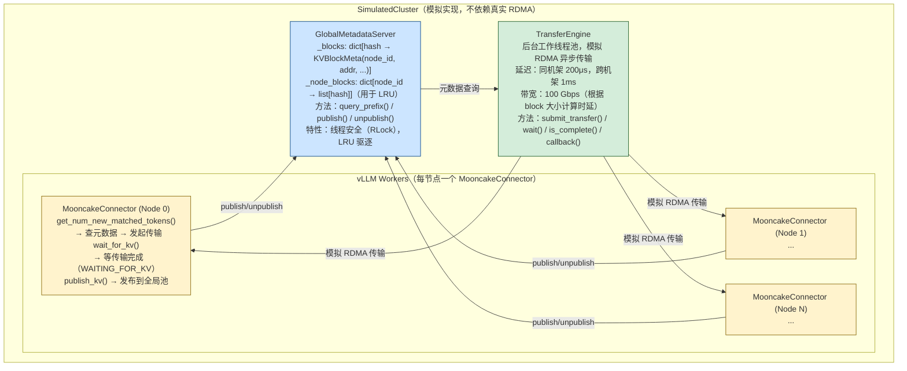

#### 7.8.2 关键实现解读

**块哈希与前缀匹配**（等价于 Radix Tree 前缀匹配）：

```python
def query_prefix(self, block_hashes: list[int]) -> tuple[int, list[KVBlockMeta]]:
    """
    链式匹配：一旦某块 MISS，后续所有块必然 MISS

    这是因为 hash[i] 依赖 hash[i-1]：
      hash[i] = hash(hash[i-1], tokens[i*BS:(i+1)*BS])

    如果 block_i MISS：
      要么 tokens[0..i*BS] 没有被缓存（完全不同的请求）
      要么 tokens[i*BS..(i+1)*BS] 不同（此后所有块的 parent_hash 不同）

    → 后续块不可能命中，可以安全停止查询
    """
    matched = []
    for h in block_hashes:
        if h in self._blocks:
            matched.append(self._blocks[h])
        else:
            break  # 链断开，提前返回
    return len(matched), matched
```

**异步传输等待**（对应 WAITING_FOR_REMOTE_KVS 状态）：

```python
def wait_for_kv(self, request_id: str, timeout: float = 5.0) -> bool:
    """
    等待该请求所有远端 KV 传输完成

    在真实 vLLM 中，这对应请求状态：
    WAITING_FOR_REMOTE_KVS → RUNNING

    调度器在每步检查 is_transfer_complete()，完成后才将请求放入批次
    """
    transfer_ids = self._pending.pop(request_id, [])
    for tid in transfer_ids:
        result = self._engine.wait(tid, timeout=timeout)
        if result is None or not result.success:
            return False
    return True
```

**关键数字验证**：

```
场景：512 token 系统提示词（32个块），3个并发请求

第1个请求（冷启动）：
  - 全部 MISS，计算 512 tokens 的 Prefill
  - 耗时：~258ms（@0.5ms/token）
  - 发布 32 个块到全局池

第2、3个请求：
  - 32 个块全部 HIT
  - 只需计算用户问题部分（假设 4 tokens）
  - 耗时：~2ms
  - 节省：(512-4) × 0.5ms = 254ms per request

全局池统计：
  命中率：66.7%（2/3 的请求完全命中系统提示词）
  节省计算：254ms × 2 = 508ms
```

