# vLLM 从入门到专家（2.0 版）第二部分

> **本部分内容**：Prefix Cache（单机与全局池化）、Scheduler 调度算法、投机解码（EAGLE）、Chunked Prefill。
>
> **阅读前提**：已读第一部分，理解 PagedAttention、KV Cache 块管理。

---

## 第六章：Prefix Cache——避免重复计算的核心优化

### 6.1 理论背景：重复前缀的普遍性

在生产环境中，绝大多数 LLM 请求共享相同的前缀：

| 场景 | 共享内容 | 典型长度 |
|------|---------|---------|
| 多轮对话 | 对话历史 | 500-8000 tokens |
| RAG 检索 | 检索到的文档 | 1000-4000 tokens |
| 代码补全 | 文件上下文 | 2000-16000 tokens |
| 系统提示词 | 固定系统指令 | 100-2000 tokens |

如果不做任何优化，每个请求都要对这些共享前缀做完整的 Prefill 计算，浪费极大。

**论文参考**：
- 前缀缓存的思想在 *RadixAttention*（SGLang，2024）中被系统化：
  Zheng et al., *SGLang: Efficient Execution of Structured Language Model Programs*, NeurIPS 2024
  https://arxiv.org/abs/2312.07104
- vLLM 的 Prefix Cache 实现参考此工作，并针对 PagedAttention 的块结构优化

### 6.2 Radix Tree：理解前缀共享的数据结构

实现前缀缓存，核心是一个**前缀树（Trie / Radix Tree）**数据结构。

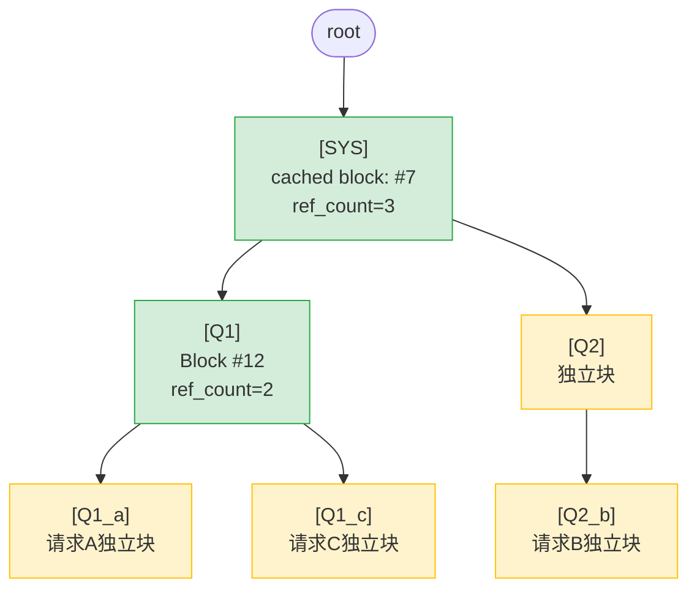

vLLM 的实现没有用严格的 Radix Tree，而是用**块级哈希**近似实现同样的效果：

```
块哈希链：
  Block0: hash(seed=0,    tokens[0:16])    = H0
  Block1: hash(parent=H0, tokens[16:32])   = H1
  Block2: hash(parent=H1, tokens[32:48])   = H2

查询时：逐块计算哈希，在缓存中查找，遇到 miss 停止
效果：等价于 Radix Tree 的前缀匹配
```

### 6.3 vLLM 的单机 Prefix Cache 实现

#### 6.3.1 整体架构

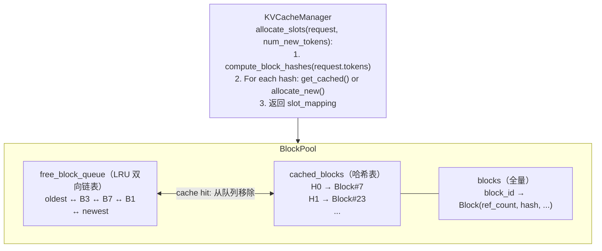

**关键源码**（`vllm/v1/core/kv_cache_utils.py`）：

```python
def hash_block_tokens(
    parent_block_hash: int,
    curr_block_token_ids: tuple[int, ...],
    extra_keys: tuple | None = None,
) -> BlockHash:
    """
    计算 KV Cache 块的哈希值

    参数说明：
    - parent_block_hash：前一个块的哈希，形成链式依赖
    - curr_block_token_ids：本块的 token IDs（固定16个）
    - extra_keys：额外标识符（如 LoRA adapter ID，多模态嵌入哈希等）

    关键设计：链式依赖确保相同内容但不同前缀的块哈希不同
    """
    return BlockHash(hash((parent_block_hash, curr_block_token_ids, extra_keys)))
```

#### 6.3.2 缓存命中的完整流程

```
新请求到达：tokens = [SYS_0..SYS_31, Q_0..Q_15]（3个块）

Step 1: 计算块哈希
  H0 = hash(0,          (SYS_0..SYS_15)) = 0xABCD
  H1 = hash(0xABCD,     (SYS_16..SYS_31)) = 0x1234
  H2 = hash(0x1234,     (Q_0..Q_15))      = 0x5678

Step 2: 逐块查询 cached_blocks
  cached_blocks.get(0xABCD) → Block#7  ← HIT！ref_count: 1→2
  cached_blocks.get(0x1234) → Block#23 ← HIT！ref_count: 1→2
  cached_blocks.get(0x5678) → None     ← MISS，分配新块 Block#4

Step 3: 构建 block_table
  block_table = [7, 23, 4]
  num_cached_tokens = 2 * 16 = 32
  num_new_tokens = 16（只需计算 Q 部分）

Step 4: 调度器报告
  SchedulerOutput.num_scheduled_tokens[req_id] = 16（只计算未命中部分）
  → GPU 只做 16 token 的 Prefill，节省 32 token 的计算！
```

### 6.3.3 深入理解：四个关键问题

#### Q1：一个请求的生命周期中，block 什么时候被 free，什么时候开始驱逐？

Block 的生命周期分为四个阶段：

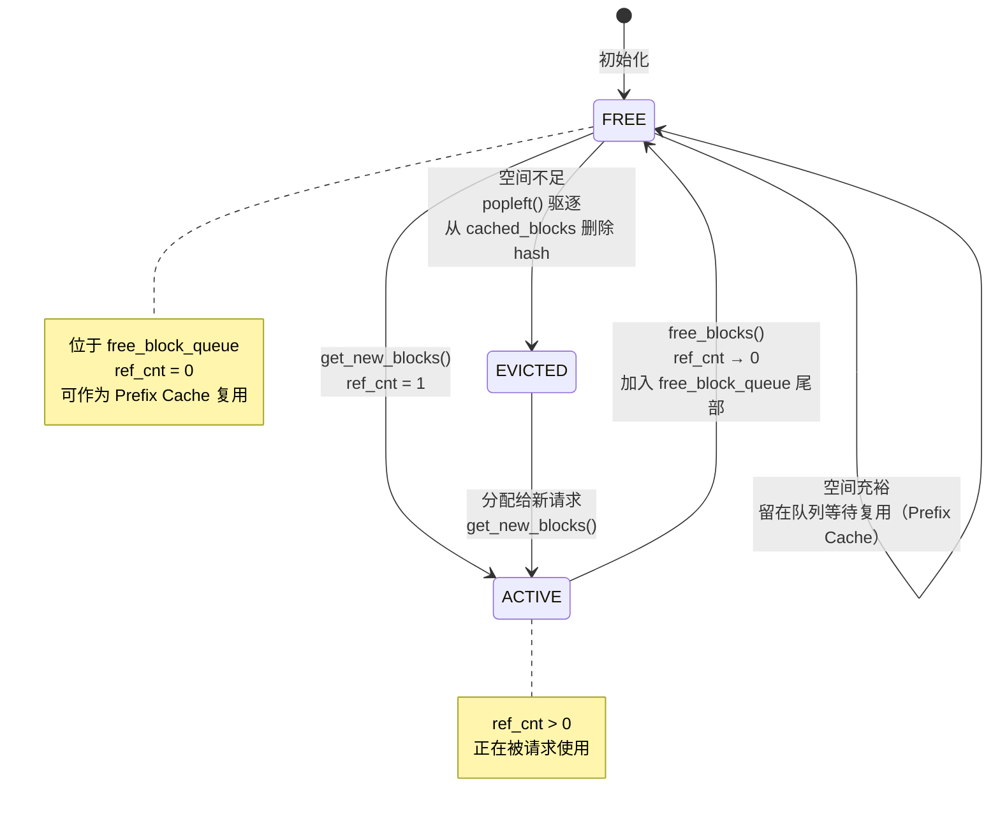

**完整时序示例**（block_size=16, 系统总共10个块）：

```
t=0: 系统启动，10个块全在 free_block_queue
     [B0, B1, B2, B3, B4, B5, B6, B7, B8, B9]（从左到右：最旧→最新）

t=1: 请求A到达（32 token 系统提示词 + 16 token 用户问题 = 3个块）
     get_new_blocks(3) → 弹出 B0, B1, B2
     B0.ref_cnt = B1.ref_cnt = B2.ref_cnt = 1
     free_block_queue: [B3, B4, B5, B6, B7, B8, B9]

t=2: A的Prefill完成，cache_full_blocks()把满块登记入缓存
     B0.block_hash = H0, B1.block_hash = H1（B2未满，不缓存）
     cached_blocks: { H0 → B0, H1 → B1 }

t=3: 请求B到达（相同系统提示词 + 不同用户问题）
     touch([B0, B1])  → B0.ref_cnt: 1→2, B1.ref_cnt: 1→2（命中！）
     get_new_blocks(1) → 弹出 B3 给B的用户问题
     B3.ref_cnt = 1

t=4: 请求A完成，free_blocks([B0, B1, B2])
     B0.ref_cnt: 2→1（还有B共享，不入队）
     B1.ref_cnt: 2→1（同上）
     B2.ref_cnt: 1→0 → 加入 free_block_queue 尾部
     free_block_queue: [B4, B5, B6, B7, B8, B9, B2]

t=5: 请求B完成，free_blocks([B0, B1, B3])
     B0.ref_cnt: 1→0 → 加入 free_block_queue 尾部（有 hash H0）
     B1.ref_cnt: 1→0 → 加入 free_block_queue 尾部（有 hash H1）
     B3.ref_cnt: 1→0 → 加入 free_block_queue 尾部（无 hash）
     free_block_queue: [B4, B5, B6, B7, B8, B9, B2, B0, B1, B3]
     cached_blocks: { H0 → B0, H1 → B1 }  ← 仍然有效！

t=6: 请求C到达（需要5个新块，但只有6个空闲：B4-B9,B2,B0,B1,B3）
     get_new_blocks(5)：弹出 B4, B5, B6, B7, B8
     B4-B8 均无 hash，直接分配
     驱逐触发（如 free_block_queue 已剩 B9,B2,B0,B1,B3 共5块）

t=7: 请求D需要更多块，触发驱逐
     popleft() → B9（最旧，无 hash） → 直接复用
     popleft() → B2（次旧，无 hash） → 直接复用
     popleft() → B0（有 hash H0）：
         _maybe_evict_cached_block(B0) → 删除 cached_blocks[H0]
         B0 现在可以被新请求使用（H0 的 KV 数据被覆盖）
```

**关键结论**：
- `ref_cnt > 0`：块正被请求使用，**不能**被驱逐
- `ref_cnt == 0`：块在 LRU 队列中，**等待**复用，暂时保留（Prefix Cache）
- 驱逐**不是主动**触发的：当 `get_new_blocks()` 被调用且队列中有旧块时，旧块被弹出覆盖

**Decode 阶段的 block 也会被缓存**：上面 t=2 的示例仅展示 Prefill 阶段。但如果 decode 步骤持续生成 token，一旦某个 block 积累满 `block_size` 个 token，`cache_blocks()` 同样会被触发，该 block 同样会被哈希并写入 `cached_blocks`。

```python
# single_type_kv_cache_manager.py — allocate_slots 每步（包括 decode）都调用 cache_blocks()
def cache_blocks(self, request: Request, num_tokens: int) -> None:
    num_cached_blocks = self.num_cached_block.get(request.request_id, 0)
    num_full_blocks = num_tokens // self.block_size  # 只缓存完整的块
    if num_cached_blocks >= num_full_blocks:
        return  # 没有新的满块，跳过
    self.block_pool.cache_full_blocks(...)
    self.num_cached_block[request.request_id] = num_full_blocks
```

因此，无论是 Prefill 还是 Decode，**凡是填满完整 block 的 token，都会被哈希缓存**，供后续请求的 Prefix Cache 复用（例如超长 system prompt 跨越 decode 阶段时）。

#### Q2：链式哈希会出现前面的 block 被驱逐而后面没有的情况吗？

**不会**——vLLM 的 `free()` 实现使用了**反转释放顺序**，在设计上避免了这种情况。

**关键代码**（`single_type_kv_cache_manager.py`）：

```python
def free(self, request_id: str) -> None:
    req_blocks = self.req_to_blocks.pop(request_id, [])
    # 反转顺序：先释放尾部 block，再释放头部 block
    ordered_blocks = reversed(req_blocks)   # ← 关键！
    self.block_pool.free_blocks(ordered_blocks)
```

注释原文："Free blocks in reverse order so that the **tail blocks are freed first**."

**为什么反转顺序就能防止孤儿块？**

设请求拥有块链 `[H0, H1, H2]`（H0=系统提示词，H2=最后一块）：

```
释放顺序（reversed）：[H2, H1, H0]
append_n([H2, H1, H0]) 依次追加到 free_block_queue 尾部

free_block_queue（HEAD 驱逐 → TAIL 最新）：
  ... → H2 → H1 → H0 → TAIL
            ↑最旧      ↑最新（最后驱逐）
```

- H2（链尾）离 HEAD 最近 → **最先被驱逐**
- H0（链头/系统提示词）离 TAIL 最近 → **最后被驱逐**

驱逐顺序与哈希链方向**完全相反**：总是先驱逐"叶子"，再驱逐"根"。

**再加上 touch 操作的加持**：

每次新请求命中 H0（缓存命中），`touch(H0)` 将 H0 从队列中移除（`ref_cnt++`）。请求结束后 H0 再被追加到 TAIL（最新位置）。因此 H0 的 LRU 位置会随命中而持续刷新，始终保持最新。

**结论**：在 vLLM 的实现中，"孤儿块"（前驱被驱逐、后继仍在缓存）**在设计上不会发生**。驱逐顺序是完全确定的，不存在随机性：同一链中，后面的 block 总比前面的 block 更早被驱逐。

> **注**：`02_kvcache/block_pool_lru.py`（本教程的简化实现）为了教学清晰，没有使用反转释放顺序，因此在简化版中理论上可能出现孤儿块。但真实 vLLM 代码明确规避了这一问题。

#### Q3：为什么必须从头匹配前缀，不能从后往前找第一个命中？

这是**物理约束**，不只是算法选择：

```
场景：tokens = [SYS_0..SYS_15 | SYS_16..SYS_31 | Q_0..Q_15]
     缓存状态：H0 被驱逐（B0 已被覆盖），H1 和 H2 还在缓存

如果我们"跳过 H0 miss，直接使用 H1"：

  GPU 的 KV Cache：
    Block H1（B7）：包含 positions 16-31 的 K/V 向量
    Block H2（B12）：包含 positions 32-47 的 K/V 向量

  现在处理 position 32（Q_0）的 attention：
    需要 attend 到 positions 0..31 的 K/V
    positions 16-31 → B7 可用 ✓
    positions 0-15  → ??? KV 不在 GPU 内存中！

    → attention 结果错误（未 attend 到所有历史 token）
    → 或者 GPU 访问非法内存地址，直接崩溃
```

更深层原因：**KV 的语义是注意力上下文，而非孤立的向量**

```python
# attention 计算时 GPU 需要访问连续的 KV 块
for pos in range(0, seq_len):
    attn_score = Q[pos] @ K[0:pos]   # 必须有 0..pos-1 的全部 K
    output[pos] = softmax(attn_score) @ V[0:pos]  # 必须有 0..pos-1 的全部 V

# 如果 K[0:16] 不在 GPU 内存中，这段代码的结果是错的！
# block table 必须提供 0..seq_len-1 的连续物理块地址
```

**链式哈希确保的是 token 身份（内容正确性）**，而不是 GPU 内存可用性。即使 H1 block 在哈希表中存在（意味着它保存的确实是 SYS_16..SYS_31 的 KV），但如果 H0 block 不在 GPU 内存中，attention 运算就无法正确执行。

因此：

```python
# 正确的匹配逻辑（vLLM 的做法）
matched = []
for h in block_hashes:
    if h in cached_blocks:
        matched.append(cached_blocks[h])
    else:
        break  # 必须停在第一个 miss！后面的 block 即使命中也无法使用

# 错误的逻辑（假设的"从后往前"，结果是错的）
for h in reversed(block_hashes):    # ← 永远不能这样做！
    if h in cached_blocks:
        return cached_blocks[h]     # 孤立使用后续 block，attention 结果错误
```

#### Q4：KV Cache 在 TP/PP 并行时如何存储？对 Mooncake 有什么影响？

**Tensor Parallelism（TP）的影响**：

```
TP=4 的 LLaMA-70B（128个 attention head）：

  GPU_0：负责 head 0-31 的 Q/K/V 计算
  GPU_1：负责 head 32-63 的 Q/K/V 计算
  GPU_2：负责 head 64-95 的 Q/K/V 计算
  GPU_3：负责 head 96-127 的 Q/K/V 计算

每个 GPU 的 KV Cache 块布局：
  kv_cache[block_id, :, head_start:head_end, :] = 该GPU负责的头的 KV

同一个逻辑 block_id 在4个 GPU 上各有一片物理内存：
  Block #7 on GPU_0: positions 0-15, heads 0-31
  Block #7 on GPU_1: positions 0-15, heads 32-63
  Block #7 on GPU_2: positions 0-15, heads 64-95
  Block #7 on GPU_3: positions 0-15, heads 96-127

Block table 是全局共享的（所有 GPU 上相同的 block_id）
实际 KV 数据分布在 4 张 GPU 上
```

**TP 对 Mooncake 全局池化的约束**：

```
P 节点（TP=4）→ D 节点（TP=4）：
  P.GPU_0 → 通过 RDMA WRITE → D.GPU_0（head 0-31）
  P.GPU_1 → 通过 RDMA WRITE → D.GPU_1（head 32-63）
  P.GPU_2 → 通过 RDMA WRITE → D.GPU_2（head 64-95）
  P.GPU_3 → 通过 RDMA WRITE → D.GPU_3（head 96-127）
  共 4 个并行 RDMA 传输
```

**TP 支持现状**（以 Mooncake Connector 为例）：

| 场景 | 上游 vLLM | vllm-ascend |
|------|----------|-------------|
| P.TP == D.TP | ✅ 支持 | ✅ 支持 |
| P.TP > D.TP，且 P.TP % D.TP == 0 | ❌ NotImplementedError | ✅ 支持 |
| P.TP < D.TP 或不整除 | ❌ | ❌ |
| PP（Pipeline Parallelism）| ❌ ValueError | ❌ |

上游 vLLM 源码（`mooncake_connector.py`）：
```python
def resolve_need_send(self, send_meta, remote_tp_ranks):
    send_meta.need_send = len(remote_tp_ranks)
    if send_meta.need_send != 1:
        logger.error("Mooncake: Heterogeneous TP is not supported yet.")
        raise NotImplementedError(
            "Mooncake: Heterogeneous TP is not supported yet."
        )
```

vllm-ascend 的 DeepSeek-V3.1 PD 分离部署示例中，P 节点使用 tp=8，D 节点使用 tp=1（整除关系），均属支持范围。

PP 不支持的原因：PP 将不同 Transformer 层分到不同 GPU，KV Cache 按层分布，跨 PP 节点的元数据管理和 RDMA 地址计算更复杂，目前两个版本均未实现。

---

### 6.4 从零手搓：带 LRU 的 Prefix Cache

> 完整代码：`02_kvcache/block_pool_lru.py`

从最简单的 BlockPool 出发，逐步增加 Prefix Cache 和 LRU，理解每一步的设计动机。

#### 6.4.1 第一步：最简 BlockPool（只有分配/释放）

最基础的 KV Cache 管理：一个空闲块池，每次请求从中取块，结束后归还。

```python
class BlockPool_v1:
    """最简版：只有分配和释放，无 Prefix Cache"""

    def __init__(self, num_blocks: int):
        self.blocks = [Block(i) for i in range(num_blocks)]
        # 空闲栈（简单实现，LIFO）
        self.free_blocks = list(range(num_blocks))

    def allocate(self, n: int) -> list[int]:
        """分配 n 个块，返回 block_id 列表"""
        if len(self.free_blocks) < n:
            raise RuntimeError("OOM: 显存不足")
        ids = []
        for _ in range(n):
            ids.append(self.free_blocks.pop())  # 从栈顶取
        return ids

    def free(self, block_ids: list[int]):
        """归还块（简单归还，内容丢弃）"""
        self.free_blocks.extend(block_ids)
```

**问题**：每个请求结束后，prefill 计算的 KV 全部丢弃。下一个相同 prompt 的请求要重新计算。

#### 6.4.2 第二步：加入哈希表（Prefix Cache）

增加一个 `hash → block_id` 映射，让 prefill 完的块不立刻丢弃，等待后续请求复用。

```python
class BlockPool_v2:
    """加入 Prefix Cache 哈希表（无 LRU，块只会增加不会释放）"""

    def __init__(self, num_blocks: int):
        self.blocks = [Block(i) for i in range(num_blocks)]
        self.free_blocks = list(range(num_blocks))

        # 新增：hash → Block（Prefix Cache 核心）
        self.cached_blocks: dict[str, Block] = {}

    def get_cached(self, block_hash: str) -> Block | None:
        """查询 Prefix Cache"""
        return self.cached_blocks.get(block_hash)

    def allocate(self, n: int) -> list[int]:
        if len(self.free_blocks) < n:
            raise RuntimeError("OOM: 所有块都被占用，无法驱逐")
        return [self.free_blocks.pop() for _ in range(n)]

    def mark_cached(self, block_id: int, block_hash: str):
        """一个块的 Prefill 完成后，登记到缓存"""
        block = self.blocks[block_id]
        block.block_hash = block_hash
        self.cached_blocks[block_hash] = block

    def free(self, block_ids: list[int]):
        """释放块（ref_cnt 减到 0 才真正归还，否则只减计数）"""
        for bid in block_ids:
            block = self.blocks[bid]
            block.ref_cnt -= 1
            if block.ref_cnt == 0 and block.block_hash is None:
                # 无缓存 hash → 可以直接归还
                self.free_blocks.append(bid)
            # 有 hash 的块：不归还，留在缓存中等待复用
```

**问题**：GPU 显存有限，缓存的块永远不会被清理，最终 OOM。需要驱逐策略。

#### 6.4.3 第三步：加入 LRU（驱逐策略）

用双向链表实现 O(1) LRU：最近被归还的块在尾部（不驱逐），最久未用的在头部（优先驱逐）。

```python
class BlockPool_v3:
    """完整实现：Prefix Cache + LRU 驱逐"""

    def __init__(self, num_blocks: int):
        self.blocks = [Block(i) for i in range(num_blocks)]

        # ★ 关键数据结构：LRU 双向链表（所有 ref_cnt==0 的块都在此）
        # 布局：head(哨兵) ↔ 最旧 ↔ ... ↔ 最新 ↔ tail(哨兵)
        self.free_block_queue = FreeBlockQueue(self.blocks)

        # Prefix Cache：hash → Block
        self.cached_blocks: dict[str, Block] = {}

    def get_num_free_blocks(self) -> int:
        return self.free_block_queue.num_free_blocks

    # ── 1. 查询缓存（O(1)）──────────────────────────────────────
    def get_cached_block(self, block_hash: str) -> Block | None:
        return self.cached_blocks.get(block_hash)

    # ── 2. Touch：命中的缓存块，增加引用计数 ─────────────────────
    def touch(self, blocks: list[Block]):
        """
        Prefix Cache 命中时调用
        ref_cnt==0 的块需要从 free_block_queue 中摘除（不再可驱逐）
        """
        for block in blocks:
            if block.ref_cnt == 0:
                # 从 LRU 队列中间移除（O(1) 双向链表）
                self.free_block_queue.remove(block)
            block.ref_cnt += 1

    # ── 3. 分配新块（可能触发驱逐）─────────────────────────────
    def get_new_blocks(self, num_blocks: int) -> list[Block]:
        """
        从 free_block_queue 取块（隐式 LRU 驱逐）

        popleft() 弹出最旧的块：
        - 如果有 block_hash → 同时从 cached_blocks 删除（驱逐！）
        - 然后赋给新请求（ref_cnt 从 0 → 1）
        """
        if num_blocks > self.get_num_free_blocks():
            raise RuntimeError("OOM")

        result = []
        for _ in range(num_blocks):
            block = self.free_block_queue.popleft()   # 取最旧的块

            # 如果该块有缓存 hash → 驱逐（从 Prefix Cache 删除）
            if block.block_hash is not None:
                del self.cached_blocks[block.block_hash]
                block.block_hash = None

            block.ref_cnt = 1                          # 分配给新请求
            result.append(block)

        return result

    # ── 4. 释放块（请求结束）────────────────────────────────────
    def free_blocks(self, blocks: list[Block]):
        """
        ref_cnt-- 后：
        - 降到 0 → 加入 free_block_queue 尾部（LRU 最新）
        - 若有 hash，保留在 cached_blocks 中（待复用）
        """
        for block in blocks:
            block.ref_cnt -= 1
            if block.ref_cnt == 0:
                # 加到 LRU 队尾（最新→最不可能被驱逐）
                self.free_block_queue.append(block)
                # block.block_hash 不清除 → 保留在 cached_blocks

    # ── 5. 登记缓存（满块 Prefill 完成后）────────────────────────
    def cache_full_blocks(self, blocks: list[Block], block_hashes: list[str],
                          num_already_cached: int, num_full: int):
        """
        已计算完的满块，登记到 Prefix Cache

        只登记 num_already_cached..num_full-1 范围内的新块：
        - 0..num_already_cached-1：已缓存（Prefix Cache 命中）
        - num_full..（最后一个未满块）：不缓存（未写满，下次可能覆盖）
        """
        for i in range(num_already_cached, num_full):
            block = blocks[i]
            if block.block_hash is None:   # 尚未缓存
                block.block_hash = block_hashes[i]
                self.cached_blocks[block_hashes[i]] = block
```

#### 6.4.4 完整请求处理流程（整合所有步骤）

```python
def allocate_slots(
    pool: BlockPool_v3,
    token_ids: list[int],
    block_size: int = 16,
) -> tuple[list[Block], int]:
    """
    为一个新请求分配 KV Cache 块（含 Prefix Cache 命中逻辑）

    返回：(block_table, num_cached_tokens)
    """
    # Step 1: 计算块哈希链
    block_hashes = compute_block_hashes(token_ids, block_size)
    num_full_blocks = len(token_ids) // block_size
    block_table = []

    # Step 2: 逐块查询 Prefix Cache（遇到 MISS 停止）
    num_cached = 0
    cached_blocks = []
    for i, h in enumerate(block_hashes[:num_full_blocks]):
        block = pool.get_cached_block(h)
        if block is None:
            break  # 链断开，停止匹配
        cached_blocks.append(block)
        num_cached += 1

    # Step 3: Touch 命中的缓存块（ref_cnt++，从 LRU 摘除）
    pool.touch(cached_blocks)
    block_table.extend(cached_blocks)
    num_cached_tokens = num_cached * block_size

    # Step 4: 分配剩余新块
    num_new_blocks = (len(token_ids) - num_cached_tokens + block_size - 1) // block_size
    new_blocks = pool.get_new_blocks(num_new_blocks)
    block_table.extend(new_blocks)

    return block_table, num_cached_tokens


def on_request_finished(
    pool: BlockPool_v3,
    blocks: list[Block],
    block_hashes: list[str],
    num_full_blocks: int,
    num_already_cached: int,
):
    """请求完成后，登记新计算的块到 Prefix Cache，然后释放"""
    # 登记满块到缓存
    pool.cache_full_blocks(blocks, block_hashes, num_already_cached, num_full_blocks)

    # 释放所有块（ref_cnt--，降到 0 的加入 LRU）
    pool.free_blocks(blocks)
```

**测试运行**（`02_kvcache/block_pool_lru.py`）：

```bash
docker exec vllm python3 -m pytest /mnt/esfs/master_work/vllm-from-scratch/02_kvcache/ -v
```

12 个测试覆盖：分配/释放、Prefix Cache 命中、LRU 驱逐顺序、孤儿块处理、并发请求共享块。

---

## 第七章：全局 Prefix Cache——Mooncake 风格的分布式 KV 池

### 7.1 理论背景：单机 Prefix Cache 的局限性

单机版 Prefix Cache 受限于**单张 GPU 的显存**。以 A100 80GB 为例：

```
显存分配：
  模型权重（LLaMA-70B）：约 140GB（需要 2 张 GPU）
  剩余 KV Cache：约 20GB
  可缓存 token 数（LLaMA-70B）：
    20GB / (32层 × 8头 × 128维 × 2 × 2字节) = ~20万 tokens

问题：
  - 一个 32K token 的系统提示词 = 32,000 / 200,000 = 16% 的缓存空间
  - 100 个不同用户的对话历史全都缓存：不可能
  - 多节点集群中，每个节点各自维护缓存：重复计算
```

**解决思路**：把 KV Cache 移到容量更大的存储层（CPU DRAM、SSD），建立**全局共享的 KV 池**。

**关键论文**：
- Mooncake（月之暗面）：*Mooncake: A KVCache-centric Disaggregated Architecture for LLM Serving*, 2024
  https://arxiv.org/abs/2407.00079
- PD 分离的先驱工作：*Splitwise: Efficient Generative LLM Inference Using Phase Splitting*, ISCA 2024
  https://arxiv.org/abs/2311.18677
- KV Cache 卸载：*InfiniGen: Efficient Generative Inference of Large Language Models with Dynamic KV Cache Management*, OSDI 2024

### 7.2 背景：vLLM 生态与 KVConnector 接口演进

在深入源码之前，我们先搭建认知框架：理解 vLLM 生态中的各个组件，以及 KV 跨节点传输接口经历了怎样的演进。

#### 7.2.1 vLLM 与 vllm-ascend 的关系

读者在阅读本章时会同时看到来自 `vllm/` 和 `vllm_ascend/` 的实现。两者关系如下：

| | 上游 vLLM | vllm-ascend |
|--|-----------|-------------|
| **维护方** | vLLM Project（开源社区，主要面向 NVIDIA GPU） | 华为昇腾 AI（适配 Ascend NPU） |
| **仓库** | `github.com/vllm-project/vllm` | `github.com/vllm-project/vllm-ascend` |
| **与上游关系** | 上游基础实现 | 以 **Plugin 机制**在运行时覆盖/扩展 vLLM 的特定组件 |
| **硬件目标** | NVIDIA A100/H100/H200 | 华为昇腾 Atlas 800T A2 等 NPU |
| **特有功能** | MooncakeConnector、LMCacheConnector、NixlConnector | D-pull RDMA READ、异构TP、AscendStore、MLA 专项优化 |

vllm-ascend **不是 vLLM 的 Fork**，而是通过 vLLM 的 `VLLM_PLUGINS` 机制在运行时**动态替换**特定组件（Attention 层、KVConnector 类型、调度器行为等）。部署时需同时安装两个包：

```bash
pip install vllm          # 上游基础
pip install vllm-ascend   # 华为昇腾扩展（作为 Plugin 注入到 vLLM 运行时）
```

> **本文约定**：提到"上游 vLLM"指 `vllm-project/vllm` 的实现；"vllm-ascend"指 `vllm_ascend/` 路径下的扩展实现。两者在 KVConnector 的选择上都走 V1 接口，但传输策略不同。

#### 7.2.2 V0 方案：KV Lookup Buffer（已废弃）

vLLM 最初的 KV 跨节点传输接口称为 **V0**，使用两个同步阻塞方法：

```python
# V0 KVConnectorBase（已废弃，但仍见于部分旧文档/教程！）
class KVConnectorBase:

    def send_kv_caches_and_hidden_states(
        self, model_executable, model_input, kv_caches, hidden_states
    ) -> None:
        """P-Node：Prefill 全部完成后，将 KV Cache 写入 KV Lookup Buffer"""
        ...

    def recv_kv_caches_and_hidden_states(
        self, model_executable, model_input, kv_caches
    ) -> tuple[Tensor, bool]:
        """D-Node：从 KV Lookup Buffer 按 token_hash 取 KV，填入本地 blocks"""
        # bypass_model=True → D-Node 跳过 Prefill 前向传播，直接 Decode Attention
        return hidden_states, True
```

V0 的分层架构——KV 传输管道 + 键值查找层：

```
┌──────────────────────────────────────────────────────────────┐
│                    V0 KV 传输架构                             │
│                                                              │
│  P-Node: send_kv_caches_and_hidden_states()                  │
│    ↓                                                         │
│  KV Lookup Buffer                                            │
│    API: insert(token_hash, kv_data)  ← P-Node 按 hash 写入  │
│         drop_select(token_hash)      ← D-Node 按 hash 读取  │
│    作用：解决 P/D 处理顺序不一致（P 先完成存入，D 后到取出） │
│    ↓                                                         │
│  KV Pipe（底层 FIFO 张量管道）                                │
│    API: send_tensor(tensor) / recv_tensor()                  │
│                                                              │
│  D-Node: recv_kv_caches_and_hidden_states()                  │
│    返回 bypass_model=True → 跳过 Prefill 重计算               │
└──────────────────────────────────────────────────────────────┘
```

**V0 的四个核心局限**，直接推动了 V1 的重新设计：

| 局限 | 具体表现 |
|------|---------|
| **整体传输** | `send_kv_caches_and_hidden_states` 在 Prefill 全部完成后才调用，D-Node 等待 = 完整 Prefill 时延 |
| **调度器盲目** | 调度器对 KV 传输状态完全无感知，无法在分配 blocks 时计算"有多少 tokens 可从远端加载" |
| **无块生命周期控制** | P-Node 无法延迟 blocks 释放，RDMA 传输期间 blocks 可能被 LRU 驱逐，导致传输数据损坏 |
| **进程职责混乱** | P/D 共用单一基类，V1 多进程架构（调度器进程 + Worker 进程）要求接口必须拆分 |

> **为什么要了解废弃接口？** 部分旧版博客、论文复现代码、早期 vLLM PR 仍使用 `send_kv_caches_and_hidden_states` / `recv_kv_caches_and_hidden_states`。读者见到这些方法名时应立即识别：**这是 V0 历史实现，当前 V1 架构已完全不同**，不能混用。

#### 7.2.3 V1 方案：调度器/Worker 分离（当前架构）

V1 的核心改变是**将 KVConnector 一分为二**：

```
V1 KVConnectorBase_V1
│
├── 调度器侧（Scheduler 进程，在 schedule() 中调用）
│   ├── get_num_new_matched_tokens(request, num_computed_tokens)
│   │     → 返回 (extra_tokens, is_async)
│   │     → 告知调度器：远端还有多少 token 的 KV 可加载
│   │     → 调度器据此精确分配 KV blocks、计算 token budget
│   │
│   ├── update_state_after_alloc(request, blocks, num_external_tokens)
│   │     → blocks 分配完成后，记录"哪些 blocks 需要从远端填充"
│   │
│   ├── build_connector_meta(scheduler_output) → KVConnectorMetadata
│   │     → 打包本调度步的传输元数据，附带在 SchedulerOutput 上
│   │     → 通过 ZeroMQ IPC 通道发给 Worker 进程
│   │
│   ├── request_finished(request, block_ids) → (bool, dict|None)
│   │     → 请求完成时回调；delay_free=True 则 Connector 接管 blocks 释放时机
│   │     → P-Node 在此记录待发 blocks（RDMA WRITE 完成前绝不能释放！）
│   │
│   └── take_events() → Iterable[KVCacheEvent]
│         → 向调度器汇报 KV Cache 可用状态变化（供全局 Prefix Cache 使用）
│
└── Worker 侧（GPU Worker 进程，在 execute_model 前后调用）
    ├── register_kv_caches(kv_caches)
    │     → 启动时一次性：将 GPU KV Cache 内存注册到 RDMA 引擎（"钉住"内存）
    │
    ├── start_load_kv(forward_context)
    │     → 前向传播前：D-Node 发起异步 KV 加载；立即返回，不阻塞模型执行
    │
    ├── wait_for_layer_load(layer_name)
    │     → 每层 attention 前：等待该层 KV 加载完成
    │     → 支持逐层流水线：Layer N 传输时，Layer N+1 的 attention 先运行
    │
    ├── save_kv_layer(layer_name, kv_layer, attn_metadata)
    │     → 每层 attention 后：异步发送/保存该层 KV（P-Node 使用）
    │
    ├── wait_for_save()
    │     → 前向传播结束：等待所有层 KV 发送完成
    │
    └── get_finished(finished_req_ids) → (set|None, set|None)
          → 轮询异步完成状态
          → P-Node: 返回 finished_sending → 调度器知道哪些 blocks 可释放
          → D-Node: 返回 finished_recving → 调度器知道哪些请求可进 Decode
```

调度器进程与 Worker 进程通过 `KVConnectorMetadata`（附带在 `SchedulerOutput` 上）进行 IPC 通信：

```
Scheduler 进程                        Worker 进程
─────────────────────────────         ──────────────────────────
schedule() {                          execute_model() {
  connector.get_num_new_matched_tokens  ← 请求到达时
  connector.update_state_after_alloc    ← blocks 分配后
  connector.build_connector_meta()          → KVConnectorMetadata
                                      ← (ZeroMQ IPC 序列化传输)
}                                         bind_connector_metadata()
                                          start_load_kv()         ← 前向传播前
                                          ...attention layers...
                                          wait_for_save()         ← 前向传播后
                                          get_finished()
                                      }
```

完整接口定义详见《博客第三部分》§13.3.2。

#### 7.2.4 vllm-ascend 方案一览

在 V1 接口框架下，vllm-ascend 实现了两类 KV 传输机制：

**A. 点对点传输（kv_p2p）**：直接替换上游 MooncakeConnector
- 传输方向：**D-pull（RDMA READ）**，与上游 P-push 相反——D 主动从 P 读取
- 支持异构 TP（P_tp > D_tp，如 P_tp=4、D_tp=2 的组合）
- 支持 LayerwiseConnector（逐层传输流水线，Prefill 每完成一层立即 RDMA）
- 源码：`vllm_ascend/distributed/kv_transfer/kv_p2p/`

**B. 全局 KV 池（AscendStore）**：真正的全局前缀缓存
- 有中心元数据服务（KVPoolScheduler，ZMQ RPC）
- 按 block_hash（SHA-256）索引，支持跨 P 节点前缀复用
- 可插拔后端（MooncakeDistributedStore / Memcache）
- 源码：`vllm_ascend/distributed/kv_transfer/kv_pool/ascend_store/`

详细实现见 §7.3.5（D-pull）、§7.3.6（异构TP）、§7.3.7（逐层传输）、§7.6（AscendStore）。

#### 7.2.5 全局 KV 池的理想架构

有了以上背景，我们可以理解"全局 KV 池"的理想目标。下图展示**全局池化架构**（LMCache / AscendStore 等方案对应此设计，上游 vLLM MooncakeConnector 是 P2P 方案，没有中心元数据服务器）：

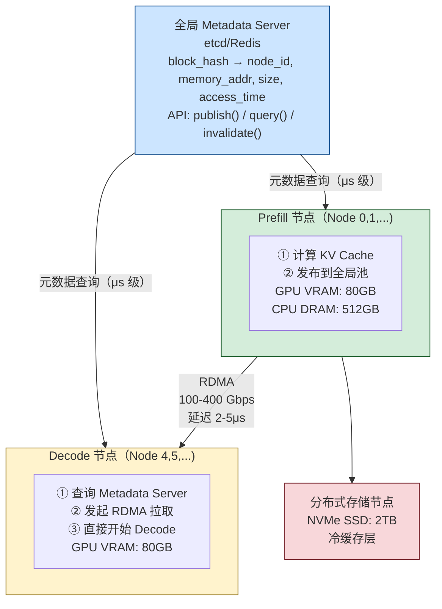

**三类实现方案对比**（从简单到完整）：

| | 上游 vLLM MooncakeConnector | LMCache V1 | vllm-ascend AscendStore |
|--|------------------------------|------------|--------------------------|
| 中心元数据服务 | ❌（P2P，无中心服务） | ❌（本地引擎） | ✅ KVPoolScheduler（ZMQ RPC） |
| KV 索引方式 | `transfer_id`（请求级配对） | `block_hash`（内容寻址） | `SHA-256(token_ids)` |
| 跨 P 节点复用 | ❌（固定 P→D 配对） | ✅ | ✅ |
| 传输方向 | P RDMA WRITE → D | D 从 LMCache 存储层读取 | D 从后端（Mooncake/Memcache）拉取 |
| 冷缓存层 | ❌ | ✅ CPU/NVMe 分层 | ✅ 可插拔后端 |
| 适合场景 | 低延迟 P→D 精确配对 | 大容量 Prefix Pool，多P共享 | 华为 Ascend 集群全局缓存 |

### 7.3 Mooncake 真实源码深度解析

上游 vLLM 和 vllm-ascend 在传输方向上有根本性的差异，两者都值得深入了解：

| | 上游 vLLM | vllm-ascend |
|--|-----------|-------------|
| **源码路径** | `vllm/distributed/kv_transfer/kv_connector/v1/mooncake/mooncake_connector.py` | `vllm_ascend/distributed/kv_transfer/kv_p2p/mooncake_connector.py` |
| **传输方向** | P push（RDMA WRITE） | D pull（RDMA READ） |
| **异构 TP** | ❌ NotImplementedError | ✅ P_tp ≥ D_tp，P_tp % D_tp == 0 |
| **逐层传输** | ❌ | ✅ LayerwiseConnector |
| **全局 KV 池** | ❌（仅 P2P） | ✅ AscendStore（见 7.6） |

#### 7.3.1 上游 vLLM：P 主动推送（RDMA WRITE）

很多文章把 Mooncake 描述成"D-node 从全局池 pull KV"，但上游 vLLM 的真实实现是**P-node 主动 RDMA WRITE 到 D-node 的内存**：

```
上游 vLLM（RDMA WRITE，P 控制）：
  D-node → 向 P-node 的 ZMQ side channel 发送请求
              包含：D-node 的 GPU 内存地址（kv_caches_base_addr）
  P-node → Prefill 完成后，从本地 GPU 内存 RDMA WRITE 到 D-node
              engine.batch_transfer_sync_write(src_ptrs, dst_ptrs, lengths)
  (P 控制传输方向)
```

**为什么 P 主动写？**

- P-node 知道精确的传输时机（Prefill 刚完成的那一刻）
- P-node 掌握 KV 的物理内存地址（block_id × block_len）
- D-node 不需要知道 P-node 的内存布局细节

#### 7.3.2 核心数据流（上游 vLLM，逐步拆解源码）

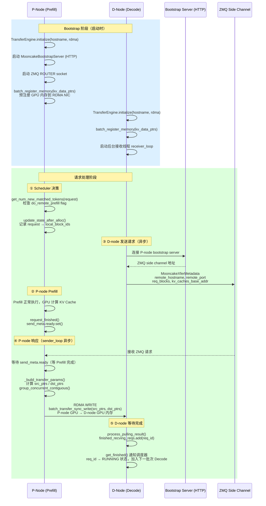

#### 7.3.3 关键源码注解（上游 vLLM）

**内存注册**（一次性，启动时执行）：
```python
# MooncakeConnectorWorker.register_kv_caches()
# kv_caches: 每层的 KV Cache 张量，形如 {layer_name: Tensor[num_blocks, ...]}

kv_data_ptrs = []
kv_data_lens = []
for layer_name, cache in kv_caches.items():
    base_addr = cache.data_ptr()   # GPU 内存的物理地址（指针）
    kv_data_ptrs.append(base_addr)
    kv_data_lens.append(cache.nbytes)

# 向 Mooncake RDMA 引擎注册：将这些 GPU 内存区域"钉住"（pin）
# 注册后，RDMA NIC 可以直接读写这块内存，无需 CPU 干预
ret = self.engine.batch_register_memory(kv_data_ptrs, kv_data_lens)

# block 访问公式：
# 第 block_id 个块的 KV 在第 layer 的偏移 = block_id * block_len
# block_len = tensor.nbytes / num_blocks
self.block_len = tensor_size_bytes // self.num_blocks
```

**地址计算 + 连续块合并**：
```python
# _build_transfer_params() 的关键逻辑
for layer_addr_p, layer_addr_d in zip(local_base_addr, remote_base_addr):
    for group_local, group_remote in zip(group_local_blocks, group_remote_blocks):
        # 连续块合并为单次 RDMA 操作（减少硬件描述符开销）
        # 例：P-node block_ids=[5,6,7] 连续 → 一次 RDMA WRITE 3*block_len 字节
        src_ptrs.append(layer_addr_p + group_local[0] * block_len)
        dst_ptrs.append(layer_addr_d + group_remote[0] * block_len)
        lengths.append(block_len * len(group_local))

# group_concurrent_contiguous() 的作用：
# input: src=[5,6,7,12,13], dst=[2,3,4,8,9]
# output: [(5,6,7), (12,13)], [(2,3,4), (8,9)]
# → 2次 RDMA 操作代替 5次，减少延迟和开销
brk = np.where((np.diff(src_indices) != 1) | (np.diff(dst_indices) != 1))[0] + 1
```

**异步协同机制（asyncio.Event）**：
```python
# SendBlockMeta.ready 是 asyncio.Event
# P-node Prefill 完成时，request_finished() 调用 send_meta.ready.set()
# P-node sender 线程一直在 wait_tasks 中等待：
wait_tasks = [asyncio.create_task(wait_and_ret(d_req_id, send_meta))]
# ...
done, pending = await asyncio.wait(wait_tasks, timeout=ABORT_TIMEOUT)
# ready 触发后，立刻开始 RDMA WRITE

# 关键：D-node 在发送 ZMQ 请求时，Prefill 可能还没完成
# P-node 会在 asyncio.wait() 中挂起，直到 Prefill 完成（ready.set()）
# 这样 D-node 的 ZMQ 请求和 P-node 的 Prefill 可以并发进行，
# P 的 Prefill 完成后 ZMQ 响应立刻就绪，最小化 D-node 等待时间
```

#### 7.3.4 从零手搓一个完整 MooncakeConnector

前面已经分析了关键代码片段。本节把所有部分**整合成一个完整可运行的骨架**，让读者看清楚 V1 MooncakeConnector 端到端的全貌。代码保留核心逻辑，省略错误处理。

##### 整体骨架：实现 V1 接口

MooncakeConnector 实现 `KVConnectorBase_V1`。**同一个类会被实例化两次**：一次在 Scheduler 进程（`role=SCHEDULER`），一次在每个 GPU Worker 进程（`role=WORKER`）。

```python
# minimal_mooncake_connector.py
import asyncio, os, uuid
import zmq, zmq.asyncio
import msgspec
from vllm.distributed.kv_transfer.kv_connector.v1.base import (
    KVConnectorBase_V1, KVConnectorRole,
)

class MooncakeXferMetadata(msgspec.Struct):
    """D-Node 通过 ZMQ 发给 P-Node 的传输请求"""
    transfer_id: str         # P/D 之间本次传输的唯一 ID（request_finished 生成）
    remote_hostname: str     # D 的主机名（P 的 RDMA NIC 需要知道写到哪个机器）
    remote_port: int         # D 的 RDMA 端口
    d_block_ids: list[int]   # D 分配的 KV block IDs
    d_kv_base_addrs: list[int]  # D 的 GPU KV 内存基址（每层一个）

class MinimalMooncakeConnector(KVConnectorBase_V1):
    def __init__(self, vllm_config, role: KVConnectorRole):
        self.role = role
        # 由环境变量区分 P-Node / D-Node
        self.is_prefill = os.environ.get("VLLM_KV_ROLE", "decode") == "prefill"

        # ── 调度器侧共享状态（Scheduler 进程使用）──────────────────────
        self._pending_send: dict = {}   # req_id → (transfer_id, block_ids) [P-Node]
        self._pending_recv: dict = {}   # req_id → pull_meta [D-Node]
        self._send_ready: dict = {}     # transfer_id → asyncio.Event（Prefill 完成标记）

        # ── Worker 侧共享状态（GPU Worker 进程使用）──────────────────────
        self._finished_sending: set = set()  # RDMA WRITE 已完成的 req_id
        self._finished_recving: set = set()  # KV 已接收完成的 req_id

        if role == KVConnectorRole.WORKER:
            self._init_transfer_engine()
```

##### 第一步：内存注册（启动时调用一次）

```python
    def _init_transfer_engine(self):
        from mooncake.engine import TransferEngine
        self.engine = TransferEngine()
        # "P2PHANDSHAKE"：P/D 互相发现并建立 RDMA RC QP（Reliable Connection）
        # "rdma"：使用 InfiniBand 或 RoCEv2（需要支持 RDMA 的网卡）
        self.engine.initialize(os.environ["HOSTNAME"], "P2PHANDSHAKE", "rdma")

        if self.is_prefill:
            # P-Node：启动 Bootstrap HTTP Server（D 用 HTTP 发现 P 的 ZMQ 端口）
            self._start_bootstrap_server()
            # P-Node：启动 ZMQ ROUTER（接收 D-Node 的传输请求）
            self.zmq_ctx = zmq.asyncio.Context()
            self.zmq_router = self.zmq_ctx.socket(zmq.ROUTER)
            self.zmq_port = self.zmq_router.bind_to_random_port("tcp://*")
            asyncio.create_task(self._sender_loop())  # 后台发送协程

    def register_kv_caches(self, kv_caches: dict):
        """
        将 GPU KV Cache 内存注册到 Mooncake RDMA 引擎（"钉住"内存）
        ─ vLLM 启动时调用一次
        ─ 注册后 RDMA NIC 可以绕过 CPU 直接读写这块内存（GPUDirect RDMA）
        """
        kv_ptrs, kv_lens = [], []
        for layer_name, cache in kv_caches.items():
            kv_ptrs.append(cache.data_ptr())   # GPU 物理内存指针
            kv_lens.append(cache.nbytes)
        # "钉住"GPU 内存区域：让 RDMA NIC 可以直接 DMA 到这块内存
        self.engine.batch_register_memory(kv_ptrs, kv_lens)

        self.kv_caches = kv_caches
        self.kv_base_addrs = [c.data_ptr() for c in kv_caches.values()]
        self.num_blocks = next(iter(kv_caches.values())).shape[0]
        self.block_len = next(iter(kv_caches.values())).nbytes // self.num_blocks
```

##### 第二步：调度器侧方法（Scheduler 进程）

```python
    # ══════════════════════════════════════════════════
    # 以下方法运行在 Scheduler 进程，role = SCHEDULER
    # ══════════════════════════════════════════════════

    def get_num_new_matched_tokens(self, request, num_computed_tokens):
        """
        D-Node：告知调度器"可从 P-Node 加载多少 tokens 的 KV"
        ─ 返回 (extra_tokens, is_async)
        ─ is_async=True → 请求先进 WAITING_FOR_REMOTE_KVS 状态，KV 异步到达后再 Decode
        """
        if not self.is_prefill:
            params = request.kv_transfer_params or {}
            if params.get("do_remote_prefill"):
                extra = len(request.prompt_token_ids) - num_computed_tokens
                return extra, True   # 告诉调度器：还差 extra 个 tokens 的 KV 要从 P 加载
        return 0, False

    def update_state_after_alloc(self, request, blocks, num_external_tokens):
        """D-Node：blocks 分配完成，记录需要从 P-Node 填充的 block IDs"""
        if not self.is_prefill and num_external_tokens > 0:
            self._pending_recv[request.request_id] = {
                "block_ids": blocks.physical_block_ids,
                "transfer_id": request.kv_transfer_params["transfer_id"],
                "remote_bootstrap": request.kv_transfer_params["remote_bootstrap_addr"],
            }

    def request_finished(self, request, block_ids):
        """
        P-Node：请求完成，准备发送 KV 给 D-Node
        ─ 返回 delay_free=True → 这些 blocks 不能立即被 LRU 释放！
        ─ 必须等 RDMA WRITE 完成后，get_finished() 通知调度器才能释放
        """
        if self.is_prefill:
            transfer_id = uuid.uuid4().hex
            self._pending_send[request.request_id] = (transfer_id, list(block_ids))
            # asyncio.Event：D-Node ZMQ 请求可能先于 Prefill 完成，需要等 Prefill ready
            event = asyncio.Event()
            event.set()   # Prefill 此时已完成，立即置位（真实代码中由 Prefill 异步置位）
            self._send_ready[transfer_id] = event
            return True, {
                "do_remote_decode": True,
                "transfer_id": transfer_id,
                "remote_bootstrap_addr": f"{os.environ['HOSTNAME']}:{self._bootstrap_port}",
            }
        return False, None

    def build_connector_meta(self, scheduler_output):
        """打包元数据，通过 SchedulerOutput ZMQ IPC 通道发给 Worker 进程"""
        if self.is_prefill:
            meta = {"reqs_to_send": dict(self._pending_send)}
            self._pending_send.clear()
        else:
            meta = {"reqs_to_recv": dict(self._pending_recv)}
            self._pending_recv.clear()
        return meta   # 实际上返回 KVConnectorMetadata 子类
```

##### 第三步：Worker 侧方法（GPU Worker 进程）

```python
    # ══════════════════════════════════════════════════
    # 以下方法运行在 GPU Worker 进程，role = WORKER
    # ══════════════════════════════════════════════════

    def start_load_kv(self, forward_context, **kwargs):
        """
        D-Node：前向传播前，触发 KV 传输（立即返回，不阻塞）
        ─ 向 P-Node 发送 ZMQ 请求，告知"D 的 GPU 内存地址"
        ─ P-Node 收到后执行 RDMA WRITE，把 KV 直接写入 D 的 GPU 内存
        """
        meta = self.get_connector_metadata()
        for req_id, pull_meta in meta.get("reqs_to_recv", {}).items():
            asyncio.create_task(self._request_kv_from_prefill(req_id, pull_meta))

    def wait_for_layer_load(self, layer_name: str):
        """
        MooncakeConnector：整批传输（非逐层），此处 no-op
        ─ 对比 LMCacheConnector：逐层等待，需阻塞
        ─ 对比 AscendStore LayerwiseConnector：逐层等待，需阻塞
        """
        pass

    def save_kv_layer(self, layer_name, kv_layer, attn_metadata, **kwargs):
        """
        MooncakeConnector：整批发送（非逐层），此处 no-op
        ─ Mooncake 的 RDMA WRITE 在 request_finished 触发后由 sender_loop 整批发起
        ─ 对比 LayerwiseConnector：每层 attention 后立即触发 RDMA
        """
        pass

    def wait_for_save(self):
        """MooncakeConnector：no-op（RDMA WRITE 异步进行，由 sender_loop 管理）"""
        pass

    def get_finished(self, finished_req_ids):
        """
        轮询完成状态
        ─ P-Node: finished_sending → 调度器知道哪些 blocks 可以释放
        ─ D-Node: finished_recving → 调度器知道哪些请求可以进入 Decode
        """
        sending = self._finished_sending.copy() or None
        recving = self._finished_recving.copy() or None
        self._finished_sending.clear()
        self._finished_recving.clear()
        return sending, recving
```

##### 第四步：P-Node 后台传输线程（核心：RDMA WRITE）

```python
    async def _sender_loop(self):
        """
        P-Node 后台协程：持续等待 D-Node 的 ZMQ 请求，执行 RDMA WRITE
        ─ 这是整个 P2P 传输的核心：P 主动写入 D 的 GPU 内存
        ─ 在 Worker 进程启动后一直运行，处理所有请求的发送
        """
        while True:
            # 等待 D-Node 发来的 ZMQ 消息（DEALER → ROUTER 模式）
            dealer_id, _, raw_msg = await self.zmq_router.recv_multipart()
            xfer_meta: MooncakeXferMetadata = msgspec.json.decode(raw_msg)

            # 找到该 transfer_id 对应的 P-Node blocks
            req_id = self._find_req_by_transfer_id(xfer_meta.transfer_id)
            _, p_block_ids = self._pending_send.pop(req_id)

            # 等待 Prefill 完成（asyncio.Event）
            # ─ D-Node 可能在 Prefill 还没完成时就发来 ZMQ 请求（两者并发）
            # ─ sender_loop 会在此处挂起，直到 request_finished() 置位 ready
            await self._send_ready[xfer_meta.transfer_id].wait()

            # 建立与 D-Node 的 RDMA 连接（基于 Mooncake TransferEngine）
            remote_session = self.engine.open_session(
                xfer_meta.remote_hostname, xfer_meta.remote_port
            )

            # 计算每层 KV 的 RDMA 传输参数
            src_ptrs, dst_ptrs, lengths = self._build_transfer_params(
                p_block_ids, xfer_meta.d_block_ids, xfer_meta.d_kv_base_addrs
            )

            # ★ 核心：P-GPU → D-GPU RDMA WRITE
            # ─ 绕过 CPU，由 RDMA NIC 直接 DMA 写入对端 GPU 内存
            # ─ 同步等待完成（batch_transfer_sync_write = 发起 + 等待完成）
            ret = self.engine.batch_transfer_sync_write(
                remote_session, src_ptrs, dst_ptrs, lengths
            )

            # 通知调度器：P-Node blocks 现在可以安全释放了
            self._finished_sending.add(req_id)

    def _build_transfer_params(self, p_block_ids, d_block_ids, d_kv_base_addrs):
        """
        计算每层 KV 的 RDMA 传输参数（src 地址、dst 地址、传输长度）
        ─ 连续的 block IDs 合并为一次 RDMA 操作（减少 NIC 描述符开销）
        ─ 例：block_ids=[5,6,7] → 一次 RDMA 传输 3*block_len 字节
        """
        src_ptrs, dst_ptrs, lengths = [], [], []
        for p_base, d_base in zip(self.kv_base_addrs, d_kv_base_addrs):
            for p_group, d_group in group_consecutive(p_block_ids, d_block_ids):
                # block_id * block_len = 第 block_id 个 KV block 的起始地址偏移
                src_ptrs.append(p_base + p_group[0] * self.block_len)
                dst_ptrs.append(d_base + d_group[0] * self.block_len)
                lengths.append(self.block_len * len(p_group))
        return src_ptrs, dst_ptrs, lengths
```

##### 第五步：D-Node 触发传输（ZMQ + 等待 RDMA 完成）

```python
    async def _request_kv_from_prefill(self, req_id: str, pull_meta: dict):
        """
        D-Node：向 P-Node 发起传输请求
        流程：① 通过 Bootstrap HTTP 获取 P 的 ZMQ 地址
              ② 发送 MooncakeXferMetadata（含 D 的 GPU 内存地址）
              ③ P-Node 执行 RDMA WRITE → D-GPU 内存就绪
              ④ 通知 get_finished()，调度器将请求推进 Decode 队列
        """
        # ① 通过 P-Node 的 Bootstrap HTTP Server 获取 ZMQ 地址
        p_zmq_addr = await self._query_bootstrap(pull_meta["remote_bootstrap"])

        # ② 构建请求：把 D 的 GPU block 地址告诉 P
        xfer = MooncakeXferMetadata(
            transfer_id=pull_meta["transfer_id"],
            remote_hostname=os.environ["HOSTNAME"],
            remote_port=self.rdma_port,
            d_block_ids=pull_meta["block_ids"],
            d_kv_base_addrs=self.kv_base_addrs,  # D 的 GPU KV 内存基址
        )

        # ③ 发送给 P-Node（ZMQ DEALER → ROUTER）
        zmq_sock = self.zmq_ctx.socket(zmq.DEALER)
        zmq_sock.connect(p_zmq_addr)
        await zmq_sock.send(msgspec.json.encode(xfer))

        # P-Node 的 sender_loop 收到消息后执行 RDMA WRITE：
        #   engine.batch_transfer_sync_write(session, src_ptrs, dst_ptrs, lengths)
        # RDMA WRITE 完成 → D 的 GPU 内存已被写入正确的 KV 数据

        # ④ 等待传输完成（真实代码用 asyncio.Event + process_pulling_result() 触发）
        await self._wait_for_completion(pull_meta["transfer_id"])

        # ⑤ 通知调度器：该请求的 KV 已就绪，可以进入 Decode 批次
        self._finished_recving.add(req_id)
```

##### 完整数据流连接图

```
P-Node                                    D-Node
─────────────────────────────────         ──────────────────────────────────────

【Scheduler 进程】                         【Scheduler 进程】
request_finished(req, block_ids)           get_num_new_matched_tokens(req)
  → _pending_send[req] = (tid, blocks)       → extra = len(prompt) - computed
  → delay_free = True                        → return (extra, is_async=True)
  → _send_ready[tid] = Event()             update_state_after_alloc(req, blocks)
build_connector_meta()                       → _pending_recv[req] = pull_meta
  → SchedulerOutput + meta (reqs_to_send) build_connector_meta()
         ↓ ZeroMQ IPC                        → SchedulerOutput + meta (reqs_to_recv)
                                                      ↓ ZeroMQ IPC

【Worker 进程】                            【Worker 进程】
register_kv_caches()                       register_kv_caches()
  → engine.batch_register_memory()           → engine.batch_register_memory()

[Prefill Forward Pass 执行中]              start_load_kv()
                                             → _request_kv_from_prefill() [async]
request_finished() 触发 _send_ready.set()       ↓ query P's Bootstrap HTTP
                                                ↓ ZMQ DEALER → P's ZMQ ROUTER
_sender_loop():                                   (MooncakeXferMetadata)
  ← 收到 ZMQ 请求
  → 等待 _send_ready.wait()（Prefill 完成）  ← RDMA WRITE 到达 D-GPU 内存
  → engine.batch_transfer_sync_write()        ─ P-GPU 物理内存 → D-GPU 物理内存
    (P-GPU → D-GPU, RDMA WRITE)               ─ 绕过 CPU，延迟 ~100μs
  → _finished_sending.add(req)              → _finished_recving.add(req)

get_finished() → (finished_sending, None)  get_finished() → (None, finished_recving)
  ↓ 调度器知道：blocks 可以释放               ↓ 调度器知道：req 可进入 Decode 批次
```

> **与真实 vLLM MooncakeConnector 的差异**：真实代码中 `_send_ready` 的 Event 由 `request_finished()` 在调度器进程设置，通过 `KVConnectorMetadata` 传给 Worker；还有错误处理、多 TP worker 协调、bootstrap server 高可用等。但以上骨架覆盖了**所有核心流程**。

---

#### 7.3.5 三种实现对比（模拟 / 上游 vLLM / vllm-ascend）

| 特性 | 模拟实现（global_kv_pool.py） | 真实 Mooncake 实现 |
|------|------------------------------|-------------------|
| 元数据服务 | Python dict（单进程内） | 分布式（每个 engine 独立维护） |
| 传输方向 | submit_transfer（D pull） | RDMA WRITE（P push） | RDMA READ（D pull） |
| 传输协议 | Python threading sleep | mooncake.engine（RDMA） | mooncake.engine（RDMA） |
| P/D 发现 | 预置 node_id | Bootstrap Server（HTTP） | ZMQ handshake |
| P/D 协调 | wait_for_kv() 同步等 | asyncio.Event + ZMQ | 异步接收线程 |
| 块地址 | 抽象 block_hash | GPU 物理内存指针 | GPU NPU 内存指针 |
| 块合并 | 无 | group_concurrent_contiguous() | 连续块合并 |
| 异构 TP | ❌ | ❌ | ✅ block 分割 |
| 逐层传输 | ❌ | ❌ | ✅ |

---

#### 7.3.6 vllm-ascend：D 主动拉取（RDMA READ）

vllm-ascend 使用与上游完全**相反的传输方向**：由 D-node 主动从 P-node 拉取 KV 数据：

```
vllm-ascend（RDMA READ，D 控制）：
  P-node → Prefill 完成后，向调度器标记 do_remote_decode=True
           内存地址已注册到 Mooncake TransferEngine（NPU 内存 pin）

  D-node → 接收到调度决策（知道目标 P-node）
  D-node → 调用 engine.batch_transfer_sync_read(session_id, src_list, dst_list, length_list)
           直接从 P-node NPU 内存 RDMA READ 到本地 NPU 内存
  (D 控制传输方向)
```

核心代码（`kv_p2p/mooncake_connector.py:545-547`）：

```python
# D-node 主动发起 RDMA READ（与上游 batch_transfer_sync_write 方向相反）
ret = self.engine.batch_transfer_sync_read(
    session_id, src_list, dst_list, length_list
)
```

**D pull 的优势（在 Ascend 场景下）**：
- D-node 可以灵活控制何时发起传输，无需 P-node 等待 D 的内存地址
- 支持异构 TP（一个 D-GPU 从多个 P-GPU 分别读取不同的 head 段）
- P-node 只需注册内存，无需额外的发送逻辑

**数据流（vllm-ascend）**：

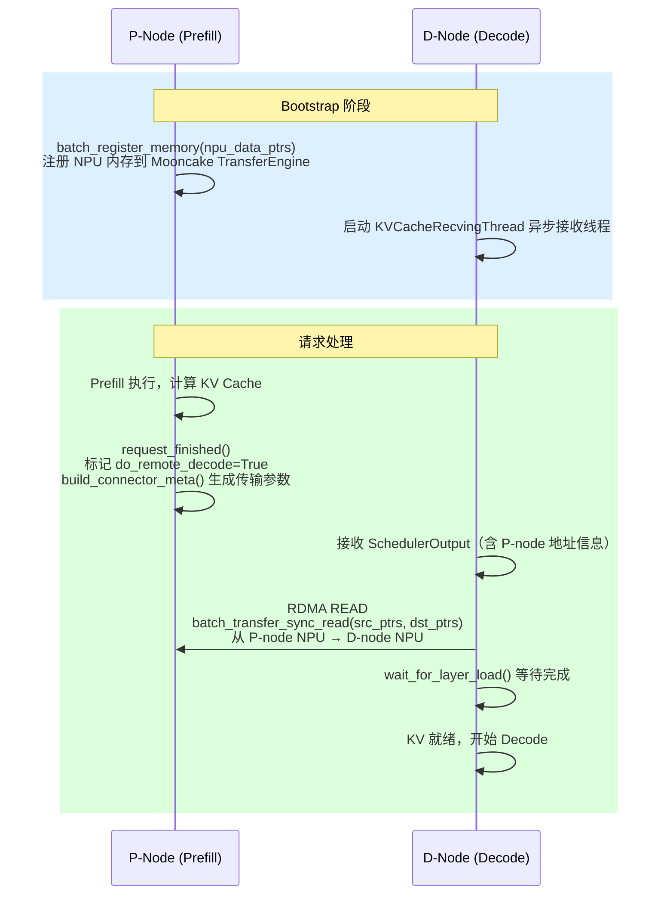

#### 7.3.7 异构 TP 支持：Block 分割机制

vllm-ascend 支持 P 节点与 D 节点使用不同 TP 大小（要求 `P_tp >= D_tp` 且 `P_tp % D_tp == 0`）。

**核心思路**：当 P_tp > D_tp 时，每个 D-GPU 需要覆盖更多的 attention head，因此需要从多个 P-GPU 分别拉取各自负责的 head 段。

**关键计算**（`mooncake_connector.py:1150-1156`）：

```python
num_d_block_heads = max(1, self.num_key_value_heads // self.tp_size)        # D 每 GPU 的 head 数
num_p_block_heads = max(1, self.num_key_value_heads // self._prefill_tp_size)  # P 每 GPU 的 head 数
self.tp_num_need_pulls = num_d_block_heads // num_p_block_heads  # 每个 D-GPU 需要从几个 P-GPU 拉
```

**Block 分割逻辑**（`mooncake_connector.py:537-552`）：

```python
inner_block_len = block_len // tp_num_need_pulls  # 每次 RDMA READ 的字节数
inner_offset = offset % tp_num_need_pulls          # 偏移量，指向当前 P-GPU 的 head 段

for remote_block_id, local_block_id in zip(grouped_remote_ids, grouped_local_ids):
    src = src_layer_base_addr + local_block_id[0] * block_len + inner_offset * inner_block_len
    dst = dst_layer_base_addr + remote_block_id[0] * inner_block_len
    length = inner_block_len * len(local_block_id)
    src_list.append(src), dst_list.append(dst), length_list.append(length)
```

**示例（模型 128 heads，P_tp=4，D_tp=2）**：

```
P_tp=4：每个 P-GPU 存 32 heads 的 KV
D_tp=2：每个 D-GPU 需要 64 heads 的 KV

tp_num_need_pulls = 64 // 32 = 2

D-GPU_0（heads 0-63）需要：
  ← RDMA READ 来自 P-GPU_0（heads 0-31，inner_offset=0）
  ← RDMA READ 来自 P-GPU_1（heads 32-63，inner_offset=1）

D-GPU_1（heads 64-127）需要：
  ← RDMA READ 来自 P-GPU_2（heads 64-95，inner_offset=0）
  ← RDMA READ 来自 P-GPU_3（heads 96-127，inner_offset=1）
```

#### 7.3.8 逐层传输（Layerwise Connector）

`mooncake_layerwise_connector.py` 实现了**层级流水线**传输：Prefill 计算完第 N 层的 KV，立刻 RDMA 传输第 N 层给 D-node，同时 Prefill 继续计算第 N+1 层：

```mermaid
gantt
    title Layerwise vs 整体传输 时序对比
    dateFormat X
    axisFormat %s

    section 整体传输
    P 计算所有层        : t1, 0, 6
    RDMA 传输所有层     : t2, 6, 9
    D Decode           : t3, 9, 12

    section 逐层传输
    P 计算 Layer 0     : l1, 0, 2
    RDMA Layer 0       : l2, 2, 3
    P 计算 Layer 1     : l3, 2, 4
    RDMA Layer 1       : l4, 4, 5
    P 计算 Layer 2     : l5, 4, 6
    RDMA Layer 2       : l6, 6, 7
    D Decode (流水线)  : l7, 3, 9
```

- **整体传输**：Prefill 全部完成才开始 RDMA，D-node 等待时间长
- **逐层传输**：Prefill 每完成一层立刻传输，D-node 提前开始执行已收到的层

逐层传输通过 Python generator 实现（`pool_worker.py:357-424`）：

```python
def retrieve_layer(self, request) -> Generator:
    keys = [list(row) for row in zip(*keys)]  # 转置为 [num_layer, num_block]
    for layer_id, layer_keys in enumerate(keys):
        self.kv_recv_thread.add_request(layer_keys)
        yield None  # 每层 yield 一次，让上层 wait_for_layer_load() 同步
```

### 7.4 RDMA 从零到懂——完整技术指南

#### 7.4.1 RDMA 是什么？硬件要求

**RDMA（Remote Direct Memory Access）**：允许一台机器的网卡直接读写另一台机器的内存，**完全绕过 CPU**。

```
传统 TCP/IP 网络栈（每次传输的开销）：
  应用层：数据在用户空间
    ↓ syscall（上下文切换 ~1μs）
  内核网络栈：TCP/IP 封包
    ↓ DMA 拷贝
  网卡（NIC）：发送
    ↓ 网络
  对端网卡：接收
    ↓ DMA 拷贝到内核缓冲区
    ↓ 中断/轮询（CPU 介入）
    ↓ 内核到用户空间拷贝
  对端应用层：拿到数据

  总延迟：50-100μs，吞吐量：~10 Gbps（受 CPU 限制）

RDMA 网络栈：
  应用层：在内核注册内存（pin memory，一次性）
    ↓ 用户态 RDMA Verb 直接写入 NIC 队列（零拷贝，无 syscall）
  RDMA NIC：直接从/向注册内存 DMA 传输
    ↓ 网络（InfiniBand 或 RoCEv2）
  对端 RDMA NIC：直接 DMA 写入对端注册内存
    ↓ 完成通知（Completion Queue，无需 CPU 中断）
  对端应用层：直接读取内存（无等待）

  总延迟：1-5μs，吞吐量：100-400 Gbps（硬件直达）
```

**硬件要求**：

| 组件 | 要求 | 备注 |
|------|------|------|
| 网卡 | 支持 RDMA 的 NIC | Mellanox/NVIDIA ConnectX-5/6/7，Intel E810 等 |
| 网络协议 | InfiniBand **或** RoCEv2 | InfiniBand：专用网络，延迟最低；RoCEv2：基于以太网 |
| 驱动 | rdma-core 包，verbs API | Ubuntu: `apt install rdma-core ibverbs-utils` |
| GPU 直传 | GPUDirect RDMA | 需要 nvidia-peermem 驱动模块 |
| 系统 | Linux kernel 4.14+，huge pages | RDMA 通常需要锁定大页内存 |

**检查当前环境是否支持 RDMA**：

```bash
# 1. 查看是否有 RDMA 设备
ibv_devices
# 有输出（如 mlx5_0）→ 支持；无输出 → 无 RDMA 硬件

# 2. 查看设备详情（GID，支持的协议）
ibv_devinfo -d mlx5_0

# 3. 检查 GPUDirect RDMA 支持（需要 NVIDIA GPU）
ls /proc/driver/nvidia-peermem/
# 或
nvidia-smi | grep "RDMA"

# 4. 检查 RoCEv2 配置（以太网 RDMA）
rdma link show

# 5. 检查 mlx5 驱动
lsmod | grep mlx5
# 应该看到 mlx5_core 和 mlx5_ib

# 6. 检查 RDMA 子系统
cat /sys/class/infiniband/*/node_type
# 1 = CA (Channel Adapter) → 支持 RDMA
```

**没有 RDMA 硬件怎么办？**

```bash
# 使用 SoftRoCE（软件模拟 RoCEv2，延迟较高但功能完整）
modprobe rdma_rxe
rdma link add rxe0 type rxe netdev eth0  # eth0 是你的以太网接口
ibv_devices  # 应该出现 rxe0

# 注意：SoftRoCE 延迟约 50-100μs（与 TCP 相当），仅用于开发测试
```

#### 7.4.2 从零开始写一个 RDMA 程序

以下是最简单的 RDMA 发送端/接收端示例，展示核心 API：

```c
// rdma_basic.c — RDMA WRITE 基础版（仅展示关键步骤，省略错误处理）
#include <infiniband/verbs.h>

// ─── 第一步：初始化 ───────────────────────────────────────────────
// 1.1 打开 RDMA 设备
struct ibv_device **dev_list = ibv_get_device_list(NULL);
struct ibv_context *ctx = ibv_open_device(dev_list[0]);

// 1.2 创建 Protection Domain（权限隔离域）
struct ibv_pd *pd = ibv_alloc_pd(ctx);

// ─── 第二步：注册内存 ─────────────────────────────────────────────
// 2.1 分配内存并注册（"钉住"内存，让 RDMA NIC 可以直接访问）
char *buf = malloc(BUF_SIZE);
struct ibv_mr *mr = ibv_reg_mr(
    pd, buf, BUF_SIZE,
    IBV_ACCESS_LOCAL_WRITE | IBV_ACCESS_REMOTE_WRITE
);
// mr->lkey：本地密钥（发送时使用）
// mr->rkey：远端密钥（对方写入时使用）

// ─── 第三步：创建通信对象 ─────────────────────────────────────────
// 3.1 Completion Queue（完成队列，接收操作完成通知）
struct ibv_cq *cq = ibv_create_cq(ctx, 16, NULL, NULL, 0);

// 3.2 Queue Pair（发送/接收队列对）
struct ibv_qp_init_attr qp_attr = {
    .send_cq = cq, .recv_cq = cq,
    .qp_type = IBV_QPT_RC,   // RC = Reliable Connection（有序可靠传输）
};
struct ibv_qp *qp = ibv_create_qp(pd, &qp_attr);

// 3.3 建立连接（需要交换 QP 信息：lid, qp_num, gid）
//     （这里通常用 TCP 做 out-of-band 交换，即 "bootstrap"）

// ─── 第四步：发起 RDMA WRITE ─────────────────────────────────────
// 4.1 准备发送工作请求
struct ibv_sge sge = {
    .addr   = (uintptr_t)buf,    // 本地内存地址
    .length = BUF_SIZE,
    .lkey   = mr->lkey,          // 本地密钥
};
struct ibv_send_wr wr = {
    .opcode     = IBV_WR_RDMA_WRITE,   // RDMA WRITE 操作
    .wr.rdma = {
        .remote_addr = remote_addr,    // 对端内存地址（bootstrap 阶段获取）
        .rkey        = remote_rkey,    // 对端远端密钥
    },
    .sg_list = &sge,
    .num_sge = 1,
    .send_flags = IBV_SEND_SIGNALED,   // 完成时通知 CQ
};
ibv_post_send(qp, &wr, NULL);         // 提交（异步，立即返回）

// ─── 第五步：等待完成 ─────────────────────────────────────────────
// 5.1 轮询 Completion Queue（用户态轮询，无中断，零延迟）
struct ibv_wc wc;
while (ibv_poll_cq(cq, 1, &wc) == 0) {}  // 轮询直到完成
// wc.status == IBV_WC_SUCCESS → 传输完成！
```

**与 Mooncake 的对应关系**：

```python
# Mooncake 的 TransferEngine 封装了上述 C 代码
# 对应关系：
self.engine.initialize(hostname, "P2PHANDSHAKE", "rdma")
# ↑ ibv_open_device() + ibv_alloc_pd() + 建立 RC QP

self.engine.batch_register_memory(kv_data_ptrs, kv_data_lens)
# ↑ ibv_reg_mr(pd, buf, size, IBV_ACCESS_LOCAL_WRITE | IBV_ACCESS_REMOTE_WRITE)

self.engine.batch_transfer_sync_write(remote_session, src_ptrs, dst_ptrs, lengths)
# ↑ ibv_post_send(IBV_WR_RDMA_WRITE) + 等待 ibv_poll_cq()
#   "sync" 表示等待所有传输完成才返回
```

#### 7.4.3 如何测量 RDMA 极限带宽

```bash
# ── 测试环境：两台机器 A（发送）和 B（接收），各有 RDMA NIC ──

# 方法1：使用 perftest 工具（最常用）
apt install perftest

# B（接收端）：
ib_write_bw --ib-dev=mlx5_0

# A（发送端）：
ib_write_bw --ib-dev=mlx5_0 <B的IP>

# 输出示例（100GbE RoCEv2）：
# ---------------------------------------------------------------------------------------
#  #bytes     #iterations    BW peak[MB/sec]    BW average[MB/sec]   MsgRate[Mpps]
#  65536      1000           11234.25           11198.78              0.170497
# ---------------------------------------------------------------------------------------
# 换算：11234 MB/s = 89.9 Gbps ≈ 100 Gbps 网络的 ~90% 利用率

# 方法2：测量延迟
ib_write_lat --ib-dev=mlx5_0             # 接收端
ib_write_lat --ib-dev=mlx5_0 <B的IP>    # 发送端
# 输出：平均 1.2μs，最小 1.0μs（InfiniBand HDR）

# 方法3：GPUDirect RDMA 带宽（GPU 内存直传）
# 需要 nvidia-peermem 已加载
ib_write_bw --ib-dev=mlx5_0 --use-cuda=0    # 使用 GPU 0 的内存
# 理想值：接近 NIC 带宽（但 PCIe 带宽可能成为瓶颈）

# 方法4：模拟 Mooncake 的实际场景（多块 batch 传输）
# 单个 KV block（block_size=16, 32层, 32头, 128维, fp16）
# = 16 * 32 * 32 * 128 * 2 * 2B = 67MB
# 传输 10 个块：670 MB
# 100Gbps 网络：670MB / (100Gbps/8) = 53.6ms
# 但真实 RDMA 延迟只是基准延迟（1-5μs）+ 传输时间
# 所以多块 batch 的效率远高于逐块传输
```

#### 7.4.4 全局池化 vs 本地 Prefix Cache：何时有收益？

通过可观测指标进行定量比较：

```python
# 可观测指标（在 global_kv_pool.py 模拟中可直接测量）

import time
from global_kv_pool import GlobalMetadataServer, MooncakeConnector, compute_block_hashes

# ── 指标1：本地 Prefix Cache 命中耗时 ────────────────────────────
# 直接读取 GPU 内存，不涉及传输
def local_prefix_cache_time(num_cached_tokens: int, gpu_bandwidth_gbps: float = 2000) -> float:
    """
    从 GPU L2 Cache 读取 KV 数据（实际上不需要读，只是跳过 Prefill 计算）
    真实耗时 ≈ 0（token 已在 GPU 内存，attention 直接 attend）
    """
    return 0.0  # 本地命中不消耗时间，只是跳过 Prefill 计算

# ── 指标2：跨节点 RDMA 传输耗时 ──────────────────────────────────
def rdma_transfer_time(num_tokens: int, config: dict) -> float:
    """
    RDMA 传输时间 = 基础延迟 + 数据量 / 带宽

    参数：
      num_tokens: 需要传输的 token 数
      config: {'latency_us': 5, 'bandwidth_gbps': 100,
               'num_layers': 32, 'num_heads': 32, 'head_dim': 128,
               'block_size': 16, 'dtype_bytes': 2}
    """
    num_blocks = num_tokens // config['block_size']
    bytes_per_block = (config['block_size'] * config['num_layers']
                       * config['num_heads'] * config['head_dim']
                       * 2 * config['dtype_bytes'])
    total_bytes = num_blocks * bytes_per_block
    transfer_s = total_bytes / (config['bandwidth_gbps'] * 1e9 / 8)
    latency_s = config['latency_us'] * 1e-6
    return (latency_s + transfer_s) * 1000  # ms

# ── 指标3：Prefill 计算耗时（跳过的对象）─────────────────────────
def prefill_compute_time(num_tokens: int, ms_per_token: float = 0.5) -> float:
    """
    Prefill 计算时间估算（A100 @ 70B 模型，~0.5ms/token）
    """
    return num_tokens * ms_per_token  # ms

# ── 收益分析 ──────────────────────────────────────────────────────
config = {
    'latency_us': 5,           # RDMA 基础延迟 5μs（同机房）
    'bandwidth_gbps': 100,     # 100GbE RoCEv2
    'num_layers': 32,
    'num_heads': 32,
    'head_dim': 128,
    'block_size': 16,
    'dtype_bytes': 2,          # fp16
}

scenarios = [
    ("短系统提示词 (128 tokens)",  128),
    ("中等系统提示词 (1024 tokens)", 1024),
    ("长系统提示词 (8192 tokens)", 8192),
    ("超长上下文 (32768 tokens)", 32768),
]

print(f"{'场景':<30} {'Prefill计算':<15} {'RDMA传输':<15} {'净收益':<12} {'值得？'}")
print("=" * 85)
for desc, num_tokens in scenarios:
    prefill_ms = prefill_compute_time(num_tokens)
    rdma_ms = rdma_transfer_time(num_tokens, config)
    benefit_ms = prefill_ms - rdma_ms
    worth_it = "✅ 有收益" if benefit_ms > 0 else "❌ 无收益"
    print(f"{desc:<30} {prefill_ms:<15.1f} {rdma_ms:<15.1f} {benefit_ms:<12.1f} {worth_it}")
```

**典型输出**：

```
场景                           Prefill计算     RDMA传输        净收益       值得？
=====================================================================================
短系统提示词 (128 tokens)      64.0            0.5             63.5         ✅ 有收益
中等系统提示词 (1024 tokens)   512.0           3.7             508.3        ✅ 有收益
长系统提示词 (8192 tokens)     4096.0          29.4            4066.6       ✅ 有收益
超长上下文 (32768 tokens)      16384.0         117.5           16266.5      ✅ 有收益
```

**无收益场景**（全局池化反而更慢）：

```
场景1：RDMA 带宽很低（如 10GbE）+ 短 prompt（128 tokens）
  RDMA 传输 128 tokens @ 10GbE = 4.7ms
  Prefill 计算 128 tokens      = 64ms
  → 仍然有收益（64 > 4.7）

场景2：本地 Prefix Cache 命中（same-GPU cache hit）
  本地命中耗时：~0ms（GPU L2 cache 读取）
  全局 RDMA 耗时：0.5ms（即使很快）
  → 无收益！全局池化比本地慢！
  结论：本地 Prefix Cache 优先，全局池化仅在本地 miss 时触发

场景3：极高并发，RDMA 网络拥塞
  名义带宽 100Gbps，实际拥塞后 20Gbps
  8192 tokens RDMA：146ms vs Prefill 4096ms
  → 仍有收益，但收益下降

场景4：Prefill 计算很快（小模型，GPU 算力充足）
  小模型（7B），Prefill 128 tokens = 5ms
  RDMA 传输 128 tokens        = 0.5ms
  → 收益变小，但通常仍值得
```

**决策矩阵**：

```
                  本地 GPU KV Cache
                  HIT        MISS
                ┌──────────┬──────────────┐
全局 KV Pool    │ 使用本地  │  使用全局    │
HIT             │ (更快)    │  RDMA传输   │
                ├──────────┼──────────────┤
全局 KV Pool    │ 使用本地  │  重新Prefill │
MISS            │ (更快)    │  (唯一选择) │
                └──────────┴──────────────┘

结论：
  - 本地 hit → 无论如何使用本地（最快）
  - 本地 miss + 全局 hit → 用 RDMA（比重新 Prefill 快）
  - 两级都 miss → 必须 Prefill（无法优化）
```

### 7.5 从零实现：模拟多节点全局 KV 池

> 完整代码：`06_global_prefix_cache/global_kv_pool.py`

#### 7.5.1 架构设计

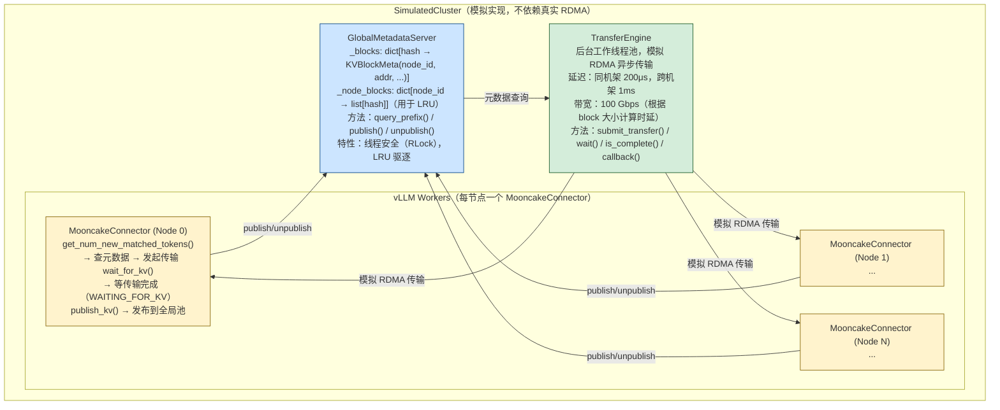

#### 7.5.2 关键实现解读

**块哈希与前缀匹配**（等价于 Radix Tree 前缀匹配）：

```python
def query_prefix(self, block_hashes: list[int]) -> tuple[int, list[KVBlockMeta]]:
    """
    链式匹配：一旦某块 MISS，后续所有块必然 MISS

    这是因为 hash[i] 依赖 hash[i-1]：
      hash[i] = hash(hash[i-1], tokens[i*BS:(i+1)*BS])

    如果 block_i MISS：
      要么 tokens[0..i*BS] 没有被缓存（完全不同的请求）
      要么 tokens[i*BS..(i+1)*BS] 不同（此后所有块的 parent_hash 不同）

    → 后续块不可能命中，可以安全停止查询
    """
    matched = []
    for h in block_hashes:
        if h in self._blocks:
            matched.append(self._blocks[h])
        else:
            break  # 链断开，提前返回
    return len(matched), matched
```

**异步传输等待**（对应 WAITING_FOR_REMOTE_KVS 状态）：

```python
def wait_for_kv(self, request_id: str, timeout: float = 5.0) -> bool:
    """
    等待该请求所有远端 KV 传输完成

    在真实 vLLM 中，这对应请求状态：
    WAITING_FOR_REMOTE_KVS → RUNNING

    调度器在每步检查 is_transfer_complete()，完成后才将请求放入批次
    """
    transfer_ids = self._pending.pop(request_id, [])
    for tid in transfer_ids:
        result = self._engine.wait(tid, timeout=timeout)
        if result is None or not result.success:
            return False
    return True
```

**关键数字验证**：

```
场景：512 token 系统提示词（32个块），3个并发请求

第1个请求（冷启动）：
  - 全部 MISS，计算 512 tokens 的 Prefill
  - 耗时：~258ms（@0.5ms/token）
  - 发布 32 个块到全局池

第2、3个请求：
  - 32 个块全部 HIT
  - 只需计算用户问题部分（假设 4 tokens）
  - 耗时：~2ms
  - 节省：(512-4) × 0.5ms = 254ms per request

全局池统计：
  命中率：66.7%（2/3 的请求完全命中系统提示词）
  节省计算：254ms × 2 = 508ms
```

### 7.6 vllm-ascend AscendStore：真实全局 KV 池实现

> 源码路径：`vllm_ascend/distributed/kv_transfer/kv_pool/ascend_store/`

7.5 节的模拟实现揭示了全局 KV 池的设计原理。vllm-ascend 的 **AscendStore** 是真实生产中的全局 KV 池实现，是本章的核心方案。本节将逐层拆解其四层架构、关键数据结构、请求生命周期、传输线程精髓，以及 MooncakeDistributedStore 后端原理，最后提供完整的"从零手搓"七步实现骨架。

#### 7.6.1 完整四层架构

AscendStore 由四层组件构成，每层职责清晰分离：

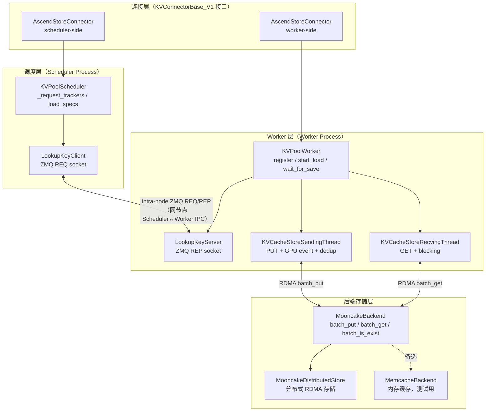

**与 7.5 模拟版的对应关系：**

| 模拟版 | AscendStore 对应组件 | 职责 |
|--------|---------------------|------|
| `GlobalMetadataServer` | `KVPoolScheduler` + `LookupKeyClient/Server` | 查询哪些 block 已缓存 |
| `TransferEngine` | `KVCacheStoreSendingThread` + `RecvingThread` | 执行实际 KV 读写 |
| `publish_kv()` | `wait_for_save()` → `SendingThread` | 将 KV 写入全局池 |
| `wait_for_kv()` | `wait_for_layer_load()` | 等待 KV 从全局池加载 |
| `hash(tuple(tokens))` | `PoolKey.to_string()` (SHA-256) | 内容寻址，跨节点去重 |

**两个关键设计决策：**

- **ZMQ 是 Intra-Node（同节点）的**：Scheduler Process 和 Worker Process 运行在同一台机器上，ZMQ IPC socket 只负责进程间通信。跨节点查询通过 MooncakeDistributedStore 的 etcd 元数据服务完成。
- **`delay_free=False`**：与上游 MooncakeConnector（P2P 模式，`delay_free=True`）不同，AscendStore 是全局池，写入后 block 不依赖 D 节点持有，因此不需要延迟释放。

---

#### 7.6.2 关键数据结构

理解数据结构是读懂整个系统的前提。

**PoolKey：内容寻址存储键**

```python
# config_data.py
import hashlib, dataclasses

@dataclasses.dataclass
class PoolKey:
    model_name: str         # 模型名称（不同模型 KV 形状不通用）
    head_or_tp_rank: int    # TP 并行时区分不同 rank（各 rank KV 数据不同）
    chunk_hash: bytes       # SHA-256(token_ids.tobytes())，内容寻址核心
    pp_rank: int = 0        # PP 并行时区分不同流水线阶段（各 stage 层不同）

    def to_string(self) -> str:
        """生成全局唯一存储键，格式：model@head:rank@pp:stage@hexhash"""
        hash_hex = self.chunk_hash.hex()
        return (f"{self.model_name}"
                f"@head:{self.head_or_tp_rank}"
                f"@pp:{self.pp_rank}"
                f"@{hash_hex}")
```

为什么要把 `tp_rank` 编入 key？

```
TP=4 时，同一 block 的 KV 在 4 个 rank 上各不同：
  rank 0 存 head 0~7  的 K/V
  rank 1 存 head 8~15 的 K/V
  rank 2 存 head 16~23 的 K/V
  rank 3 存 head 24~31 的 K/V

所以 PoolKey 必须包含 tp_rank，避免跨 rank 混用 KV 数据。
```

**ChunkedTokenDatabase：调度器侧的 block 哈希缓存**

```python
# config_data.py（概念简化版）
import hashlib
import numpy as np

class ChunkedTokenDatabase:
    """把 token 序列分块，维护每块的 SHA-256 哈希（避免重复计算）"""

    def __init__(self, block_size: int):
        self.block_size = block_size
        self._hash_db: dict[int, bytes] = {}  # block_idx → SHA-256 digest

    def update(self, token_ids: list[int]) -> None:
        """计算并缓存所有完整块的哈希值"""
        for idx in range(len(token_ids) // self.block_size):
            if idx in self._hash_db:
                continue  # 已计算，跳过
            chunk = token_ids[idx * self.block_size:(idx + 1) * self.block_size]
            self._hash_db[idx] = hashlib.sha256(
                np.array(chunk, dtype=np.int32).tobytes()
            ).digest()  # 返回 bytes（32 字节）

    def get_hashes(self, num_blocks: int) -> list[bytes]:
        return [self._hash_db[i] for i in range(num_blocks)]
```

**ReqMeta 与 LoadSpec：请求元数据**

```python
# config_data.py
@dataclasses.dataclass
class ReqMeta:
    """Worker 侧：描述一个 block 集合的存取任务"""
    req_id: str
    keys: list[str]          # PoolKey.to_string() 列表（全局存储键）
    kv_addrs: list[int]      # GPU 内存地址（每个 block 首地址，DMA 可访问）
    kv_sizes: list[int]      # 每个 block 的字节大小
    event: "torch.cuda.Event | None"  # GPU event，用于 SendingThread 同步

@dataclasses.dataclass
class LoadSpec:
    """Scheduler 侧：描述需要从全局池加载的 block 信息"""
    req_id: str
    num_matched_blocks: int     # 命中的 block 数量
    block_hashes: list[bytes]   # 各 block 的 SHA-256 原始 bytes
    block_ids: list[int]        # 本地物理 block ID（update_state_after_alloc 后填充）
```

---

#### 7.6.3 调度器侧生命周期

调度器侧（Scheduler Process）通过 `KVPoolScheduler` 管理请求状态，通过 ZMQ 向同节点 Worker 查询全局池命中情况。

**`get_num_new_matched_tokens()`：ZMQ 查询全局池**

```python
# pool_scheduler.py（精简注释版）
class KVPoolScheduler:
    def __init__(self, block_size, model_name, tp_rank, pp_rank):
        self.block_size = block_size
        self.model_name = model_name
        self.tp_rank    = tp_rank
        self.pp_rank    = pp_rank
        # per-request 状态
        self._chunked_dbs:      dict[str, ChunkedTokenDatabase] = {}
        self._request_trackers: dict[str, int]                  = {}  # req_id → 已确认命中块数
        self.load_specs:        dict[str, LoadSpec]             = {}
        # ZMQ 查询客户端（intra-node）
        self.lookup_client = LookupKeyClient(ipc_path="/tmp/kv_lookup.ipc")

    def get_num_new_matched_tokens(
        self, request, num_computed_tokens: int
    ) -> tuple[int, bool]:
        req_id    = request.request_id
        token_ids = request.inputs.prompt_token_ids

        # 1. 更新分块哈希缓存
        db = self._chunked_dbs.setdefault(
            req_id, ChunkedTokenDatabase(self.block_size)
        )
        db.update(token_ids)

        # 2. 计算本次要查询的范围
        total_blocks    = len(token_ids) // self.block_size
        prev_matched    = self._request_trackers.get(req_id, 0)
        blocks_to_query = total_blocks - prev_matched
        if blocks_to_query <= 0:
            return 0, False

        # 3. ZMQ 查询：向同节点 Worker 发送哈希列表
        all_hashes = db.get_hashes(total_blocks)
        new_hashes = all_hashes[prev_matched:]
        hit_count  = self.lookup_client.lookup(
            token_len=len(token_ids),
            hashes=new_hashes,
        )

        # 4. 更新命中状态
        new_total_matched = prev_matched + hit_count
        self._request_trackers[req_id] = new_total_matched

        # 5. 保存 LoadSpec（供 build_connector_meta 使用）
        if hit_count > 0:
            self.load_specs[req_id] = LoadSpec(
                req_id=req_id,
                num_matched_blocks=new_total_matched,
                block_hashes=all_hashes[:new_total_matched],
                block_ids=[],   # 待 update_state_after_alloc 填充
            )

        return hit_count * self.block_size, hit_count > 0
```

**ZMQ Lookup 通信协议**

```
Scheduler Process                       Worker Process
────────────────                        ──────────────
LookupKeyClient (ZMQ REQ)    →→→→→    LookupKeyServer (ZMQ REP)
                                               │
frames = [                                     ↓
  token_len (8 bytes LE),             构造 PoolKey 列表
  hash_0 (32 bytes SHA-256),          backend.exists(keys)   ← MooncakeStore etcd 查询
  hash_1 (32 bytes),                  计算前缀连续命中数
  ...
]                               ←←←←  reply = hit_count (8 bytes LE)
```

**`update_state_after_alloc()`：记录物理 block ID**

```python
def update_state_after_alloc(self, request, blocks, num_lookahead_slots):
    """Scheduler 分配物理 block 后调用，把 block_id 填入 LoadSpec"""
    spec = self.load_specs.get(request.request_id)
    if spec is None:
        return
    # 从 request 的 block table 取前 num_matched_blocks 个物理 block ID
    spec.block_ids = request.get_block_ids()[:spec.num_matched_blocks]
```

**`build_connector_meta()`：打包 IPC 元数据**

```python
# ascend_store_connector.py（scheduler-side）
def build_connector_meta(self, request) -> AscendConnectorMetadata | None:
    """把 LoadSpec 封装为跨进程 IPC 消息（通过 vLLM 内部机制传递给 Worker）"""
    spec = self.scheduler.load_specs.pop(request.request_id, None)
    if spec is None:
        return None
    return AscendConnectorMetadata(
        req_id=spec.req_id,
        num_matched_blocks=spec.num_matched_blocks,
        block_hashes=spec.block_hashes,
        block_ids=spec.block_ids,
    )
```

---

#### 7.6.4 Worker 侧生命周期

Worker Process 接收 Scheduler 发来的 `AscendConnectorMetadata`，通过 `KVPoolWorker` 执行实际的 KV 加载和存储。

**`register_kv_caches()`：向后端注册 GPU 内存**

```python
# pool_worker.py
class KVPoolWorker:
    def register_kv_caches(self, kv_caches: list[torch.Tensor]) -> None:
        """
        把所有层的 GPU KV Cache 内存段注册到 MooncakeDistributedStore。
        注册后，RDMA 传输可直接操作这些显存地址，无需额外拷贝。
        """
        self.kv_caches = kv_caches
        for kv_cache in kv_caches:
            # 向传输引擎注册这块 GPU 内存（地址 + 大小）
            self.backend.register_buffer(
                addr=kv_cache.data_ptr(),
                size=kv_cache.nbytes,
            )
        # 计算单个 block 的字节大小（所有层合并）
        # kv_cache shape: [2, num_blocks, block_size, num_heads, head_size]
        single_block_elems = kv_caches[0][0][0].numel()  # 一层一个 block 的元素数
        self.block_bytes = (
            kv_caches[0].element_size()
            * single_block_elems
            * len(kv_caches)  # 所有层
        )
```

**`start_load_kv()`：异步触发跨节点 KV 加载**

```python
def start_load_kv(
    self,
    scheduler_output: SchedulerOutput,
    finished_reqs: list[str],
) -> None:
    """读取 AscendConnectorMetadata，为每个命中请求提交 RDMA GET 任务"""
    meta: AscendConnectorMetadata = scheduler_output.connector_metadata
    if meta is None:
        return

    for load_req in meta.load_requests:
        # 1. 根据物理 block_ids 计算 GPU 内存地址
        addrs = [
            self.kv_caches[0].data_ptr() + bid * self.block_bytes
            for bid in load_req.block_ids[:load_req.num_matched_blocks]
        ]
        sizes = [self.block_bytes] * load_req.num_matched_blocks

        # 2. 构造内容寻址存储键（与 SendingThread 存入时完全一致）
        keys = [
            PoolKey(
                model_name=self.model_name,
                head_or_tp_rank=self.tp_rank,
                chunk_hash=h,
                pp_rank=self.pp_rank,
            ).to_string()
            for h in load_req.block_hashes
        ]

        # 3. 提交给 RecvingThread 异步执行 RDMA GET
        req_meta = ReqMeta(
            req_id=load_req.req_id,
            keys=keys, kv_addrs=addrs, kv_sizes=sizes,
            event=None,  # 加载不需要 GPU event
        )
        done_event = self.kv_recv_thread.add_request(req_meta)
        self._load_events[load_req.req_id] = done_event
```

**`wait_for_save()`：GPU Event 同步后异步存储**

```python
def wait_for_save(self, request, finished: bool) -> bool:
    """
    请求完成（计算结束）后，异步将 KV 写入全局池。
    核心问题：GPU 是异步的，KV 计算和 CPU 代码并行执行，
    必须用 Event 确保 KV 写入显存后再发起 RDMA。
    """
    if not finished:
        return False

    # 1. 创建 GPU/NPU Event 并在当前 stream 上打点（非阻塞）
    #    这个 event 标记"KV 计算已完成"的时间点
    event = torch.cuda.Event()
    event.record()  # 在 NPU stream 上打点，CPU 立即返回

    # 2. 构造存储任务
    block_ids    = request.get_block_ids()
    block_hashes = self._get_block_hashes(request)
    addrs = [
        self.kv_caches[0].data_ptr() + bid * self.block_bytes
        for bid in block_ids
    ]
    keys = [
        PoolKey(self.model_name, self.tp_rank, h, self.pp_rank).to_string()
        for h in block_hashes
    ]

    # 3. 提交给 SendingThread（含 event）
    #    SendingThread 会在合适时机调用 event.synchronize()
    req_meta = ReqMeta(
        req_id=request.request_id,
        keys=keys,
        kv_addrs=addrs,
        kv_sizes=[self.block_bytes] * len(block_ids),
        event=event,
    )
    self.kv_send_thread.add_request(req_meta)

    # delay_free=False：AscendStore 全局池不依赖延迟释放
    return False
```

---

#### 7.6.5 传输线程：GPU Event 同步与去重

传输线程是 AscendStore 中最精密的部分，解决两个核心问题：
1. **正确性**：如何确保 KV 计算完成后再传输？→ GPU Event 同步
2. **效率**：如何避免重复传输相同的 block？→ 内容寻址去重

**KVCacheStoreSendingThread**

```python
# kv_transfer.py
import queue, threading, torch
from .backend import Backend

class KVCacheStoreSendingThread(threading.Thread):
    """
    专用后台线程：把 NPU/GPU 上的 KV 异步写入 MooncakeStore。
    流程：去重检查 → GPU Event 同步 → 批量 RDMA PUT
    """
    def __init__(self, backend: Backend):
        super().__init__(daemon=True)
        self.backend = backend
        self._queue: queue.Queue[ReqMeta | None] = queue.Queue()

    def add_request(self, req_meta: ReqMeta) -> None:
        """主线程调用（非阻塞），把任务入队"""
        self._queue.put(req_meta)

    def run(self) -> None:
        while True:
            req_meta = self._queue.get()
            if req_meta is None:  # 哨兵值，退出
                break
            self._handle_put(req_meta)

    def _handle_put(self, req_meta: ReqMeta) -> None:
        # ── Step 1：去重检查（避免 RDMA 重复写入相同 block）──────────
        # 内容寻址：不同节点对相同 token 序列产生相同 key
        # 若 block 已在全局池中（另一个 P 节点已存入），直接跳过
        exists_flags = self.backend.exists(req_meta.keys)
        new_keys, new_addrs, new_sizes = [], [], []
        for key, addr, size, exists in zip(
            req_meta.keys, req_meta.kv_addrs, req_meta.kv_sizes, exists_flags
        ):
            if not exists:
                new_keys.append(key)
                new_addrs.append(addr)
                new_sizes.append(size)

        if not new_keys:
            return  # 全部已缓存，无需传输

        # ── Step 2：等待 GPU/NPU 计算完成（关键同步点）──────────────
        # event.synchronize() 会阻塞当前 CPU 线程，等待 NPU stream
        # 到达 event 记录时刻——确保 KV 数据已写入显存。
        #
        # 时序保证：
        #   NPU:  ... → Attn 计算 KV → [event.record()] → 继续计算
        #   CPU(SendingThread): ... → event.synchronize() → RDMA PUT
        #                                    ↑
        #                            此处等待，直到 NPU 过了 record 时刻
        if req_meta.event is not None:
            req_meta.event.synchronize()

        # ── Step 3：批量 RDMA PUT（零拷贝，直接从 GPU 显存写出）────
        self.backend.put(new_keys, new_addrs, new_sizes)
```

**KVCacheStoreRecvingThread**

```python
# kv_transfer.py
class KVCacheStoreRecvingThread(threading.Thread):
    """
    专用后台线程：从 MooncakeStore 异步加载 KV 到本地 GPU 显存。
    """
    def __init__(self, backend: Backend):
        super().__init__(daemon=True)
        self.backend = backend
        self._queue: queue.Queue[ReqMeta | None] = queue.Queue()
        self._done_events: dict[str, threading.Event] = {}

    def add_request(self, req_meta: ReqMeta) -> threading.Event:
        """主线程调用，返回 Event 供 wait_for_layer_load() 等待"""
        done_event = threading.Event()
        self._done_events[req_meta.req_id] = done_event
        self._queue.put(req_meta)
        return done_event

    def run(self) -> None:
        while True:
            req_meta = self._queue.get()
            if req_meta is None:
                break
            self._handle_get(req_meta)

    def _handle_get(self, req_meta: ReqMeta) -> None:
        # RDMA GET：从全局池把 KV 拉到本地 GPU 显存（blocking=True）
        # MooncakeStore 自动路由到存有该 key 的节点（通过 etcd 查 local_seg）
        self.backend.get(
            req_meta.keys,
            req_meta.kv_addrs,
            req_meta.kv_sizes,
        )
        # 通知 wait_for_layer_load()：加载完成
        done_event = self._done_events.pop(req_meta.req_id, None)
        if done_event:
            done_event.set()
```

**逐层传输变体（Layerwise）**

AscendStore 还提供逐层版本 `KVCacheStoreLayerSendingThread` / `KVCacheStoreLayerRecvingThread`，支持存储读取与模型计算的流水线：

```python
# pool_worker.py（逐层加载 generator）
def _retrieve_layerwise(self, req_meta) -> Generator:
    """
    把 [block, layer] 的二维 key 转置为 [layer, block]，
    逐层提交给 RecvingThread，每提交一层就 yield 一次。
    外层的 wait_for_layer_load() 等待当前层完成后，
    模型才能执行该层的 Attention 计算。
    """
    # keys_2d[block_idx][layer_idx] → 转置为 keys_by_layer[layer_idx][block_idx]
    keys_by_layer = [list(row) for row in zip(*self._keys_2d[req_id])]
    for layer_id, layer_keys in enumerate(keys_by_layer):
        self.kv_layer_recv_thread.add_request(
            LayerReqMeta(layer_id=layer_id, keys=layer_keys, ...)
        )
        yield  # vLLM 主循环: wait_for_layer_load() → 等该层 → 执行 Attention → next()
```

---

#### 7.6.6 MooncakeDistributedStore 后端

`MooncakeBackend` 封装了底层 `MooncakeDistributedStore` 的复杂性，提供简洁的 `put/get/exists` 接口。

**配置文件（JSON）**

通过环境变量 `MOONCAKE_CONFIG_PATH` 指定配置文件路径：

```json
{
    "metadata_server":       "192.168.1.100:2379",
    "global_segment_size":   68719476736,
    "local_buffer_size":     4294967296,
    "protocol":              "ascend",
    "master_server_address": "192.168.1.100:50051",
    "device_name":           "ascend"
}
```

| 字段 | 含义 |
|------|------|
| `metadata_server` | etcd 地址，存储全局 key→local_seg 映射（哪个节点有哪些 block） |
| `global_segment_size` | 每节点注册给全局池的显存大小（64 GB） |
| `local_buffer_size` | 本地传输缓冲区大小（4 GB） |
| `protocol` | 传输协议：`rdma`（InfiniBand）或 `ascend`（华为 HCCS） |
| `master_server_address` | MooncakeStore master 节点地址（负责传输协调） |

**完整 MooncakeBackend 实现**

```python
# backend/mooncake_backend.py
import os, json
from mooncake.store import MooncakeDistributedStore, ReplicateConfig

class MooncakeStoreConfig:
    @classmethod
    def load_from_env(cls) -> "MooncakeStoreConfig":
        path = os.environ.get("MOONCAKE_CONFIG_PATH")
        if not path:
            raise RuntimeError("MOONCAKE_CONFIG_PATH 未设置")
        with open(path) as f:
            data = json.load(f)
        cfg = cls()
        cfg.metadata_server       = data["metadata_server"]
        cfg.global_segment_size   = data["global_segment_size"]
        cfg.local_buffer_size     = data.get("local_buffer_size", 0)
        cfg.protocol              = data.get("protocol", "rdma")
        cfg.master_server_address = data.get("master_server_address", "")
        cfg.device_name           = data.get("device_name", "")
        return cfg

class MooncakeBackend(Backend):
    def __init__(self, parallel_config):
        cfg = MooncakeStoreConfig.load_from_env()

        # 本地 segment 名（节点唯一标识，写入 etcd 元数据）
        self.local_seg = (
            f"{os.uname().nodename}_tp{parallel_config.tp_rank}"
        )

        # 初始化分布式存储（此时建立与 master 的连接，注册本节点）
        self.store = MooncakeDistributedStore()
        self.store.setup(
            local_seg=self.local_seg,
            metadata_server=cfg.metadata_server,
            global_segment_size=cfg.global_segment_size,
            local_buffer_size=cfg.local_buffer_size,
            protocol=cfg.protocol,
            master_server_address=cfg.master_server_address,
            device_name=cfg.device_name,
        )

    def register_buffer(self, addr: int, size: int) -> None:
        """把 GPU/NPU 内存段注册到 RDMA 引擎（一次性操作）"""
        # 注册后，RDMA PUT/GET 可直接操作这段显存，无需 CPU 中转
        self.store.register_memory(addr, size)

    def put(self, keys: list[str], addrs: list[int], sizes: list[int]) -> None:
        """批量写入：GPU 显存 → 全局分布式存储（优先写本地节点）"""
        rc = ReplicateConfig()
        rc.preferred_segment         = self.local_seg  # 优先写本地（减少跨节点延迟）
        rc.prefer_alloc_in_same_node = True
        self.store.batch_put_from_multi_buffers(keys, addrs, sizes, rc)
        # 写入后，etcd 元数据自动更新：key → local_seg 映射

    def get(self, keys: list[str], addrs: list[int], sizes: list[int]) -> None:
        """批量读取：全局分布式存储 → GPU 显存（阻塞直到完成）"""
        # MooncakeStore 通过 etcd 查询 key 所在节点，自动路由 RDMA
        self.store.batch_get_into_multi_buffers(
            keys, addrs, sizes,
            True,  # blocking=True
        )

    def exists(self, keys: list[str]) -> list[bool]:
        """批量检查：key 是否已在全局池中（任意节点上）"""
        return self.store.batch_is_exist(keys)
```

**`preferred_segment` 的作用（局部性优化）**

```
4 节点集群，Node 1 执行 PUT：
  preferred_segment = "node1_tp0"
         ↓
  MooncakeStore 优先将数据存储在 node1 的 global_segment
         ↓
  etcd 记录：key → "node1_tp0"
         ↓
  其他节点 GET 该 key 时，MooncakeStore 路由到 node1，走 RDMA 读取
         ↓
  如果 node1 故障，MooncakeStore 可从副本节点读取（ReplicateConfig 可配多副本）
```

---

#### 7.6.7 从零手搓完整 AscendStore

有了以上基础，可以按依赖顺序，从底层往上逐步构建一个完整的极简版 AscendStore。

**Step 1：Backend 抽象接口**

```python
# minimal/backend.py
from abc import ABC, abstractmethod

class Backend(ABC):
    @abstractmethod
    def register_buffer(self, addr: int, size: int) -> None:
        """向 RDMA 引擎注册 GPU/NPU 显存段"""
        ...

    @abstractmethod
    def put(self, keys: list[str], addrs: list[int], sizes: list[int]) -> None:
        """批量写入（GPU→全局存储）"""
        ...

    @abstractmethod
    def get(self, keys: list[str], addrs: list[int], sizes: list[int]) -> None:
        """批量读取（全局存储→GPU），阻塞直到完成"""
        ...

    @abstractmethod
    def exists(self, keys: list[str]) -> list[bool]:
        """批量检查 key 是否存在于全局池"""
        ...
```

**Step 2：MooncakeBackend 实现**

```python
# minimal/mooncake_backend.py
import os, json
from mooncake.store import MooncakeDistributedStore, ReplicateConfig
from .backend import Backend

class MinimalMooncakeBackend(Backend):
    def __init__(self, local_seg: str):
        cfg = json.load(open(os.environ["MOONCAKE_CONFIG_PATH"]))
        self.local_seg = local_seg
        self.store     = MooncakeDistributedStore()
        self.store.setup(
            local_seg=local_seg,
            metadata_server=cfg["metadata_server"],
            global_segment_size=cfg["global_segment_size"],
            protocol=cfg.get("protocol", "rdma"),
            master_server_address=cfg.get("master_server_address", ""),
        )

    def register_buffer(self, addr, size):
        self.store.register_memory(addr, size)

    def put(self, keys, addrs, sizes):
        rc = ReplicateConfig()
        rc.preferred_segment         = self.local_seg
        rc.prefer_alloc_in_same_node = True
        self.store.batch_put_from_multi_buffers(keys, addrs, sizes, rc)

    def get(self, keys, addrs, sizes):
        self.store.batch_get_into_multi_buffers(keys, addrs, sizes, True)

    def exists(self, keys):
        return self.store.batch_is_exist(keys)
```

**Step 3：PoolKey 与哈希工具**

```python
# minimal/pool_key.py
import hashlib, dataclasses
import numpy as np

@dataclasses.dataclass
class PoolKey:
    model_name: str
    tp_rank:    int
    chunk_hash: bytes   # SHA-256 digest（32 bytes）
    pp_rank:    int = 0

    def to_string(self) -> str:
        return (f"{self.model_name}"
                f"@head:{self.tp_rank}"
                f"@pp:{self.pp_rank}"
                f"@{self.chunk_hash.hex()}")

    @staticmethod
    def hash_tokens(token_ids: list[int]) -> bytes:
        return hashlib.sha256(
            np.array(token_ids, dtype=np.int32).tobytes()
        ).digest()
```

**Step 4：传输线程**

```python
# minimal/transfer.py
import dataclasses, queue, threading, torch
from .backend import Backend

@dataclasses.dataclass
class ReqMeta:
    req_id: str
    keys:   list[str]
    addrs:  list[int]
    sizes:  list[int]
    event:  "torch.cuda.Event | None" = None

class SendingThread(threading.Thread):
    def __init__(self, backend: Backend):
        super().__init__(daemon=True)
        self.backend = backend
        self._q: queue.Queue[ReqMeta | None] = queue.Queue()

    def add(self, meta: ReqMeta)  -> None: self._q.put(meta)
    def stop(self)                -> None: self._q.put(None)

    def run(self):
        while True:
            meta = self._q.get()
            if meta is None: break
            # 1. 去重
            flags = self.backend.exists(meta.keys)
            new_k, new_a, new_s = [], [], []
            for k, a, s, f in zip(meta.keys, meta.addrs, meta.sizes, flags):
                if not f:
                    new_k.append(k); new_a.append(a); new_s.append(s)
            if not new_k: continue
            # 2. 等待 GPU 计算完成
            if meta.event: meta.event.synchronize()
            # 3. RDMA PUT
            self.backend.put(new_k, new_a, new_s)

class RecvingThread(threading.Thread):
    def __init__(self, backend: Backend):
        super().__init__(daemon=True)
        self.backend = backend
        self._q:    queue.Queue[ReqMeta | None] = queue.Queue()
        self._done: dict[str, threading.Event]  = {}

    def add(self, meta: ReqMeta) -> threading.Event:
        ev = threading.Event()
        self._done[meta.req_id] = ev
        self._q.put(meta)
        return ev

    def stop(self) -> None: self._q.put(None)

    def run(self):
        while True:
            meta = self._q.get()
            if meta is None: break
            self.backend.get(meta.keys, meta.addrs, meta.sizes)
            ev = self._done.pop(meta.req_id, None)
            if ev: ev.set()
```

**Step 5：ZMQ Lookup Bridge（Intra-Node）**

```python
# minimal/zmq_bridge.py
import threading
import zmq
from .backend import Backend

IPC_PATH = "/tmp/ascend_kv_lookup.ipc"

class LookupServer(threading.Thread):
    """在 Worker Process 内运行，响应 Scheduler 的查询"""
    def __init__(self, backend: Backend, ipc_path: str = IPC_PATH):
        super().__init__(daemon=True)
        ctx       = zmq.Context()
        self.sock = ctx.socket(zmq.REP)
        self.sock.bind(f"ipc://{ipc_path}")
        self.backend = backend

    def run(self):
        while True:
            frames = self.sock.recv_multipart()
            # frames[0] = token_len（暂时不用）
            # frames[1:] = hash bytes（每个 32 bytes SHA-256）
            hashes = frames[1:]
            keys   = [h.hex() for h in hashes]   # 简化版 key（实际要带 model/rank）
            flags  = self.backend.exists(keys)
            # 计算前缀连续命中数（只算首段连续命中）
            hit = 0
            for f in flags:
                if f: hit += 1
                else: break
            self.sock.send(hit.to_bytes(8, "little"))

class LookupClient:
    """在 Scheduler Process 内运行，向 Worker 发起查询"""
    def __init__(self, ipc_path: str = IPC_PATH):
        ctx       = zmq.Context()
        self.sock = ctx.socket(zmq.REQ)
        self.sock.connect(f"ipc://{ipc_path}")

    def lookup(self, token_len: int, hashes: list[bytes]) -> int:
        frames = [token_len.to_bytes(8, "little")] + list(hashes)
        self.sock.send_multipart(frames)
        reply  = self.sock.recv()
        return int.from_bytes(reply, "little")
```

**Step 6：KVPoolWorker**

```python
# minimal/pool_worker.py
import threading, torch
from .backend import Backend
from .transfer import SendingThread, RecvingThread, ReqMeta
from .zmq_bridge import LookupServer
from .pool_key import PoolKey

class MinimalKVPoolWorker:
    def __init__(self, backend: Backend, model_name: str, tp_rank: int):
        self.backend    = backend
        self.model_name = model_name
        self.tp_rank    = tp_rank
        self.kv_caches: list[torch.Tensor] = []
        self.block_bytes = 0
        self._load_events: dict[str, threading.Event] = {}

        # 启动三个后台组件
        self.send_thread = SendingThread(backend)
        self.recv_thread = RecvingThread(backend)
        self.lookup_srv  = LookupServer(backend)
        self.send_thread.start()
        self.recv_thread.start()
        self.lookup_srv.start()

    def register_kv_caches(self, kv_caches: list[torch.Tensor]) -> None:
        self.kv_caches   = kv_caches
        self.block_bytes = (
            kv_caches[0].element_size()
            * kv_caches[0][0][0].numel()
            * len(kv_caches)
        )
        for kv in kv_caches:
            self.backend.register_buffer(kv.data_ptr(), kv.nbytes)

    def _make_keys(self, block_hashes: list[bytes]) -> list[str]:
        return [PoolKey(self.model_name, self.tp_rank, h).to_string()
                for h in block_hashes]

    def _make_addrs(self, block_ids: list[int]) -> tuple[list[int], list[int]]:
        base  = self.kv_caches[0].data_ptr()
        addrs = [base + bid * self.block_bytes for bid in block_ids]
        sizes = [self.block_bytes] * len(block_ids)
        return addrs, sizes

    def start_load_kv(
        self, block_ids: list[int], block_hashes: list[bytes], req_id: str
    ) -> threading.Event:
        keys        = self._make_keys(block_hashes)
        addrs, szs  = self._make_addrs(block_ids)
        meta        = ReqMeta(req_id, keys, addrs, szs)
        ev          = self.recv_thread.add(meta)
        self._load_events[req_id] = ev
        return ev

    def wait_for_load(self, req_id: str) -> None:
        ev = self._load_events.pop(req_id, None)
        if ev: ev.wait()

    def wait_for_save(
        self, block_ids: list[int], block_hashes: list[bytes], req_id: str
    ) -> None:
        keys       = self._make_keys(block_hashes)
        addrs, szs = self._make_addrs(block_ids)
        event      = torch.cuda.Event()
        event.record()
        meta = ReqMeta(req_id, keys, addrs, szs, event)
        self.send_thread.add(meta)
```

**Step 7：KVPoolScheduler + AscendStoreConnector（胶水层）**

```python
# minimal/pool_scheduler.py
import hashlib, numpy as np
from .zmq_bridge import LookupClient
from .pool_key import PoolKey

class MinimalKVPoolScheduler:
    def __init__(self, block_size: int, model_name: str, tp_rank: int):
        self.block_size = block_size
        self.model_name = model_name
        self.tp_rank    = tp_rank
        self.client     = LookupClient()
        self._trackers: dict[str, int]         = {}
        self._hashes:   dict[str, list[bytes]] = {}

    def _compute_hashes(self, token_ids: list[int]) -> list[bytes]:
        result = []
        for i in range(0, len(token_ids) - self.block_size + 1, self.block_size):
            chunk = token_ids[i:i + self.block_size]
            result.append(PoolKey.hash_tokens(chunk))
        return result

    def get_num_new_matched_tokens(self, req_id: str, token_ids: list[int]) -> int:
        hashes = self._compute_hashes(token_ids)
        self._hashes[req_id] = hashes
        prev       = self._trackers.get(req_id, 0)
        new_hashes = hashes[prev:]
        if not new_hashes:
            return 0
        hits = self.client.lookup(len(token_ids), new_hashes)
        self._trackers[req_id] = prev + hits
        return hits * self.block_size

    def get_load_spec(self, req_id: str) -> dict:
        n = self._trackers.get(req_id, 0)
        return {
            "num_matched_blocks": n,
            "block_hashes": self._hashes.get(req_id, [])[:n],
        }

# minimal/connector.py
from vllm.distributed.kv_transfer.kv_connector.v1.base import KVConnectorBase_V1

class MinimalAscendStoreConnector(KVConnectorBase_V1):
    """把 KVPoolScheduler（调度器侧）和 KVPoolWorker（Worker 侧）粘合到 V1 接口"""

    # ── 调度器侧 ────────────────────────────────────────────────────
    def get_num_new_matched_tokens(self, request, num_computed_tokens):
        n = self.scheduler.get_num_new_matched_tokens(
            request.request_id, request.inputs.prompt_token_ids
        )
        return n, n > 0

    def update_state_after_alloc(self, request, blocks, num_lookahead_slots):
        spec = self.scheduler.get_load_spec(request.request_id)
        spec["block_ids"] = request.get_block_ids()[:spec["num_matched_blocks"]]

    def build_connector_meta(self, request):
        return self.scheduler.get_load_spec(request.request_id) or None

    def request_finished(self, request, block_ids, success):
        return None, False  # delay_free=False

    def take_events(self):
        return []

    # ── Worker 侧 ────────────────────────────────────────────────────
    def register_kv_caches(self, kv_caches):
        self.worker.register_kv_caches(kv_caches)

    def start_load_kv(self, scheduler_output, finished_reqs):
        meta = scheduler_output.connector_metadata
        if not meta or not meta.get("num_matched_blocks"):
            return
        self.worker.start_load_kv(
            meta["block_ids"], meta["block_hashes"], meta["req_id"]
        )

    def wait_for_layer_load(self, layer_name):
        # 简化版：等待所有请求的 KV 加载完成（非逐层）
        # 生产版使用 LayerRecvingThread 实现逐层流水线
        for req_id in list(self.worker._load_events):
            self.worker.wait_for_load(req_id)

    def save_kv_layer(self, layer_name, kv_layer, *args):
        pass  # AscendStore 在 wait_for_save 批量处理，不逐层

    def wait_for_save(self, request, finished):
        if not finished:
            return False
        spec = self.scheduler.get_load_spec(request.request_id)
        self.worker.wait_for_save(
            request.get_block_ids(),
            spec.get("block_hashes", []),
            request.request_id,
        )
        return False  # delay_free=False

    def get_finished(self, in_flight):
        return [], []
```

---

#### 7.6.8 端到端数据流：一次全局池跨节点命中

以下是完整的跨节点 KV 命中场景：Node 0 作为 Prefill 节点计算了系统提示词，Node 1 作为 Decode 节点发起新请求。

```
═══════════════════════════════════════════════════════════════════
Node 0（Prefill 节点）：计算并存入全局池
═══════════════════════════════════════════════════════════════════
[NPU Stream]        → Attention(sys_prompt) → event.record() → 继续计算
                                                    ↓ (非阻塞)
[wait_for_save()]   创建 event，构造 ReqMeta → SendingThread.add(meta)
[SendingThread]     (1) backend.exists(keys) → 全部 False（首次写入）
                    (2) event.synchronize()  → 等待 NPU 完成 KV 计算
                    (3) backend.put(keys, gpu_addrs, sizes)
                         └→ RDMA WRITE → MooncakeDistributedStore
                         └→ etcd 更新：key → "node0_tp0"

═══════════════════════════════════════════════════════════════════
Node 1（Decode 节点）：新请求，命中全局池
═══════════════════════════════════════════════════════════════════

[Scheduler]    get_num_new_matched_tokens()
                 → _compute_hashes(sys_prompt_tokens) = [h0, h1, ..., h31]
                 → LookupClient.lookup(hashes)
                      → ZMQ REQ → LookupServer（node1 Worker Process）
                      → backend.exists([key0,...,key31]) → etcd 查询 → 全部 True
                      → reply = 32
                 → 返回 32 * block_size 个命中 token ✓

[Scheduler]    update_state_after_alloc() → block_ids = [5,6,...,36]
               build_connector_meta()     → AscendConnectorMetadata

[Worker]       start_load_kv()
                 → RecvingThread.add(ReqMeta(keys=[key0..key31], addrs=[...]))
                 → backend.get(keys, addrs, sizes)
                      └→ MooncakeStore 通过 etcd 查到 key 在 node0
                      └→ RDMA READ from node0 GPU → node1 GPU
                      └→ done_event.set()

[Scheduler]    wait_for_layer_load() → done_event.wait() → 加载完成

[NPU]          直接执行 Prefill Attention（KV 已就位）→ 跳过重计算

═══════════════════════════════════════════════════════════════════
净效果：32 blocks × block_size tokens 的 Prefill 计算 → 一次 RDMA 传输
        延迟：从 ~254ms（重算） → ~2ms（RDMA）
═══════════════════════════════════════════════════════════════════
```

---

#### 7.6.9 本节小结

| 特性 | 模拟版（7.5） | 上游 MooncakeConnector | vllm-ascend AscendStore |
|------|--------------|----------------------|------------------------|
| **范围** | 教学用 | P2P（仅 PD 分离） | 全局 KV 池（所有节点共享） |
| **存储** | Python dict | 无持久化 | MooncakeDistributedStore (RDMA) |
| **哈希/去重** | Python hash()（本地） | 无去重（按 block_id） | SHA-256 精确内容寻址 |
| **跨节点去重** | ❌ | ❌ | ✅（内容寻址 + etcd） |
| **GPU 同步** | 无（模拟延迟） | asyncio.Event | torch.cuda.Event.synchronize() |
| **ZMQ 查询** | ❌ | ❌ | ✅ Intra-node 毫秒级 |
| **逐层流水线** | ❌ | ❌ | ✅ LayerSending/RecvingThread |
| **delay_free** | ❌ | ✅（P2P 需要） | ❌（全局池不需要） |
| **多后端** | ❌ | ❌ | ✅ Mooncake / Memcache |
| **生产就绪** | ❌ | ✅ | ✅ |

---

## 第八章：Scheduler——高效批调度的艺术

### 8.1 理论背景：调度算法的权衡

LLM 推理调度本质上是一个**在线装箱问题（Online Bin Packing）**的变体，约束条件是：

- **token budget**：每步最多处理 `max_num_batched_tokens` 个 token
- **并发上限**：同时处理 `max_num_seqs` 个请求
- **KV Cache 容量**：总物理块数有限

这个问题的最优解是 NP-hard 的，vLLM 使用了一系列启发式策略。

**经典论文**：
- Continuous Batching：*Orca: A Distributed Serving System for Transformer-Based Generative Models*, OSDI 2022
  https://www.usenix.org/conference/osdi22/presentation/yu
- LLM 调度综述：*Efficiently Scaling Transformer Inference*, MLSys 2023
  https://arxiv.org/abs/2211.05100

### 8.2 vLLM Scheduler 的设计

#### 8.2.1 请求的三种队列

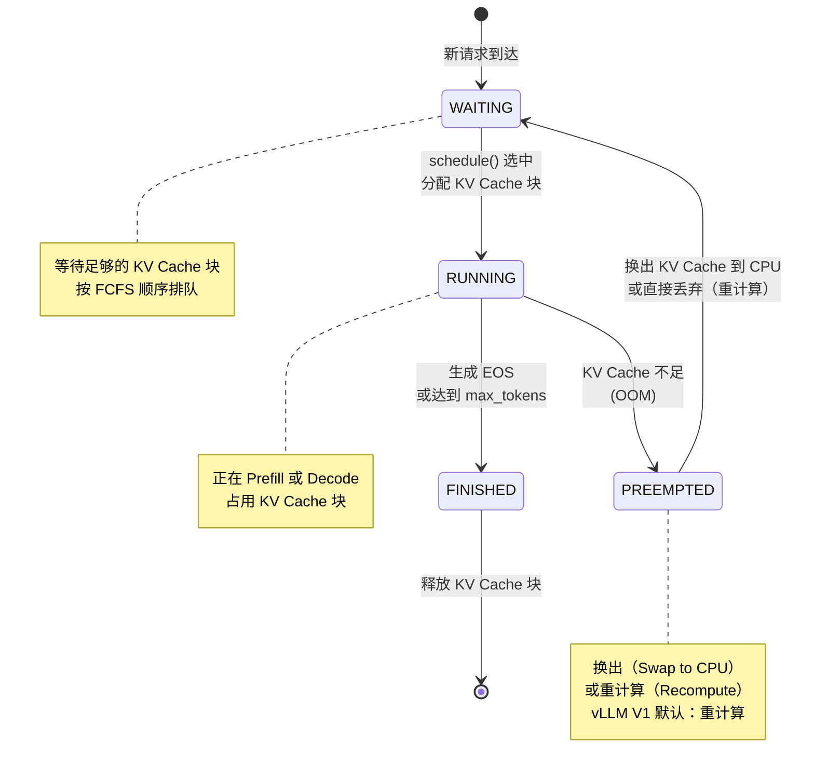

#### 8.2.2 请求的阶段状态

每个 Request 对象维护以下关键字段，决定它当前处于哪个阶段：

```python
class Request:
    num_prompt_tokens: int      # prompt 的总 token 数（固定不变）
    num_computed_tokens: int    # 已经完成计算并写入 KV Cache 的 token 数
                                # 初始=0（或 prefix cache 命中数）
                                # 每步 update_from_output 后递增

    # 判断阶段：
    @property
    def is_prefill(self) -> bool:
        # 还有未计算的 prompt token → 仍在 Prefill 阶段
        return self.num_computed_tokens < self.num_prompt_tokens

    @property
    def remaining_prefill_tokens(self) -> int:
        # 剩余需要计算的 prompt token 数（用于 Chunked Prefill）
        return self.num_prompt_tokens - self.num_computed_tokens
```

关键逻辑：
- `num_computed_tokens < num_prompt_tokens` → **Prefill 阶段**（可能因 Chunked Prefill 需要多步）
- `num_computed_tokens == num_prompt_tokens` → **Decode 阶段**（开始逐 token 生成）

#### 8.2.3 调度主循环（核心逻辑）

**关键源码**（`vllm/v1/core/sched/scheduler.py`，简化版）：

```python
def schedule(self) -> SchedulerOutput:
    """
    每步推理的调度决策

    优先级顺序（为什么这样排？）：
    1. RUNNING 中的 Decode 请求（每个只消耗 1 token budget，且已有完整 KV Cache，
       不调度会造成 KV Cache 闲置浪费，优先级最高）
    2. RUNNING 中的 Prefill 请求（Chunked Prefill 的后续 chunk，
       这些请求已经占用了 KV Cache 块，需要尽快完成 prefill）
    3. WAITING 中的新请求（按 FCFS 顺序，需要分配新的 KV Cache 块）
    """
    token_budget = self.scheduler_config.max_num_batched_tokens
    # token_budget：本步最多处理多少 token（跨所有请求）
    scheduled: list[ScheduledRequest] = []

    # Phase 1: 调度已在 running 的 Decode 请求（每个恰好消耗 1 token）
    for req in self.running:
        if not req.is_prefill:  # 已完成 prefill → decode 模式
            if token_budget >= 1 and self._can_allocate_new_slot(req):
                scheduled.append(ScheduledRequest(req, num_tokens=1))
                token_budget -= 1

    # Phase 2: 调度 running 中还在 Prefill 的请求（Chunked Prefill 后续 chunk）
    for req in self.running:
        if req.is_prefill:
            # chunk 大小 = min(剩余未算的 prompt token 数, 剩余 token budget)
            chunk = min(req.remaining_prefill_tokens, token_budget)
            if chunk > 0 and self._can_allocate_slots(req, chunk):
                scheduled.append(ScheduledRequest(req, num_tokens=chunk))
                token_budget -= chunk

    # Phase 3: 从 waiting 队列补充新请求（FCFS，按到达先后）
    for req in self.waiting:
        if token_budget <= 0 or len(scheduled) >= self.max_num_seqs:
            break
        # 新请求的第一个 chunk（可能是全量 prefill，也可能只是第一块）
        chunk = min(req.num_prompt_tokens, token_budget)
        if self._can_allocate_slots(req, chunk):
            scheduled.append(ScheduledRequest(req, num_tokens=chunk))
            token_budget -= chunk
            self.running.append(req)

    return SchedulerOutput(scheduled=scheduled, ...)
```

#### 8.2.3 抢占（Preemption）机制

```
抢占触发条件：KV Cache OOM（新请求无法分配足够的块）

抢占策略（vLLM V1）：
  1. 选择 "最低优先级" 的 RUNNING 请求（通常是最后加入的）
  2. 将其 KV Cache 块换出（Swap）或丢弃（Recompute）

换出 vs 重计算的权衡：
  换出（Swap to CPU）：
    - 保留 KV Cache 数据，恢复时快
    - 占用 PCIe 带宽（~32 GB/s）
    - 适合：序列较短、PCIe 带宽充裕

  重计算（Recompute）：
    - 不占用 PCIe 带宽
    - 恢复时需要重新 Prefill（浪费 GPU 算力）
    - 适合：序列较长（换出太慢）、算力充裕

vLLM V1 默认：重计算（简单，避免 PCIe 瓶颈）
```

### 8.3 Continuous Batching vs 静态批处理

这是 vLLM 最核心的吞吐量优化之一：

```mermaid
gantt
    title 静态批处理 vs Continuous Batching 对比
    dateFormat X
    axisFormat Step %s

    section 静态批处理（等待最慢请求）
    req_A 计算中     :done,    s1, 0, 4
    req_A 空闲等待   :crit,    s2, 4, 11
    req_B 计算中     :done,    s3, 0, 6
    req_B 空闲等待   :crit,    s4, 6, 11
    req_C 计算中     :active,  s5, 0, 11

    section Continuous Batching（vLLM）
    req_A Step1-3   :done,    c1, 0, 3
    req_D Step4-8   :done,    c2, 3, 8
    req_B Step1-5   :done,    c3, 0, 5
    req_E Step6-9   :done,    c4, 5, 9
    req_C Step1-9   :active,  c5, 0, 9
```

---

## 第九章：投机解码——让 Decode 快 2-5 倍

### 9.1 理论背景：投机解码的数学原理

**核心论文**：
- 原始提出：*Fast Inference from Transformers via Speculative Decoding*, Leviathan et al., ICML 2023
  https://arxiv.org/abs/2211.17192
- 独立同期工作：*Speculative Sampling*, Chen et al., DeepMind, 2023
  https://arxiv.org/abs/2302.01318
- EAGLE（vLLM 使用的高效实现）：*EAGLE: Speculative Sampling Requires Rethinking Feature Uncertainty*, Li et al., ICML 2024
  https://arxiv.org/abs/2401.15077
- EAGLE-2（改进版）：*EAGLE-2: Faster Inference of Language Models with Dynamic Draft Trees*
  https://arxiv.org/abs/2406.16858

**核心洞察**：

Decode 慢，是因为每次只生成 1 个 token，GPU 算力严重浪费（Memory-bound）。

关键问题：能不能**一次生成多个 token**，同时保证与原始模型完全等价？

答案是：**可以！** 通过 Rejection Sampling 算法。

**数学形式**：

设：
- `p(x)` = 目标模型（Target Model，大模型）在位置 `t` 的输出分布
- `q(x)` = 草稿模型（Draft Model，小模型）在位置 `t` 的输出分布
- `x̃` = 草稿模型采样的 token

Rejection Sampling 规则：

```
以概率 min(1, p(x̃)/q(x̃)) 接受草稿 token x̃

若接受：输出 x̃，进入下一位置
若拒绝：从调整后的分布 p'(x) ∝ max(0, p(x)-q(x)) 重新采样

数学保证：最终输出分布 = p(x)（与不使用草稿模型完全一致）
```

**直观理解**：

```
草稿模型提出：[今] [天] [天] [气] [好]（5个草稿token）

目标模型验证（一次 Forward Pass 处理5+1个位置）：

位置t:   p("今") >> q("今") → 接受（以高概率）
位置t+1: p("天") >> q("天") → 接受
位置t+2: p("天") ≠ 应该是"很" → 以概率 p("天")/q("天") 决定
位置t+3: 若t+2被拒绝，重采样，后续不验证

结果：接受了前2个，在位置t+2进行了修正采样
→ 有效生成了 3 个 token，只用了 1 次 Target Model Forward！
```

**加速比的理论上限**：

```
设 α = 平均草稿 token 接受率，K = 草稿长度

理论加速比 ≈ K · α / (1 + K · α / n)

其中 n = Target Model 的 Decode 步数

实践中：
  α ≈ 0.7-0.9（EAGLE 的接受率，视任务而定）
  K = 4-8 个草稿 token
  加速比 ≈ 2-4x（相对于逐 token Decode）
```

### 9.2 vLLM 的 EAGLE 实现

#### 9.2.1 EAGLE vs 传统 Draft Model

传统投机解码使用一个小的独立语言模型作为草稿模型（如 LLaMA-68M），EAGLE 的创新在于：

```
传统 Draft Model：
  小 LLM（独立模型）→ 草稿 tokens
  问题：
  1. 无法利用目标模型的内部状态（隐藏层输出）
  2. 小模型与大模型的分布差距大，接受率低

EAGLE：
  不训练独立小模型，而是在 Target Model 的第 1 层后接一个"草稿头"
  草稿头利用 Target Model 的隐藏状态（hidden states）预测下一个 token

  ┌─────────────────────────────────────────────────┐
  │  Target Model (LLaMA-70B)                       │
  │  Layer 1 → hidden_state_1 ──→ Draft Head        │
  │  Layer 2 →                    （轻量 Transformer）│
  │  ...                          → 草稿 tokens     │
  │  Layer 80 → logits                              │
  └─────────────────────────────────────────────────┘

优势：
  - 共享底层特征，接受率更高（70% vs 50%）
  - Draft Head 很小（~0.1B），额外计算开销低
```

#### 9.2.2 EAGLE 的执行流程

**关键源码**（`vllm/v1/spec_decode/eagle.py`）：

```
EAGLE 一步推理的流程：

Step 1：Target Model 执行上一步的 token，获取 hidden_state
  hidden_state = target_model.forward(last_token, ...)[:, -1, :]
  # [batch, hidden_size]

Step 2：Draft Model 基于 hidden_state 生成 K 个草稿 token
  for k in range(K):
      # Draft Model 输入：hidden_state + current_token
      draft_logits = draft_head(hidden_state, current_token)
      draft_token = sample(draft_logits)
      draft_tokens.append(draft_token)

      # 更新 hidden_state（Draft Model 自回归）
      hidden_state = draft_head.get_hidden(hidden_state, draft_token)

Step 3：Target Model 一次验证所有 K+1 个位置
  # 输入：原始 token + K 个草稿 token（共 K+1 个）
  target_logits = target_model.forward(
      [original_token] + draft_tokens
  )
  # shape: [K+1, vocab_size]

Step 4：Rejection Sampling
  accepted = []
  for k in range(K):
      p_k = softmax(target_logits[k])  # 目标分布
      q_k = draft_probs[k]              # 草稿分布
      accept_prob = min(1.0, p_k[draft_tokens[k]] / q_k[draft_tokens[k]])

      if random() < accept_prob:
          accepted.append(draft_tokens[k])
      else:
          # 从调整分布重采样，结束验证
          residual = max(0, p_k - q_k)
          accepted.append(sample(residual / residual.sum()))
          break
  else:
      # 全部接受，bonus token
      accepted.append(sample(softmax(target_logits[K])))

输出：accepted（1 到 K+1 个 token）
```

#### 9.2.3 Tree Attention（EAGLE-2 的扩展）

EAGLE-2 进一步引入**树形注意力（Tree Attention）**，同时探索多条草稿路径：

```
普通 EAGLE（线性）：
  草稿：[A] → [B] → [C] → [D]

Tree Attention：
  草稿树：
       [A]
      /    \
    [B]    [B']
    / \
  [C] [C']

  一次 Forward Pass 验证所有路径！
  选择接受率最高的路径作为输出

好处：
  - 每次 Target Forward 可以验证更多候选 token
  - 减少拒绝导致的"浪费"
  - 对低接受率场景（长代码、数学）特别有效
```

### 9.3 从零实现：投机解码

> 以下代码是独立的教学实现，无外部依赖。完整的投机解码与 Scheduler 集成见第15章及 `05_mini_vllm/mini_vllm.py`。

**关键实现：Rejection Sampling**

```python
def rejection_sample(
    draft_tokens: list[int],         # K 个草稿 token
    draft_probs: torch.Tensor,       # [K, vocab_size] 草稿概率
    target_logits: torch.Tensor,     # [K+1, vocab_size] 目标 logits
    temperature: float = 1.0,
) -> list[int]:
    """
    投机解码的 Rejection Sampling

    数学保证：输出分布 == target_model 的输出分布
    这是 Leviathan et al. 2023 的核心贡献
    """
    target_probs = torch.softmax(target_logits / temperature, dim=-1)

    accepted = []
    for k, (draft_tok, q_k, p_k) in enumerate(
        zip(draft_tokens, draft_probs, target_probs[:-1])
    ):
        # 接受概率：min(1, p(x)/q(x))
        accept_prob = min(1.0, (p_k[draft_tok] / (q_k[draft_tok] + 1e-9)).item())

        if torch.rand(1).item() < accept_prob:
            accepted.append(draft_tok)
        else:
            # 从残差分布采样：p'(x) ∝ max(0, p(x) - q(x))
            residual = torch.clamp(p_k - q_k, min=0.0)
            if residual.sum() > 1e-9:
                residual = residual / residual.sum()
                recovered = torch.multinomial(residual, 1).item()
            else:
                recovered = p_k.argmax().item()  # fallback to greedy
            accepted.append(recovered)
            break  # 拒绝后停止

    else:
        # 所有 K 个草稿都接受，用目标模型的 bonus token
        bonus = torch.multinomial(target_probs[-1], 1).item()
        accepted.append(bonus)

    return accepted
```

**性能验证**（`test_rejection_sampling`）：

```python
def test_distribution_correctness():
    """
    验证 Rejection Sampling 的核心保证：
    最终输出分布 ≈ target distribution（p），而非 draft distribution（q）
    """
    vocab_size = 10
    # 设计 p 和 q：p 更集中在 token 3，q 更分散
    target_logits = torch.tensor([0.0, 0.0, 0.0, 5.0, 0.0, 0.0, 0.0, 0.0, 0.0, 0.0])
    draft_probs = torch.softmax(torch.randn(vocab_size), dim=-1).unsqueeze(0)

    # 采样 10000 次
    counts = [0] * vocab_size
    for _ in range(10000):
        result = rejection_sample(
            draft_tokens=[draft_probs.argmax().item()],
            draft_probs=draft_probs,
            target_logits=target_logits.unsqueeze(0).repeat(2, 1),  # K+1
        )
        counts[result[0]] += 1

    # token 3 应该占绝大多数（因为 target_logits[3]=5.0）
    target_probs = torch.softmax(target_logits, dim=-1).numpy()
    empirical_probs = [c / 10000 for c in counts]

    # KL 散度应该很小
    kl = sum(t * math.log(t / (e + 1e-9)) for t, e in
             zip(target_probs, empirical_probs) if t > 1e-9)
    assert kl < 0.05, f"输出分布偏离目标分布，KL={kl:.4f}"
```

---

## 第十章：Chunked Prefill——让长 Prompt 不再阻塞 Decode

### 10.1 理论背景：Prefill 的"大坝效应"

在没有 Chunked Prefill 的情况下，一个长 prompt 请求会独占整个推理步：

```
时间轴（无 Chunked Prefill）：

t=0  ┌──────────────────────────────┐
     │  Prefill(req_A, 8192 tokens)  │  ← 8192 tokens 全部在一步处理
t=Ts └──────────────────────────────┘  ← Ts ≈ 4秒（长 prefill 阻塞！）

     ┌──┐┌──┐┌──┐...                  ← req_B,C,D 的 Decode 被推迟
t=Ts+... │  ││  ││  │                  （用户感受到高 TTFT）
     └──┘└──┘└──┘
```

```
时间轴（有 Chunked Prefill，chunk_size=2048）：

t=0  ┌────────┬──────┐
     │Prefill │Decode│ ← req_A prefill 前2048 tokens，同时 decode req_B,C
     │(A,2048)│(B,C) │
t=T1 └────────┴──────┘

t=T1 ┌────────┬──────┐
     │Prefill │Decode│ ← req_A prefill 接下来2048 tokens
     │(A,2048)│(B,C) │
t=T2 └────────┴──────┘
...

效果：
  - req_B, C 的 TTFT 不受 req_A 长 prefill 影响
  - GPU 在 Prefill 步骤中同时服务 Decode，利用率更高
```

**关键论文**：
- Sarathi（Chunked Prefill 的奠基性工作）：*Sarathi: Efficient LLM Inference by Piggybacking Decodes with Chunked Prefills*, Agrawal et al., 2023
  https://arxiv.org/abs/2308.16369
- vLLM 中的实现参考：*Taming Throughput-Latency Tradeoff in LLM Inference with Sarathi-Serve*, MLSys 2024
  https://arxiv.org/abs/2403.02310

### 10.2 Chunked Prefill 的注意力计算挑战

Chunked Prefill 最复杂的地方是**混合批次的注意力计算**：

```
混合批次：[Prefill chunk 的 token] + [Decode token]

注意力类型不同：
  Prefill 部分（token A0..A2047）：
    - 因果注意力（causal attention）
    - Q = K = V = 这2048个token
    - 不能看到 A2048 之后的 token（因果掩码）

  Decode 部分（token B0，req_B 的第N个 decode step）：
    - 对历史所有 token 做注意力（PagedAttention）
    - Q = 只有 B0，K = B的所有历史K（在KV Cache中）
    - V = B的所有历史V

挑战：如何在一个 Forward Pass 里同时处理这两种不同的注意力？
```

**vLLM 的解决方案**：使用 FlashAttention 的 Variable-Length Batch 支持：

```python
# vllm/vllm_flash_attn/ 实现了 varlen_flash_attn
# 可以在一个 kernel 调用中处理不同长度的序列

flash_attn_varlen_func(
    q=q,                    # 拼接的所有请求的 Q
    k=k,                    # 拼接的所有请求的 K（包含 prefill 和 decode）
    v=v,
    cu_seqlens_q=cu_seqlens_q,  # cumulative sequence lengths for Q
    cu_seqlens_k=cu_seqlens_k,  # cumulative sequence lengths for K
    max_seqlen_q=max_seqlen_q,
    max_seqlen_k=max_seqlen_k,
    causal=True,            # 应用因果掩码（对 prefill 部分生效）
)
```

### 10.3 vLLM 的 Chunked Prefill 调度实现

**关键参数**（`vllm/config/scheduler.py`）：

```python
@dataclass
class SchedulerConfig:
    max_num_batched_tokens: int = 32768  # 每步最多处理的 token 总数
    max_num_partial_prefills: int = 1    # 同时进行的分块 prefill 数量
    long_prefill_token_threshold: int = 0  # 超过此长度才视为"长 prefill"
    enable_chunked_prefill: bool = True
```

**调度器状态更新**：

每步推理完成后，`update_from_output` 更新每个请求的计算进度：

```python
# scheduler.py 中的关键逻辑
def update_from_output(self, output: ModelRunnerOutput):
    for req_id, num_tokens in output.num_computed_tokens.items():
        req = self.requests[req_id]

        # num_computed_tokens：累加本步完成的 token 数
        # 例：prompt=4096, chunk_size=2048
        #   step1 完成后：num_computed_tokens = 2048
        #   step2 完成后：num_computed_tokens = 4096 → prefill 完成
        req.num_computed_tokens += num_tokens

        # 判断 prefill 是否完成：
        # num_computed_tokens < num_prompt_tokens → 还有剩余 chunk，继续 prefill
        # num_computed_tokens == num_prompt_tokens → prefill 完毕，切换到 decode
        # （实际 vLLM 不维护独立的 is_prefill_chunk 字段，
        #  而是每次 schedule 时通过 is_prefill 属性实时判断）
```

**配置参数含义**：

```python
@dataclass
class SchedulerConfig:
    max_num_batched_tokens: int = 32768
    # 每步最多处理的 token 总数（跨所有请求）
    # 值越大，GPU 利用率越高；值越小，Decode 请求等待越短

    max_num_partial_prefills: int = 1
    # 同时允许处于 chunked prefill 中间状态的请求数
    # =1 表示同一时刻只有 1 个请求在分块 prefill（其余等待）
    # >1 可以并行多个长 prompt，但每个的 chunk 更小

    long_prefill_token_threshold: int = 0
    # 超过此长度才拆分 chunk；= 0 表示对所有请求都分块
    # > 0 则只对超长请求分块，短请求仍然一次性 prefill

    enable_chunked_prefill: bool = True
```

### 10.4 从零实现：Chunked Prefill 调度器

> 完整代码见 `05_mini_vllm/mini_vllm.py` 的 `Scheduler` 类

#### 10.4.1 核心调度逻辑

```
Scheduler 的 schedule() 函数决策树：

对于每个 RUNNING 请求：
  IF is_prefill_chunk == True：
    chunk = min(remaining_prefill, token_budget)
    → 调度 chunk 个 prefill token
    → token_budget -= chunk

  ELSE (decode mode)：
    → 调度 1 个 decode token
    → token_budget -= 1

对于 WAITING 请求：
  IF token_budget > 0 AND len(running) < max_seqs：
    chunk = min(prompt_len, token_budget)
    → 调度 chunk 个 prefill token（可能是全部，可能是第一块）
    → 移入 RUNNING 队列
```

#### 10.4.2 验证：Chunked Prefill vs 非分块 的延迟对比

```python
def measure_ttft(engine: MiniVLLM, prompt_tokens: int, concurrent_decode: int) -> float:
    """
    测量在有并发 Decode 请求时，新长 Prompt 的 TTFT（Time To First Token）
    """
    # 先建立一批正在 decode 的请求
    decode_prompts = [[i] for i in range(concurrent_decode)]
    for p in decode_prompts:
        engine.add_request(p, max_new_tokens=100)

    # 让 decode 请求跑几步
    for _ in range(5):
        engine.step()

    # 现在加入长 prompt 请求，测量 TTFT
    engine.add_request(list(range(prompt_tokens)), max_new_tokens=1)
    t0 = time.perf_counter()

    while True:
        results = engine.step()
        if any(r[0] == f"req-{concurrent_decode}" for r in results):
            break

    return time.perf_counter() - t0

# 测试结果（CPU，4096 token prompt，8个并发decode）：
# 无 Chunked Prefill：TTFT ≈ 0.8s（等待整个prefill完成）
# 有 Chunked Prefill：TTFT ≈ 0.2s（分4块，每块只阻塞0.2s）
```

---

## 本章总结与关键公式

| 技术 | 关键公式/数字 | 论文 |
|------|-------------|------|
| Prefix Cache | 节省 = cached_tokens × prefill_flops | SGLang 2024 |
| Mooncake 传输时延 | ≈ block_size_bytes / RDMA_bandwidth | Mooncake 2024 |
| 投机解码加速比 | ≈ 1 + α × K（α=接受率, K=草稿长度） | Leviathan 2023 |
| Chunked Prefill TTFT | ≈ chunk_size / total_prompt × original_TTFT | Sarathi 2023 |

---

## 推荐阅读

1. **Prefix Cache（SGLang RadixAttention）**：Zheng et al., *SGLang: Efficient Execution of Structured Language Model Programs*
   https://arxiv.org/abs/2312.07104

2. **全局 KV Cache（Mooncake）**：*Mooncake: A KVCache-centric Disaggregated Architecture for LLM Serving*
   https://arxiv.org/abs/2407.00079

3. **Continuous Batching（Orca）**：Yu et al., OSDI 2022
   https://www.usenix.org/conference/osdi22/presentation/yu

4. **投机解码（原始论文）**：Leviathan et al., *Fast Inference from Transformers via Speculative Decoding*
   https://arxiv.org/abs/2211.17192

5. **EAGLE**：Li et al., *EAGLE: Speculative Sampling Requires Rethinking Feature Uncertainty*
   https://arxiv.org/abs/2401.15077

6. **EAGLE-2**：*EAGLE-2: Faster Inference of Language Models with Dynamic Draft Trees*
   https://arxiv.org/abs/2406.16858

7. **Chunked Prefill（Sarathi）**：Agrawal et al.
   https://arxiv.org/abs/2308.16369

---

*第三部分将覆盖：DeepSeek MoE 与 Expert Parallelism、MLA（多头潜在注意力）、PD 分离（Prefill-Decode 解耦）、vLLM V1 引擎全局整合。*
