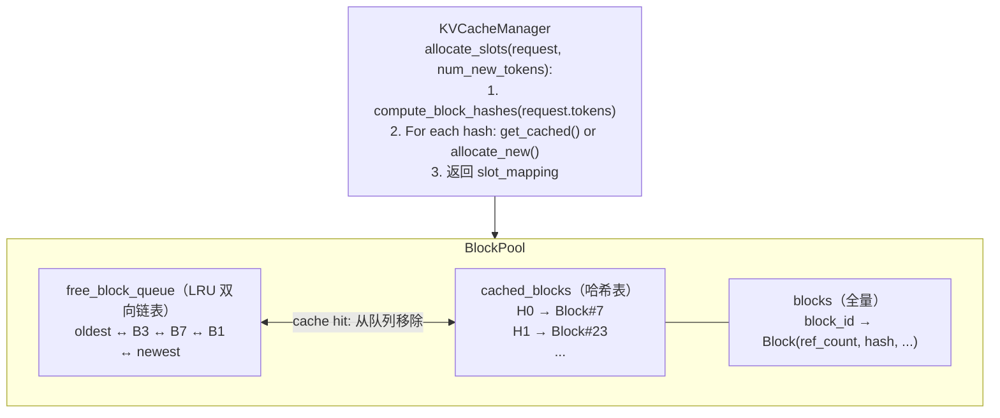
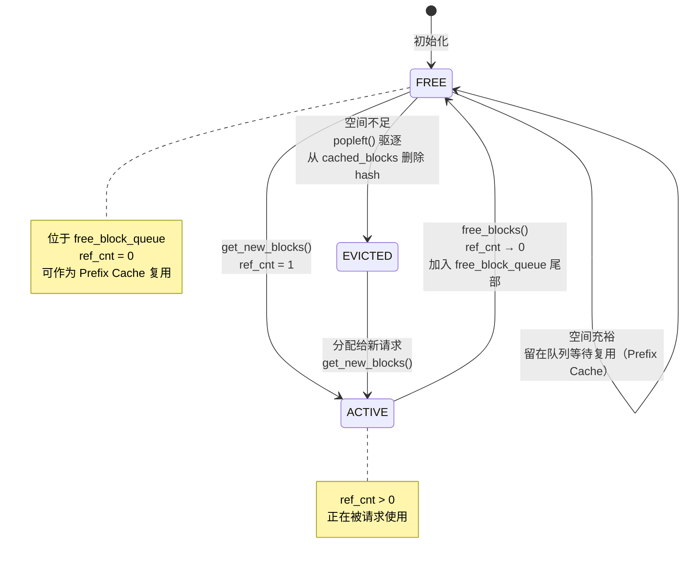
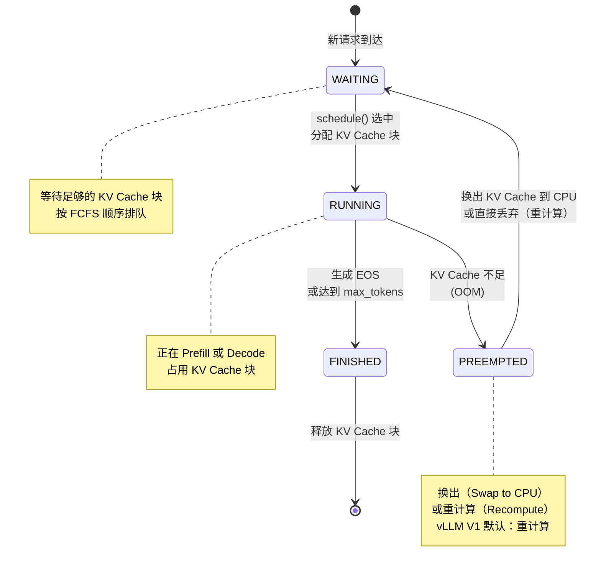

# vLLM 从入门到专家（2.0 版）第二部分

> **本部分内容**：Prefix Cache 单机实现（第六章）、Scheduler 调度算法（第八章）、投机解码 EAGLE（第九章）、Chunked Prefill（第十章）。全局 KV 池分布式方案详见《全局 Prefix Cache》专题。
>
> **阅读前提**：已读第一部分，理解 PagedAttention、KV Cache 块管理。

---

## 第六章：Prefix Cache——避免重复计算的核心优化

### 6.1 理论背景：重复前缀的普遍性

在生产环境中，绝大多数 LLM 请求共享相同的前缀：

| 场景 | 共享内容 | 典型长度 |
|------|---------|---------|
| 多轮对话 | 对话历史 | 500-8000 tokens |
| RAG 检索 | 检索到的文档 | 1000-4000 tokens |
| 代码补全 | 文件上下文 | 2000-16000 tokens |
| 系统提示词 | 固定系统指令 | 100-2000 tokens |

如果不做任何优化，每个请求都要对这些共享前缀做完整的 Prefill 计算，浪费极大。

**论文参考**：
- 前缀缓存的思想在 *RadixAttention*（SGLang，2024）中被系统化：
  Zheng et al., *SGLang: Efficient Execution of Structured Language Model Programs*, NeurIPS 2024
  https://arxiv.org/abs/2312.07104
- vLLM 的 Prefix Cache 实现参考此工作，并针对 PagedAttention 的块结构优化

### 6.2 Radix Tree：理解前缀共享的数据结构

实现前缀缓存，核心是一个**前缀树（Trie / Radix Tree）**数据结构。


vLLM 的实现没有用严格的 Radix Tree，而是用**块级哈希**近似实现同样的效果：

```
块哈希链：
  Block0: hash(seed=0,    tokens[0:16])    = H0
  Block1: hash(parent=H0, tokens[16:32])   = H1
  Block2: hash(parent=H1, tokens[32:48])   = H2

查询时：逐块计算哈希，在缓存中查找，遇到 miss 停止
效果：等价于 Radix Tree 的前缀匹配
```

### 6.3 vLLM 的单机 Prefix Cache 实现

#### 6.3.1 整体架构



**关键源码**（`vllm/v1/core/kv_cache_utils.py`）：

```python
def hash_block_tokens(
    parent_block_hash: int,
    curr_block_token_ids: tuple[int, ...],
    extra_keys: tuple | None = None,
) -> BlockHash:
    """
    计算 KV Cache 块的哈希值

    参数说明：
    - parent_block_hash：前一个块的哈希，形成链式依赖
    - curr_block_token_ids：本块的 token IDs（固定16个）
    - extra_keys：额外标识符（如 LoRA adapter ID，多模态嵌入哈希等）

    关键设计：链式依赖确保相同内容但不同前缀的块哈希不同
    """
    return BlockHash(hash((parent_block_hash, curr_block_token_ids, extra_keys)))
```

#### 6.3.2 缓存命中的完整流程

```
新请求到达：tokens = [SYS_0..SYS_31, Q_0..Q_15]（3个块）

Step 1: 计算块哈希
  H0 = hash(0,          (SYS_0..SYS_15)) = 0xABCD
  H1 = hash(0xABCD,     (SYS_16..SYS_31)) = 0x1234
  H2 = hash(0x1234,     (Q_0..Q_15))      = 0x5678

Step 2: 逐块查询 cached_blocks
  cached_blocks.get(0xABCD) → Block#7  ← HIT！ref_count: 1→2
  cached_blocks.get(0x1234) → Block#23 ← HIT！ref_count: 1→2
  cached_blocks.get(0x5678) → None     ← MISS，分配新块 Block#4

Step 3: 构建 block_table
  block_table = [7, 23, 4]
  num_cached_tokens = 2 * 16 = 32
  num_new_tokens = 16（只需计算 Q 部分）

Step 4: 调度器报告
  SchedulerOutput.num_scheduled_tokens[req_id] = 16（只计算未命中部分）
  → GPU 只做 16 token 的 Prefill，节省 32 token 的计算！
```

### 6.3.3 深入理解：四个关键问题

#### Q1：一个请求的生命周期中，block 什么时候被 free，什么时候开始驱逐？

Block 的生命周期分为四个阶段：



**完整时序示例**（block_size=16, 系统总共10个块）：

```
t=0: 系统启动，10个块全在 free_block_queue
     [B0, B1, B2, B3, B4, B5, B6, B7, B8, B9]（从左到右：最旧→最新）

t=1: 请求A到达（32 token 系统提示词 + 16 token 用户问题 = 3个块）
     get_new_blocks(3) → 弹出 B0, B1, B2
     B0.ref_cnt = B1.ref_cnt = B2.ref_cnt = 1
     free_block_queue: [B3, B4, B5, B6, B7, B8, B9]

t=2: A的Prefill完成，cache_full_blocks()把满块登记入缓存
     B0.block_hash = H0, B1.block_hash = H1（B2未满，不缓存）
     cached_blocks: { H0 → B0, H1 → B1 }

t=3: 请求B到达（相同系统提示词 + 不同用户问题）
     touch([B0, B1])  → B0.ref_cnt: 1→2, B1.ref_cnt: 1→2（命中！）
     get_new_blocks(1) → 弹出 B3 给B的用户问题
     B3.ref_cnt = 1

t=4: 请求A完成，free_blocks([B0, B1, B2])
     B0.ref_cnt: 2→1（还有B共享，不入队）
     B1.ref_cnt: 2→1（同上）
     B2.ref_cnt: 1→0 → 加入 free_block_queue 尾部
     free_block_queue: [B4, B5, B6, B7, B8, B9, B2]

t=5: 请求B完成，free_blocks([B0, B1, B3])
     B0.ref_cnt: 1→0 → 加入 free_block_queue 尾部（有 hash H0）
     B1.ref_cnt: 1→0 → 加入 free_block_queue 尾部（有 hash H1）
     B3.ref_cnt: 1→0 → 加入 free_block_queue 尾部（无 hash）
     free_block_queue: [B4, B5, B6, B7, B8, B9, B2, B0, B1, B3]
     cached_blocks: { H0 → B0, H1 → B1 }  ← 仍然有效！

t=6: 请求C到达（需要5个新块，但只有6个空闲：B4-B9,B2,B0,B1,B3）
     get_new_blocks(5)：弹出 B4, B5, B6, B7, B8
     B4-B8 均无 hash，直接分配
     驱逐触发（如 free_block_queue 已剩 B9,B2,B0,B1,B3 共5块）

t=7: 请求D需要更多块，触发驱逐
     popleft() → B9（最旧，无 hash） → 直接复用
     popleft() → B2（次旧，无 hash） → 直接复用
     popleft() → B0（有 hash H0）：
         _maybe_evict_cached_block(B0) → 删除 cached_blocks[H0]
         B0 现在可以被新请求使用（H0 的 KV 数据被覆盖）
```

**关键结论**：
- `ref_cnt > 0`：块正被请求使用，**不能**被驱逐
- `ref_cnt == 0`：块在 LRU 队列中，**等待**复用，暂时保留（Prefix Cache）
- 驱逐**不是主动**触发的：当 `get_new_blocks()` 被调用且队列中有旧块时，旧块被弹出覆盖

**Decode 阶段的 block 也会被缓存**：上面 t=2 的示例仅展示 Prefill 阶段。但如果 decode 步骤持续生成 token，一旦某个 block 积累满 `block_size` 个 token，`cache_blocks()` 同样会被触发，该 block 同样会被哈希并写入 `cached_blocks`。

```python
# single_type_kv_cache_manager.py — allocate_slots 每步（包括 decode）都调用 cache_blocks()
def cache_blocks(self, request: Request, num_tokens: int) -> None:
    num_cached_blocks = self.num_cached_block.get(request.request_id, 0)
    num_full_blocks = num_tokens // self.block_size  # 只缓存完整的块
    if num_cached_blocks >= num_full_blocks:
        return  # 没有新的满块，跳过
    self.block_pool.cache_full_blocks(...)
    self.num_cached_block[request.request_id] = num_full_blocks
```

因此，无论是 Prefill 还是 Decode，**凡是填满完整 block 的 token，都会被哈希缓存**，供后续请求的 Prefix Cache 复用（例如超长 system prompt 跨越 decode 阶段时）。

#### Q2：链式哈希会出现前面的 block 被驱逐而后面没有的情况吗？

**不会**——vLLM 的 `free()` 实现使用了**反转释放顺序**，在设计上避免了这种情况。

**关键代码**（`single_type_kv_cache_manager.py`）：

```python
def free(self, request_id: str) -> None:
    req_blocks = self.req_to_blocks.pop(request_id, [])
    # 反转顺序：先释放尾部 block，再释放头部 block
    ordered_blocks = reversed(req_blocks)   # ← 关键！
    self.block_pool.free_blocks(ordered_blocks)
```

注释原文："Free blocks in reverse order so that the **tail blocks are freed first**."

**为什么反转顺序就能防止孤儿块？**

设请求拥有块链 `[H0, H1, H2]`（H0=系统提示词，H2=最后一块）：

```
释放顺序（reversed）：[H2, H1, H0]
append_n([H2, H1, H0]) 依次追加到 free_block_queue 尾部

free_block_queue（HEAD 驱逐 → TAIL 最新）：
  ... → H2 → H1 → H0 → TAIL
            ↑最旧      ↑最新（最后驱逐）
```

- H2（链尾）离 HEAD 最近 → **最先被驱逐**
- H0（链头/系统提示词）离 TAIL 最近 → **最后被驱逐**

驱逐顺序与哈希链方向**完全相反**：总是先驱逐"叶子"，再驱逐"根"。

**再加上 touch 操作的加持**：

每次新请求命中 H0（缓存命中），`touch(H0)` 将 H0 从队列中移除（`ref_cnt++`）。请求结束后 H0 再被追加到 TAIL（最新位置）。因此 H0 的 LRU 位置会随命中而持续刷新，始终保持最新。

**结论**：在 vLLM 的实现中，"孤儿块"（前驱被驱逐、后继仍在缓存）**在设计上不会发生**。驱逐顺序是完全确定的，不存在随机性：同一链中，后面的 block 总比前面的 block 更早被驱逐。

> **注**：`02_kvcache/block_pool_lru.py`（本教程的简化实现）为了教学清晰，没有使用反转释放顺序，因此在简化版中理论上可能出现孤儿块。但真实 vLLM 代码明确规避了这一问题。

#### Q3：为什么必须从头匹配前缀，不能从后往前找第一个命中？

这是**物理约束**，不只是算法选择：

```
场景：tokens = [SYS_0..SYS_15 | SYS_16..SYS_31 | Q_0..Q_15]
     缓存状态：H0 被驱逐（B0 已被覆盖），H1 和 H2 还在缓存

如果我们"跳过 H0 miss，直接使用 H1"：

  GPU 的 KV Cache：
    Block H1（B7）：包含 positions 16-31 的 K/V 向量
    Block H2（B12）：包含 positions 32-47 的 K/V 向量

  现在处理 position 32（Q_0）的 attention：
    需要 attend 到 positions 0..31 的 K/V
    positions 16-31 → B7 可用 ✓
    positions 0-15  → ??? KV 不在 GPU 内存中！

    → attention 结果错误（未 attend 到所有历史 token）
    → 或者 GPU 访问非法内存地址，直接崩溃
```

更深层原因：**KV 的语义是注意力上下文，而非孤立的向量**

```python
# attention 计算时 GPU 需要访问连续的 KV 块
for pos in range(0, seq_len):
    attn_score = Q[pos] @ K[0:pos]   # 必须有 0..pos-1 的全部 K
    output[pos] = softmax(attn_score) @ V[0:pos]  # 必须有 0..pos-1 的全部 V

# 如果 K[0:16] 不在 GPU 内存中，这段代码的结果是错的！
# block table 必须提供 0..seq_len-1 的连续物理块地址
```

**链式哈希确保的是 token 身份（内容正确性）**，而不是 GPU 内存可用性。即使 H1 block 在哈希表中存在（意味着它保存的确实是 SYS_16..SYS_31 的 KV），但如果 H0 block 不在 GPU 内存中，attention 运算就无法正确执行。

因此：

```python
# 正确的匹配逻辑（vLLM 的做法）
matched = []
for h in block_hashes:
    if h in cached_blocks:
        matched.append(cached_blocks[h])
    else:
        break  # 必须停在第一个 miss！后面的 block 即使命中也无法使用

# 错误的逻辑（假设的"从后往前"，结果是错的）
for h in reversed(block_hashes):    # ← 永远不能这样做！
    if h in cached_blocks:
        return cached_blocks[h]     # 孤立使用后续 block，attention 结果错误
```

#### Q4：KV Cache 在 TP/PP 并行时如何存储？对 Mooncake 有什么影响？

**Tensor Parallelism（TP）的影响**：

```
TP=4 的 LLaMA-70B（128个 attention head）：

  GPU_0：负责 head 0-31 的 Q/K/V 计算
  GPU_1：负责 head 32-63 的 Q/K/V 计算
  GPU_2：负责 head 64-95 的 Q/K/V 计算
  GPU_3：负责 head 96-127 的 Q/K/V 计算

每个 GPU 的 KV Cache 块布局：
  kv_cache[block_id, :, head_start:head_end, :] = 该GPU负责的头的 KV

同一个逻辑 block_id 在4个 GPU 上各有一片物理内存：
  Block #7 on GPU_0: positions 0-15, heads 0-31
  Block #7 on GPU_1: positions 0-15, heads 32-63
  Block #7 on GPU_2: positions 0-15, heads 64-95
  Block #7 on GPU_3: positions 0-15, heads 96-127

Block table 是全局共享的（所有 GPU 上相同的 block_id）
实际 KV 数据分布在 4 张 GPU 上
```

**TP 对 Mooncake 全局池化的约束**：

```
P 节点（TP=4）→ D 节点（TP=4）：
  P.GPU_0 → 通过 RDMA WRITE → D.GPU_0（head 0-31）
  P.GPU_1 → 通过 RDMA WRITE → D.GPU_1（head 32-63）
  P.GPU_2 → 通过 RDMA WRITE → D.GPU_2（head 64-95）
  P.GPU_3 → 通过 RDMA WRITE → D.GPU_3（head 96-127）
  共 4 个并行 RDMA 传输
```

**TP 支持现状**（以 Mooncake Connector 为例）：

| 场景 | 上游 vLLM | vllm-ascend |
|------|----------|-------------|
| P.TP == D.TP | ✅ 支持 | ✅ 支持 |
| P.TP > D.TP，且 P.TP % D.TP == 0 | ❌ NotImplementedError | ✅ 支持 |
| P.TP < D.TP 或不整除 | ❌ | ❌ |
| PP（Pipeline Parallelism）| ❌ ValueError | ❌ |

上游 vLLM 源码（`mooncake_connector.py`）：
```python
def resolve_need_send(self, send_meta, remote_tp_ranks):
    send_meta.need_send = len(remote_tp_ranks)
    if send_meta.need_send != 1:
        logger.error("Mooncake: Heterogeneous TP is not supported yet.")
        raise NotImplementedError(
            "Mooncake: Heterogeneous TP is not supported yet."
        )
```

vllm-ascend 的 DeepSeek-V3.1 PD 分离部署示例中，P 节点使用 tp=8，D 节点使用 tp=1（整除关系），均属支持范围。

PP 不支持的原因：PP 将不同 Transformer 层分到不同 GPU，KV Cache 按层分布，跨 PP 节点的元数据管理和 RDMA 地址计算更复杂，目前两个版本均未实现。

---

### 6.4 从零手搓：带 LRU 的 Prefix Cache

> 完整代码：`02_kvcache/block_pool_lru.py`

从最简单的 BlockPool 出发，逐步增加 Prefix Cache 和 LRU，理解每一步的设计动机。

#### 6.4.1 第一步：最简 BlockPool（只有分配/释放）

最基础的 KV Cache 管理：一个空闲块池，每次请求从中取块，结束后归还。

```python
class BlockPool_v1:
    """最简版：只有分配和释放，无 Prefix Cache"""

    def __init__(self, num_blocks: int):
        self.blocks = [Block(i) for i in range(num_blocks)]
        # 空闲栈（简单实现，LIFO）
        self.free_blocks = list(range(num_blocks))

    def allocate(self, n: int) -> list[int]:
        """分配 n 个块，返回 block_id 列表"""
        if len(self.free_blocks) < n:
            raise RuntimeError("OOM: 显存不足")
        ids = []
        for _ in range(n):
            ids.append(self.free_blocks.pop())  # 从栈顶取
        return ids

    def free(self, block_ids: list[int]):
        """归还块（简单归还，内容丢弃）"""
        self.free_blocks.extend(block_ids)
```

**问题**：每个请求结束后，prefill 计算的 KV 全部丢弃。下一个相同 prompt 的请求要重新计算。

#### 6.4.2 第二步：加入哈希表（Prefix Cache）

增加一个 `hash → block_id` 映射，让 prefill 完的块不立刻丢弃，等待后续请求复用。

```python
class BlockPool_v2:
    """加入 Prefix Cache 哈希表（无 LRU，块只会增加不会释放）"""

    def __init__(self, num_blocks: int):
        self.blocks = [Block(i) for i in range(num_blocks)]
        self.free_blocks = list(range(num_blocks))

        # 新增：hash → Block（Prefix Cache 核心）
        self.cached_blocks: dict[str, Block] = {}

    def get_cached(self, block_hash: str) -> Block | None:
        """查询 Prefix Cache"""
        return self.cached_blocks.get(block_hash)

    def allocate(self, n: int) -> list[int]:
        if len(self.free_blocks) < n:
            raise RuntimeError("OOM: 所有块都被占用，无法驱逐")
        return [self.free_blocks.pop() for _ in range(n)]

    def mark_cached(self, block_id: int, block_hash: str):
        """一个块的 Prefill 完成后，登记到缓存"""
        block = self.blocks[block_id]
        block.block_hash = block_hash
        self.cached_blocks[block_hash] = block

    def free(self, block_ids: list[int]):
        """释放块（ref_cnt 减到 0 才真正归还，否则只减计数）"""
        for bid in block_ids:
            block = self.blocks[bid]
            block.ref_cnt -= 1
            if block.ref_cnt == 0 and block.block_hash is None:
                # 无缓存 hash → 可以直接归还
                self.free_blocks.append(bid)
            # 有 hash 的块：不归还，留在缓存中等待复用
```

**问题**：GPU 显存有限，缓存的块永远不会被清理，最终 OOM。需要驱逐策略。

#### 6.4.3 第三步：加入 LRU（驱逐策略）

用双向链表实现 O(1) LRU：最近被归还的块在尾部（不驱逐），最久未用的在头部（优先驱逐）。

```python
class BlockPool_v3:
    """完整实现：Prefix Cache + LRU 驱逐"""

    def __init__(self, num_blocks: int):
        self.blocks = [Block(i) for i in range(num_blocks)]

        # ★ 关键数据结构：LRU 双向链表（所有 ref_cnt==0 的块都在此）
        # 布局：head(哨兵) ↔ 最旧 ↔ ... ↔ 最新 ↔ tail(哨兵)
        self.free_block_queue = FreeBlockQueue(self.blocks)

        # Prefix Cache：hash → Block
        self.cached_blocks: dict[str, Block] = {}

    def get_num_free_blocks(self) -> int:
        return self.free_block_queue.num_free_blocks

    # ── 1. 查询缓存（O(1)）──────────────────────────────────────
    def get_cached_block(self, block_hash: str) -> Block | None:
        return self.cached_blocks.get(block_hash)

    # ── 2. Touch：命中的缓存块，增加引用计数 ─────────────────────
    def touch(self, blocks: list[Block]):
        """
        Prefix Cache 命中时调用
        ref_cnt==0 的块需要从 free_block_queue 中摘除（不再可驱逐）
        """
        for block in blocks:
            if block.ref_cnt == 0:
                # 从 LRU 队列中间移除（O(1) 双向链表）
                self.free_block_queue.remove(block)
            block.ref_cnt += 1

    # ── 3. 分配新块（可能触发驱逐）─────────────────────────────
    def get_new_blocks(self, num_blocks: int) -> list[Block]:
        """
        从 free_block_queue 取块（隐式 LRU 驱逐）

        popleft() 弹出最旧的块：
        - 如果有 block_hash → 同时从 cached_blocks 删除（驱逐！）
        - 然后赋给新请求（ref_cnt 从 0 → 1）
        """
        if num_blocks > self.get_num_free_blocks():
            raise RuntimeError("OOM")

        result = []
        for _ in range(num_blocks):
            block = self.free_block_queue.popleft()   # 取最旧的块

            # 如果该块有缓存 hash → 驱逐（从 Prefix Cache 删除）
            if block.block_hash is not None:
                del self.cached_blocks[block.block_hash]
                block.block_hash = None

            block.ref_cnt = 1                          # 分配给新请求
            result.append(block)

        return result

    # ── 4. 释放块（请求结束）────────────────────────────────────
    def free_blocks(self, blocks: list[Block]):
        """
        ref_cnt-- 后：
        - 降到 0 → 加入 free_block_queue 尾部（LRU 最新）
        - 若有 hash，保留在 cached_blocks 中（待复用）
        """
        for block in blocks:
            block.ref_cnt -= 1
            if block.ref_cnt == 0:
                # 加到 LRU 队尾（最新→最不可能被驱逐）
                self.free_block_queue.append(block)
                # block.block_hash 不清除 → 保留在 cached_blocks

    # ── 5. 登记缓存（满块 Prefill 完成后）────────────────────────
    def cache_full_blocks(self, blocks: list[Block], block_hashes: list[str],
                          num_already_cached: int, num_full: int):
        """
        已计算完的满块，登记到 Prefix Cache

        只登记 num_already_cached..num_full-1 范围内的新块：
        - 0..num_already_cached-1：已缓存（Prefix Cache 命中）
        - num_full..（最后一个未满块）：不缓存（未写满，下次可能覆盖）
        """
        for i in range(num_already_cached, num_full):
            block = blocks[i]
            if block.block_hash is None:   # 尚未缓存
                block.block_hash = block_hashes[i]
                self.cached_blocks[block_hashes[i]] = block
```

#### 6.4.4 完整请求处理流程（整合所有步骤）

```python
def allocate_slots(
    pool: BlockPool_v3,
    token_ids: list[int],
    block_size: int = 16,
) -> tuple[list[Block], int]:
    """
    为一个新请求分配 KV Cache 块（含 Prefix Cache 命中逻辑）

    返回：(block_table, num_cached_tokens)
    """
    # Step 1: 计算块哈希链
    block_hashes = compute_block_hashes(token_ids, block_size)
    num_full_blocks = len(token_ids) // block_size
    block_table = []

    # Step 2: 逐块查询 Prefix Cache（遇到 MISS 停止）
    num_cached = 0
    cached_blocks = []
    for i, h in enumerate(block_hashes[:num_full_blocks]):
        block = pool.get_cached_block(h)
        if block is None:
            break  # 链断开，停止匹配
        cached_blocks.append(block)
        num_cached += 1

    # Step 3: Touch 命中的缓存块（ref_cnt++，从 LRU 摘除）
    pool.touch(cached_blocks)
    block_table.extend(cached_blocks)
    num_cached_tokens = num_cached * block_size

    # Step 4: 分配剩余新块
    num_new_blocks = (len(token_ids) - num_cached_tokens + block_size - 1) // block_size
    new_blocks = pool.get_new_blocks(num_new_blocks)
    block_table.extend(new_blocks)

    return block_table, num_cached_tokens


def on_request_finished(
    pool: BlockPool_v3,
    blocks: list[Block],
    block_hashes: list[str],
    num_full_blocks: int,
    num_already_cached: int,
):
    """请求完成后，登记新计算的块到 Prefix Cache，然后释放"""
    # 登记满块到缓存
    pool.cache_full_blocks(blocks, block_hashes, num_already_cached, num_full_blocks)

    # 释放所有块（ref_cnt--，降到 0 的加入 LRU）
    pool.free_blocks(blocks)
```

**测试运行**（`02_kvcache/block_pool_lru.py`）：

```bash
docker exec vllm python3 -m pytest /mnt/esfs/master_work/vllm-from-scratch/02_kvcache/ -v
```

12 个测试覆盖：分配/释放、Prefix Cache 命中、LRU 驱逐顺序、孤儿块处理、并发请求共享块。

---

## 第八章：Scheduler——高效批调度的艺术

### 8.1 理论背景：调度算法的权衡

LLM 推理调度本质上是一个**在线装箱问题（Online Bin Packing）**的变体，约束条件是：

- **token budget**：每步最多处理 `max_num_batched_tokens` 个 token
- **并发上限**：同时处理 `max_num_seqs` 个请求
- **KV Cache 容量**：总物理块数有限

这个问题的最优解是 NP-hard 的，vLLM 使用了一系列启发式策略。

**经典论文**：
- Continuous Batching：*Orca: A Distributed Serving System for Transformer-Based Generative Models*, OSDI 2022
  https://www.usenix.org/conference/osdi22/presentation/yu
- LLM 调度综述：*Efficiently Scaling Transformer Inference*, MLSys 2023
  https://arxiv.org/abs/2211.05100

### 8.2 vLLM Scheduler 的设计

#### 8.2.1 请求的三种队列



#### 8.2.2 请求的阶段状态

每个 Request 对象维护以下关键字段，决定它当前处于哪个阶段：

```python
class Request:
    num_prompt_tokens: int      # prompt 的总 token 数（固定不变）
    num_computed_tokens: int    # 已经完成计算并写入 KV Cache 的 token 数
                                # 初始=0（或 prefix cache 命中数）
                                # 每步 update_from_output 后递增

    # 判断阶段：
    @property
    def is_prefill(self) -> bool:
        # 还有未计算的 prompt token → 仍在 Prefill 阶段
        return self.num_computed_tokens < self.num_prompt_tokens

    @property
    def remaining_prefill_tokens(self) -> int:
        # 剩余需要计算的 prompt token 数（用于 Chunked Prefill）
        return self.num_prompt_tokens - self.num_computed_tokens
```

关键逻辑：
- `num_computed_tokens < num_prompt_tokens` → **Prefill 阶段**（可能因 Chunked Prefill 需要多步）
- `num_computed_tokens == num_prompt_tokens` → **Decode 阶段**（开始逐 token 生成）

#### 8.2.3 调度主循环（核心逻辑）

**关键源码**（`vllm/v1/core/sched/scheduler.py`，简化版）：

```python
def schedule(self) -> SchedulerOutput:
    """
    每步推理的调度决策

    优先级顺序（为什么这样排？）：
    1. RUNNING 中的 Decode 请求（每个只消耗 1 token budget，且已有完整 KV Cache，
       不调度会造成 KV Cache 闲置浪费，优先级最高）
    2. RUNNING 中的 Prefill 请求（Chunked Prefill 的后续 chunk，
       这些请求已经占用了 KV Cache 块，需要尽快完成 prefill）
    3. WAITING 中的新请求（按 FCFS 顺序，需要分配新的 KV Cache 块）
    """
    token_budget = self.scheduler_config.max_num_batched_tokens
    # token_budget：本步最多处理多少 token（跨所有请求）
    scheduled: list[ScheduledRequest] = []

    # Phase 1: 调度已在 running 的 Decode 请求（每个恰好消耗 1 token）
    for req in self.running:
        if not req.is_prefill:  # 已完成 prefill → decode 模式
            if token_budget >= 1 and self._can_allocate_new_slot(req):
                scheduled.append(ScheduledRequest(req, num_tokens=1))
                token_budget -= 1

    # Phase 2: 调度 running 中还在 Prefill 的请求（Chunked Prefill 后续 chunk）
    for req in self.running:
        if req.is_prefill:
            # chunk 大小 = min(剩余未算的 prompt token 数, 剩余 token budget)
            chunk = min(req.remaining_prefill_tokens, token_budget)
            if chunk > 0 and self._can_allocate_slots(req, chunk):
                scheduled.append(ScheduledRequest(req, num_tokens=chunk))
                token_budget -= chunk

    # Phase 3: 从 waiting 队列补充新请求（FCFS，按到达先后）
    for req in self.waiting:
        if token_budget <= 0 or len(scheduled) >= self.max_num_seqs:
            break
        # 新请求的第一个 chunk（可能是全量 prefill，也可能只是第一块）
        chunk = min(req.num_prompt_tokens, token_budget)
        if self._can_allocate_slots(req, chunk):
            scheduled.append(ScheduledRequest(req, num_tokens=chunk))
            token_budget -= chunk
            self.running.append(req)

    return SchedulerOutput(scheduled=scheduled, ...)
```

#### 8.2.3 抢占（Preemption）机制

```
抢占触发条件：KV Cache OOM（新请求无法分配足够的块）

抢占策略（vLLM V1）：
  1. 选择 "最低优先级" 的 RUNNING 请求（通常是最后加入的）
  2. 将其 KV Cache 块换出（Swap）或丢弃（Recompute）

换出 vs 重计算的权衡：
  换出（Swap to CPU）：
    - 保留 KV Cache 数据，恢复时快
    - 占用 PCIe 带宽（~32 GB/s）
    - 适合：序列较短、PCIe 带宽充裕

  重计算（Recompute）：
    - 不占用 PCIe 带宽
    - 恢复时需要重新 Prefill（浪费 GPU 算力）
    - 适合：序列较长（换出太慢）、算力充裕

vLLM V1 默认：重计算（简单，避免 PCIe 瓶颈）
```

### 8.3 Continuous Batching vs 静态批处理

这是 vLLM 最核心的吞吐量优化之一：

```mermaid
gantt
    title 静态批处理 vs Continuous Batching 对比
    dateFormat X
    axisFormat Step %s

    section 静态批处理（等待最慢请求）
    req_A 计算中     :done,    s1, 0, 4
    req_A 空闲等待   :crit,    s2, 4, 11
    req_B 计算中     :done,    s3, 0, 6
    req_B 空闲等待   :crit,    s4, 6, 11
    req_C 计算中     :active,  s5, 0, 11

    section Continuous Batching（vLLM）
    req_A Step1-3   :done,    c1, 0, 3
    req_D Step4-8   :done,    c2, 3, 8
    req_B Step1-5   :done,    c3, 0, 5
    req_E Step6-9   :done,    c4, 5, 9
    req_C Step1-9   :active,  c5, 0, 9
```



---

## 第九章：投机解码——让 Decode 快 2-5 倍

### 9.1 理论背景：投机解码的数学原理

**核心论文**：
- 原始提出：*Fast Inference from Transformers via Speculative Decoding*, Leviathan et al., ICML 2023
  https://arxiv.org/abs/2211.17192
- 独立同期工作：*Speculative Sampling*, Chen et al., DeepMind, 2023
  https://arxiv.org/abs/2302.01318
- EAGLE（vLLM 使用的高效实现）：*EAGLE: Speculative Sampling Requires Rethinking Feature Uncertainty*, Li et al., ICML 2024
  https://arxiv.org/abs/2401.15077
- EAGLE-2（改进版）：*EAGLE-2: Faster Inference of Language Models with Dynamic Draft Trees*
  https://arxiv.org/abs/2406.16858

**核心洞察**：

Decode 慢，是因为每次只生成 1 个 token，GPU 算力严重浪费（Memory-bound）。

关键问题：能不能**一次生成多个 token**，同时保证与原始模型完全等价？

答案是：**可以！** 通过 Rejection Sampling 算法。

**数学形式**：

设：
- `p(x)` = 目标模型（Target Model，大模型）在位置 `t` 的输出分布
- `q(x)` = 草稿模型（Draft Model，小模型）在位置 `t` 的输出分布
- `x̃` = 草稿模型采样的 token

Rejection Sampling 规则：

```
以概率 min(1, p(x̃)/q(x̃)) 接受草稿 token x̃

若接受：输出 x̃，进入下一位置
若拒绝：从调整后的分布 p'(x) ∝ max(0, p(x)-q(x)) 重新采样

数学保证：最终输出分布 = p(x)（与不使用草稿模型完全一致）
```

**直观理解**：

```
草稿模型提出：[今] [天] [天] [气] [好]（5个草稿token）

目标模型验证（一次 Forward Pass 处理5+1个位置）：

位置t:   p("今") >> q("今") → 接受（以高概率）
位置t+1: p("天") >> q("天") → 接受
位置t+2: p("天") ≠ 应该是"很" → 以概率 p("天")/q("天") 决定
位置t+3: 若t+2被拒绝，重采样，后续不验证

结果：接受了前2个，在位置t+2进行了修正采样
→ 有效生成了 3 个 token，只用了 1 次 Target Model Forward！
```

**加速比的理论上限**：

```
设 α = 平均草稿 token 接受率，K = 草稿长度

理论加速比 ≈ K · α / (1 + K · α / n)

其中 n = Target Model 的 Decode 步数

实践中：
  α ≈ 0.7-0.9（EAGLE 的接受率，视任务而定）
  K = 4-8 个草稿 token
  加速比 ≈ 2-4x（相对于逐 token Decode）
```

### 9.2 vLLM 的 EAGLE 实现

#### 9.2.1 EAGLE vs 传统 Draft Model

传统投机解码使用一个小的独立语言模型作为草稿模型（如 LLaMA-68M），EAGLE 的创新在于：

```
传统 Draft Model：
  小 LLM（独立模型）→ 草稿 tokens
  问题：
  1. 无法利用目标模型的内部状态（隐藏层输出）
  2. 小模型与大模型的分布差距大，接受率低

EAGLE：
  不训练独立小模型，而是在 Target Model 的第 1 层后接一个"草稿头"
  草稿头利用 Target Model 的隐藏状态（hidden states）预测下一个 token

  ┌─────────────────────────────────────────────────┐
  │  Target Model (LLaMA-70B)                       │
  │  Layer 1 → hidden_state_1 ──→ Draft Head        │
  │  Layer 2 →                    （轻量 Transformer）│
  │  ...                          → 草稿 tokens     │
  │  Layer 80 → logits                              │
  └─────────────────────────────────────────────────┘

优势：
  - 共享底层特征，接受率更高（70% vs 50%）
  - Draft Head 很小（~0.1B），额外计算开销低
```

#### 9.2.2 EAGLE 的执行流程

**关键源码**（`vllm/v1/spec_decode/eagle.py`）：

```
EAGLE 一步推理的流程：

Step 1：Target Model 执行上一步的 token，获取 hidden_state
  hidden_state = target_model.forward(last_token, ...)[:, -1, :]
  # [batch, hidden_size]

Step 2：Draft Model 基于 hidden_state 生成 K 个草稿 token
  for k in range(K):
      # Draft Model 输入：hidden_state + current_token
      draft_logits = draft_head(hidden_state, current_token)
      draft_token = sample(draft_logits)
      draft_tokens.append(draft_token)

      # 更新 hidden_state（Draft Model 自回归）
      hidden_state = draft_head.get_hidden(hidden_state, draft_token)

Step 3：Target Model 一次验证所有 K+1 个位置
  # 输入：原始 token + K 个草稿 token（共 K+1 个）
  target_logits = target_model.forward(
      [original_token] + draft_tokens
  )
  # shape: [K+1, vocab_size]

Step 4：Rejection Sampling
  accepted = []
  for k in range(K):
      p_k = softmax(target_logits[k])  # 目标分布
      q_k = draft_probs[k]              # 草稿分布
      accept_prob = min(1.0, p_k[draft_tokens[k]] / q_k[draft_tokens[k]])

      if random() < accept_prob:
          accepted.append(draft_tokens[k])
      else:
          # 从调整分布重采样，结束验证
          residual = max(0, p_k - q_k)
          accepted.append(sample(residual / residual.sum()))
          break
  else:
      # 全部接受，bonus token
      accepted.append(sample(softmax(target_logits[K])))

输出：accepted（1 到 K+1 个 token）
```

#### 9.2.3 Tree Attention（EAGLE-2 的扩展）

EAGLE-2 进一步引入**树形注意力（Tree Attention）**，同时探索多条草稿路径：

```
普通 EAGLE（线性）：
  草稿：[A] → [B] → [C] → [D]

Tree Attention：
  草稿树：
       [A]
      /    \
    [B]    [B']
    / \
  [C] [C']

  一次 Forward Pass 验证所有路径！
  选择接受率最高的路径作为输出

好处：
  - 每次 Target Forward 可以验证更多候选 token
  - 减少拒绝导致的"浪费"
  - 对低接受率场景（长代码、数学）特别有效
```

### 9.3 从零实现：投机解码

> 以下代码是独立的教学实现，无外部依赖。完整的投机解码与 Scheduler 集成见第15章及 `05_mini_vllm/mini_vllm.py`。

**关键实现：Rejection Sampling**

```python
def rejection_sample(
    draft_tokens: list[int],         # K 个草稿 token
    draft_probs: torch.Tensor,       # [K, vocab_size] 草稿概率
    target_logits: torch.Tensor,     # [K+1, vocab_size] 目标 logits
    temperature: float = 1.0,
) -> list[int]:
    """
    投机解码的 Rejection Sampling

    数学保证：输出分布 == target_model 的输出分布
    这是 Leviathan et al. 2023 的核心贡献
    """
    target_probs = torch.softmax(target_logits / temperature, dim=-1)

    accepted = []
    for k, (draft_tok, q_k, p_k) in enumerate(
        zip(draft_tokens, draft_probs, target_probs[:-1])
    ):
        # 接受概率：min(1, p(x)/q(x))
        accept_prob = min(1.0, (p_k[draft_tok] / (q_k[draft_tok] + 1e-9)).item())

        if torch.rand(1).item() < accept_prob:
            accepted.append(draft_tok)
        else:
            # 从残差分布采样：p'(x) ∝ max(0, p(x) - q(x))
            residual = torch.clamp(p_k - q_k, min=0.0)
            if residual.sum() > 1e-9:
                residual = residual / residual.sum()
                recovered = torch.multinomial(residual, 1).item()
            else:
                recovered = p_k.argmax().item()  # fallback to greedy
            accepted.append(recovered)
            break  # 拒绝后停止

    else:
        # 所有 K 个草稿都接受，用目标模型的 bonus token
        bonus = torch.multinomial(target_probs[-1], 1).item()
        accepted.append(bonus)

    return accepted
```

**性能验证**（`test_rejection_sampling`）：

```python
def test_distribution_correctness():
    """
    验证 Rejection Sampling 的核心保证：
    最终输出分布 ≈ target distribution（p），而非 draft distribution（q）
    """
    vocab_size = 10
    # 设计 p 和 q：p 更集中在 token 3，q 更分散
    target_logits = torch.tensor([0.0, 0.0, 0.0, 5.0, 0.0, 0.0, 0.0, 0.0, 0.0, 0.0])
    draft_probs = torch.softmax(torch.randn(vocab_size), dim=-1).unsqueeze(0)

    # 采样 10000 次
    counts = [0] * vocab_size
    for _ in range(10000):
        result = rejection_sample(
            draft_tokens=[draft_probs.argmax().item()],
            draft_probs=draft_probs,
            target_logits=target_logits.unsqueeze(0).repeat(2, 1),  # K+1
        )
        counts[result[0]] += 1

    # token 3 应该占绝大多数（因为 target_logits[3]=5.0）
    target_probs = torch.softmax(target_logits, dim=-1).numpy()
    empirical_probs = [c / 10000 for c in counts]

    # KL 散度应该很小
    kl = sum(t * math.log(t / (e + 1e-9)) for t, e in
             zip(target_probs, empirical_probs) if t > 1e-9)
    assert kl < 0.05, f"输出分布偏离目标分布，KL={kl:.4f}"
```

---

## 第十章：Chunked Prefill——让长 Prompt 不再阻塞 Decode

### 10.1 理论背景：Prefill 的"大坝效应"

在没有 Chunked Prefill 的情况下，一个长 prompt 请求会独占整个推理步：

```
时间轴（无 Chunked Prefill）：

t=0  ┌──────────────────────────────┐
     │  Prefill(req_A, 8192 tokens)  │  ← 8192 tokens 全部在一步处理
t=Ts └──────────────────────────────┘  ← Ts ≈ 4秒（长 prefill 阻塞！）

     ┌──┐┌──┐┌──┐...                  ← req_B,C,D 的 Decode 被推迟
t=Ts+... │  ││  ││  │                  （用户感受到高 TTFT）
     └──┘└──┘└──┘
```

```
时间轴（有 Chunked Prefill，chunk_size=2048）：

t=0  ┌────────┬──────┐
     │Prefill │Decode│ ← req_A prefill 前2048 tokens，同时 decode req_B,C
     │(A,2048)│(B,C) │
t=T1 └────────┴──────┘

t=T1 ┌────────┬──────┐
     │Prefill │Decode│ ← req_A prefill 接下来2048 tokens
     │(A,2048)│(B,C) │
t=T2 └────────┴──────┘
...

效果：
  - req_B, C 的 TTFT 不受 req_A 长 prefill 影响
  - GPU 在 Prefill 步骤中同时服务 Decode，利用率更高
```

**关键论文**：
- Sarathi（Chunked Prefill 的奠基性工作）：*Sarathi: Efficient LLM Inference by Piggybacking Decodes with Chunked Prefills*, Agrawal et al., 2023
  https://arxiv.org/abs/2308.16369
- vLLM 中的实现参考：*Taming Throughput-Latency Tradeoff in LLM Inference with Sarathi-Serve*, MLSys 2024
  https://arxiv.org/abs/2403.02310

### 10.2 Chunked Prefill 的注意力计算挑战

Chunked Prefill 最复杂的地方是**混合批次的注意力计算**：

```
混合批次：[Prefill chunk 的 token] + [Decode token]

注意力类型不同：
  Prefill 部分（token A0..A2047）：
    - 因果注意力（causal attention）
    - Q = K = V = 这2048个token
    - 不能看到 A2048 之后的 token（因果掩码）

  Decode 部分（token B0，req_B 的第N个 decode step）：
    - 对历史所有 token 做注意力（PagedAttention）
    - Q = 只有 B0，K = B的所有历史K（在KV Cache中）
    - V = B的所有历史V

挑战：如何在一个 Forward Pass 里同时处理这两种不同的注意力？
```

**vLLM 的解决方案**：使用 FlashAttention 的 Variable-Length Batch 支持：

```python
# vllm/vllm_flash_attn/ 实现了 varlen_flash_attn
# 可以在一个 kernel 调用中处理不同长度的序列

flash_attn_varlen_func(
    q=q,                    # 拼接的所有请求的 Q
    k=k,                    # 拼接的所有请求的 K（包含 prefill 和 decode）
    v=v,
    cu_seqlens_q=cu_seqlens_q,  # cumulative sequence lengths for Q
    cu_seqlens_k=cu_seqlens_k,  # cumulative sequence lengths for K
    max_seqlen_q=max_seqlen_q,
    max_seqlen_k=max_seqlen_k,
    causal=True,            # 应用因果掩码（对 prefill 部分生效）
)
```

### 10.3 vLLM 的 Chunked Prefill 调度实现

**关键参数**（`vllm/config/scheduler.py`）：

```python
@dataclass
class SchedulerConfig:
    max_num_batched_tokens: int = 32768  # 每步最多处理的 token 总数
    max_num_partial_prefills: int = 1    # 同时进行的分块 prefill 数量
    long_prefill_token_threshold: int = 0  # 超过此长度才视为"长 prefill"
    enable_chunked_prefill: bool = True
```

**调度器状态更新**：

每步推理完成后，`update_from_output` 更新每个请求的计算进度：

```python
# scheduler.py 中的关键逻辑
def update_from_output(self, output: ModelRunnerOutput):
    for req_id, num_tokens in output.num_computed_tokens.items():
        req = self.requests[req_id]

        # num_computed_tokens：累加本步完成的 token 数
        # 例：prompt=4096, chunk_size=2048
        #   step1 完成后：num_computed_tokens = 2048
        #   step2 完成后：num_computed_tokens = 4096 → prefill 完成
        req.num_computed_tokens += num_tokens

        # 判断 prefill 是否完成：
        # num_computed_tokens < num_prompt_tokens → 还有剩余 chunk，继续 prefill
        # num_computed_tokens == num_prompt_tokens → prefill 完毕，切换到 decode
        # （实际 vLLM 不维护独立的 is_prefill_chunk 字段，
        #  而是每次 schedule 时通过 is_prefill 属性实时判断）
```

**配置参数含义**：

```python
@dataclass
class SchedulerConfig:
    max_num_batched_tokens: int = 32768
    # 每步最多处理的 token 总数（跨所有请求）
    # 值越大，GPU 利用率越高；值越小，Decode 请求等待越短

    max_num_partial_prefills: int = 1
    # 同时允许处于 chunked prefill 中间状态的请求数
    # =1 表示同一时刻只有 1 个请求在分块 prefill（其余等待）
    # >1 可以并行多个长 prompt，但每个的 chunk 更小

    long_prefill_token_threshold: int = 0
    # 超过此长度才拆分 chunk；= 0 表示对所有请求都分块
    # > 0 则只对超长请求分块，短请求仍然一次性 prefill

    enable_chunked_prefill: bool = True
```

### 10.4 从零实现：Chunked Prefill 调度器

> 完整代码见 `05_mini_vllm/mini_vllm.py` 的 `Scheduler` 类

#### 10.4.1 核心调度逻辑

```
Scheduler 的 schedule() 函数决策树：

对于每个 RUNNING 请求：
  IF is_prefill_chunk == True：
    chunk = min(remaining_prefill, token_budget)
    → 调度 chunk 个 prefill token
    → token_budget -= chunk

  ELSE (decode mode)：
    → 调度 1 个 decode token
    → token_budget -= 1

对于 WAITING 请求：
  IF token_budget > 0 AND len(running) < max_seqs：
    chunk = min(prompt_len, token_budget)
    → 调度 chunk 个 prefill token（可能是全部，可能是第一块）
    → 移入 RUNNING 队列
```

#### 10.4.2 验证：Chunked Prefill vs 非分块 的延迟对比

```python
def measure_ttft(engine: MiniVLLM, prompt_tokens: int, concurrent_decode: int) -> float:
    """
    测量在有并发 Decode 请求时，新长 Prompt 的 TTFT（Time To First Token）
    """
    # 先建立一批正在 decode 的请求
    decode_prompts = [[i] for i in range(concurrent_decode)]
    for p in decode_prompts:
        engine.add_request(p, max_new_tokens=100)

    # 让 decode 请求跑几步
    for _ in range(5):
        engine.step()

    # 现在加入长 prompt 请求，测量 TTFT
    engine.add_request(list(range(prompt_tokens)), max_new_tokens=1)
    t0 = time.perf_counter()

    while True:
        results = engine.step()
        if any(r[0] == f"req-{concurrent_decode}" for r in results):
            break

    return time.perf_counter() - t0

# 测试结果（CPU，4096 token prompt，8个并发decode）：
# 无 Chunked Prefill：TTFT ≈ 0.8s（等待整个prefill完成）
# 有 Chunked Prefill：TTFT ≈ 0.2s（分4块，每块只阻塞0.2s）
```

---

## 本章总结与关键公式

| 技术 | 关键公式/数字 | 论文 |
|------|-------------|------|
| Prefix Cache | 节省 = cached_tokens × prefill_flops | SGLang 2024 |
| Mooncake 传输时延 | ≈ block_size_bytes / RDMA_bandwidth | Mooncake 2024 |
| 投机解码加速比 | ≈ 1 + α × K（α=接受率, K=草稿长度） | Leviathan 2023 |
| Chunked Prefill TTFT | ≈ chunk_size / total_prompt × original_TTFT | Sarathi 2023 |

---

## 推荐阅读

1. **Prefix Cache（SGLang RadixAttention）**：Zheng et al., *SGLang: Efficient Execution of Structured Language Model Programs*
   https://arxiv.org/abs/2312.07104

2. **全局 KV Cache（Mooncake）**：*Mooncake: A KVCache-centric Disaggregated Architecture for LLM Serving*
   https://arxiv.org/abs/2407.00079

3. **Continuous Batching（Orca）**：Yu et al., OSDI 2022
   https://www.usenix.org/conference/osdi22/presentation/yu

4. **投机解码（原始论文）**：Leviathan et al., *Fast Inference from Transformers via Speculative Decoding*
   https://arxiv.org/abs/2211.17192

5. **EAGLE**：Li et al., *EAGLE: Speculative Sampling Requires Rethinking Feature Uncertainty*
   https://arxiv.org/abs/2401.15077

6. **EAGLE-2**：*EAGLE-2: Faster Inference of Language Models with Dynamic Draft Trees*
   https://arxiv.org/abs/2406.16858

7. **Chunked Prefill（Sarathi）**：Agrawal et al.
   https://arxiv.org/abs/2308.16369

8. **vllm-ascend PD Colocated + MooncakeConnectorStoreV1 教程**
   https://docs.vllm.com.cn/projects/ascend/en/latest/tutorials/pd_colocated_mooncake_multi_instance.html

9. **vllm-ascend KV Pool 功能指南**（AscendStoreConnector + MooncakeConnectorStoreV1 对比）
   https://docs.vllm.com.cn/projects/ascend/en/latest/user_guide/feature_guide/kv_pool.html

10. **MooncakeStore 架构设计文档**（master/client 职责分工，P2P 数据流）
    https://kvcache-ai.github.io/Mooncake/design/mooncake-store.html

11. **LMCache 博客：扩展 RemoteConnector——以 MooncakeStore 为例**
    https://blog.lmcache.ai/en/2025/04/22/extending-lmcache-remote-connectors-mooncakestore-as-an-example/

12. **vllm-ascend MooncakeConnector 部署指南**（GitHub Examples）
    https://github.com/vllm-project/vllm-ascend/blob/main/examples/disaggregated_prefill_v1/mooncake_connector_deployment_guide.md

---

*第三部分将覆盖：DeepSeek MoE 与 Expert Parallelism、MLA（多头潜在注意力）、PD 分离（Prefill-Decode 解耦）、vLLM V1 引擎全局整合。*
