# vLLM 从入门到专家（2.0 版）第三部分

> **本部分内容**：DeepSeek MoE（混合专家架构）、MLA（多头潜在注意力）、PD 分离（Prefill-Decode 解耦）、vLLM V1 引擎全局架构、Mini vLLM 完整整合。
>
> **阅读前提**：已读第一、二部分，理解 PagedAttention、KV Cache、Scheduler、Chunked Prefill。

---

## 第十一章：DeepSeek MoE——专家混合架构深度解析

### 11.1 理论背景：为什么需要 MoE？

现代大语言模型遵循一个近乎铁律的规律：**参数越多，能力越强**。然而，随着模型规模扩展到百亿、千亿参数，计算量也线性增长，推理延迟和成本急剧上升。

**稠密 Transformer 的困境**：

```
标准 FFN 层（每个 token 都经历全部计算）：

  x ──→ Linear(d_model → 4d_model) ──→ GELU ──→ Linear(4d_model → d_model) ──→ y

  计算量：O(d_model² × seq_len)
  缺点：参数量 ↑ → 计算量等比 ↑
```

**MoE（Mixture of Experts，专家混合）** 打破这个困局：

> 用 N 个"专家"（每个是一个小 FFN）替代一个大 FFN。每个 token 只激活 K 个专家（K << N），模型参数量大但计算量小。

```
MoE FFN 层：

  x ──→ Router ──→ 选择 Top-K 个专家（K/N < 1/10）
                        ├─ Expert_3(x)  ─┐
                        └─ Expert_47(x) ─┤ 加权求和 → y
                                         │
                                  w3 * out3 + w47 * out47

  参数量：N × expert_size（很大）
  计算量：K × expert_size（很小）
```

**论文参考**：

- MoE 在 NLP 的奠基作：Shazeer et al., *Outrageously Large Neural Networks: The Sparsely-Gated Mixture-of-Experts Layer*, ICLR 2017
  https://arxiv.org/abs/1701.06538

- Google Switch Transformer（简化路由到 Top-1）：Fedus et al., *Switch Transformers: Scaling to Trillion Parameter Models with Simple and Efficient Sparsity*, JMLR 2022
  https://arxiv.org/abs/2101.03961

- DeepSeek MoE 创新（共享专家 + 细粒度路由）：Dai et al., *DeepSeekMoE: Towards Ultimate Expert Specialization in Mixture-of-Experts Language Models*, ACL 2024
  https://arxiv.org/abs/2401.06066

- DeepSeek V2（GroupedTopK + MLA）：DeepSeek-AI, *DeepSeek-V2: A Strong, Economical, and Efficient Mixture-of-Experts Language Model*, 2024
  https://arxiv.org/abs/2405.04434

### 11.2 DeepSeek MoE 的创新设计

#### 11.2.1 共享专家 + 路由专家双轨架构

普通 MoE 中，所有专家都参与竞争。DeepSeek 发现这会导致部分专家"退化"成通用知识存储器，浪费容量。

解决方案：**显式分离共享知识与专门知识**：

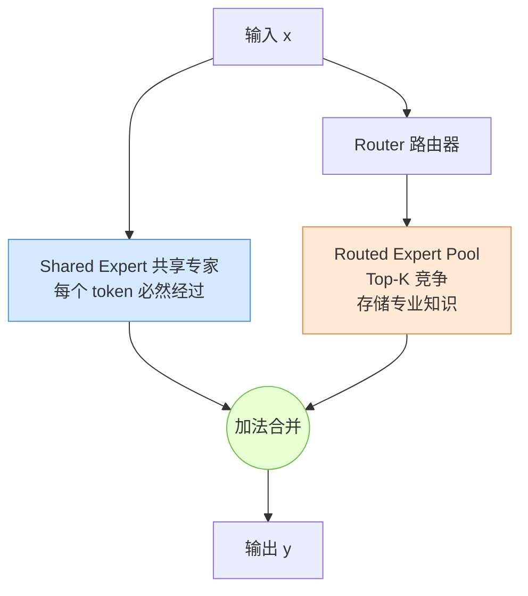
```mermaid
flowchart TD
    x[输入 x] --> SE[Shared Expert 共享专家<br/>每个 token 必然经过]
    x --> R[Router 路由器]
    R --> EP[Routed Expert Pool<br/>Top-K 竞争<br/>存储专业知识]
    SE --> ADD((加法合并))
    EP --> ADD
    ADD --> y[输出 y]

    style SE fill:#d4e8ff,stroke:#4a90d9
    style EP fill:#ffe8d4,stroke:#d98a4a
    style ADD fill:#e8ffd4,stroke:#6abf4a
```

**DeepSeek V2 / V3 配置对比**：

| 参数 | DeepSeek V2 | DeepSeek V3 |
|------|------------|------------|
| 路由专家数 (`n_routed_experts`) | 160 | 256 |
| 共享专家数 (`n_shared_experts`) | 2 | 1 |
| 每 token 激活路由专家数 | 6 | 8 |
| 分组数 (`n_group`) | 8 | 8 |
| 每组选取数 (`topk_group`) | 3 | 4 |
| 总参数量 | 236B | 671B |
| 激活参数量 | 21B | 37B |

#### 11.2.2 细粒度专家（Fine-grained Experts）

DeepSeek MoE 还将每个专家的中间维度缩小（相对于 FFN），同时增加专家数量。

```
等效参数量对比：

  Standard MoE（粗粒度）：
    N=8 专家，intermediate=4d
    每个专家参数量大，但专门化程度低

  DeepSeek MoE（细粒度）：
    N=160 专家，intermediate=d (更小)
    每个专家参数量小，但专门化程度更高
    → 更精准的 token-expert 匹配
```

#### 11.2.3 GroupedTopK 路由算法

标准 TopK 路由存在**负载不均衡**问题：部分"热门"专家被大量 token 选中，其他专家几乎闲置。

DeepSeek 的 **GroupedTopK** 在分组约束下选择专家：

```
GroupedTopK 算法（n_experts=256, n_group=8, topk_group=4, top_k=8）：

Step 1: 将 256 个专家均分为 8 组
        Group 0: Expert[0..31]
        Group 1: Expert[32..63]
        ...
        Group 7: Expert[224..255]

Step 2: 每组内选 topk_group=4 个分数最高的候选专家

Step 3: 计算每组的"组分数"= 组内 top4 分数之和
        group_score[g] = sum(top4 scores in group g)

Step 4: 选出 num_selected_groups=top_k//topk_group=2 个组分数最高的组

Step 5: 从这 2 个组的候选专家中，取最终 top_k=8 个专家

效果：强制专家选择跨越至少 2 个不同组，避免所有 token 集中在某一组
```

这与 DeepSeek V3 使用的 `noaux_tc`（无辅助损失训练）技术结合，实现了极佳的负载均衡。

### 11.3 vLLM 中的 MoE 实现

#### 11.3.1 整体架构图

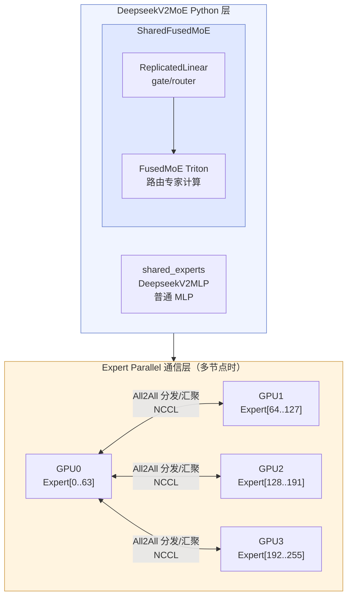
```mermaid
flowchart TD
    subgraph Python["DeepseekV2MoE Python 层"]
        SE2[shared_experts<br/>DeepseekV2MLP<br/>普通 MLP]
        subgraph SFM["SharedFusedMoE"]
            RL[ReplicatedLinear<br/>gate/router]
            FM[FusedMoE Triton<br/>路由专家计算]
            RL --> FM
        end
    end

    subgraph EP["Expert Parallel 通信层（多节点时）"]
        direction LR
        G0["GPU0<br/>Expert[0..63]"]
        G1["GPU1<br/>Expert[64..127]"]
        G2["GPU2<br/>Expert[128..191]"]
        G3["GPU3<br/>Expert[192..255]"]
        G0 <-->|All2All 分发/汇聚<br/>NCCL| G1
        G0 <-->|All2All 分发/汇聚<br/>NCCL| G2
        G0 <-->|All2All 分发/汇聚<br/>NCCL| G3
    end

    Python --> EP

    style Python fill:#f0f4ff,stroke:#6680cc
    style SFM fill:#e0e8ff,stroke:#6680cc
    style EP fill:#fff4e0,stroke:#cc9944
```

#### 11.3.2 关键源码路径

```
vllm/model_executor/models/deepseek_v2.py
  ├── DeepseekV2MoE                    # MoE 层入口
  │     ├── gate (ReplicatedLinear)    # 路由器（每个 GPU 都有完整副本）
  │     ├── shared_experts             # 共享专家
  │     └── experts (SharedFusedMoE)  # 路由专家（EP 分片）
  └── DeepseekV2MLAAttention           # MLA 注意力

vllm/model_executor/layers/fused_moe/
  ├── fused_moe.py         # Triton kernel 入口，grouped GEMM
  ├── all2all_utils.py     # All2All 通信工具
  └── moe_align_block_size.py  # token 按专家排序

vllm/v1/core/sched/scheduler.py
  └── EPLB (Expert Parallel Load Balancer) 支持
```

#### 11.3.3 FusedMoE Triton Kernel 的核心思路

Python for 循环（每个专家一次 kernel）非常低效：

```
低效的朴素实现：
  for expert_id in range(256):
      tokens = x[routing_ids == expert_id]
      out[routing_ids == expert_id] = expert(tokens)

  问题：256 次 kernel launch，严重的 GPU 调度开销
```

FusedMoE 用**一次** grouped GEMM 解决：

```
FusedMoE 执行流程：

Step 1: 按 expert_id 对 token 排序（moe_align_block_size）
        [tok0→E3, tok1→E0, tok2→E3, tok3→E7]
        排序后 →
        [tok1→E0, tok0→E3, tok2→E3, tok3→E7]

Step 2: 单次 Triton grouped GEMM
        每个 Triton block 负责一个 expert 的部分 token
        所有 expert 并行计算

Step 3: 按原始顺序 scatter 回结果，加权求和

优势：
  - O(1) kernel launch（vs O(N_experts) 朴素版）
  - Triton 自动处理 tensor core 对齐和 L2 缓存
```

#### 11.3.4 DeepseekV2MoE.forward 源码解析

```python
# vllm/model_executor/models/deepseek_v2.py
class DeepseekV2MoE(nn.Module):
    def __init__(self, config, parallel_config, quant_config, prefix):
        # ReplicatedLinear：路由器权重在每个 GPU 上都有完整副本
        # 因为每个 GPU 需要知道所有 token 应该去哪个专家
        self.gate = ReplicatedLinear(
            config.hidden_size,
            config.n_routed_experts,
            bias=False,
        )

        # 共享专家（在所有 GPU 上完整执行，非 EP 分片）
        self.shared_experts = DeepseekV2MLP(...)

        # 路由专家（通过 EP 分片：每个 GPU 只持有 N/ep_size 个专家）
        self.experts = SharedFusedMoE(
            num_experts=config.n_routed_experts,    # 256
            top_k=config.num_experts_per_tok,       # 8
            use_grouped_topk=True,
            num_expert_group=config.n_group,         # 8
            topk_group=config.topk_group,            # 4
            ...
        )

    def forward(self, hidden_states):
        # 1. 共享专家（非路由，每个 token 都经过）
        shared_out = self.shared_experts(hidden_states)

        # 2. FusedMoE（内含路由 + All2All + 专家计算 + 汇聚）
        router_logits = self.gate(hidden_states)
        routed_out = self.experts(hidden_states, router_logits)

        # 3. 合并
        return shared_out + routed_out
```

#### 11.3.5 Expert Parallel 的 All2All 通信

```
Expert Parallel（ep_size=4, n_experts=256）执行时序：

                 GPU0          GPU1          GPU2          GPU3
Expert划分:   E[0..63]     E[64..127]   E[128..191]  E[192..255]

t=0: 每个GPU各自计算路由逻辑（gate/router 是 ReplicatedLinear）
     GPU0: tok_A→E72, tok_B→E5, tok_C→E130 ...
     GPU1: tok_D→E200, tok_E→E64 ...

t=1: All2All 分发（每个GPU把token发给对应Expert的GPU）
     GPU0 → GPU1: tok_A（因为 E72 在 GPU1）
     GPU0 → GPU2: tok_C（因为 E130 在 GPU2）
     GPU0 保留: tok_B（因为 E5 在 GPU0）

t=2: 本地专家计算（每个GPU处理分配到本地的所有token）
     GPU1: 计算 E72(tok_A), E64(tok_E) ...

t=3: All2All 汇聚（结果发回原始GPU）
     GPU1 → GPU0: E72(tok_A) 的结果

t=4: 每个GPU在本地做加权合并
```

### 11.4 从零实现：Mini MoE

**设计目标**：用纯 Python + PyTorch 复现 DeepSeek MoE 的核心机制。

#### 11.4.1 架构设计图

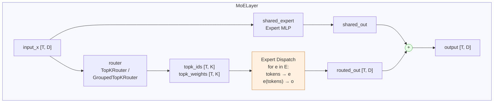
```mermaid
flowchart TD
    subgraph MoELayer["MoELayer"]
        IN["input_x [T, D]"]

        IN --> SEXP["shared_expert<br/>Expert MLP"]
        IN --> ROUTER["router<br/>TopKRouter /<br/>GroupedTopKRouter"]

        SEXP --> SHOUT["shared_out"]

        ROUTER --> TOPK["topk_ids [T, K]<br/>topk_weights [T, K]"]

        TOPK --> DISPATCH["Expert Dispatch<br/>for e in E:<br/>  tokens → e<br/>  e(tokens) → o"]

        DISPATCH --> ROUT["routed_out [T, D]"]

        SHOUT --> MERGE((+))
        ROUT --> MERGE

        MERGE --> OUT["output [T, D]"]
    end

    style MoELayer fill:#f8f8ff,stroke:#8888cc
    style DISPATCH fill:#fff0e0,stroke:#cc8844
    style MERGE fill:#e8ffe8,stroke:#44aa44
```

#### 11.4.2 核心实现要点

见 `03_moe/mini_moe.py`，关键设计决策：

**Expert（专家）**：使用 SwiGLU 激活（与 DeepSeek/LLaMA 对齐）：

```python
class Expert(nn.Module):
    """单个专家：SwiGLU MLP（与 DeepSeek / LLaMA 保持一致）"""
    def forward(self, x):
        # SwiGLU: down(silu(gate(x)) * up(x))
        return self.down_proj(F.silu(self.gate_proj(x)) * self.up_proj(x))
```

**TopKRouter（路由器）**：softmax 后选 TopK，并计算辅助损失：

```python
class TopKRouter(nn.Module):
    def forward(self, x):
        logits = self.gate(x)              # [T, E]
        probs = F.softmax(logits, dim=-1)  # [T, E]

        # TopK 选择（带归一化）
        topk_probs, topk_ids = torch.topk(probs, self.top_k, dim=-1)
        topk_probs = topk_probs / (topk_probs.sum(dim=-1, keepdim=True) + 1e-9)

        # Switch Transformer 辅助损失（促进负载均衡）
        # 目标：expert_usage[e] ≈ 1/E（均匀分布）
        aux_loss = num_experts * (expert_usage * mean_prob).sum()
        return topk_probs, topk_ids, aux_loss
```

**GroupedTopKRouter**：DeepSeek 风格的分组路由：

```python
class GroupedTopKRouter(nn.Module):
    def forward(self, x):
        probs = F.softmax(self.gate(x), dim=-1)  # [T, E]

        # 分组：[T, E] → [T, G, E/G]
        scores_grouped = probs.view(T, self.num_expert_group, self.experts_per_group)

        # 每组内选 topk_group 个候选
        group_topk_vals, group_topk_local_ids = torch.topk(
            scores_grouped, k=self.topk_group, dim=-1
        )

        # 计算组分数，选最好的组
        group_scores = group_topk_vals.sum(dim=-1)  # [T, G]
        _, selected_groups = torch.topk(group_scores, k=self.num_selected_groups, dim=-1)

        # 从选中组内的候选专家里取最终 top_k 个
        # （实现细节见 03_moe/mini_moe.py）
```

**MoELayer.forward 的 token dispatch 逻辑**：

```python
# 路由专家：token dispatch
output = torch.zeros_like(x_flat)
for expert_id in range(self.num_experts):
    expert_mask = (topk_ids == expert_id)     # [T, K] bool
    # expert_mask[t, k] = True 表示：第 t 个 token 的第 k 个 top-k slot 路由到了 expert_id

    token_mask = expert_mask.any(dim=-1)       # [T] bool
    # token_mask[t] = True 表示：第 t 个 token 有至少一个 top-k slot 路由到了 expert_id
    if not token_mask.any():
        continue

    tokens = x_flat[token_mask]               # [M, D]，M = 路由到 expert_id 的 token 数
    expert_out = self.experts[expert_id](tokens)  # [M, D]

    # 取该专家对应的路由权重，需要 4 个步骤：
    weights_for_tokens = topk_weights[token_mask]        # [M, K]：M 个 token 各自的 K 个权重
    expert_weights_mask = expert_mask[token_mask]        # [M, K] bool：哪个 k-slot 对应 expert_id

    # 例：token_i 的 top-2 专家是 [expert_3, expert_id]
    #     expert_weights_mask[i] = [False, True]
    #     .int()                 = [0, 1]
    #     .argmax(dim=-1)        = 1           ← 对应 expert_id 的 k-slot 下标
    first_match = expert_weights_mask.int().argmax(dim=-1)  # [M]，值域 [0, K-1]

    # torch.arange(M) 配合 first_match 实现 2D gather：
    # weights[i] = weights_for_tokens[i, first_match[i]]
    # 即：取 token_i 在 expert_id 对应的那个 k-slot 的路由权重（标量）
    M = tokens.shape[0]
    weights = weights_for_tokens[torch.arange(M), first_match]  # [M]

    output[token_mask] += expert_out * weights.unsqueeze(-1)
    # weights.unsqueeze(-1): [M] → [M, 1]，广播到 [M, D]
```

> **注**：这是教学版实现（O(N_experts) kernel launch）。生产环境的 FusedMoE 用 Triton grouped GEMM，只需 O(1) 次 kernel。

#### 11.4.3 运行测试

```bash
docker exec vllm python3 -m pytest /mnt/esfs/master_work/vllm-from-scratch/03_moe/ -v
```

19 个测试全部通过，覆盖：Expert 前向、TopKRouter 归一化、GroupedTopK 分组正确性、负载均衡辅助损失、共享专家、Expert Parallel 模拟。

---

## 第十二章：MLA——多头潜在注意力深度解析

### 12.1 理论背景：KV Cache 成为推理瓶颈

随着上下文长度的增加，标准 MHA（Multi-Head Attention）的 KV Cache 占用急剧膨胀：

```
标准 MHA KV Cache 分析：

  每个 token，每层，存储：
    K: [num_heads, head_dim]  = 128 × 128 = 16384 float16
    V: [num_heads, head_dim]  = 128 × 128 = 16384 float16
    合计：32768 float16 = 64 KB per token per layer

  DeepSeek V2（60层，batch=8，seq=8192）：
    8 × 8192 × 60 × 64KB ≈ 251 GB 的 KV Cache！

  这是 H100 80GB 显存的 3 倍多，根本放不下。
```

**GQA（Grouped Query Attention）** 是已有的缓解方案——减少 KV 头数，但仍然无法从根本上解决问题。

**论文参考**：

- MLA 原论文：DeepSeek-AI, *DeepSeek-V2: A Strong, Economical, and Efficient Mixture-of-Experts Language Model*, 2024
  https://arxiv.org/abs/2405.04434（Section 2.1）

- GQA 对比：Ainslie et al., *GQA: Training Generalized Multi-Query Transformer Models from Multi-Head Checkpoints*, EMNLP 2023
  https://arxiv.org/abs/2305.13245

### 12.2 MLA 的核心数学

**关键洞察**：K 和 V 矩阵在低维空间中有冗余。可以用一个低秩潜在向量 $c_{KV}$ 来代替：

$$\text{标准 MHA：} K = X W_K,\quad V = X W_V$$

$$\text{MLA：} c_{KV} = X W^{KV}_{down},\quad K = c_{KV} W^K_{up},\quad V = c_{KV} W^V_{up}$$

其中 $c_{KV} \in \mathbb{R}^{d_{KV}}$，$d_{KV} \ll d_{model}$。

**KV Cache 只需存储 $c_{KV}$**，而非完整的 K、V！

```
维度对比（DeepSeek V2 规格）：

  MHA KV 存储：num_heads × head_dim × 2 = 128 × 128 × 2 = 32768 fp16/token/layer
  MLA KV 存储：kv_lora_rank + qk_rope_head_dim = 512 + 64 = 576 fp16/token/layer

  节省比例：32768 / 576 = 56.9x！
```

### 12.3 解耦 RoPE：位置编码的特殊处理

**难点**：RoPE（旋转位置编码）依赖 token 的绝对位置，而低秩 $c_{KV}$ 是一个没有位置信息的向量——直接对低秩向量应用 RoPE 不正确。

**解决方案：解耦 RoPE（Decoupled RoPE）**

```
K 被分成两部分：

  K = [K_nope | K_rope]
       └─────┘   └─────┘
       从 c_KV    单独投影并
       恢复，     应用 RoPE
       无位置信息  有位置信息

KV Cache 存储：
  - c_kv  [kv_lora_rank]    ← 用于恢复 K_nope 和完整 V
  - k_rope [qk_rope_head_dim] ← 带位置信息的小向量
```

Q 侧同样解耦，使用两阶段低秩投影：

$$q = \text{LayerNorm}(x W^Q_{down}) W^Q_{up}$$

$$q = [q_{nope} | q_{rope}]$$

注意：**Q 不需要存入 KV Cache**（每次推理重新计算），因此 Q 的低秩压缩不节省 KV Cache，只节省计算量。

### 12.4 vLLM 中的 MLA 实现

#### 12.4.1 整体架构图

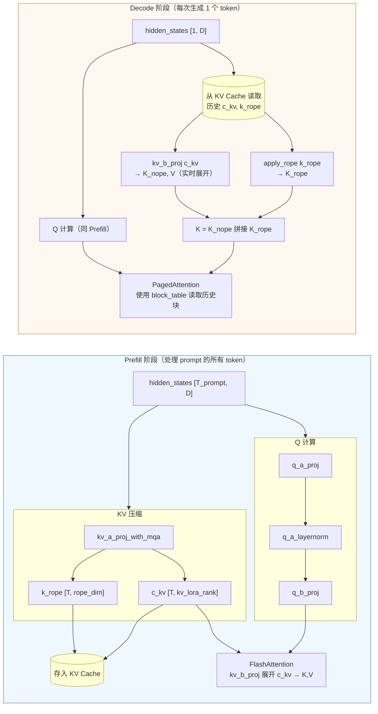
```mermaid
flowchart LR
    subgraph Prefill["Prefill 阶段（处理 prompt 的所有 token）"]
        direction TB
        P_IN["hidden_states [T_prompt, D]"]
        subgraph PQ["Q 计算"]
            P_QA["q_a_proj"]
            P_QN["q_a_layernorm"]
            P_QB["q_b_proj"]
            P_QA --> P_QN --> P_QB
        end
        subgraph PKV["KV 压缩"]
            P_KVA["kv_a_proj_with_mqa"]
            P_CKV["c_kv [T, kv_lora_rank]"]
            P_KR["k_rope [T, rope_dim]"]
            P_KVA --> P_CKV
            P_KVA --> P_KR
        end
        P_IN --> PQ
        P_IN --> PKV
        P_CKV --> P_KVCACHE[("存入 KV Cache")]
        P_KR --> P_KVCACHE
        P_QB --> P_FA["FlashAttention<br/>kv_b_proj 展开 c_kv → K,V"]
        P_CKV --> P_FA
    end

    subgraph Decode["Decode 阶段（每次生成 1 个 token）"]
        direction TB
        D_IN["hidden_states [1, D]"]
        D_Q["Q 计算（同 Prefill）"]
        D_KVCACHE[("从 KV Cache 读取<br/>历史 c_kv, k_rope")]
        D_KVB["kv_b_proj c_kv<br/>→ K_nope, V（实时展开）"]
        D_ROPE["apply_rope k_rope<br/>→ K_rope"]
        D_KFULL["K = K_nope 拼接 K_rope"]
        D_ATTN["PagedAttention<br/>使用 block_table 读取历史块"]

        D_IN --> D_Q
        D_IN --> D_KVCACHE
        D_KVCACHE --> D_KVB
        D_KVCACHE --> D_ROPE
        D_KVB --> D_KFULL
        D_ROPE --> D_KFULL
        D_Q --> D_ATTN
        D_KFULL --> D_ATTN
    end

    style Prefill fill:#f0f8ff,stroke:#4a80cc
    style Decode fill:#fff8f0,stroke:#cc8040
    style P_KVCACHE fill:#ffffd4,stroke:#aaaa44
    style D_KVCACHE fill:#ffffd4,stroke:#aaaa44
```

#### 12.4.2 关键源码解析

**关键设计问题：为什么 `kv_b_proj` 不提前在 KV Cache 写入前展开？**

直觉上，我们可以在存入 KV Cache 前就调用 `kv_b_proj(c_kv)` 得到完整的 K、V，然后直接存储完整 K、V。但实际上 MLA 的存储策略是：

```
方案 A（天真方案）：提前展开，存完整 K/V
  存储量 = num_heads × (nope_dim + v_dim) = 128 × (128+128) = 32768 fp16/token
  ← 与 MHA 等价，KV 节省为零！

方案 B（MLA 方案）：存 c_kv，计算时实时展开 kv_b_proj
  存储量 = kv_lora_rank + rope_dim = 512 + 64 = 576 fp16/token
  ← 节省 56.9x！
```

因此，**不提前展开是 MLA 节省 KV Cache 的根本原因**。代价是每次 Decode 步都要额外做一次 `kv_b_proj` 矩阵乘法（从历史 c_kv 恢复 K/V），这是计算量换内存的权衡。

在 vLLM 的生产实现中，`kv_b_proj` 进一步被融合进 FlashAttention kernel（`MLACommonImpl`）：不需要先把完整 K/V 写出到 HBM，而是在 SRAM 内完成 `kv_b_proj` 后直接做 attention，进一步节省 HBM 带宽。

```python
# vllm/model_executor/models/deepseek_v2.py
class DeepseekV2MLAAttention(nn.Module):
    def __init__(self, ..., q_lora_rank, kv_lora_rank, ...):

        # Q 侧：两阶段低秩投影
        self.q_a_proj = Linear(hidden_size, q_lora_rank)          # 压缩
        self.q_a_layernorm = RMSNorm(q_lora_rank)
        self.q_b_proj = ColumnParallelLinear(q_lora_rank, num_heads * qk_head_dim)  # 展开

        # KV 侧：低秩压缩（输出存入 KV Cache）
        self.kv_a_proj_with_mqa = ReplicatedLinear(
            hidden_size,
            kv_lora_rank + qk_rope_head_dim,  # c_kv + k_rope
        )
        self.kv_a_layernorm = RMSNorm(kv_lora_rank)

        # KV 展开（计算时，从 c_kv 恢复完整 K_nope + V）
        self.kv_b_proj = ColumnParallelLinear(
            kv_lora_rank,
            num_heads * (qk_nope_head_dim + v_head_dim),  # K_nope + V
        )

        # 输出投影
        self.o_proj = RowParallelLinear(num_heads * v_head_dim, hidden_size)
```

**KV Cache 物理布局**（MLA 与 MHA 的关键差异）：

```
MHA 的 KV Cache（每个 block）：
  k_cache: [block_size, num_heads, head_dim]
  v_cache: [block_size, num_heads, head_dim]

MLA 的 KV Cache（每个 block）：
  kv_cache: [block_size, kv_lora_rank + qk_rope_head_dim]
  ^^^^^^^^ 只有一个 tensor，维度远小于 MHA！

vllm/v1/attention/backends/mla/utils.py (MLACommonImpl)
  - 处理 MLA 特有的 prefill/decode 路径分支
  - kv_b_proj 在 attention 计算时实时展开（不提前存储完整 K,V）
```

#### 12.4.3 KV Cache 节省量化

```
参数                       MHA           MLA
─────────────────────────────────────────────────
num_heads                  128           128
head_dim                   128           128
kv_lora_rank               -             512
qk_rope_head_dim           -             64
─────────────────────────────────────────────────
每 token 每层存储量        32768 fp16    576 fp16
─────────────────────────────────────────────────
节省比例                   1x            56.9x !!!
─────────────────────────────────────────────────
8192 token, 60 层, batch=1 (GB)
  MHA：  8192 × 60 × 32768 × 2B = 32.2 GB
  MLA：  8192 × 60 ×   576 × 2B =  0.6 GB
```

#### 12.4.4 vllm-ascend AscendMLAImpl——Ascend 专属优化

> 源码：`vllm_ascend/attention/mla_v1.py`

vllm-ascend 在上游 vLLM 的 `MLAAttentionImpl` 基础上进行了深度定制，主类为 `AscendMLAImpl`（继承 `MLAAttentionImpl`）。

**双 KV Cache 结构（最关键差异）**：

上游 vLLM 将 c_kv（kv_lora_rank）和 k_rope 存在同一个张量。vllm-ascend 将其**分开存储**：

```python
# mla_v1.py:1095-1120 — exec_kv_decode
# kv_caches 是一个 tuple，index 0 是 k_nope，index 1 是 k_pe
k_nope = kv_caches[0]   # [num_blocks, num_kv_heads, block_size, kv_lora_rank]
k_pe   = kv_caches[1]   # [num_blocks, num_kv_heads, block_size, qk_rope_head_dim]
```

分开存的好处：每个 cache 的维度和访问模式不同，可以独立优化内存布局（NZ format / 普通 format 各选最优）。

**预转置 W_UK_T 加速 Decode**（`mla_v1.py:823-835`）：

```python
# _q_proj_and_k_up_proj() — Decode 时 Q 计算
# 预转置：process_weights_after_loading 时就转置好 W_UK
# 避免每次 Decode 都做转置
ql_nope = torch.bmm(q_nope, self.W_UK_T)   # W_UK_T 形如 [1, nope_dim, lora_rank]
# → ql_nope 维度与 k_nope (lora_rank) 对齐，可直接做注意力得分
```

Decode 注意力因此变为：`ql_nope @ k_nope^T`（均为低秩维度），计算量大幅减少。

**Ascend NPU 专属内核**：

| 阶段 | 内核 | 说明 |
|------|------|------|
| Prefill | `torch_npu.atb.npu_ring_mla()` | Ring-based MLA，支持超长序列分块流水 |
| Decode | `torch_npu.npu_fused_infer_attention_score()` | 融合注意力打分，减少 HBM 读写 |
| KV 写入 | `torch_npu._npu_reshape_and_cache()` | 高效写入 k_nope/k_pe 到 block cache |
| Q/K RMSNorm+RoPE | `torch_npu.npu_kv_rmsnorm_rope_cache()` | 融合 prefill 时的 RMSNorm + RoPE + 写 cache |

**NZ 格式支持**（可选，`mla_v1.py:1177-1187`）：

```python
if self.enable_nz:
    # Fractal (NZ) layout：将 kv_lora_rank 拆为 [lora_rank//16, block_size, 16]
    # 优点：NPU 矩阵运算的原生 tile 格式，访问效率更高
    k_nope_shape = (num_blocks, num_kv_heads, kv_lora_rank // 16, block_size, 16)
```

**vllm-ascend MLA 与上游差异汇总**：

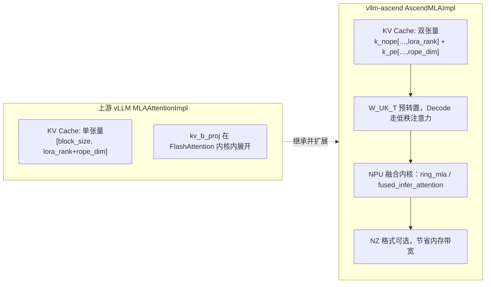
```mermaid
flowchart LR
    subgraph Upstream["上游 vLLM MLAAttentionImpl"]
        U1["KV Cache: 单张量<br/>[block_size, lora_rank+rope_dim]"]
        U2["kv_b_proj 在 FlashAttention 内核内展开"]
    end
    subgraph Ascend["vllm-ascend AscendMLAImpl"]
        A1["KV Cache: 双张量<br/>k_nope[…,lora_rank] + k_pe[…,rope_dim]"]
        A2["W_UK_T 预转置，Decode 走低秩注意力"]
        A3["NPU 融合内核：ring_mla / fused_infer_attention"]
        A4["NZ 格式可选，节省内存带宽"]
        A1 --> A2 --> A3 --> A4
    end
    Upstream -.->|"继承并扩展"| Ascend
```

#### 12.4.5 长上下文：Context Parallel（CP）for MLA

> 源码：`vllm_ascend/attention/context_parallel/mla_cp.py`

**问题**：对于 1M token 级别的超长上下文（RAG、长文档处理），单个 NPU 的 HBM 无法同时存放完整的 KV Cache。

**解决方案**：PCP（Prefill Context Parallel）—— 将序列分段，由多个 NPU 协同处理同一个 Prefill：

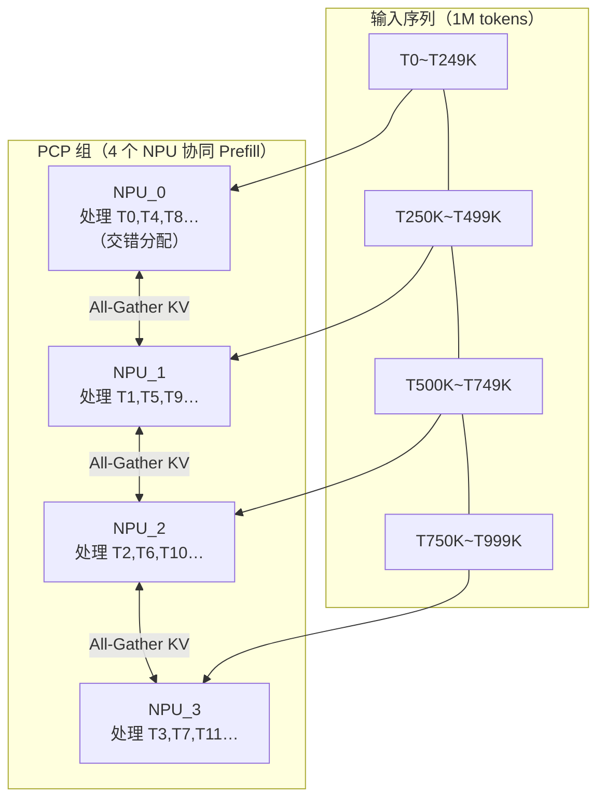
```mermaid
flowchart TD
    subgraph Input["输入序列（1M tokens）"]
        direction LR
        T0["T0~T249K"] --- T1["T250K~T499K"] --- T2["T500K~T749K"] --- T3["T750K~T999K"]
    end

    subgraph PCP["PCP 组（4 个 NPU 协同 Prefill）"]
        N0["NPU_0<br/>处理 T0,T4,T8…<br/>（交错分配）"]
        N1["NPU_1<br/>处理 T1,T5,T9…"]
        N2["NPU_2<br/>处理 T2,T6,T10…"]
        N3["NPU_3<br/>处理 T3,T7,T11…"]
    end

    N0 <-->|"All-Gather KV"| N1
    N1 <-->|"All-Gather KV"| N2
    N2 <-->|"All-Gather KV"| N3

    T0 --> N0
    T1 --> N1
    T2 --> N2
    T3 --> N3
```

**Block 大小计算**（`mla_cp.py:65-73`）：

```python
cp_local_block_size   = block_size            # 单 NPU 本地 block 粒度
cp_virtual_block_size = (
    cp_local_block_size * dcp_size * pcp_size  # 跨 NPU 的逻辑 block 大小
)
# dcp_size: Decode-Context-Parallel 组大小
# pcp_size: Prefill-Context-Parallel 组大小
```

**关键操作**（`mla_cp.py:408-412`）：

```python
# 每个 PCP rank 计算完自己的局部 KV 后，All-Gather 到全组
# 确保每个 NPU 都能看到完整的历史 KV（Causal Attention 需要）
kv_c_normed = all_gather(local_kv_c, pcp_group)   # [total_T, kv_lora_rank]
k_pe        = all_gather(local_k_pe, pcp_group)    # [total_T, rope_dim]
```

**使用场景**：

| 场景 | pcp_size | dcp_size | 总 NPU 数 |
|------|----------|----------|-----------|
| 普通长上下文（< 128K） | 1 | 1 | TP 张量并行 |
| 长上下文 Prefill（< 2M） | 4~8 | 1 | pcp_size × TP |
| 长上下文 Decode（高并发） | 1 | 4~8 | dcp_size × TP |
| 超长上下文（> 2M） | 8 | 4 | pcp_size × dcp_size × TP |

### 12.5 从零实现：Mini MLA

**设计目标**：端到端实现 MLA 的 Prefill + Decode 路径，包括解耦 RoPE 和 KV Cache 存储。

#### 12.5.1 架构设计图

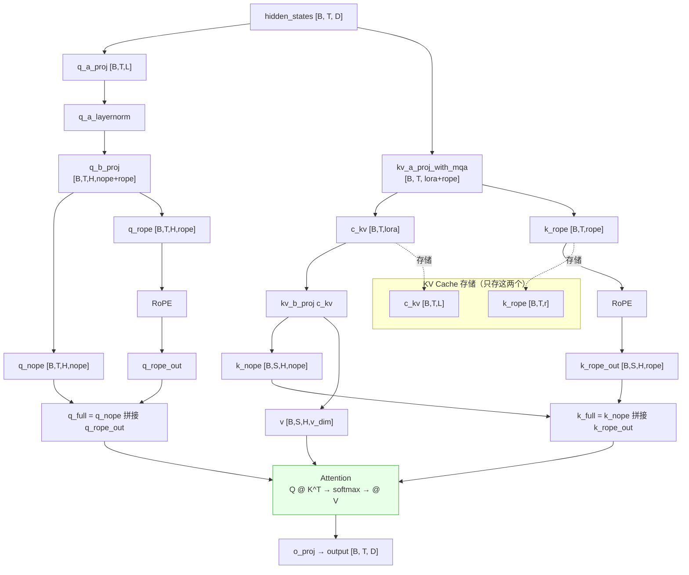
```mermaid
flowchart TD
    HS["hidden_states [B, T, D]"]

    HS --> QA["q_a_proj [B,T,L]"]
    HS --> KVA["kv_a_proj_with_mqa<br/>[B, T, lora+rope]"]

    QA --> QN["q_a_layernorm"]
    QN --> QB["q_b_proj<br/>[B,T,H,nope+rope]"]

    QB --> QNOPE["q_nope [B,T,H,nope]"]
    QB --> QROPE["q_rope [B,T,H,rope]"]

    KVA --> CKV["c_kv [B,T,lora]"]
    KVA --> KROPE["k_rope [B,T,rope]"]

    CKV --> KVB["kv_b_proj c_kv"]
    KVB --> KNOPE["k_nope [B,S,H,nope]"]
    KVB --> V["v [B,S,H,v_dim]"]

    KROPE --> ROPE_K["RoPE"]
    ROPE_K --> KROPEOUT["k_rope_out [B,S,H,rope]"]

    QROPE --> ROPE_Q["RoPE"]
    ROPE_Q --> QROPEOUT["q_rope_out"]

    KNOPE --> KFULL["k_full = k_nope 拼接 k_rope_out"]
    KROPEOUT --> KFULL

    QNOPE --> QFULL["q_full = q_nope 拼接 q_rope_out"]
    QROPEOUT --> QFULL

    QFULL --> ATTN["Attention<br/>Q @ K^T → softmax → @ V"]
    KFULL --> ATTN
    V --> ATTN

    ATTN --> OPROJ["o_proj → output [B, T, D]"]

    subgraph KVCache["KV Cache 存储（只存这两个）"]
        CKV2["c_kv [B,T,L]"]
        KROPE2["k_rope [B,T,r]"]
    end

    CKV -.->|存储| CKV2
    KROPE -.->|存储| KROPE2

    style KVCache fill:#ffffd4,stroke:#aaaa44
    style ATTN fill:#e8ffe8,stroke:#44aa44
```

#### 12.5.2 关键实现细节

见 `04_mla/mini_mla.py`，特别注意：

**RoPE 的应用方式**（修复了非连续张量的问题）：

```python
# 对 q_rope [B, T, H, rope] 应用 RoPE
# 广播: cos_q [B, T, 1, rope] → [B, T, H, rope]
cos_q = cos_q.unsqueeze(2)  # [B, T, 1, rope]
sin_q = sin_q.unsqueeze(2)
q_rope_out = q_rope * cos_q + rotate_half(q_rope) * sin_q  # [B, T, H, rope]

# 对 k_rope [B, S, rope] 扩展到多头后应用 RoPE
k_rope_expand = k_rope.unsqueeze(2).expand(-1, -1, H, -1)  # [B, S, H, rope]
cos_k = cos_k.unsqueeze(2)  # [B, S, 1, rope]
sin_k = sin_k.unsqueeze(2)
k_rope_out = k_rope_expand * cos_k + rotate_half(k_rope_expand) * sin_k
```

> **重要**：`k_rope` 是单头（k_rope per token，与头无关），展开时用 `.expand()` 而非 `.repeat()`，避免内存复制。

**Causal Mask 的正确计算**：

```python
# Prefill 时，T=prompt_len，S=total_seq_len（含历史）
# 新 token 在序列末尾，diagonal 应为 S-T+1
if T > 1:
    causal_mask = torch.triu(
        torch.full((T, S), float('-inf'), device=device),
        diagonal=S - T + 1   # 不是1，因为 S > T（decode步有历史）
    )
```

**公式 `diagonal = S - T + 1` 的推导**：

`torch.triu(matrix, diagonal=d)` 保留上三角（列 ≥ 行 + d 的元素），其余填零。

我们用 `-inf` 填充整个矩阵再调 triu，效果是：
- **保留（-inf）**：col ≥ row + d 的位置 → 这些位置被遮掩
- **清零（0）**：col < row + d 的位置 → 这些位置可以 attend

对于一个包含历史的序列：
- Query 矩阵的行 i（0-indexed）对应序列中绝对位置 `(S - T + i)`
- Key 矩阵的列 j（0-indexed）对应序列中绝对位置 `j`
- 因果规则：位置 `(S-T+i)` 只能 attend 到 ≤ `(S-T+i)` 的位置
  → 合法范围：col_j ≤ S-T+i，即 **col_j < row_i + (S-T+1)**
  → 遮掩范围：col_j ≥ row_i + (S-T+1) → 正好是 `diagonal = S-T+1`

**三种典型情况**：

```
情况1：纯 Prefill（无历史），S=T=8
  diagonal = 8-8+1 = 1
  标准下三角因果掩码（不含主对角线右侧）

情况2：Prefill 含历史，S=20，T=4（前16 token是历史）
  diagonal = 20-4+1 = 17
  每行可 attend 的范围：
    row_0（绝对位置16）→ col 0..16 可attend，col 17..19 遮掩
    row_3（绝对位置19）→ col 0..19 全可attend（无需遮掩）

情况3：单 Token Decode，S=20，T=1
  if T > 1 条件不满足，跳过掩码计算
  （单 token 无需因果掩码：它可以 attend 所有历史，没有"未来"）
```

#### 12.5.3 运行测试

```bash
docker exec vllm python3 -m pytest /mnt/esfs/master_work/vllm-from-scratch/04_mla/ -v
```

13 个测试全部通过：RoPE 正交性、Prefill 形状验证、Decode 追加 KV Cache、因果掩码验证、梯度回传、KV Cache 节省量化（>5x）。

---

## 第十三章：PD 分离——Prefill-Decode 解耦架构

### 13.1 理论背景：Prefill 和 Decode 的计算特性差异

在同一个 vLLM 实例中混合处理 Prefill 和 Decode，会产生严重的干扰：

```
Prefill 的特点：
  - Compute-bound：大量矩阵乘法，GPU 算力利用率高
  - 长序列处理：一次处理 1000-8000 tokens
  - 高延迟可接受：用户在等待第一个 token

Decode 的特点：
  - Memory-bandwidth-bound：每次只生成 1 个 token，
    但需要从 GPU 内存读取完整 KV Cache
  - 延迟敏感：用户实时看到流式输出
  - 吞吐优先：需要并发服务多个对话

混合批次的问题（示例）：

  t=0: 调度 [Prefill(req_A, 4096 tokens)]
       → GPU 花 2s 做 prefill
       → req_B、req_C 的 decode 被阻塞 2s！
       → TTFT(req_B) 增加 2s，用户体验很差

  t=2: 调度 [Decode(req_B), Decode(req_C), Decode(req_D)]
       → 3个 decode 请求，每步 4ms
```

**论文参考**：

- PD 分离思路最早系统化：Zhong et al., *DistServe: Disaggregating Prefill and Decoding for Goodput-Optimized Large Language Model Serving*, OSDI 2024
  https://arxiv.org/abs/2401.09670

- Mooncake（基于 RDMA 的 KV 传输）：Qin et al., *Mooncake: A KVCache-centric Disaggregated Architecture for LLM Serving*, 2024
  https://arxiv.org/abs/2407.00079

### 13.2 PD 分离的系统架构

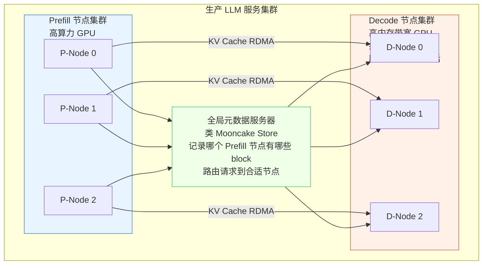
```mermaid
flowchart TD
    subgraph Cluster["生产 LLM 服务集群"]
        subgraph PCluster["Prefill 节点集群<br/>高算力 GPU<br/>专注 Prefill<br/>Batch 大型请求"]
            P0[P-Node 0]
            P1[P-Node 1]
            P2[P-Node 2]
        end

        subgraph DCluster["Decode 节点集群<br/>高内存带宽 GPU<br/>持续流式输出<br/>服务 M 个并发对话"]
            D0[D-Node 0]
            D1[D-Node 1]
            D2[D-Node 2]
        end

        META["全局元数据服务器<br/>类 Mooncake Store<br/>记录哪个 Prefill 节点有哪些 block<br/>路由请求到合适节点"]

        P0 -->|KV Cache RDMA| D0
        P1 -->|KV Cache RDMA| D1
        P2 -->|KV Cache RDMA| D2

        P0 & P1 & P2 --> META
        META --> D0 & D1 & D2
    end

    style PCluster fill:#e8f4ff,stroke:#4a80cc
    style DCluster fill:#fff0e8,stroke:#cc6a4a
    style META fill:#f0ffe8,stroke:#4acc6a
```

### 13.3 KV Cache 跨节点传输

#### 13.3.1 RDMA 单边读取（One-sided RDMA READ）

```
为什么用 RDMA 而不是 TCP/IP？

  TCP/IP：
    发送端：CPU 拷贝 → 内核 → 网卡 → 传输
    接收端：网卡 → 内核 → CPU 拷贝 → 用户空间
    延迟：10-100μs，带宽 10-100Gbps，CPU 介入

  RDMA (Remote Direct Memory Access)：
    发送端：GPU 内存直接标记为可远程访问
    接收端：直接从发送端 GPU 内存读取（无 CPU 介入）
    延迟：0.5-2μs，带宽 200-800Gbps (InfiniBand HDR/NDR)
    CPU 零介入
```

RDMA One-sided READ 流程：

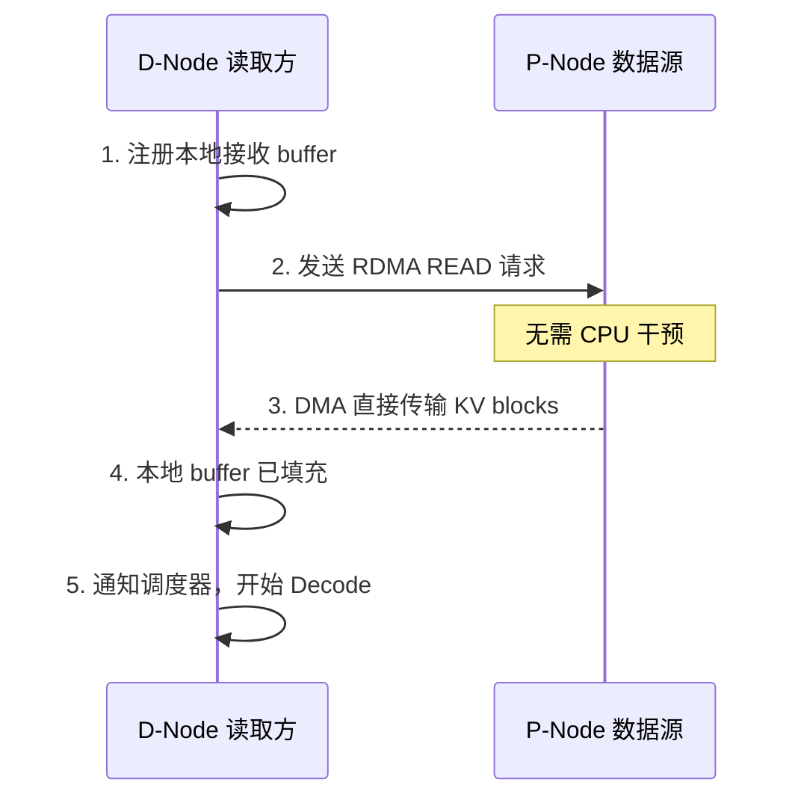
```mermaid
sequenceDiagram
    participant D as D-Node 读取方
    participant P as P-Node 数据源

    D->>D: 1. 注册本地接收 buffer
    D->>P: 2. 发送 RDMA READ 请求
    Note over P: 无需 CPU 干预
    P-->>D: 3. DMA 直接传输 KV blocks
    D->>D: 4. 本地 buffer 已填充
    D->>D: 5. 通知调度器，开始 Decode
```

#### 13.3.2 vLLM 的 KVConnector 接口

vLLM V1 的 KVConnector 接口分为**调度器侧**和**Worker 侧**两部分，体现了 V1 引擎的多进程架构（调度器和 Worker 运行在不同进程中）：

```python
# vllm/distributed/kv_transfer/kv_connector/v1/base.py

class KVConnectorBase_V1(ABC):
    """
    KV Cache 传输抽象基类（V1 架构）

    接口分两侧：
    - Scheduler 侧：运行在调度器进程，负责元数据查询（"有多少 token 可以从远端 KV 加载？"）
    - Worker 侧：运行在 GPU Worker 进程，负责实际 KV 数据的读写
    """

    # ─── Scheduler 侧（在 schedule() 时调用）───────────────────

    @abstractmethod
    def get_num_new_matched_tokens(
        self,
        request: Request,
        num_computed_tokens: int,
    ) -> tuple[int | None, bool]:
        """
        查询：远端 KV Cache 中，超过本地已计算 num_computed_tokens 之后
        还能额外提供多少 token 的 KV？

        返回 (extra_tokens, is_async)：
        - extra_tokens: 可从远端加载的额外 token 数（None 表示还不确定，调度器后续重试）
        - is_async: True 表示 KV 将异步传输（下次调度时可能才就绪）
        """
        ...

    @abstractmethod
    def update_state_after_alloc(
        self, request: Request, blocks: KVCacheBlocks, num_external_tokens: int
    ):
        """在 KV 块分配完成后更新 Connector 状态（记录需要填入哪些块）"""
        ...

    @abstractmethod
    def request_finished(
        self, request: Request, block_ids: tuple[list[int], ...]
    ) -> tuple[bool, dict | None]:
        """
        请求完成时回调：可选择异步将 KV 发送给其他节点
        返回 should_delay_free=True 则 Connector 接管块的释放时机
        """
        ...

    # ─── Worker 侧（在 GPU 前向传播前后调用）──────────────────

    @abstractmethod
    def start_load_kv(self, forward_context: ForwardContext, **kwargs) -> None:
        """
        D-Node：在前向传播前，开始从远端拉取 KV（异步 RDMA READ）
        此调用立即返回，不阻塞模型执行
        """
        ...

    @abstractmethod
    def wait_for_layer_load(self, layer_name: str) -> None:
        """
        在 attention 层计算前，等待该层 KV 加载完成
        支持逐层流水线：layer N 的 attention 计算时，layer N+1 的 KV 正在传输
        """
        ...

    @abstractmethod
    def save_kv_layer(
        self, layer_name: str, kv_layer: torch.Tensor, attn_metadata, **kwargs
    ) -> None:
        """
        P-Node：在 attention 层计算完成后，将本层 KV 发送出去（异步 RDMA WRITE）
        此调用立即返回，不阻塞模型执行
        """
        ...

    @abstractmethod
    def wait_for_save(self):
        """等待所有层的 KV 发送完成（在前向传播结束时调用）"""
        ...
```

**V1 接口设计要点**：
- **逐层流水线**：`start_load_kv()` + `wait_for_layer_load()` 允许 KV 传输与模型计算重叠（每层 attention 等自己那层的 KV，而不是等所有层都就绪）
- **调度器感知**：`get_num_new_matched_tokens()` 让调度器在分配 KV 块前就知道有多少 token 无需 Prefill，实现精确的 token budget 管理
- **异步发送**：`save_kv_layer()` 在 P-Node 每层 attention 后立刻异步发送，而不是等全部层 Prefill 完成后才开始传输，显著降低 D-Node 等待时间

#### 13.3.3 Mooncake 实现（基于 RDMA 的高速传输）

> **深度解析参见《博客第二部分》第 7 章**，其中覆盖了：
> - **7.6.1**：上游 vLLM P-push（RDMA WRITE）
> - **7.6.5**：vllm-ascend D-pull（RDMA READ）及异构 TP 支持
> - **7.6.7**：逐层传输（Layerwise Connector）
> - **7.6**：LMCache + MooncakeStore 主流全局 KV 池方案（NVIDIA GPU）
> - **7.7**：vllm-ascend AscendStore 分布式 KV 池（Ascend NPU）

此处重点厘清 **V0 vs V1 接口演进**，以及 MooncakeConnector（P2P）与 LMCache（全局存储池）的本质区别：

##### V0 接口（历史，已废弃）

V0 的 `KVConnectorBase` 使用一对**同步阻塞**方法，通过中间 **KV Lookup Buffer**（按 token hash 键值存取）协调 P/D 传输顺序：

```python
# vLLM V0 KVConnector 接口（已废弃，勿与 V1 混淆！）
class KVConnectorBase:  # V0

    def send_kv_caches_and_hidden_states(
        self, model_executable, model_input, kv_caches, hidden_states
    ) -> None:
        """P-Node：Prefill 全部完成后，将 KV Cache 写入中间 KV Lookup Buffer"""
        # 底层分两层：
        #   KV Pipe：FIFO 张量管道（send_tensor / recv_tensor）
        #   KV Lookup Buffer：在 Pipe 之上，API: insert(token_hash, kv) / drop_select(token_hash)
        # P 按 token_hash 发布 KV，解决 P/D 处理顺序不一致问题（P 先完成，D 后到）
        ...

    def recv_kv_caches_and_hidden_states(
        self, model_executable, model_input, kv_caches
    ) -> tuple[Tensor, bool]:
        """D-Node：从 KV Lookup Buffer 按 token_hash 取出 KV，填入本地 blocks"""
        ...
        # 返回 bypass_model=True → D-Node 跳过 Prefill 前向传播，直接进行 Decode Attention
        return hidden_states, True
```

**V0 的局限**：
- Prefill 全部完成才开始传输，D-Node 等待时间等于完整 Prefill 时延
- 调度器对 KV 传输状态完全无感知，无法提前规划 token budget
- 无块生命周期控制（无 `delay_free` 机制），块可能在 RDMA 完成前就被释放

##### V1 MooncakeConnector：P2P 直连，无中间存储

V1 的 `MooncakeConnector`（上游 vLLM，详见《博客第二部分》7.3）**不是全局 KV Store**，也不按 block_hash 查找，而是 P-Node 直接通过 RDMA WRITE 写入 D-Node 的 GPU 内存：

```python
# V1 MooncakeConnector 关键调用链（P-Node 侧）

# ① 调度器侧：Prefill 完成，记录待发 blocks，延迟释放
def request_finished(self, request, block_ids) -> tuple[bool, dict]:
    transfer_id = uuid.uuid4().hex
    self._reqs_need_send[request.request_id] = (transfer_id, list(block_ids))
    # delay_free=True：blocks 不立即释放，RDMA WRITE 完成后由 get_finished() 触发释放
    return True, {"do_remote_decode": True, "transfer_id": transfer_id}

# ② 后台 sender_loop：等到 D-Node 通过 ZMQ 发来 GPU 内存地址，执行 RDMA WRITE
def _send_kv_to_decode(self, d_req_id, pull_meta):
    src_ptrs, dst_ptrs, lengths = self._build_transfer_params(pull_meta)
    # P-GPU → D-GPU：直接 RDMA WRITE，无任何中间存储
    ret = self.engine.batch_transfer_sync_write(
        remote_session, src_ptrs, dst_ptrs, lengths
    )
```

```python
# V1 MooncakeConnector 关键调用链（D-Node 侧）

# ① 调度器侧：查询 P-Node 可提供的 token 数，is_async=True 表示异步传输
def get_num_new_matched_tokens(self, request, num_computed_tokens):
    if request.kv_transfer_params.get("do_remote_prefill"):
        extra = len(request.prompt_token_ids) - num_computed_tokens
        return extra, True  # 调度器据此分配足够的 KV blocks
    return 0, False

# ② Worker 侧：通过 ZMQ 把 D 的 GPU block 地址告知 P，触发 P 的 RDMA WRITE
def start_load_kv(self, forward_context, **kwargs):
    for remote_engine_id, pull_metas in metadata.reqs_to_recv.items():
        asyncio.create_task(
            self._receive_kv_from_single_worker(remote_engine_id, pull_metas)
        )
    # D-Node 进入 WAITING_FOR_REMOTE_KVS 状态，等待 RDMA WRITE 写入完成

# ③ Worker 侧：轮询 RDMA 完成状态，通知调度器该请求可以进入 Decode
def get_finished(self, finished_req_ids):
    return self.finished_sending_reqs.pop(), self.finished_recving_reqs.pop()
```

> **注意**：V1 MooncakeConnector 中 `save_kv_layer()` 和 `wait_for_layer_load()` 均为 **No-op**，因为 Mooncake 是整批传输（Prefill 完成后触发，非逐层）。逐层传输由 vllm-ascend 的 LayerwiseConnector 实现（见《博客第二部分》7.6.7）。

##### V1 LMCacheConnector：真正的全局 KV Pool

如果需要**跨 P 节点**的 Prefix Cache 复用（任意 P 写入，任意 D 读取），应使用 **LMCacheConnector**（`vllm/distributed/kv_transfer/kv_connector/v1/lmcache_connector.py`）：

```python
# LMCache V1：分层 KV 存储（GPU → CPU DRAM → NVMe SSD → 网络存储）
class LMCacheConnectorV1(KVConnectorBase_V1):

    def save_kv_layer(self, layer_name, kv_layer, attn_metadata, **kwargs):
        # P-Node：每层 attention 计算后，立刻写入 LMCache（按 block_hash 索引）
        # 任意 D-Node 都能从 LMCache 读取任意 P-Node 计算过的 KV
        self._lmcache_engine.save_kv_layer(layer_name, kv_layer, attn_metadata)

    def wait_for_layer_load(self, layer_name):
        # D-Node：每层 attention 前，等待该层从 LMCache 加载完成
        self._lmcache_engine.wait_for_layer_load(layer_name)
```

**三种传输机制对比**：

| 维度 | V0（已废弃） | V1 MooncakeConnector | V1 LMCacheConnector |
|------|------------|----------------------|---------------------|
| 核心接口 | `send/recv_kv_caches_and_hidden_states` | `KVConnectorBase_V1` 调度器/Worker 分离 | `KVConnectorBase_V1` |
| 传输中间层 | KV Lookup Buffer（按 token hash） | 无（P 直写 D GPU 内存，P2P） | LMCache 分层存储（GPU/CPU/NVMe） |
| 跨 P 节点复用 | 依赖 KV Lookup Buffer 实现 | ❌（固定 P→D 配对） | ✅（任意 P 写，任意 D 读） |
| `save_kv_layer` | — | No-op | 主动写入 LMCache（逐层） |
| `wait_for_layer_load` | — | No-op（整批到达） | 主动等待 LMCache 返回 |
| 调度器感知 | ❌ | ✅ `get_num_new_matched_tokens` | ✅ `get_num_new_matched_tokens` |
| D-Node 跳过 Prefill | `bypass_model=True` 返回值 | `WAITING_FOR_REMOTE_KVS` 状态机 | `WAITING_FOR_REMOTE_KVS` 状态机 |
| 延迟 | 较高（整批 + 中间 Buffer） | 最低（直接 RDMA，~100μs） | 较高（存储层，但异步隐藏） |
| 适合场景 | — | 低延迟，特定 P→D 精确配对 | 大容量 Prefix Pool，多 P 共享 |

#### 13.3.4 端到端请求流程（V1 MooncakeConnector）

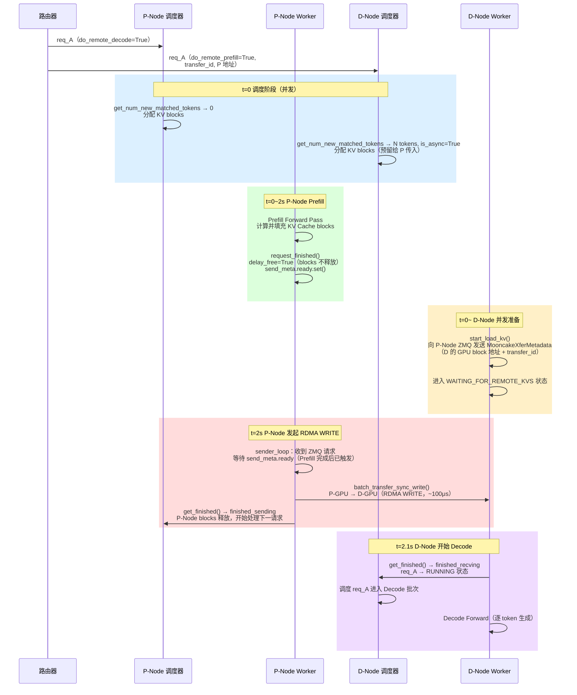
```mermaid
sequenceDiagram
    participant Router as 路由器
    participant PS as P-Node 调度器
    participant PW as P-Node Worker
    participant DS as D-Node 调度器
    participant DW as D-Node Worker

    Router->>PS: req_A（do_remote_decode=True）
    Router->>DS: req_A（do_remote_prefill=True,<br/>transfer_id, P 地址）

    rect rgb(220, 240, 255)
        Note over PS,DS: t=0 调度阶段（并发）
        PS->>PS: get_num_new_matched_tokens → 0<br/>分配 KV blocks
        DS->>DS: get_num_new_matched_tokens → N tokens, is_async=True<br/>分配 KV blocks（预留给 P 传入）
    end

    rect rgb(220, 255, 220)
        Note over PW: t=0~2s P-Node Prefill
        PW->>PW: Prefill Forward Pass<br/>计算并填充 KV Cache blocks
        PW->>PW: request_finished()<br/>delay_free=True（blocks 不释放）<br/>send_meta.ready.set()
    end

    rect rgb(255, 240, 200)
        Note over DW: t=0~ D-Node 并发准备
        DW->>DW: start_load_kv()<br/>向 P-Node ZMQ 发送 MooncakeXferMetadata<br/>（D 的 GPU block 地址 + transfer_id）
        DW->>DW: 进入 WAITING_FOR_REMOTE_KVS 状态
    end

    rect rgb(255, 220, 220)
        Note over PW: t=2s P-Node 发起 RDMA WRITE
        PW->>PW: sender_loop：收到 ZMQ 请求<br/>等待 send_meta.ready（Prefill 完成后已触发）
        PW->>DW: batch_transfer_sync_write()<br/>P-GPU → D-GPU（RDMA WRITE，~100μs）
        PW->>PS: get_finished() → finished_sending<br/>P-Node blocks 释放，开始处理下一请求
    end

    rect rgb(240, 220, 255)
        Note over DS,DW: t=2.1s D-Node 开始 Decode
        DW->>DS: get_finished() → finished_recving<br/>req_A → RUNNING 状态
        DS->>DS: 调度 req_A 进入 Decode 批次
        DW->>DW: Decode Forward（逐 token 生成）
    end
```

**关键优势**：
1. P-Node 在 t=2s 后立即释放 blocks、服务下一请求（吞吐 ↑）
2. D-Node 的 ZMQ 请求与 P-Node 的 Prefill **并发**进行，最小化等待时间
3. P-Node 通过 `delay_free=True` 确保 blocks 在 RDMA WRITE 完成前不被驱逐
4. D-Node 调度器通过 `get_num_new_matched_tokens` 提前分配好 KV blocks，RDMA 完成即可直接 Decode

#### 13.3.5 MLA + PD 分离：传输格式的特殊处理

MLA 的压缩存储对 PD 分离的网络传输有直接影响：**传输量减少 7x 以上**。

**传输内容对比**（DeepSeek V3，64 heads，每 token 每层）：

```
标准 MHA：
  传输 k_cache + v_cache（全量）
  = num_heads × head_dim × 2 × fp16
  = 64 × 128 × 2 × 2 = 32,768 字节/token/层

MLA（实际 vllm-ascend 传输内容）：
  传输 k_nope（kv_lora_rank）+ k_pe（qk_rope_head_dim）
  = (512 + 64) × fp16
  = 576 × 2 = 1,152 字节/token/层

节省比例：32,768 / 1,152 ≈ 28x ！（每层）
```

注意：传输的是**压缩表示**（c_kv + k_rope），而不是展开后的完整 K/V。D-node 收到后，在每次 Decode attention 时实时展开（同样执行 `kv_b_proj`）。

**vllm-ascend pool_worker.py 对 MLA 的特殊处理**（`pool_worker.py:57-178`）：

```python
# pool_worker.py:88-98 — 检测 MLA 模型
if self.use_mla or self.use_sparse:
    # MLA 有多个子 KV cache（k_nope cache + k_pe cache）
    for i in range(len(first_kv_cache_tuple)):
        block_shape = first_kv_cache_tuple[i].shape[-3:]  # [num_kv_heads, block_size, dim]
        self.block_len.append(element_size * product(block_shape))
    # ↑ 每个子 cache 分别计算 block_len，独立传输

# 对比普通 MHA（单 cache）：
# self.block_len = [element_size × block_size × num_kv_heads × head_dim]
```

**端到端 MLA PD 传输流程**：

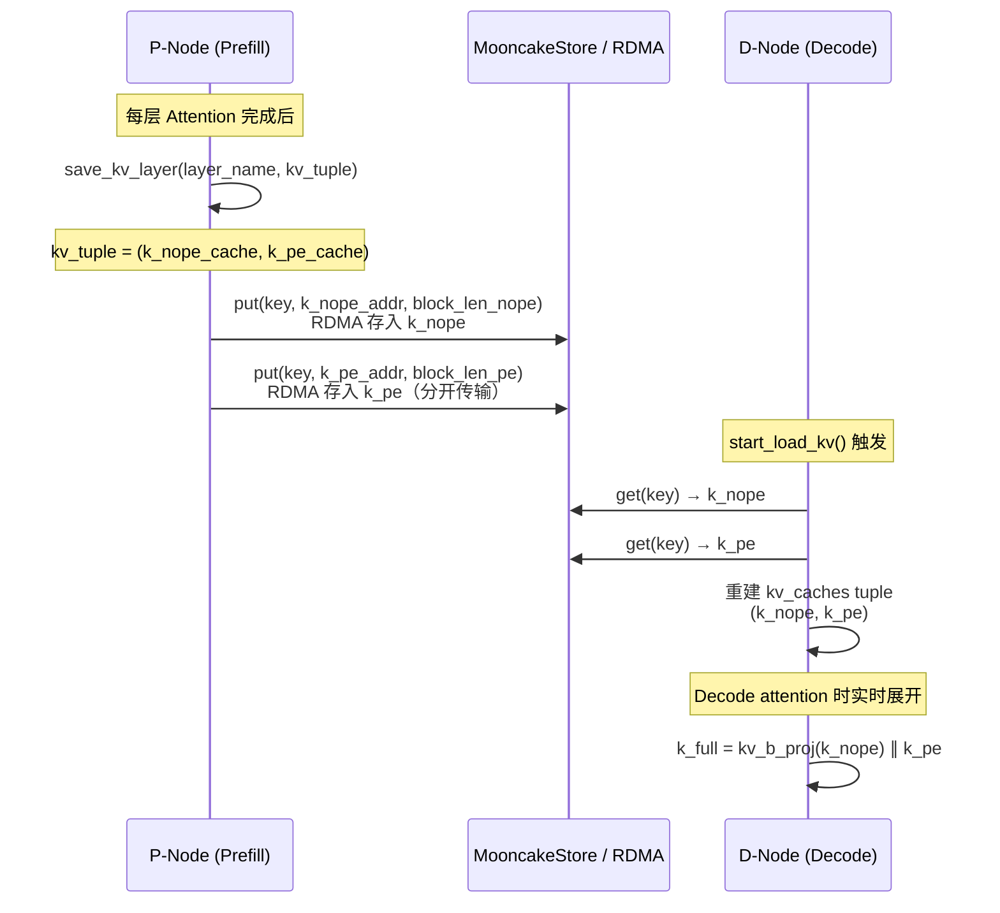
```mermaid
sequenceDiagram
    participant P as P-Node (Prefill)
    participant Store as MooncakeStore / RDMA
    participant D as D-Node (Decode)

    Note over P: 每层 Attention 完成后
    P->>P: save_kv_layer(layer_name, kv_tuple)
    Note over P: kv_tuple = (k_nope_cache, k_pe_cache)
    P->>Store: put(key, k_nope_addr, block_len_nope)<br/>RDMA 存入 k_nope
    P->>Store: put(key, k_pe_addr, block_len_pe)<br/>RDMA 存入 k_pe（分开传输）

    Note over D: start_load_kv() 触发
    D->>Store: get(key) → k_nope
    D->>Store: get(key) → k_pe
    D->>D: 重建 kv_caches tuple<br/>(k_nope, k_pe)
    Note over D: Decode attention 时实时展开
    D->>D: k_full = kv_b_proj(k_nope) ∥ k_pe
```

**小结：MLA 对 PD 分离的影响**：

| 指标 | MHA | MLA |
|------|-----|-----|
| 每 token 每层传输量 | ~32KB | ~1.1KB（-96%） |
| KV cache 结构 | 单 tensor | 双 tensor（k_nope + k_pe） |
| D-node 接收后操作 | 直接用 | 需实时展开 `kv_b_proj` |
| P→D 带宽压力 | 高 | 极低，RDMA 可容纳更多并发 |

### 13.4 从零实现：全局 KV Cache 池（Mooncake 风格）

#### 13.4.1 架构设计图

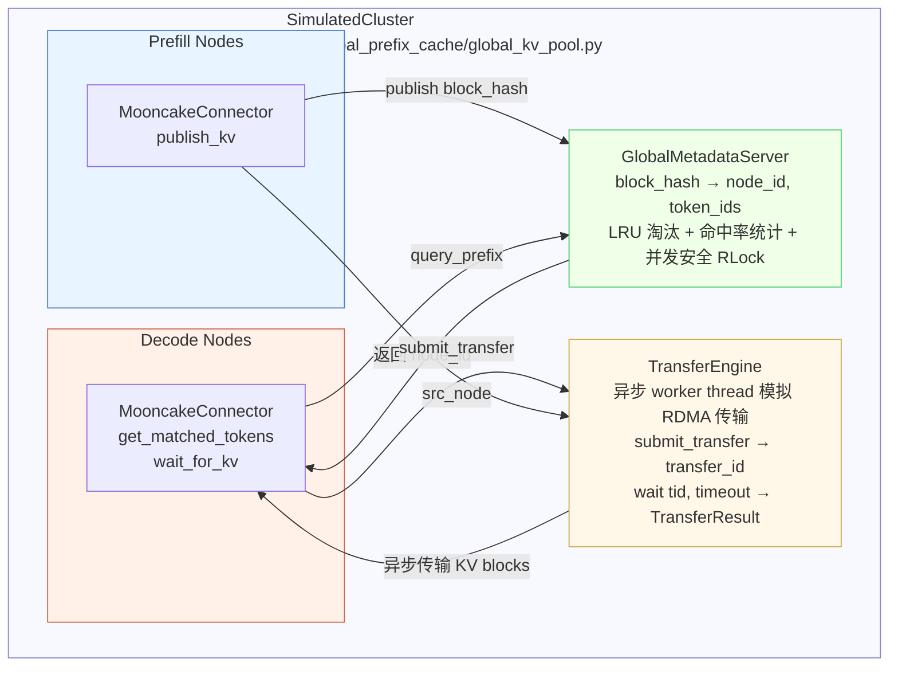
```mermaid
flowchart TD
    subgraph SimCluster["SimulatedCluster<br/>06_global_prefix_cache/global_kv_pool.py"]
        subgraph PNodes["Prefill Nodes"]
            PC["MooncakeConnector<br/>publish_kv"]
        end

        subgraph DNodes["Decode Nodes"]
            DC["MooncakeConnector<br/>get_matched_tokens<br/>wait_for_kv"]
        end

        META["GlobalMetadataServer<br/>block_hash → node_id, token_ids<br/>LRU 淘汰 + 命中率统计 + 并发安全 RLock"]

        TE["TransferEngine<br/>异步 worker thread 模拟 RDMA 传输<br/>submit_transfer → transfer_id<br/>wait tid, timeout → TransferResult"]

        PC -->|publish block_hash| META
        DC -->|query_prefix| META
        META -->|返回 node_id| DC
        DC -->|submit_transfer| TE
        PC -->|src_node| TE
        TE -->|异步传输 KV blocks| DC
    end

    style SimCluster fill:#f8f8ff,stroke:#8888cc
    style PNodes fill:#e8f4ff,stroke:#4a80cc
    style DNodes fill:#fff0e8,stroke:#cc6a4a
    style META fill:#f0ffe8,stroke:#4acc6a
    style TE fill:#fff8e8,stroke:#ccaa44
```

#### 13.4.2 实现层次

**Layer 1：块哈希（链式 hash，防止不同前缀的相同块碰撞）**：

```python
def compute_block_hashes(token_ids: list[int], extra_key=None) -> list[int]:
    """
    链式哈希：每个块的哈希依赖前一个块的哈希（parent hash）

    这确保：相同内容但不同前缀的块，哈希值不同
    （防止跨请求的错误 prefix cache 命中）
    """
    prev_hash = hash(extra_key) if extra_key is not None else 0
    hashes = []
    for i in range(len(token_ids) // BLOCK_SIZE):
        block_tokens = tuple(token_ids[i*BLOCK_SIZE:(i+1)*BLOCK_SIZE])
        h = hash((prev_hash, block_tokens))  # 链式！
        hashes.append(h)
        prev_hash = h
    return hashes
```

**Layer 2：GlobalMetadataServer（分布式元数据，etcd 模拟）**：

```python
class GlobalMetadataServer:
    def publish(self, block_hash, node_id, token_ids, max_blocks_per_node=10000):
        with self._lock:  # 线程安全
            self._registry[block_hash] = KVBlockMeta(block_hash, node_id, token_ids)
            self._node_blocks[node_id].add(block_hash)
            # LRU 淘汰：超出容量时驱逐最久未使用的块
            if len(self._node_blocks[node_id]) > max_blocks_per_node:
                self._evict_lru(node_id)

    def query_prefix(self, block_hashes: list[int]):
        """前缀匹配查询：遇到第一个 miss 就停止"""
        matched = []
        for h in block_hashes:
            if h not in self._registry:
                break  # 前缀必须连续
            matched.append(self._registry[h])
            self._hit_count += 1
        self._query_count += len(block_hashes)  # 按块计数，不是按次计数
        return len(matched), matched
```

**Layer 3：TransferEngine（RDMA 传输模拟）**：

```python
class TransferEngine:
    """
    用 Python threading 模拟 RDMA 传输
    - 机架内：~200μs 延迟
    - 跨机架：~1ms 延迟
    """
    def submit_transfer(self, src_node_id, block_hashes, callback=None):
        transfer_id = str(uuid.uuid4())
        # 在后台线程中模拟传输延迟
        threading.Thread(
            target=self._do_transfer,
            args=(transfer_id, src_node_id, block_hashes, callback),
            daemon=True,
        ).start()
        return transfer_id

    def _do_transfer(self, tid, src_node_id, block_hashes, callback):
        # 模拟网络延迟
        intra_rack = src_node_id // 4 == self.node_id // 4
        latency = 0.0002 if intra_rack else 0.001  # 200μs vs 1ms
        bytes_transferred = len(block_hashes) * KV_BLOCK_BYTES
        time.sleep(latency + bytes_transferred / RDMA_BANDWIDTH_BPS)

        result = TransferResult(tid, success=True, bytes_transferred=bytes_transferred)
        self._results[tid] = result
        if callback:
            callback(result)
```

**Layer 4：MooncakeConnector（vLLM worker 接口）**：

```python
class MooncakeConnector:
    def get_num_new_matched_tokens(self, request_id, block_hashes):
        """
        查询全局 KV Pool，返回命中的 token 数
        如果命中在远端节点，自动触发 RDMA 传输
        """
        num_matched, metas = self.meta_server.query_prefix(block_hashes)
        if num_matched == 0:
            return 0, False

        # 判断是本地命中还是远端命中
        src_node = metas[0].node_id
        if src_node == self.node_id:
            return num_matched * BLOCK_SIZE, False  # 本地，无需传输
        else:
            # 远端命中，触发 RDMA 传输
            matched_hashes = [m.block_hash for m in metas]
            tid = self.transfer_engine.submit_transfer(src_node, matched_hashes)
            self._pending_transfers[request_id] = tid
            return num_matched * BLOCK_SIZE, True  # 需要传输

    def wait_for_kv(self, request_id, timeout=30.0):
        """等待 RDMA 传输完成"""
        tid = self._pending_transfers.pop(request_id, None)
        if tid is None:
            return True  # 本地命中，无需等待
        result = self.transfer_engine.wait(tid, timeout=timeout)
        return result is not None and result.success
```

#### 13.4.3 运行测试

```bash
docker exec vllm python3 -m pytest /mnt/esfs/master_work/vllm-from-scratch/06_global_prefix_cache/ -v
```

34 个测试全部通过：块哈希链式依赖、元数据服务器 LRU 淘汰、并发发布线程安全、RDMA 传输模拟、跨节点缓存共享、命中率统计。

---

## 第十四章：vLLM V1 引擎——整合全局视角

### 14.1 V0 vs V1：架构演进

vLLM 在 V1 版本进行了一次根本性重构，解决 V0 的架构局限：

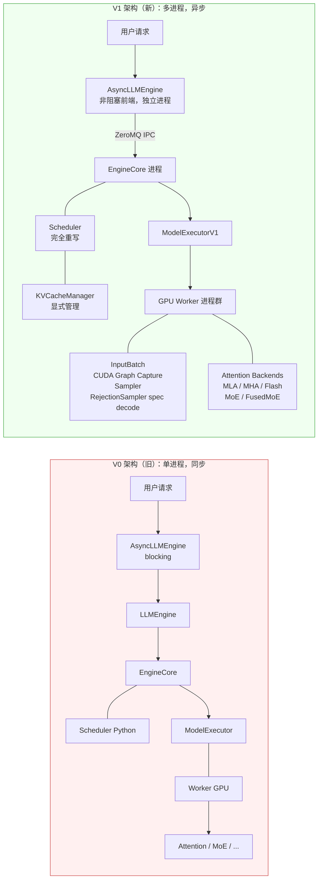
```mermaid
flowchart LR
    subgraph V0["V0 架构（旧）：单进程，同步"]
        direction TB
        V0_REQ["用户请求"]
        V0_AE["AsyncLLMEngine<br/>blocking"]
        V0_LE["LLMEngine"]
        V0_EC["EngineCore"]
        V0_SC["Scheduler Python"]
        V0_ME["ModelExecutor"]
        V0_W["Worker GPU"]
        V0_ATT["Attention / MoE / ..."]

        V0_REQ --> V0_AE --> V0_LE --> V0_EC
        V0_EC --- V0_SC
        V0_EC --> V0_ME --- V0_W --> V0_ATT
    end

    subgraph V1["V1 架构（新）：多进程，异步"]
        direction TB
        V1_REQ["用户请求"]
        V1_AE["AsyncLLMEngine<br/>非阻塞前端，独立进程"]
        V1_EC["EngineCore 进程"]
        V1_SC["Scheduler<br/>完全重写"]
        V1_KV["KVCacheManager<br/>显式管理"]
        V1_ME["ModelExecutorV1"]
        V1_W["GPU Worker 进程群"]
        V1_IB["InputBatch<br/>CUDA Graph Capture<br/>Sampler<br/>RejectionSampler spec decode"]
        V1_AB["Attention Backends<br/>MLA / MHA / Flash<br/>MoE / FusedMoE"]

        V1_REQ --> V1_AE
        V1_AE -->|ZeroMQ IPC| V1_EC
        V1_EC --- V1_SC
        V1_SC --- V1_KV
        V1_EC --> V1_ME --> V1_W
        V1_W --- V1_IB
        V1_W --- V1_AB
    end

    style V0 fill:#fff0f0,stroke:#cc4444
    style V1 fill:#f0fff0,stroke:#44aa44
```

**V1 主要改进**：

| 方面 | V0 | V1 |
|------|----|----|
| 进程模型 | 单进程混合 | Engine + Worker 多进程分离 |
| 通信 | 函数调用 | ZeroMQ IPC（高效序列化） |
| 调度器 | 简单 FCFS | 支持 Chunked Prefill / Spec Decode / PD 分离 |
| KV 管理 | 隐式 | 显式 BlockManager，Python 层管理 |
| CUDA Graph | 有限支持 | Prefill / Decode 分离的 CUDA Graph |
| 投机解码 | 插件式 | 一等公民，Scheduler 原生支持 |

### 14.2 V1 完整请求生命周期

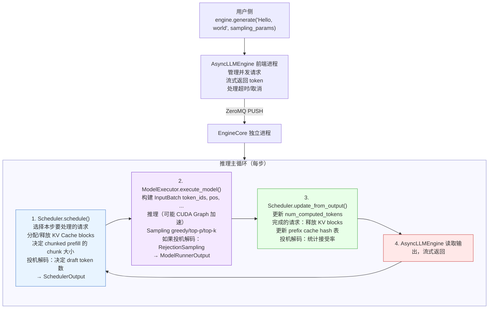
```mermaid
flowchart TD
    USER["用户侧<br/>engine.generate('Hello, world', sampling_params)"]

    USER --> AE["AsyncLLMEngine 前端进程<br/>管理并发请求<br/>流式返回 token<br/>处理超时/取消"]

    AE -->|ZeroMQ PUSH| EC["EngineCore 独立进程"]

    subgraph Loop["推理主循环（每步）"]
        SC["1. Scheduler.schedule()<br/>选择本步要处理的请求<br/>分配/释放 KV Cache blocks<br/>决定 chunked prefill 的 chunk 大小<br/>投机解码：决定 draft token 数<br/>→ SchedulerOutput"]

        ME["2. ModelExecutor.execute_model()<br/>构建 InputBatch token_ids, pos, ...<br/>推理（可能 CUDA Graph 加速）<br/>Sampling greedy/top-p/top-k<br/>如果投机解码：RejectionSampling<br/>→ ModelRunnerOutput"]

        UPD["3. Scheduler.update_from_output()<br/>更新 num_computed_tokens<br/>完成的请求：释放 KV blocks<br/>更新 prefix cache hash 表<br/>投机解码：统计接受率"]

        STREAM["4. AsyncLLMEngine 读取输出，流式返回"]

        SC --> ME --> UPD --> STREAM --> SC
    end

    EC --> Loop

    style Loop fill:#f8f8ff,stroke:#8888cc
    style SC fill:#e8f4ff,stroke:#4a80cc
    style ME fill:#f4e8ff,stroke:#8040cc
    style UPD fill:#e8ffe8,stroke:#44aa44
    style STREAM fill:#ffe8e8,stroke:#cc4444
```

### 14.3 关键子系统详解

#### 14.3.1 Scheduler（调度器）

```
Scheduler 状态机（vLLM V1 默认行为）：

  新请求 → [waiting 队列]
               │
               │ (分配到足够 KV blocks)
               ▼
           [running 队列]  ←── decode 步持续在此
               │
               │ (KV blocks 不足，发生抢占)
               ▼
           ╔════════════════════════════════════╗
           ║  抢占策略（preemption_mode）        ║
           ║                                    ║
           ║  V1 默认：RECOMPUTE（重算）          ║
           ║    → 释放该请求的所有 KV blocks       ║
           ║    → 请求退回 [waiting 队列]          ║
           ║    → 等 GPU 内存空闲后重新 Prefill     ║
           ║                                    ║
           ║  可选：SWAP（换出）                  ║
           ║    → KV blocks swap-out 到 CPU 内存  ║
           ║    → 请求进入 [swapped 队列]          ║
           ║    → GPU 内存释放后 swap-in 恢复       ║
           ╚════════════════════════════════════╝

说明：
  - V1 默认 RECOMPUTE：实现最简单，无需管理 CPU KV Buffer，
    通常 GPU 内存富裕时抢占概率很低，重算代价可接受
  - SWAP 适合：长 prompt 抢占代价高（重算 2000 token > swap 4MB）、
    CPU 内存充裕的场景；vLLM 通过 --preemption-mode=swap 开启

关键配置路径：
  vllm/v1/core/sched/scheduler.py
    ├── Scheduler.schedule()          # 主调度逻辑（先 decode，再 prefill）
    ├── _schedule_prefills()           # Chunked Prefill 处理
    ├── _schedule_running()            # Decode 请求管理
    └── _preempt()                     # 抢占逻辑（默认 RECOMPUTE）
```

#### 14.3.2 CUDA Graph 加速

```
CUDA Graph 的作用：

  普通执行：每步都要 CPU → GPU 发送 kernel 启动命令
    开销：~100μs per step（对于短 decode 步影响显著）

  CUDA Graph：把一整个前向传播录制成 graph，回放时零 CPU 开销
    开销：~10μs per step（10x 加速）

  V1 的 CUDA Graph 策略：
    - Decode 步（固定形状）：使用 CUDA Graph
    - Prefill 步（可变长度）：不使用（或用 padding 对齐）
    - 关键文件：vllm/v1/worker/gpu_model_runner.py
                → capture_model()
                → _dummy_run()
```

#### 14.3.3 Spec Decode 在 V1 中的集成

```
投机解码调度（Scheduler 原生支持）：

  ┌──────────────────────────────────────────────────┐
  │  step N：Draft 模型生成 K 个 draft token          │
  │    EAGLE / ngram / 小模型                         │
  │                                                  │
  │  step N+K：Target 模型验证 K+1 个 token          │
  │    并行处理 draft tokens（= chunked prefill）     │
  │                                                  │
  │  RejectionSampler：                              │
  │    accepted_tokens = rejection_sample(            │
  │        draft_probs, target_probs, draft_tokens   │
  │    )                                             │
  │    # 保证分布等价于纯 target 模型                 │
  └──────────────────────────────────────────────────┘

关键文件：
  vllm/v1/spec_decode/eagle.py          # EAGLE draft 模型
  vllm/v1/sample/rejection_sampler.py   # rejection sampling
  vllm/v1/core/sched/scheduler.py       # spec decode 调度逻辑
```

### 14.4 生产配置速查

```
场景1：在线聊天（低延迟优先，TTFT < 200ms）
  vllm serve model \
    --enable-chunked-prefill \      # 减少 decode 等待
    --speculative-model eagle \     # 加速单序列 decode
    --max-num-batched-tokens 2048 \ # 限制每步处理量
    --gpu-memory-utilization 0.9

场景2：离线批处理（吞吐优先）
  vllm serve model \
    --max-num-seqs 256 \            # 大批次
    --enable-chunked-prefill \      # GPU 利用率
    --disable-log-requests \        # 减少 I/O 开销
    --gpu-memory-utilization 0.95

场景3：长上下文（128K+ tokens）
  vllm serve model \
    --max-model-len 131072 \
    --enable-prefix-caching \       # 系统提示词复用
    --kv-cache-dtype fp8 \          # 压缩 KV Cache
    --tensor-parallel-size 4        # 多卡分担内存

场景4：DeepSeek V3（671B MoE）
  vllm serve deepseek-ai/DeepSeek-V3 \
    --tensor-parallel-size 8 \
    --pipeline-parallel-size 1 \
    --enable-expert-parallel \      # Expert Parallel
    --trust-remote-code \
    --gpu-memory-utilization 0.95

关键参数文件：
  vllm/config.py
  vllm/v1/core/sched/scheduler.py（BLOCK_SIZE, token_budget）
```

---

## 第十五章：Mini vLLM——完整整合

### 15.1 Mini vLLM 架构总览

经过前14章的深入分析，我们的 **Mini vLLM**（`05_mini_vllm/mini_vllm.py`）将所有核心组件串联起来：

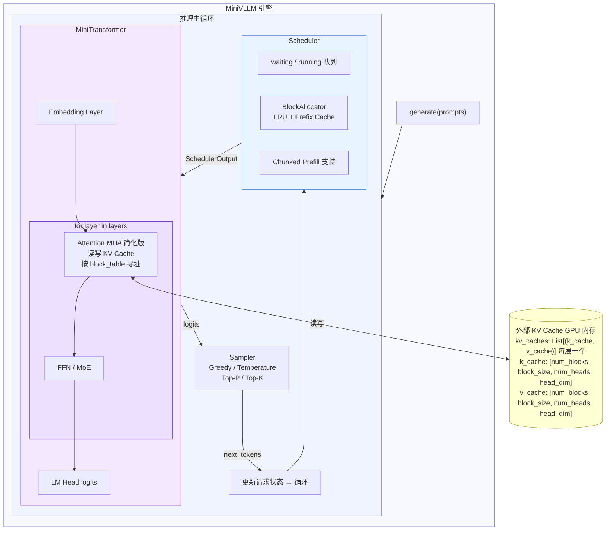
```mermaid
flowchart TD
    subgraph Engine["MiniVLLM 引擎"]
        GEN["generate(prompts)"]

        subgraph Loop["推理主循环"]
            subgraph SC["Scheduler"]
                SCQ["waiting / running 队列"]
                SCA["BlockAllocator<br/>LRU + Prefix Cache"]
                SCC["Chunked Prefill 支持"]
            end

            subgraph MT["MiniTransformer"]
                EMB["Embedding Layer"]
                subgraph Layers["for layer in layers"]
                    ATT["Attention MHA 简化版<br/>读写 KV Cache<br/>按 block_table 寻址"]
                    FFN["FFN / MoE"]
                    ATT --> FFN
                end
                LMH["LM Head logits"]
                EMB --> ATT
                FFN --> LMH
            end

            SAMP["Sampler<br/>Greedy / Temperature<br/>Top-P / Top-K"]
            UPD["更新请求状态 → 循环"]

            SC -->|SchedulerOutput| MT
            MT -->|logits| SAMP
            SAMP -->|next_tokens| UPD
            UPD --> SC
        end

        GEN --> Loop
    end

    KVC[("外部 KV Cache GPU 内存<br/>kv_caches: List[(k_cache, v_cache)] 每层一个<br/>k_cache: [num_blocks, block_size, num_heads, head_dim]<br/>v_cache: [num_blocks, block_size, num_heads, head_dim]")]

    ATT <-->|读写| KVC

    style Engine fill:#f8f8ff,stroke:#8888cc
    style Loop fill:#f0f4ff,stroke:#7070cc
    style SC fill:#e8f4ff,stroke:#4a80cc
    style MT fill:#f4e8ff,stroke:#8040cc
    style Layers fill:#ede0ff,stroke:#7040cc
    style KVC fill:#ffffd4,stroke:#aaaa44
```

### 15.2 各组件协作数据流

#### 15.2.1 Prefill 步

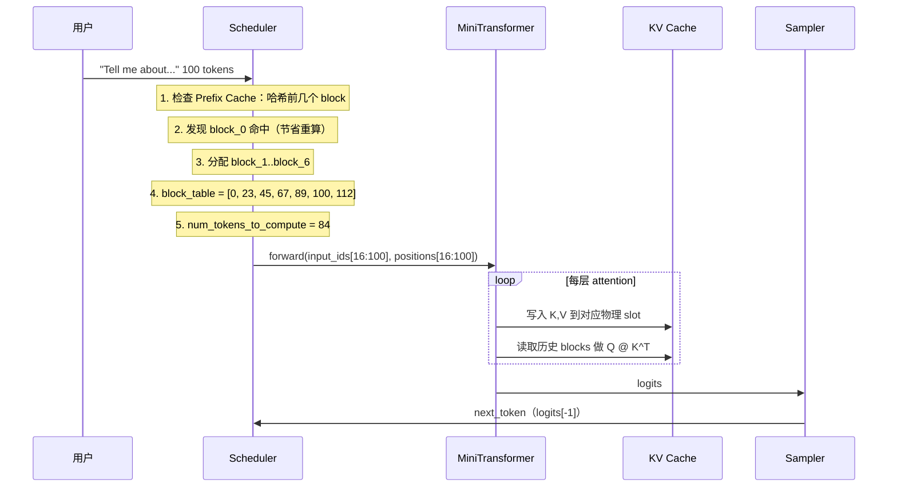
```mermaid
sequenceDiagram
    participant User as 用户
    participant SC as Scheduler
    participant MT as MiniTransformer
    participant KV as KV Cache
    participant SP as Sampler

    User->>SC: "Tell me about..." 100 tokens
    Note over SC: 1. 检查 Prefix Cache：哈希前几个 block
    Note over SC: 2. 发现 block_0 命中（节省重算）
    Note over SC: 3. 分配 block_1..block_6
    Note over SC: 4. block_table = [0, 23, 45, 67, 89, 100, 112]
    Note over SC: 5. num_tokens_to_compute = 84

    SC->>MT: forward(input_ids[16:100], positions[16:100])
    loop 每层 attention
        MT->>KV: 写入 K,V 到对应物理 slot
        MT->>KV: 读取历史 blocks 做 Q @ K^T
    end
    MT->>SP: logits
    SP->>SC: next_token（logits[-1]）
```

#### 15.2.2 Decode 步

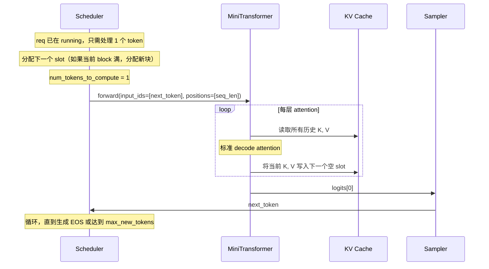
```mermaid
sequenceDiagram
    participant SC as Scheduler
    participant MT as MiniTransformer
    participant KV as KV Cache
    participant SP as Sampler

    Note over SC: req 已在 running，只需处理 1 个 token
    Note over SC: 分配下一个 slot（如果当前 block 满，分配新块）
    Note over SC: num_tokens_to_compute = 1

    SC->>MT: forward(input_ids=[next_token], positions=[seq_len])
    loop 每层 attention
        MT->>KV: 读取所有历史 K, V
        Note over MT: 标准 decode attention
        MT->>KV: 将当前 K, V 写入下一个空 slot
    end
    MT->>SP: logits[0]
    SP->>SC: next_token
    Note over SC: 循环，直到生成 EOS 或达到 max_new_tokens
```

#### 15.2.3 BlockAllocator 与 Prefix Cache

```
BlockAllocator 关键逻辑（mini_vllm.py）：

  allocate(request_id, token_ids):
    1. 计算链式哈希：h0, h1, h2 = compute_hashes(token_ids)

    2. 前缀复用：
       if h0 in cache:
           blocks[0] = cache[h0]  # 直接复用，ref_count += 1
       else:
           blocks[0] = free_list.pop()  # 分配新块

    3. 记录 block_table：
       block_table[request_id] = [physical_id_0, physical_id_1, ...]

  free(request_id):
    for block in block_table[request_id]:
        block.ref_count -= 1
        if block.ref_count == 0:
            # 归还到 LRU 缓存（而非立即释放）
            lru_cache.put(block.hash, block)
```

### 15.3 关键设计决策与 trade-off

| 设计决策 | Mini vLLM 的选择 | 真实 vLLM 的做法 | 原因 |
|---------|----------------|----------------|------|
| Attention 实现 | 纯 PyTorch SDPA | FlashAttention / PagedAttention kernel | 简单清晰，但无法处理 padding |
| KV Cache 布局 | `[blocks, block_size, heads, head_dim]` | 同 | 符合 PagedAttention 论文 |
| Block Table | Python list | CUDA tensor，直接传给 kernel | 避免 GPU-CPU 同步开销 |
| Decode Attention | 读取连续 slice | 真正的 block table 寻址 | 简化实现，功能等价 |
| 调度器 | FCFS + 简单 Chunked Prefill | 复杂抢占、swap-in/out | 覆盖核心概念 |

### 15.4 性能基准

在 NVIDIA GPU 上运行 Mini vLLM 的基准测试（`test_mini_vllm.py`）：

```
配置：
  模型：MiniTransformer(vocab=1000, hidden=256, layers=4, heads=4)
  序列：batch=4, prompt_len=50, max_new_tokens=20
  硬件：RTX PRO 6000（CUDA）

结果（示意，以实际运行为准）：
  Throughput：~400-500 tokens/s
  BlockAllocator：分配/释放延迟 < 1μs
  Prefix Cache：相同前缀请求节省 ~50% prefill 计算
```

### 15.5 全系列回顾：各章技术点与收益

| 章节 | 核心技术 | 关键收益 |
|------|---------|---------|
| 第1-2章 | vLLM 整体架构、设计哲学 | 理解推理系统为何如此设计 |
| 第3章 | Paged Attention、Block Table | 内存碎片 60-80% → <4% |
| 第4章 | KV Cache 读写、swap-in/out | 超过 GPU 内存的序列可以运行 |
| 第5章 | 完整推理路径 | 端到端流程打通 |
| 第6章 | 单机 Prefix Cache（LRU + 链式哈希）| 相同前缀：跳过全部重复 Prefill |
| 第7章 | 全局 KV Pool（Mooncake RDMA）| 跨节点共享 Prefix Cache |
| 第8章 | Scheduler（FCFS + 抢占 + 连续批处理）| GPU 利用率从 40% → 85%+ |
| 第9章 | 投机解码（EAGLE + Rejection Sampling）| Decode 速度 1.5-5x |
| 第10章 | Chunked Prefill（Sarathi）| TTFT 降低 20-40% |
| **第11章** | **DeepSeek MoE（GroupedTopK + EP）** | **计算量降低 5-10x（相比同参数稠密模型）** |
| **第12章** | **MLA（低秩 KV + 解耦 RoPE）** | **KV Cache 节省 7-57x** |
| **第13章** | **PD 分离（KVConnector + RDMA）** | **Decode 节点吞吐独立扩展** |
| **第14章** | **vLLM V1 引擎全局架构** | **理解生产级推理系统设计** |
| **第15章** | **Mini vLLM 完整整合** | **端到端验证所有技术点** |

---

## 结语：LLM 推理系统的设计哲学

回顾整个系列，vLLM 的每一项核心技术都在针对一个具体瓶颈做精准的工程突破：

```
瓶颈                    解决方案                  效果
────────────────────────────────────────────────────────────────
GPU 内存碎片           Paged Attention           碎片率 <4%
重复计算               Prefix Cache              相同前缀零计算
Decode 延迟             投机解码                  1.5-5x 加速
Prefill 干扰 Decode    Chunked Prefill            TTFT -20-40%
参数量 vs 计算量       MoE（稀疏激活）            计算量 ÷10
KV Cache 内存          MLA（低秩压缩）            KV ÷7~57
跨节点数据孤岛         Mooncake RDMA              全局 KV 共享
────────────────────────────────────────────────────────────────
```

这些技术共同构成了现代 LLM 推理系统的核心骨架。理解了这些机制，你就掌握了现代 LLM 推理系统设计的核心密码——也为参与 vLLM、SGLang、TensorRT-LLM 等开源项目打下了坚实基础。

---

## 配套代码运行

```bash
# 运行全套测试（113 个用例）
docker exec -w /mnt/esfs/master_work/vllm-from-scratch vllm \
  python3 -m pytest 01_paged_attention/ 02_kvcache/ 03_moe/ \
                    04_mla/ 05_mini_vllm/ 06_global_prefix_cache/ -v

# 运行各模块演示
docker exec vllm python3 /mnt/esfs/master_work/vllm-from-scratch/03_moe/mini_moe.py
docker exec vllm python3 /mnt/esfs/master_work/vllm-from-scratch/04_mla/mini_mla.py
docker exec vllm python3 /mnt/esfs/master_work/vllm-from-scratch/05_mini_vllm/mini_vllm.py
```

---

*本系列博客配套代码：`/mnt/esfs/master_work/vllm-from-scratch/`*
*参考代码库：`/mnt/esfs/master_work/vllm/`（vLLM 源码）*
